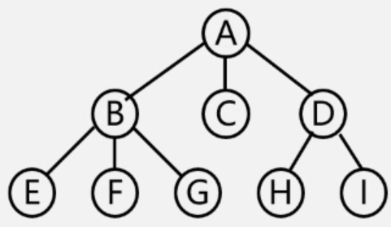

# 数据结构

- 适用于：考研

- 适用于：软考-中级-软件设计师

    软件设计师只考察基础内容

## 概论

$$数据结构 
\begin{cases}
逻辑结构  
	\begin{cases}
	线性结构
		\begin{cases}
		线性表、
		栈（特殊线性表）\\[2ex]
		队列（特殊线性表）\\[2ex]
		字符串、一维数组、广义表\\[2ex]
		\end{cases}
    \\[2ex] 非线性结构 
     	\begin{cases}
        树形结构 \\[2ex]
        图形结构 \\[2ex]
        二维数组和多维数组
        \end{cases}
	\end{cases}
\\[2ex] 存储结构 
	\begin{cases}
	顺序结构 \\[2ex]
	链式结构
	\end{cases}
\\[2ex] 数据运算：查找、排序、插入、删除、修改
\end{cases} $$

### 一、名词解释

1. 数据：信息的载体、能输入计算机且能被计算机处理的各种符号集合（例如商品表、全国地址）

2. 数据项：数据的最小单位

3. 数据元素：数据的基本单位，多个数据项组合而成，也叫元素、记录、节点、顶点

4. 数据对象：相同类型数据元素的集合、数据的子集

    ---

5. 数据结构：相互之间存在一种或多种**特定关系**的数据元素集合

    数据结构三要素：

    1. 逻辑结构：数据元素之间的关系（独立于其他存储结构）

        - 集合：哈希表
        - 线性结构：线性表（有序表）、队列、栈、串、数组、
        - 树形结构：树、二叉树、森林
        - 图形结构：图

    2. 物理结构（存储结构）：数据元素在计算机中的存储

        - 顺序存储：顺序结构、循环队列

        - 链式存储：所有的链表

        - 索引存储：索引

        - 散列存储：哈希表、散列表

    3. 数据的运算与实现：对数据元素的操作及操作存储结构

6. 数据类型：（例如：C语言中int、数组、指针、char等等）

7. 抽象数据类型（ADT）：指数学模型及其操作

    ---

8. 算法特性：有穷性、确定性、可行性、输入/输出

9. 算法的要求：正确性、可读性、健壮性、高效性

### 二、时间复杂度计算

1. 算法复杂度小$\to$ 复杂度大

    $ O(1) < O(log_2n) < O(n) < O(nlog_2n) < O(n^2)  < O(2^n) < O(n!) < O(n^n) $​​​ 

2. 加法规则：

    时间复杂度只是粗略计算，因此只关心**高阶**，所以$\sum_{i=1}^ni$可以舍去

    例：$\sum_{i=1}^n(i^2+i)=\sum_{i=1}^ni^2+\sum_{i=1}^ni$ 

3. 乘法规则：

4. 常见递归表达式

    - $2T(n/2)+nlogn \to 2T(n/2)\to n$  

    - $T(n) = T(n-1) + n\to n^2$ ​

#### 情况一、while类型

```c
// 例题：
void func(int n) {
    int i=1;
    while(i<n) {
        i=i*2;
    }
}
```

- 根据while循环写出公式，注意i的初始值

    | 次数k                | 1    | 2    | 3    | 4    | 5    |
    | :------------------- | ---- | ---- | ---- | ---- | ---- |
    | 循环主体的值z（i*2） | 2    | 4    | 8    | 16   | 32   |
    
- 根据循环主体得到z与k的关系式：$2^k=z$ 
- 求得次数K关系式：$K=\log_2z$ 

#### 情况二、for类型 

``` c
for(i=1;i<=n;i++) {
    for(j=1;j<=2*i;j++) {
        m++;
    }
}
```

- 原则：有几个for就有几个累加，又因为m++就执行1次（$O(1)$），所有m++为1

- 得公式：$\sum_{i=1}^n\sum_{i=1}^{2i}1$ 

- 计算方法，由右向左计算
  1. $\sum_{i=1}^{2i}1=1+1+1+...+1=2i$ （共累加2i次，每次都加1）
  2. $\sum_{i=1}^n2i=2\sum_{i=1}^ni=2(1+2+3+4+...+n)=2\frac{n(n+1)}{2}=n^2+2$ 
  3. 因为时间复杂度只求近似值，所以时间复杂度为$O({n^2})$ 
  
- 常见的累加计算方法：

    - $\sum_{n=1}^{n}1=1+1+1+...+1=n$ （n个1相加等于n ）

    - $\sum_{n=1}^{an}1=1+1+1+...+1= an$ 

        ---

    - $\sum_{j=i}^{n}1=1+1+1+...+(n-i)=(n-i)$ 

    - $\sum_{j=i}^{n}j=i+(i+1)+(i+2)...+n=\frac{(n-i)(i+n)}{2}$

        ---

    - $\sum_{n=1}^{n}i=i\sum_{n=1}^{n}1$ 

    - $\sum_{i=1}^n2i=2\sum_{i=1}^ni$ 

        ---

    - $\sum_{n=1}^{n}n=1+2+3+...+n=\frac{n(n+1)}{2}$ 
    
    - $\sum_{i=1}^ni^2 = 1^2+2^2+...+n^2=\frac{n(n+1)(2n+1)}{6}$  

### 三、空间复杂度

1. 算法所占有的内存空间，while、for等不占用内存空间

    例如：int i=1；变量的声明定义，

2. 只需要N个变量：$O_{(n)}$ 

3. 递归调用的空间复杂度 = 递归调用的深度

## 线性表

### 一、线性表的顺序表示

1. 线性表的顺序表示又称为：顺序存储结构或顺序映像

2. 顺序存储结构必须占用连续的存储空间

    - 支持随机存取
    - 方便快速读取，可以插入读取指定序号的元素。

    - 插入删除较慢（因为要移动大量数据），但在尾部插入删除很快。

3. **顺序表**：线性表采用顺序存储

    顺序表中，在任意位置插入元素，元素平均移动次数是：$\frac{n+1}{2}$ 

    顺序表中，在任意位置删除元素，元素平均移动次数是：$\frac{n-1}{2}$ 

4. 长度为 n 的非空顺序表，若在第i个位置**插入新**的元素X，则需要移动：$n-i+1$ 个元素

5. 长度为 n 的非空顺序表，若**删除**第i个位置的元素X，则需要移动：$n-i$ 个元素

6. 在表长为 n 的顺序表上做插入运算，平均要移动的结点数为：$n/2$ 

### 二、线性表的链式表示

1. 线性表使用链式存储结构：链表

2. 链表支持顺序存取（不等于随机存取）

3. 链表得存储密度低，因为需要存储指针位置

    ---

4. 单链表效率

    查找：$O(n)$

    插入：只插入，只用修改指针$O(1)$ ；在单链表中插入删除$O(n)$，因为得查找元素

5. 单链表为空条件（head是头指针） 

    有头节点：`head->next == NULL` 

    不带头节点：`head == NULL` 

    ---

6. 单循环链表，头插/尾插的时候，知道**尾指针**更快

7. 单链表必须在当前指针之后插入、双链表可以在元素前后插入

8. 双向循环链表，头插，知道尾指针效率高

9. 链表只有删除插入首尾节点的时间复杂度才是O(1)，在中间插入删除因为要先查找到相应位置才能插入删除，所以时间复杂度也到了O(n)


头指针、头结点、元节点

1. 带头结点的链表

    > 注意：
    >
    > 1. 头结点、头指针（info、head）不属于表，所以在统计表长的时候，不计算这两个节点
    > 2. 空表的情况：只有头结点和头指针
    > 3. head只是一个指针且指向的info节点，所以head就等价于info节点

    添加头结点的好处：

    1. 便于首元节点的处理：首元节点保存在头结点的指针域中，所以，所有的元素处理都一样
    2. 便于空表和非空表一样处理

    头结点数据域：可以存放任意元素

    

2. 不带头结点（H，头指针）

    

### 三、线性表的应用

#### Ⅰ、线性表合并

> L1 = （7，5，3，11） L2 = （2，6，3）求L1与L2的并集（相同的元素只保留1个）

``` c
void union(List &L1, List &L2)
{
    int i,j,mark;
    for(i=0; i < L1.length; i++)
    {
       	// 在L2中查找L1.data[i]
        // 如果L1.data中没有，将L2.data[j]元素添加进L1中
    }
}
```

#### Ⅱ、有序表的合并

长度为M和N得**升序**链表

- 若将2个链表合并为**降序**（与原来的次序相反），则最坏的时间复杂度：$O(max(M,N))$ 
- 若将2个链表合并为升序（与原来的次序相同），则时间复杂度：$O(M+N)$ 


#### Ⅲ、多项式的运算

1. 主要是利用了数组的存储
2. 数组的下标就代表者未知数的指数（$x^i$）
3. 同样下标的数相加即可


#### Ⅳ、稀疏多项式

1. 多项式中含有多个0

2. 运算方式：利用了有序表的合并思想，2个指针，分别比较A，B的每一项

    指数不同：将指数小的复制到新数组中

    指数相同：将2项进行运算，并复制到数组中

    有一个多项式复制完成，就将另一个数组剩余元素移动过去即可

顺序存储结构（优先使用链式存储结构）

- 顺序存储结构存储空间不灵活，空间复杂度高


- $A = ((7,0),(3,1),(9,8),(5,17))$ 
- $B = ((8,1),(22,7),(-9,8))$ 
- $C = ((7,0),(11,1),(22,7),(5,17))$ 

## 队列/栈

1. 队列和栈都是限制存储点的线性结构

### 一、队列

1. 队列（FIFO）：表尾插入，表头删除

2. 队列的常见应用

    脱机打印、多用户系统中CPU的使用、缓冲区利用了队列技术

3. 链表方式存储队列时，在进行插入运算时，只修改尾指针即可

4. 最不适合队列的链表：非循环结构（包括非循环单链表、非循环双链表），因为普通链表无法快速找到头尾

#### Ⅰ、顺序队列

1. 初始化：front=rear=0
2. 入队：Q.base[rear] = x；rear++ （Q当前队列，x变量）
3. 出队：x=Q.base[front]；front++ （Q当前队列，x变量）
4. 队空：front == rear
5. 队满：rear == MaxSize - 1


#### Ⅱ、循环队列

1. 队列的大小默认表示为：$Q[0...m-1]$ 

    若队列大小为：$A[0...m]$ 

    > 循环队列存储在数据A[0..m]中，则入队时的操作为

    $rear=(rear+1)\%(m+1)$ 

    > 例如：A[3] 表示队列共4个数，分别为0123

2. 初始化：$Q.rear = Q.front = 0$ 

3. 入队：$Q.base[Q.rear] = x；Q.rear = (Q.rear+1) \% MaxSize$

4. 出队：$x=Q.base[Q.front]；Q.front= (Q.front+1) \% MaxSize$ 

5. 队满：$Q.front == (Q.rear+1) \% MaxSize$ 

6. 队空：$Q.rear == Q.front$ 

7. 队中元素个数（rear指向队尾元素的下一个位置）：

   $(Q.rear - Q.front + MaxSize) \% MaxSize $

8. 队中元素个数（rear为当前队尾元素位置(最后一个元素的位置)）：

   $(Q.rear - Q.front + MaxSize + 1) \% MaxSize $ 

9. 缺点：这种队满浪费了一个数据元素

> 已知循环队列存储在一维数组A[0..n-1]中，且队列非空时 front 和 rear 分别指向队头和队尾元素。若初始时队列为空，且要求第 1 个进入队列的元素存储在 A[0]处，则**初始时** front和 rear 的值分别是（ ）。

- 第 1 个进入队列的元素存储在 A[0]处：rear + 1 = 0;
- 得rear指向 n-1；front一开始只有2个选项 0 或 n-1;rear指向n -1后，front只能选择0

#### Ⅲ、链队


1. Q.front指向队头、Q.rear指向队尾

2. 空队列（只有初始状态是空队列）： 

   > 链栈，经过一系列正常的入队与退队操作后， front=rear，栈中有1个元素

3. 入队：

4. 出队： （x出队、直接删除x节点）

5. 用链接方式存储的队列，在进行删除运算时，头、尾指针可能都要修改

### 三、栈

1. 后进先出（LIFO）的线性表

2. 栈是只允许在一端进行插入或删除的操作的线性表

3. 链栈

    - 特点：头指针就是栈顶、不需要头结点、不会满栈、空栈等于头指针指向空

    - st栈空条件：`st->top = -1` 

    - 最不适合做链栈的是：只有头指针，没有尾指针的循环单链表

4. 顺序栈（top栈顶、base栈底、stacksize栈的总共大小）

    - 空栈：`base == top` 

    - 进栈：`top++ `

    - 满栈：`top == stacksize` 

    - 栈中元素个数：`top-base` 

5. 不论是顺序栈还是链栈，其入栈出栈的操作时间复杂度都为$O_{(1)}$ （因为只在栈顶操作）

若输入序列是1，2，3，……，n

- 输出序列第一个是n，则第i个元素是：`n-i+1`

- 输出序列第一个是i（第一个元素不是n），则第j个元素是**不确定**

- 其出栈顺序是$P_1,P_2,P_3...$，若$P_2$=3（任意数），则$P_3$**可能取到的值**得个数是n-1（只有$P_2$是确定的，其他数都可取到）

- 特别注意入栈顺序（以上序列在栈中的顺序）：
  $$
  n\to 栈顶（表尾）\\
  ……\\
  3\\
  2\\
  1\to 栈底（表头）\\
  $$

以abcd的顺序入栈，出栈的顺序有多少种

- 等价于：

    先序序列为abcd的不同二叉树的个数

    具有4个节点的二叉树可能有几种不同的形态

- 公式：$C_{2n}^{n}\frac{1}{n+1}$ （n是元素的个数）

- 有2个元素：$C_{4}^{2}\frac{1}{2+1} = \frac{4!}{2!(4-2)!}\times \frac{1}{2+1}=\frac{24}{4}\times\frac{1}{3}=2$ 

- 有3个元素：$C_{6}^{3}\frac{1}{3+1}=\frac{1*2*3*4*5*6}{(1*2*3)(1*2*3)}\times \frac{1}{3+1}=20\times\frac{1}{4}= 5$  

- 有4个元素：共14种

- $C_m^n=\frac{m!}{n!(m-n)!}$ 

- $C_n^0=C_n^n=1$ 

共享栈

- 结构：共享栈2端是栈低，**中间是栈顶**（一个栈底位置为1，另一个栈底位置为n）
- 优点：节省空间，降低上溢发生率
- st栈满：`top[1] + 1 = top[2]`

### 四、表达式求值

1、笔算方式：**中缀**表达式转**前/后缀**，只需要加括号（依据正常计算的流程），再把符号前移/后移即可

2、中缀转后缀（利用栈）：

1. 运算符入栈，数字不入栈
2. 当前运算符优先级>栈顶元素优先级，入栈
3. 当前运算符优先级<=栈顶元素优先级，**先弹出栈中的元素**，当前元素才可入栈
4. “（”直接入栈，遇见“）”出栈，而且是一直出到与之匹配的“（”

3、**前缀/后缀**表达式转**中缀**（利用栈）

1. 入栈方向是从数字端开始

2. 数字入栈，操作符不入栈

3. 遇见操作符则出栈，出栈的**数字顺序与前/后缀中的顺序**相同（）

    1. 前缀可以理解为：A-B中的A是**先出栈的**
      2. 后缀可以理解为：A-B中的A是**后出栈的**

4. 出栈元素＋操作符组成一个整体，再次入栈

    **出栈方向也符合（<--是方向）：后<--栈-->前**

## 串、数组和广义表

1. 串：内容首先的线性表，内容只能是字符
2. 子串：串种任意个连续的字符组成的子序列（包含空）
3. 真子串：不包含自身的子串
4. 子串位置：子串第一字符在主串中的位置
5. 空格串：由多个或1个空格组成的串，与空串不同
6. **确定主串中所含有子串（模式串）第一次出现的位置：模式匹配（没有求字串的说法）** 
7. 被匹配的主串称目标串。


### 一、串

1. 设S为一个长度为n的字符串，其中的字符各不相同

   > 若串 S="software"，则其子串的数目是

   8*(8+1) / 2 = 36

   - 非空真子子串（不包括空串和跟自己一样的子串）（互异的非平凡子串）的个数为：$\frac{n(n+1)}{2}-1$ 
   - 子串（包括空串）为 ：$\frac{n(n+1)}{2}+1$ 
   - 非空子串的个数：$\frac{n(n+1)}{2}$  

   > 若串 S="www.qq.com"，则其子串，不重复的数目是

   10 * 11 / 2 - 5 =55

2. n个字符长度的字符串有n-1个长度为2的子串；

   > "abcdefg" 中长度 2 的子串的个数是 7-1=6

3. 所有的空串都是相等的

4. 字符串长度问题

   > char s\[\]\[10\] = {"mango" ,"apple","orange","banana","pineapple" }，那么sizeof(s)的结果为

   因为定义中定义了s的每一个字符串长度为10，所以总大小应为5*10 =50

5. > 字符串 "qiniu" 根据顺序不同有多少种排列组合的方式？

   5个字符一共有的排列组合：$C^5_5 = 5 \times 4\times 3\times 2\times 1=120$  

   相同的元素共2个：$C^2_2=2\times1 =2$

   所以一共有120 / 2 =60种组合方式

#### Ⅰ、KMP算法

- next数组：https://www.bilibili.com/video/BV1g341147vQ
- nextval数组：https://www.bilibili.com/video/BV1uJ411s7br
- 已知字符串ABAABBAA……，模式串ABAAA，则next与nextval是根据**模式串**生成的
- 注意模式串下标，一般是从1开始，若是从0开始，next要全体-1
- n为主串长，m为子串长，KMP算法复杂度为$O(n+m)$ 
- 设串长为 n，模式串长为 m，则 KMP 算法所需的附加空间$O(m)$ 

| j（默认为1） | 1    | 2    | 3    | 4    | 5    | 6    | 7    | 8    |
| ------------ | ---- | ---- | ---- | ---- | ---- | ---- | ---- | ---- |
| 模式串P      | a    | b    | c    | a    | a    | b    | b    | c    |
| next         | 0    | 1    | 1    | 1    | 2    | 2    | 3    | 1    |
| nextval      | 0    | 1    | 1    |      |      |      |      |      |

next求法

- 固定值：next[1]=0，next[2]=1 

- 列表法：当j=7时，其前面的字符为abcaab

    a         | b

    ab       | ab

    abc     | aab

    abca   | caab

    abcaa | bcaab

    abcaab中有**最长**相同的字符ab，则2+1=3

- 观察法：当j=13时，其前面的字符为abcaabbcabca

    **abca**abbc**abca**中有最长相同的字符abca，则4+1=5

nextval求法

- 固定值：nextval[1] = 0，nextval[2] = 1

- 若j>2（$P_j$为当前指向的字符串，j为当前指向得key值）
  1. $P[j]\neq P[ next[j]]: nextval[j] = next[j]$   (next的值直接下移，成为nextval的值)
  
  2. $P[j]=P[next[j]]: $ $nextval[j] = next[P[next[j]]]$  
  

#### Ⅱ、BF算法

> Brute-Force简称为BF算法，简单匹配算法，采用穷举法的思路

1. 朴素匹配算法=暴力匹配算法=BF算法

2. 匹配失败回溯

    i是主串循环的下标，j是模式串（子串）的下标

    下标从1开始：`i = i-j+2; j=1`

    下标从0开始：`i = i-j+1; j=0`

3. 最好的匹配情况：一开始就匹配成功

    比较次数：m（子串长度）

    算法复杂度：$O(m)$ 

4. 最坏匹配情况

    若n为主串长，m为子串长，则串的BF算法在最坏的情况下比较字符总次数为：$(n-m+1)\times m$ 

    若n为主串长，m为子串长，n>>m，串的BF算法在最坏的情况下算法复杂度为：$O(n*m)$ 

### 二、数组

#### Ⅰ、一维数组

> 数组定义 int a[5]，每个元素占用4个字节，假设a[0]存储在2000单元，a[3]地址？

1. 数组下标从0开始，所以，a[3]前面有3个元素（a[0]、a[1]、a[2]）
2. 每个元素占用4个字节：3*4+2000 = 2012

下标从0开始公式：$(i-s) \times L + a$ 

- i：第i个元素
- s：下标从s开始（第一个元素是$a[0]$，则s=0）
- L：每个元素占几个字节
- a：偏移量

#### Ⅱ、二维数组

>  设二维数组$A[m][n]$，第一个元素位置为$A[a][b]$，按行优先存储, 每个元素占L个字节数，则$A[i][j]$，按行存储、按列存储的位置 

1. 关于数组 $A[a-m][b-n]$ 行和列的计算

    $m_t = m-a+1$ 

    $n_t = n -b +1$ 

2. 行优先计算元素下标

    公式：$(i-a)\times n_t+(j-b)$ 

    $A[i][j]$完整公式：$Loc(0,0) + [(i-a)\times n_t+(j-b)]\times L$ 

3. 列优先计算元素下标

    公式：$(j-b)\times m_t+(i-a)$ 

    $A[i][j]$偏移存储位置：$Loc(0,0) + [(j-b)\times m_t + (i-a)]\times L$ 

> 设有数组A[1-8，1-10]，数组的每个元素长度为1字节，数组从内存首地址BA开始顺序存放，当用以列为主存放时，元素A[5，7]的存储首地址为

- 行：8-1+1 = 8

- 列：10-1+1 = 10

- 公式：

  $(j-b)\times m_t+(i-a) = (7-1)\times 8+(5-1)=52 $ 


#### Ⅲ、特色矩阵压缩存储

1. 能压缩的矩阵：对称矩阵、对三角矩阵、三角矩阵、稀疏矩阵、稀疏矩阵
2. 使用压缩存储**稀疏矩阵**的存储结构：**三元组和十字链表** 
3. 优先画出矩阵样子，选定特定的值带入选项公式计算
4. 上三角/下三角与元素下标、列存储和行存储（一般默认都是行存储）的关系

三元组存储

> M由{（1，2，12），（1，3，9），（3，1，-3），（6，1，15）}组成，矩阵维数：M\[6][7]

- 使用数组保存，存储形式：$(i,j,a_{ij})$ 

    i：行；j：列；$a_{ij}$ ：值

- 优点：便于进行依行序处理的矩阵运算

- 缺点：不能随机存取，不利于删除，插入元素

> 有一个 $A[100][90]$ 的稀疏矩阵 ，非0元素有10个，设每个整型数占2字节，则用三元组表示该矩阵时,所需的字节数是

- 三元组保存数据需要 3 个单元，每个单元2个字节 $\to$ $3\times2=6$ 
- 10个非零元素$\to  6\times 10 = 60$ 个字节； 
- 还需要三个整数来存储矩阵的**行数、列数和总元素个数**：$3\times 2=6$
- 所以一共需要 60+6

十字链表

1. 优点：可以灵活插入删除元素

#### Ⅳ、对称矩阵压缩

1. 对称矩阵只需要存储上三角或下三角即可

    > 将10阶对称矩阵压缩存储到一维数组A中，则数组A的长度最少为（）

    10 阶对称矩阵，其主对角线元素唯一：100 - 10 =90

    剩下元素只存一半：90 / 2 =45；

    一共需要 45 + 10 =55个位置

2. 对称的位置数值相同，例：$a_{21}=a_{12}$ 

    常用于求解的元素并不在指定区域中，可以利用对称矩阵特性（$a_{ij}=a_{ji}$ ）转换

    > 例：10阶对称矩阵A，采用压缩存储方式，以行为主存储在下三角，$a_{11}$ 为第一个元素，则$a_{36}$的地址为

    【分析】$a_{36}$ 是上三角元素（$a_{33}$ 是对角线元素），而数据存储在下三角，所有利用对称矩阵特性（$a_{ij}=a_{ji}$ ）求$a_{36}等价于求a_{63}$ 

3. 只要是下标行列相同的元素，其位置肯定在对角线上（例如：$A_{11}、A_{22}$ ）

    1. 一定是上三角的第一个
    2. 一定是下三角的最后一个

4. $A[i][j]$位置计算方法查看：Ⅴ、上下三角矩阵

$$
对称矩阵图例：
\begin{pmatrix} 
	a_{11} & a_{12} & a_{13} & \cdots & a_{1n} \\ 
    a_{21} & a_{22} & a_{23} & \cdots & a_{2n} \\
    \vdots & \vdots & \vdots & \ddots & \vdots \\    
    a_{n1} & a_{n2} & a_{n3} & \cdots & a_{nM} \\ 
\end{pmatrix}
$$

#### Ⅴ、上下三角矩阵

1. 上/下三角矩阵n行共存储的元素个数：$\frac{n(n+1)}{2}$ 

2. 以行为主序的下三角存储（公式法）

    $A[i][j]$前面有多少元素：$\frac{(i-s)(i-s-1)}{2} + (j-s)$ 

3. 上下三角于对称矩阵特殊的地方在于要有一个地方存放除上三角（下三角）之外的元素，所以是对称矩阵+1

4. **以行为主序的存储（经验法）**【简单容易】

    > 上三角与下三角都分别有行主序和列主序

    第一个元素位置：$A[i][j]$；则$A[a][b]$前有计算$a-i$行

    - 上三角例子：10$\times$10矩阵，前5行=10+9+8+7+6
    - 下三角例子：10$\times$10矩阵，前5行=1+2+3+4+5

    计算 j 前面有多少元素：$b-j$ 


$$
上三角矩阵图例：
\begin{pmatrix} 
	a_{11} & a_{12} & a_{13} & \cdots & a_{1n} \\ 
    0 & a_{22} & a_{23} & \cdots & a_{2n} \\
    0 & 0 & a_{33} & \cdots & a_{2n} \\
    \vdots & \vdots & \vdots & \ddots & \vdots \\    
    0 & 0 & 0 & \cdots & a_{nM} \\ 
\end{pmatrix}
\\\\
下三角矩阵图例：
\begin{pmatrix} 
	a_{11} & 0 & 0 & \cdots & 0 \\ 
    a_{21} & a_{22} & 0 & \cdots & 0 \\
    a_{31} & a_{32} & a_{33} & \cdots & 0 \\
    \vdots & \vdots & \vdots & \ddots & \vdots \\    
    a_{n1} & a_{n2} & a_{n3} & \cdots & a_{nM} \\ 
\end{pmatrix}
$$

#### Ⅵ、三对阵矩阵压缩

1. 第一行，最后一行都是2个元素
2. 中间元素下标i行j列，i=j
3. 前一个元素下标i行j列，i>j
4. 后一个元素下标i行j列，i<j
5. 例：$A_{43}A_{44}A_{45}$ 

$$
三对称矩阵图例：
\begin{pmatrix} 
	a_{11} & a_{12} & 0 & \cdots & & & 0 \\ 
    a_{21} & a_{22} & a_{23} & 0 &\cdots && 0 \\
    0 & a_{32} & a_{33} & a_{34} & 0 &\cdots & 0 \\
    \vdots & \vdots & \vdots &  & \vdots & \ddots &\\    
    0 & 0 & 0 & \cdots & a_{n,n-1} & & a_{nn} &\\ 
\end{pmatrix}
$$


计算方法：$A[1][1]$是第一个元素，矩阵$A_{ij}$在一维数组中的位置

1. 计算去掉 **第i行** 和 **第一行** 一共有多少元素（注意每行3个元素）

   $C_z=3 \times (i-2)$

2. 矩阵A第i行j列一共有多少元素$A_{ij}$

   【第一行2个元素；第i行（除第一行）之前一共有多少元素】

   $总数：C_{x}=C_z+2$ 

3. 当前行元素

   i>j：+1

   i=j：+2

   i<j：+3

4. $总数:C_{x}-1$ （$A[1][1]$是第一个元素，所以，总数应-1）

### 三、广义表

1. 广义表不要求所以元素类型都一样（与数组相同，但数组要求所有类型相同）

2. 广义表通常使用大写字母表示，原子通常使用小写字母

3. 原子：广义表中的元素

4. 广义表运算

    求表头：head(xx)

    求表尾：tail(xxxx)

5. 广义表通常记住：$LS = (a_1,a_2,...a_n)$ 

    表头：广义表中的第一个元素（表头是一个元素，不用加括号）

    表尾：除表头外其他元素组成的表（这是一个表，得加括号）

      

6. 广义表的长度：最外层所包含的元素个数

    $C=(a,(b,c))$ 是长度为2的广义表

7. 广义表的深度：展开后所包含括号的重数

    $A = (b,c)$：深度为1

    $B=(A,d)$：深度为2，A的深度为1，B本身为1

    $C=(f,B,h)$：深度为3，C本身为1，B为2

    $D=(f,((b,c),d)h)$：深度为3

    空表深度为1、原子深度为0

8. 广义表也可使用图表示，广义表是一个多层次结构

    

## 树与二叉树

### 一、树的性质

1. 总结节点数 = 分支数 + 1（与$n_0、n_2的公式不同$）

2. $n_0 = n_2 + 1$  ；$n_2 = n_0 - 1$ 

    ---

3. 二叉树第 i 层最多有 $2^{i-1}$ 个节点

4. 二叉树第 i 层最少有 1 个节点

5. 只有树的深度或高度是数节点（哈夫曼树是数边）

6. 高度（深度）为K的二叉树，整个二叉树最多有 $2^k-1$ 个节点数：

    （满二叉树、完全二叉树**最多**节点数）  

7. 高度（深度）为K的二叉树，整个二叉树最少有 K 个节点数

    （一条线的情况、每层只有1个节点）

8. 高度（深度）为K层的**完全二叉数树**至少有 $2^{k-1}$ 个节点

    【说明：$2^{k-1}-1是前k-1行共多少节点，+1是第k行至少1个元素$ 】

9. 高度为k，度为M的树最多有x个节点：$x=\frac{(m^k - 1)}{(m - 1)}$ 

    ---

10. n个节点的**完全二叉树**树高、**二叉树最小高度**、**二分查找**最大比较次数：

    $当n能被log整解:\lfloor \log_2n \rfloor + 1$ 

    $当n不能被log整解:\lceil \log_2(n+1) \rceil$ 

    > 设某棵二叉树中有360个结点，则该二叉树的最小高度是

    $2^9=512,2^8=256, \lfloor \log_2360 \rfloor=8$ ; 8+1 = 9

    > 设某棵三叉树中有40个结点，则该三叉树的最小高度（根节点为1）为

    $3^3=27;3^4=71; \lfloor \log_340 \rfloor=3$; 3+1=4

### 二、二叉树

1. 二叉树左右子树是有左右之分的，且左右次序不能颠倒，颠倒会变另外的树

    二叉树即使只有一个子树，也要区分是左子树还是右子树

    若二叉树只有1个孩子节点，这时不用区分左右次序

2. 二叉树可以是空集，根可以有空的左子树或右子树

#### Ⅰ、满二叉树与完全二叉树

1. 满二叉树：树中没有空，且符合K层有 $2^k-1$ 个节点

    

2. 完全二叉树：

    

完全二叉树、满二叉树与节点的关系

- 适合使用顺序存储保存

- 其节点的下标满足：父节点i，左孩子2i，右孩子2i+1


#### Ⅱ、二叉树的存储结构

顺序存储：

1. 将二叉树按照满二叉树结构编号（由上到下，由左到右），没有的元素为0，存入一维数组中

2. 顺序存储的缺点：

    空间的浪费、顺序存储适合满二叉树和完全二叉树

3. 优点：节点关系蕴含在存储位置中


链式存储（二叉链表）：

1. 节点结构 ：$\fbox{左孩子|data|右孩子}$ 

    

#### Ⅲ、二叉树计算题

> 在一棵二叉树中有30个叶子结点，仅有一个孩子结点的节点个数为20个，则该二叉树共有() 个结点

- 公式：$n = n_0+n_1+n_2; n_0=n_2+1$ 
- $n_0=30;n_1=20;n_2=30-1$ 
- $30+29+20 = 79$

>  完全二叉树的总节点数 M 与叶子节点 $n_0$ 的个数的关系 
>

- 原理：（过程）

    1. 完全二叉树：（$n_1$一定只能为1）

        完全二叉树只有 $n_0,n_2,n_1$ ，设叶子节点总个数为$n_0,n_2=n_0-1,n_1=1$ 

        $M=n_0+n_1+n_2=n_0+1+(n_0-1)$

    2. 完全二叉树：（没有$n_1$，全为$n_2$）

        完全二叉树只有 $n_0,n_2,n_1$ ，设叶子节点总个数为$n_0,n_2=n_0-1,n_1=0$ 

        $M=n_0+n_1+n_2=n_0+0+(n_0-1)$ 

    3. 哈夫曼树：（没有$n_1$，全为$n_2$）

        与完全二叉树只有$n_0,n_2$情况相同

- **完全二叉树含有度为1的节点**（M为偶数，这个可以画图验证）：$M=2n_0$ 

- **完全二叉树的度全为2的节点**（M为奇数）：$M=2n_0-1$ 

- 哈夫曼树：$M=2n_0-1$ 

    ---

    > 一棵完全二叉树有2015个叶子结点，则结点总数为( )

    没有$n_1$节点：$M=2n_0=2015\times2=4030$

    含有$n_1$节点：$M=2n_0-1=2015\times2-1=4029$ 

> 度为1的节点数，度为2的节点数，……，度为m的节点数，求叶子节点的个数 / 求度为0的节点个数

- 公式：$n_0=1+n_2+2n_3+3n_4+....+(m-1)n_m$ 

  | 0     | 1（计为1）                   | 2                         | 3                         |
  | ----- | ---------------------------- | ------------------------- | ------------------------- |
  | $n_0$ | $(1-1)n_1 \to 0\times n_1=0$ | $(2-1)n_2\to 1\times n_2$ | $(3-1)n_3\to 2\times n_3$ |

- 注意：$n_m$代表**度**为m的**节点个数**

- 注意：由公式可以看出 $n_1$ 节点个数不重要

- 例：$n_2$是度为2的**节点个数**

>  例题：计算第6层有8个节点的完全二叉树有多少节点

- 情况一，第6层全是叶子节点
    1. 计算前5层节点数：$2^5-1=A$
    2. 第6层节点数：8（由题目得）
    3. 前五层+第6层：A+8
- 情况二，第6层是倒数第2层，共有7层（也可说最多有多少节点）
    1. 先计算第6层一共有多少节点：$2^{6-1} = 32$
    2. 计算第6层有多少节点是含有叶子节点的：$32-8 = 24$
    3. 计算叶子节点个数，第7层节点个数：$24\times2 = 48$
    4. 计算前6层共多少节点：$2^6-1 = 63$
    5. 计算一共有多少节点 ：$48 + 63 = 111$ 

>  已知一棵有n个节点的树，其叶子节点个数为x，

- 求该树对应二叉树中**无右孩子**结点个数：$n-x+1$ 

### 三、二叉树的遍历

#### Ⅰ、遍历方法

1. 二叉树的中序、先序、后续遍历需要用到栈
2. 二叉树的层次遍历需要用到队列
3. 先根遍历：根左右
4. 中序遍历：左根右
5. 后根遍历：左右根

先序与中序、后序与中序可以确定唯一的二叉树

- 原则1：先序确定根节点（最左边的是根节点）
- 原则2：后序确定根节点（最右边的是根节点）
- 原则3：中序根据先序/后序确定的根节点划分左右子树（位置，在根节点的左边还是右边）

前序，后序可以确定祖先关系

- 原理1：当前序为XY，后序为YX则，X是Y的祖先
- 原理2：当前序为ABC，后序为EBA，则A是B的祖先，EC是B的孩子

#### Ⅱ、前中后序与节点关系

- 空树、只有根节点 :left_right_arrow: 前后、前中、中后相同

- 只有一半孩子节点
  
    $前中后：只有左孩子 \leftarrow 开始\rightarrow 只有右孩子：前中后$
    
    1. 左孩子为空（只有右孩子）:left_right_arrow: 前中相同
    2. 右孩子为空（只有左孩子）:left_right_arrow: 后中相同
    
- **高度与节点数相同** :left_right_arrow: 前后相反

#### Ⅲ、线索二叉树

1. 线索二叉树分为先序/中序/后序线索二叉树；

2. 线索二叉树是为了方便找某种遍历（前中后序遍历）的前驱和后继

    ---

3. N个节点的线索二叉树，若用二叉链表表示，有$N-1$个链域不为空，因而有$N+1$个链域为空

4. 线索二叉树的孩子节点标识为：
    - 0 为孩子节点，例：p->rtag==0
    - 1 为线索节点，例：p->rtag==1

线索二叉树创立方法：

1. 写线索二叉树应先写先序、中序、后序遍历，

2. 然后根据图，**将所以缺省的孩子变成线索**，连接遍历排序最近的节点

    例如：

    ​	D元素左右孩子都是空的，所以应连接B，A

    ​	B元素左孩子是空的，但中序左边是空，所以没有线索

    ​	若某个节点线索没有指向，应指向NULL


### 四、哈夫曼树

1. 路径长度：数哈夫曼树的边（连接线）

2. 树的路径长度：根节点到每一个节点的边数之和

3. 节点数目相同的二叉树中，完全二叉树的路径长度最短

4. 满二叉树不一定是哈夫曼树，哈夫曼树权值越大离根节点越近

5. 哈夫曼树不唯一

6. 树的带权路径长度（WPL）：根节点到所有叶子节点的带权路径长度

7. 哈夫曼树特点：相同的度下**带权路径长度最短**（WPL）的树

    ---

8. 哈夫曼树中最优二叉树只有$n_0、n_2（没有度为1的节点）$ 

9. 哈夫曼树的叶子节点 $n_0$ 与总共节点数 M 的关系：$M=2n_0-1$ 

10. 初始有n棵二叉树（只有根节点、度为0的节点），要经过 n-1 次合并变为哈夫曼树

11. 经过 n-1 次合并会产生 n-1 个新节点（度为2的节点）

#### Ⅰ、哈夫曼树的创立

- 规则1：**左小，右大** 

- 规则2：哈夫曼树的创立必须是在节点上

- 规则3：每次都要选择2个最小的节点，组合在一起

  【选择的2个最小节点之和，要重新添加进待排序数列，参与最小节点的选择】

> 对字符串 "mabnmnm" 的二进制进行哈夫曼编码有多少位

1. 统计m，a，b，n的个数m:3,a:1,b:1,n:2 

2. 根据m:3,a:1,b:1,n:2 生成哈夫曼树

3. 生成的编码为：0 111 110 10 0 10 0 共13位

   

> 有5个节点a,b,c,d,e权值分别为7，5，5，2，4构建哈夫曼树


> 给定权集w={5，7，2，3，6，8，9}构造哈夫曼树

- 解：将权集的值当成节点，与节点哈夫曼树生成方式一样

>  特殊字符构建哈夫曼树


#### Ⅱ、哈夫曼树的存储

> n=8，权值为{7，19，2，6，32，3，21，10}构建哈夫曼树

1. 画表格

    根据公式 n 个叶子节点，要有 2n-1 个节点：$8\times 2-1=15$ 

    key可以从0开始，也可以从1开始（key由1~8是题目中有的）

    

2. 更新节点

     

#### Ⅲ、哈夫曼树编码

- 生成哈夫曼树

- 只有叶子节点才可以求编码

- 左为0，右为1

  

#### Ⅳ、哈夫曼树计算

>  判断是否为前缀编码方案

- 按顺序写哈夫曼树，左0右1，若每一编码都是**叶子节点**，则是前缀编码

>  判断是否属于哈夫曼树

- 24、10、5和24、10、7有可能生成2个情况的树，如情况1，情况2


>  已知字符集abcdef，若各字符出现的次数分别为6，3，8，2，10，4，则对应的字符集的哈夫曼编码是

- 直接用6,3,8,2,10,4**生成**哈夫曼树
- 然后根据字符集与字符出现的次数的对应关系，确定abcdef的位置
- 左0右1，进行哈夫曼编码

>  对于n个互不相同的符号进行哈夫曼编码，生成的哈夫曼树一共有M个节点，则n是多少

- 等价于n个叶子节点的哈夫曼树，其总节点数M为（公式：$2n-1=M$）

> WPL计算：字符A出现5次、B出现4次、C出现1次、D出现3次


- 计算公式：边数$\times$权值（出现次数）

  【与ASL有明显差异，ASL是按点计算】
  
  $WPL=1\times5(A)+2\times4(B)+3\times3(D)+3\times1(C)$ 

### 八、树和森林


#### Ⅰ、森林性质

1. 森林有e条边、k个节点，则这个森林包含k-e个树（同无向图）
2. 将森林F转换为对应的二叉树T，F中的叶子节点个数等于T中左孩子为空的节点个数（画图就很清楚）
3. F是一个森林，B是由F转换的二叉树，若F中有n个非终端节点，则B的右指针域为空的节点是：n+1（建议画图）

#### Ⅱ、树的存储结构

**双亲表示法：**

 1. 数据域：存放节点本身信息

 2. 双亲域：存放双亲节点的下标（key）

 3. 优点：方便快速找到双亲节点

 4. 缺点：不方便找孩子节点

     

**孩子链表:** 

1. 优点：找孩子节点容易

2. 缺点：找双亲节点困难

3. 可以增加一个数据域，双亲节点的下标，来优化查找方法

    

**孩子兄弟表示法（二叉树表示法、二叉链表表示法）：**


#### Ⅲ、森林和树与二叉树相互转化

二叉树转森林、树要把握住：左孩子，右兄弟

1. 只有根节点有右子树的二叉树才能转成森林

    

2. 根节点没有右子树的二叉树只能变树（如下图）

     

 

森林转换为二叉树

1. 连接兄弟节点
2. 断开除最左侧的连线之外的所有连线


树转二叉树

1. 连接兄弟节点
2. 断开除最左侧连线之外的所有线


#### Ⅳ、树和森林的遍历

树的遍历

1. 树只有先根遍历、后根遍历、层次遍历

2. 树的遍历方法：将树转换为二叉树，再进行遍历

3. 遍历特点
    1. 树的先序遍历（深度优先遍历） $\iff$ 二叉树的先序遍历
    
       > 采用邻接表存储的图按**深度优先**搜索方法进行遍历的算法类似于二叉树的先序遍历
    
    2. 树的后序遍历 $\iff$ 二叉树的中序遍历
    
    3. 树的广度优先遍历 $\iff$ 二叉树的层次遍历
    
    4. 树的深度优先遍历输出的是逆拓扑排序（不存在回路）

森林遍历

1. 先根遍历：从左到右，对每一个树都进行先根遍历

2. 中序遍历：从左到右，对每一个树都进行中序遍历

    

## 图

### 一、图的定义（了解）

- 简单图：不存在重复的边，不存在从自己到自己的边
- 有向/无向图：有方向/无方向的图，表示方法：<a,b> （a,b）
- 完全图：任意2点之间都有边
- 连通图（无向图）：任意2点之间都存在路径（可以从一个点到达任意一点）
- 强连通图（有向图）：任意两点之间存在
- 完全图一定是连通图，连通图不一定是完全图

### 二、图常用公式

1. 可以简单的记为

   **无向图 = 无向完全图 = 连通图**

   **有向图 = 有向完全图 = 强连通图**

2. **无向完全图**，节点n与边的公式：边=$\frac{(n-1)n}{2}$ 

3. **有向完全图**，节点n与边的公式：边=$(n-1)n$ 

   ---

4. n 个顶点 n 条边的**连通图**一定有环，n个顶点的**连通图**至少要有$n-1$条边。最多需要：$\frac{(n-1)n}{2}$ 

   > 22个顶点的连通图中边的条数**至少**为：22-1=21条边

   > 具有 4 个顶点的无向图至多有（   6 ）条边。

5. n 个顶点的**强连通图**至少需要 n 条边，最多需要 $(n-1)n$ 

6. 强连通图删除一条边后依然是强连通图，只要保证一个点既有出度也有入度即可

   ---

7. n个顶点的**有向图**，每个顶点最大度（出度+入度）符合公式：$2(n-1)$ 

8. 对于含有n个顶点的带权连通图，他的最小生成树是指图中任意一个由n个顶点构成的边的权值之和和最小的连通子图

### 三、常见例题

> 假设一个无向图中包含 12 个顶点，其中 5 个顶点有 5 个度，7 个顶点有 7 个度，那么这个图有几条边？

- **无向图**边与度数的关系：2 $\times$ 所有边 = 所以顶点的出度与入度之和
- 边数 = 所有度之和 / 2 ：$(5\times 5+7\times7) / 2 = 37$  

> 已知无向图 G 含有 16 条边，其中度为 4 的顶点个数为 3，度为 3 的顶点个数为 4，其他顶点的度均小于 3。图 G 所含的顶点个数至少是

- 设点的度为2（最少顶点数）：$4*3+3*4+2*x=16*2$
- 设点的度为1（最多顶点数）：$4*3+3*4+1*x=16*2$ 

>  无向图 G=（V，E）中含有7个节点，要保证图G任何情况都是连通的，则边数最少为？

- 思路：无向完全图必然连通，只要6个节点是无向完全图，再加1条连接最后一个顶点的边即可

- 注意：一共有7个点，而n选用6个点

- 计算：$\frac{n(n-1)}{2} + 1 = \frac{6*5}{2} +1 = 16$ 

>  利用**有向无环图**来描述**表达式**的时候，至少需要多少个顶点

- 【注意：乘法会被隐藏】
- 顶点数 = 元素个数（不重复的）+ 运算符个数（不重复，包含乘法） 

### 四、图的遍历

1. 图没有根节点，可以从任意一个顶点开始遍历
2. 邻接矩阵遍历时间复杂度：$O(n^2)$ 
3. 邻接表遍历时间复杂度：$O(n+e)$ 

深度优先遍历

1. 深度优先遍历：一条路走到底，然后退回上个分支，直到所有节点都访问过
2. 连通图的深度优先遍历等价于树的先根遍历
3. 非连通图也可进行深度优先遍历，只需要访问一个连通分量，再访问另一个连通分量即可
4. 深度优先遍历借助**栈**实现

广度优先遍历

1. 深度优先遍历：从起始点A开始，访问A所有能到达的节点，依存循环

2. 广度优先遍历：

   

3. 非联通图也可进行广度优先遍历，只需要访问一个连通分量，再访问另一个连通分量即可

4. 广度优先遍历（BFS）是借用**队列**来存储的过程


### 五、图的存储

1. 数组表示法 $\to$ 邻接矩阵（图没有顺序结构存储，但可以使用二维数组表示数组元素关系）
2. 链式存储结构 $\to$ 多重链表
    - 邻接表
    - 邻接多重表
    - 十字链表

#### Ⅰ、邻接矩阵

1. 邻接矩阵适用存储：稠密图

2. 邻接矩阵的空间复杂度：$O(v^2)$ 

3. 完全图的邻接矩阵：对角线为0，其余都是1 

   ---

4. 无向图的邻接矩阵一定是对称的

5. 无向图邻接矩阵的度 = 行（列）向量之和（例：`v2的度 = 1+0+1+0+1`）

6. 无向邻接矩阵n个顶点e条边的的空闲空间（或**0元素个数**）：$n^2-2e$ 

7. 邻接矩阵存储 n 个顶点的**无环**的**简单**无向图，在其邻接矩阵存储结构中共有多少个零元素：$n^2-2e+2$  

8. 有 n 个顶点的无向图, 采用邻接矩阵表示, 图中的边数等于邻接矩阵中**非零元素总数**的一半。

   ---

9. 上三角矩阵或下三角矩阵$\to$ 有向图无环图，因此一定存在拓扑序列，但序列不唯一

10. 有向图接矩阵n个顶点e条边的的空闲空间（或**0元素个数**）：$n^2-e$ 

11. 用**邻接矩阵**构造图时，若存储的是一个无向图，则时间复杂度为：$O(n^2 + n*e)$ 

##### 无向图邻接矩阵


##### 有向图的连接矩阵

1. 第i行的含义：$v_i$ 的**出度** 
2. 第i列的含义：$v_i$ 的**入度** 
3. 邻接矩阵有奇数个边，这是有向图（因为无向图是对称的，一定是偶数）


##### 网（有权图）

1. $\infty$ ：表示没有边


##### 邻接矩阵的存储

1. 邻接矩阵存储的结构

    ``` c
    typedef struct {
        char vexs[MVNum]; //顶点表，最多有MVNum个顶点
        int arcs[MVNum][MVNum]; // 邻接矩阵关系表，二位数组
        int vexnum; // 当前顶点数，不一定是满的
        int arcnum; // 当前边数
    }AMGraph; // adjacency Marrix graph
    ```

2. 邻接矩阵优点：

    可以快速找到一对顶点之间是否存在边

    可以快速找到他的邻接点

    方便计算出度、入度

3. 邻接矩阵缺点

    不利于添加删除顶点

    不利于存储稀疏图（因为邻接矩阵是根据顶点数生成的，边少会造成空间浪费）

    有利于稠密图（特别是完全图）

    不利于统计稀疏图中的边数

#### Ⅱ、邻接表

- 邻接表不唯一（邻接矩阵是唯一的），但邻接表结构形成后，所画的图便能唯一确定

- 邻接表适合存储稀疏图

- 具有 n 个顶点和 e 条边的无向图用邻接表存储表示时，需要 n 个头结点和 2e 个边结点

  

##### 无向图邻接表

1. 蓝色存放节点的key
2. 对于有v个顶点e条边的**无向图**，其邻接表需要存储有v个头节点和2e条边
3. 黄色节点所连接的蓝色节点，就是此黄色节点的度的个数（v1有2个度）


##### 有向图邻接表

1. 出度：蓝色节点表示当前节点的出度（v1有1、2共2个出度）
2. 入度：遍历节点表，找到与节点相同的节点数既是入度（蓝色节点共有1个0，所有下标0的v1有1个入度）
3. 对于有v个顶点e条边的**有向图**，其邻接表需要存储有v个头节点和e条边
4. 邻接表记录出度，逆邻接表记录入度


##### 图的邻接表存储

1. 邻接表的存储结构

    ``` c
    // 定义顶点结构
    typedef struct VNode {
        char data; // 顶点信息
        ArcNode * firstarc; // 指向第一条边的指针
    }VNode, AdjList[MVNum]; // AdjList表示邻接表类型那个
    
    // 边节点的定义
    typedef struct ArcNode {
        int adjvex; // 该边指向的顶点位置
        struct ArcNode * nextarc; //下一条边的信息
        int info; // 和边相关的信息，权重什么的
    }ArcNode;
    
    // 图的定义
    typedef struct {
        AdjList vertices; //顶点
        int vexnum; // 当前图，顶点个数
        int arcnum; // 当前图，边的个数
    }ALGragh;
        
    ALGragh G;
    G.vertices[1].data = 'b';
    p = G.vertices[1].firtarc; // 指针p指向顶点的第一条边
    p->adjvex = 4; // 4是顶点表的下标
    ```

2. 邻接表的空间复制度：$O(v+e)$ 

#### Ⅲ、十字链表

1. 邻接表-存储有向图，解决求节点度困难（将邻接表与逆邻接表结合）

2. 顶点结构：key $\fbox{data|顶点的入度|顶点的出度}$ 

    例子：顶点$v_1$ 表示为：0 $\fbox{v1| --> | --> }$ 

3. 弧的结构：$\fbox{A | B | B点属性 | A点属性 }$

    A | B：表示边，图像中 $A\to B$ 的边

    B：B点的入度也连接到这格属性。

    B点属性：若B点有多条入度，由这个属性表示入度的连接。

    A点属性：若A点有多个出度，右这个属性表示出度的连接，

4. 图中有几条连线，就有几条弧


#### Ⅳ、邻接多重表

1. 邻接表-存储无向图，解决每条边都存储2遍的问题

2. 顶点结构：key $\fbox{data|连接的边}$ 

3. 弧的结构：$\fbox{A|A点属性|B|B点属性}$

    A B：AB之间的弧

    A点属性：若A点有多个弧，可由这个属性标识，A发出的弧，

    B点属性：若B点有多个弧，可由这个属性标识，B发出的弧

4. 图中有几条连线，就有几条弧


### 六、有向无环图及其应用

1. 有向无环图（DAG图）：无环的有向图
2. 以顶点表示活动，弧表示活动之间的优先制约关系，既AOV网
3. 以弧表示活动，以顶点表示活动的开始或结束，既AOE网
4. AOV网解决拓扑排序问题
5. AOE网解决关键路径问题

#### Ⅰ、拓扑排序（AOV）

1. 将AOV网变成拓扑有序序列的过程叫拓扑排序
2. 拓扑排序是**有向无环图**，有向无环图一定存在拓扑排序
3. 拓扑排序不唯一
4. 拓扑排序可以检测AOV网是否有环
5. 深度优先遍历也可检查有无环

拓扑排序规则

1. 在有向无环图中选择一个没有前驱的定点输出（若多个，可选择任意一个）
2. 删除以选中的节点和所有相关的弧
3. 重复以上步骤（下图是确定了2个点的步骤）


#### Ⅱ、关键路径（AOE）

1. 把工程计划表示为**边表示活动的网络**，既AOE网，顶点表示事件，弧表示活动，弧的权值表示活动持续时间

2. 关键路径：从起点到终点**最长的路径**

    整个工期所完成的最短时间、完成该项目的最早时间

3. 路径长度：路径上各活动持续时间之和

4. 关键活动：关键路径上的活动（工期），最早发生时间与最晚发生时间相同地点

关键路径求法（关注点是节点，节点从0开始）


- 事件**最早**发生时间（第一个节点写0）

  1. 当一个顶点有多个不同的入度，选择入度**数值大的数** 

     例如：2有2个入度（**A：$1\to3\to2$ 和B：$1\to2$** ）

     A的总长度为12，B的总长度为3，所以选择A路径

  2. 主要计算多个入度的节点（节点2，节点5，节点6是多个入度）

  节点1到节点2

  ​	$1\to2:3$

  ​	$1\to3\to2:12$ ✔

  节点1到节点5

  ​	$1\to2\to 5:9$

  ​	$1\to 3\to2\to5:18$ ✔

  ​	$1\to3\to5:18$​ ✔

  节点1到节点6

  ​	$1\to2\to4\to6:18$

  ​	$1\to 3\to2\to5\to6:27$ ✔

  ​	$1\to3\to5\to6:27$​ ✔

- 事件**最晚**发生时间

  1. 从终点起步，依次减去边的权值

  2. 若有当前顶点有多个**出度**，选择权值计算后**数值小**的出度

     $v_1有2个出度,v_1\to v_2:12-3=9和v_1\to v_3:8-8=0$，所以选择$v_1\to v_3$这条边的数值

  | $v_1$              | $v_2$           | $v_3$          | $v_4$ | $v_5$ | $v_6$ |      |
  | ------------------ | --------------- | -------------- | ----- | ----- | ----- | ---- |
  | $v_1\to v_3$:0     | $v_4\to v_2$:12 | $v_5\to v_3$:8 | 21    | 18    | 27    |      |
  | ~~$v_2\to v_1$:9~~ | $v_5\to v_2$:12 | $v_2\to v_3$:8 |       |       |       |      |

活动发生时间（关注点是边）

- 活动最早开始时间：

    例如：$3\to2$ 这条边（d）

    【开始的节点是3，结束的点是2】

    d活动最早开始时间 = 节点3**事件最早开始时间** 

    | A    | B    | C    | D    | E    | F    | G    | H    |
    | ---- | ---- | ---- | ---- | ---- | ---- | ---- | ---- |
    | 0    | 0    | 12   | 8    | 12   | 8    | 21   | 18   |

- 活动最晚开始时间：

    例如：$3\to2$ 这条边（d）

    【箭头顶点的值-这个边的权值】

    d活动最迟开始时间 = 节点2**事件最晚发生时间** - d的权值

    | A    | B    | C    | D    | E    | F    | G    | H    |
    | ---- | ---- | ---- | ---- | ---- | ---- | ---- | ---- |
    | 9    | 0    | 12   | 8    | 12   | 8    | 21   | 18   |

- 关键活动：活动最早开始时间 - 活动最晚开始时间 = 0

确定关键路径（关键路径可能不唯一）；

- 方法一：由关键活动构成的路径就是关键路径
- 方法二：因为已经去掉了a=3这条边，剩下的全是关键路径（路径最短）

1. $1\to 3\to2\to4\to6$ （8+4+9+6=27） 
2. $1\to3\to2\to5\to6$ （8+4+6+9=27）
3. $1\to3\to5\to6$ （8+10+9=27）

关键路径的性质

- 缩短关键路径（时间）不能缩短整体时间，只能让其他路径变成关键路径
- 增加关键路径长度（时间）会增加整体时间
- 若网中有多条关键路径，要同时加快关键路径上的活动，才能缩短shi'j

### 七、生成树

1. 所有顶点有边连接在一起，不存在回路的图
2. 一颗树可以有很多不同的生成树
3. 生成树顶点个数与图的顶点个数相同
4. 生成树是图的极小连通子图，去掉一条边则不连通
5. 一个有n个顶点的连通图的生成树有 $n-1$ 条边，反之不对

无向图的生成树：从v1出发


最小生成树（MST）：给定一个无向网络，在该网中所有生成树中，使得各边权值之和最小的哪个生成树称之为最小生成树，也叫最小代价生成树

1. 最小生成树可能不唯一
2. Prim适合稠密图、Krushkal适合稀疏图
3. Prim算法时间复杂度：$O(n^2)$ n为顶点
4. Krushkal算法时间复杂度：$O(eloge)$ e为边数

最小生成树就2种算法：

- Prim（普里姆）算法：由顶点出发，选择权值最小的边，当有多个顶点时，从所以以连接的顶点找权值最小的边（包含所有顶点，但不能有回路）

- Kruskal（克鲁斯卡尔）算法：直接找权值最小的**边**。直到所有边都连通，但是不能生成回路

- 关于Krushal存在回路：

  

  其中 $宁\iff 沪、杭\iff 沪、宁\iff 杭$ 这3个点形成了回路

  根据Kruskal算法，先选择权值小的边，由于$宁\iff杭$这条边是最后选中的且选中后形成回路，所以这条边废弃

### 八、最短路径

1. 在有向图中找到一条权值之和最小的路径，既最短路径
2. 最短路径与最小生成树不同，不用包含n个顶点，也不用n-1条边
3. 单源点最短路径-Dijkstra（迪杰斯特拉）
4. 所有顶点间的最短路径-Floyd（弗洛伊德算法）

#### Ⅰ、Dijkstra


第一步画表：写出所有顶点，并更新源点状太、路径长度、前面的点

$$
\begin{array}{c|c}
    \text{节点}&状态 & 路径长度 & 前面的点\\
    \hline
   0 &\surd&0 & -\\
   1&&\infty &\\
   2&&\infty &\\
   3&&\infty &\\
   4&&\infty &\\
   5&&\infty &\\
   6&&\infty &\\
   7&&\infty &\\
   8&&\infty &\\
\end{array}
$$
第二步更新节点

1. 根据图像更可到达的节点（注意，这里是带$\surd$号能到达的所有点）

2. 路径长度更新：
   1. 找到节点能到的其他所有点，更新路径长度

       0->1节点，路径长度4小于当前值（$\infty$），更新成4

       0->7节点，路径长度8小于当前值（$\infty$），更新成8

   2. 注意路径长度是累加的

       假设现在路径为 $0 \to 1 \to 7$ ，我们要计算 $7\to8$ 节点

       值应该是：4+11+7

3. 前面节点更新：

    1和7节点的前面节点都是0（都是通过0到达）

4. 更新状态：在没有对号的专栏下，寻找路径长度最小的，打对号（最小节点为1，0->1的路径长度为4，最小）

$$
\begin{array}{c|c}
    \text{节点}&状态 & 路径长度& 前面的点\\
    \hline
   0 &\surd &0 & -\\
   1&\surd &4 &0\\
   2&&\infty &\\
   3&&\infty &\\
   4&&\infty &\\
   5&&\infty &\\
   6&&\infty &\\
   7&&8 &0\\
   8&&\infty &\\
\end{array}
$$

循环第二步，更新所有节点


$$
\begin{array}{c|c}
    \text{节点}&状态 & 路径长度& 前面的点\\
    \hline
   0 &\surd &0 & -\\
   1&\surd &4 &0\\
   2&\surd &12 &1\\
   3&\surd&19 &2\\
   4&\surd&21 &5\\
   5&\surd&11 &6\\
   6&\surd &9 &7\\
   7&\surd&8 &0\\
   8&\surd&14 &2\\
\end{array}
$$
得出最短路径：从最后一个节点开始，找他的前面节点

- 因为终点是4号节点，从 节点4 开始，依存找前面的点
- $4\to 5\to6\to7\to 0$ 

#### Ⅱ、Floyd

1. 弗洛伊德的算法时间复杂度：$O_{(n^3)}$ 

## 查找

1. 静态查找：只做查询操作
2. 动态查找：包含插入删除查询等操作
3. 静态链表：可以线性查找，又可快速增加删除元素
4. ASL：平均查找长度，查找算法的评价指标
5. 平均查找速度，查找速度从慢到快的关系：顺序、分块、折半、哈希

### 一、线性表查找 

#### Ⅰ、顺序查找

1. 线性查找 = 顺序查找

2. 存储方式：顺序存储（顺序表）、链式存储（线性链表）。

3. 表内元素之间无序

4. 数组结构：a[0]存放哨兵，a[1]开始存放元素

    查找失败的比较次数：$n+1次（n个元素）$ 

    查找第i个元素，需要比较 $n-i+1$ 次 

5. 顺序查找（顺序结构或链式结构）的时间复杂度为： $O_{(n)}$ 

6. 在长度为n的顺序表中查找，则在**平均**情况下需要**比较**的次数为：$\frac{(n+1)}{2}$ 

7. 对长度为N的线性表进行顺序查找，在**最坏**情况下所需要的**比较**次数为：$N$ 

8. 顺序查找的平均时间是多少：$\frac{n}{2}$ 

``` c
/**
* return 查找到返回下标，失败返回0
*/
int search_seq(SSTable ST, keyType key)
{
    int i = 0;
    ST.R[0] = key;
    for(i = ST.length; ST.R[i] != key; i--);
    return i;
}
```

顺序查找ASL计算

> n个元素，查找方式为从头扫到尾，找到待查找元素即查找成功，若到尾部没有找到，说明查找失败。

-  公式：**每个元素的比较次数**之和 / 元素的总个数
  
  $ASL_{成功} = \frac{(1+2+3+…+n)}{n}  =\frac{(n+1)}{2}$ 
  
  $ ASL_{失败} = n $ 

其他计算方法

> 假设顺序表中包含5个关键字{a，b，c，d，e}，它们的查找概率分别为{0.25，0.3，0.2，0.1，0.15}，为了使查找成功时的平均查找长度达到最小，则顺序表中数据元素的出现顺序是（   ）

- 只需要把查找概率大的放前面即可
- 答案：b，a，c，e，d

#### Ⅱ、折半查找

1. 折半查找（二分查找） $\iff$ 最佳二叉排序树 $\iff$ 折半查找判定树 

2. 折半查找数据元素必须有序且顺序存储结构（要求随机读取）

3. 折半查找最高比较次数 $\iff$ 二叉树的树高\树的深度

   > 设有序表中有1000个元素，则用二分查找查找元素X最多需要比较（）次。

   最多比较次数公式：$\lfloor \log_2n \rfloor + 1$ 

4. 本质就是利用折半查找算法，每一个计算出来的值都是根节点

5. 其中序序列是有序的（可以判别谁是折半查找判定树）

6. 左子树一定小于右子树

7. 查找失败（成功）的比较次数就是元素的层数

8. 在长度为n的有序线性表中进行二分查找，最坏情况下需要比较的次数是：$O(logn)$ 


折半查找mid的计算方法

``` c
//中点
int mid; //mid是int类型，所以小数点之后的会舍去
mid = （low+high）/ 2;
    
//左子树,右子树一定要+1,-1不然中点计算会错误
high = mid - 1; // key < mid
low = mid + 1;  // key > mid 
```

生成折半查找判定树

> 例题：{1,3,9,12,32,41,45,62,75,77,82,95,100} 生成的折半查找判定树为

- 下标从0开始和从1开始结果一样，本次选用从0开始

  | 下标 | 0    | 1    | 2    | 3    | 4    | 5    | 6    | 7    | 8    | 9    | 10   | 11   | 12   |
  | ---- | ---- | ---- | ---- | ---- | ---- | ---- | ---- | ---- | ---- | ---- | ---- | ---- | ---- |
  | 元素 | 1    | 3    | 9    | 12   | 32   | 41   | 45   | 62   | 75   | 77   | 82   | 95   | 100  |

- 计算查找次数

  (0+12) / 2 = 6 （第一个元素下标为6，元素45）

  (0+5) / 2 = 2.5->2（因为是int型，所以舍弃小数部分）

  ……

- 画出图像

  

折半查找ASL计算

> 例：给11个数据元素有序表（2,3,10,15,20,25,28,29,30,35,40）采用折半查找，假定每个元素的查找概率相同，则ASL成功和不成功分别是多少？

1. 生成折半查找判定树

    

2. 成功ASL计算

    公式：（层数 * 成功的节点 之和）/ 成功总节点数

    1层1个；2层2个；3层4个；4层4个

    $ASL_{成功}=\frac{(1 \times 1+2\times 2+3\times 4+4\times 4)}{11}$ 

3. 失败ASL计算

    公式（方块）：（层数 * 失败的节点 之和）/ 失败总节点数

    4层4个；5层8个；

    $ASL_{失败}=\frac{4\times 4+5\times 8}{12}$ 

#### Ⅲ、分块查找

1. 分块查找-块内可无序（块内顺序查找）

2. 分块查找-块间有序（块间用折半查找）

3. 分块查找最理想的块长（共N个元素）：$\sqrt{n}$ 

4. 分块查找效率：$ASL = log_2(n/s +s)/2$ 

   （$n/s：既块的数目，s为每块内部记录个数$）  

   > 一个文件包含了200个记录，若采用分块查找法，每块长度为4，则平均查找长度为多少？

   $ASL = log_2(200/4+4)/2 = 28$ 

5. 索引顺序结构 $\to$ 使用分块查找快

   * 先建立分块（索引表）
   * 块间进行折半查找
   * 块内顺序查找

6. 分块查找优点：插入、删除容易，不用移动大量元素

7. 分块查找缺点：要使用额外的空间存储索引表进行排序运算

8. 适用：线性表要快速查找，又经常动态变化

### 二、散列函数/哈希表

1. 散列表术语

    > 例如：（25,21,39,9,23,11） $H(k) = k \% 7$ 

    1. 关键码：元素（25,21,39,9,23,11）

    2. 冲突：不同关键码映射到同一个散列地址

        > 例如：39，25，11对应的散列表地址都为4，所以39，25，11冲突

    3. 同义词：具有相同函数值（同一个散列表地址）的多个关键字

        > 例如：39，25，11他们的经过 $H(k) = k \% 7$ 都为4

    4. 聚集：非同义词产生冲突，开放定址法容易产生聚集

        > 例如：2，3 是已经确定位置，但本身3的位置应该是空的，但现在因为2个2造成的3的位置占用，当来一个真实的3时，他的位置已经被占用，需要继续后移

2. 假设有K个关键字，互为同义词，线性探测法**至少要**探测：

    $1+2+3+...+n = \sum_{n=1}^{n}{n}=\frac{n(n+1)}{2}$ 

4. 散列表**平均查找长度**受**填装因子**、**散列函数**、**处理冲突的方法**影响

5. 提高散列表的查找效率

    1. 设计冲突（碰撞）少的散列函数
    2. 处理冲突（碰撞）时避免产生聚集（堆积）现象

6. 散列表查找时间复杂度：$O_{(1)}$ 

7. 冲突不可避免，任何散列函数都可能产生冲突

8. 堆积不影响存储效率、散列函数、填装因子

9. **散列表长度 = $\lceil 元素个数 / 填装因子\rceil$** 

    - 例：13/0.75=17.33，向上取整为18
    - 填装因子表示：表的满的程度（空间利用率）
    - 填装因子越大冲突越多

10. 散列表的长度与关键字个数这是两个不同的值，他们可以不相同 

    > 例如：关键码集合：{47，2，29，11，16，22} 散列表长度 m = 11

常见的创建散列表的方法（哈希函数的构造方法）

- 除留余数法：（优于其他类型函数）

  P的取值技巧：$p < m$ 且为质数，m为散列表长度

  方法：$H(key) = key \% p$   

- 直接定址法：

  优点：取关键码的某个**线性函数值**为散列地址，不会产生冲突
  
  缺点：要占用连续的存储空间，空间效率低
  
  常用：$H(key) = a * key +b $ （a、b为常数） 
  
  例如：$H(key)=key / 100$ 
  
- 平方取中法 

- 数字分析法 

- 分段叠加法 

常用的处理冲突的方法

1. 开放定址化（开地址法）

    【有冲突就去寻找下一个空的散列地址（只要散列表足够大，就一定能找到位置）】

    - 线性探测法（线性探测再散列法）

        d为：$1，2，3，...，m-1$ 

    - 二次探测法

        d为：$1^2，-1^2，2^2，-2^2，3^2，-3^2……$ 

    - 伪随机探测法

        d为：伪随机数序列，这个序列是固定的

2. 链地址（拉链法）：

    优点：非同义词不会冲突，无“聚集”现象、更适合长度不确定的情况

    优于开放地址法

    注意：散列表是key后面接元素，图是接下标

    > 关键字组{19、14、23、1、68、20、84、27、55、11、10、79}  H(key) = key mod 13
    
    

链地址法求ASL

> 图例为上图，关键字组{19、14、23、1、68、20、84、27、55、11、10、79}  H(key) = key mod 13

1. 成功ASL计算方法

    > **比较1次**的有14、68、19、29、23、11**共6个**；

    > **比较2次**的有1、55、84、10**共4个**；

    > **比较3次**的有27**共1个**

    > **比较4次**的有79**共1个**

    计算方法：（列数$\times$这一列的元素个数）/ 元素个数 

    $ASL_{成功} = (6*1+4*2+3+4)/12  = 21$

2. 失败ASL

    注意：成功ASL是除元素个数，失败ASL除表长，**本题表长=元素个数**

    > 计算方法：元素个数 / 表长

    $ASL_{失败}=(4+2+2+1+2+1)/12 = 1$ 

开放地址法ASL计算

> 数列（7、8、30、11、18、9、14）；散列函数：H(key) = (key*3) MOD 7；装填（载）因子为 0.7；线性探测法

1. **计算散列表长度**：（这里数据填装到表格中使用的是除留余数法）

    7/ 0.7=10（元素个数/填装因子 = 散列表长度）=> **key从0~9**

    $H(key) = (key*3) \% 7 \to $ 元素占用0\~6，其他格为空 

2. **成功的 ASL 算法** 

    H(7) = (7x3) MOD 7 = 0   

    H(8) = (8x3) MOD 7 = 3   

    H(30) = (30x3)MOD 7 = 6   

    H(11) = (11x3) MOD 7 = 5   

    H(18) = (18x3) MOD 7 = 5   冲突，线性探测法

    - KEY=5：已存在元素11（+1）
    - KEY=6：已存在元素30（+2）
    - KEY=7：当前位置为空，存在在此 （+3）


    H(9) = (9x3) MOD 7 = 6  冲突，线性探测法
    
    - KEY=6：已存在元素30（+1）
    - KEY=7：已存在元素18（+2）
    - KEY=8：当前位置为空，存放在此（+3）
    
    H(14) = (14x3) MOD 7 = 0  冲突，线性探测法
    
    - KEY=0：已存在元素7（+1）
    - KEY=1：当前位置为空，存放在此（+2）
    
    |     key      | 0    | 1    | 2    | 3    | 4    | 5    | 6    | 7    | 8    | 9    |
    | :----------: | ---- | ---- | ---- | ---- | ---- | ---- | ---- | ---- | ---- | ---- |
    |    value     | 7    | 14   |      | 8    |      | 11   | 30   | 18   | 9    |      |
    | 成功比较次数 | 1    | 2    |      | 1    |      | 1    | 1    | 3    | 3    |      |
    
    $ASL_{成功}$公式：成功比较次数之和 / 元素个数（并不是散列表长度，也不是MOD的长度）
    
    > 注意：**比较次数从1开始计算**；所以7插入0，比较1次
    
    $ASL_{成功}$（1+4+4+1+5+1+1）/  7 = 17/7 

3. **计算失败的ASL** 

    > 因为哈希函数中 MOD 7，所以只计算KEY=0到KEY=6的位置即可

    > 失败位置：查找到第一个空元素的位置

    > **比较次数从1开始计算**；空元素比较1次，如 KEY=2
    
    KEY=0：value的值需要数3次才到 空，所以失败比较次数为3
    
    KEY=1：value的值需要数2次才到空，所以失败比较次数为2
    
    KEY=2：value的值本身就是空，所以失败比较次数为1
    
    KEY=3：value的值需要数2次才到空，所以失败比较次数为2
    
    KEY=4：value的值本身就是空，所以失败比较次数为1
    
    KEY=5：value的值需要数5次才到空，所以失败比较次数为5
    
    KEY=6：value的值需要数4次才到空，所以失败比较次数为4
    
    |     key      | 0    | 1    | 2    | 3    | 4    | 5    | 6    | 7    | 8    | 9    |
    | :----------: | ---- | ---- | ---- | ---- | ---- | ---- | ---- | ---- | ---- | ---- |
    |    value     | 7    | 14   |      | 8    |      | 11   | 30   | 18   | 9    |      |
    | 失败比较次数 | 3    | 2    | 1    | 2    | 1    | 5    | 4    |      |      |      |
    
      ASL失败公式：失败比较次数之和 / **散列表长度**（不是MOD的长度）
    
      $ASL_{失败}$：（3+2+1+2+1+5+4）/  10

### 三、树表查询

#### Ⅰ、二叉排序树

1. 二叉排序树的平均查找长度和树的形态有关（平衡二叉树是最优解）

2. 二叉排序树，最坏查找情况是单支树

    > 既：高度（深度）= 树的元素个数（n个元素，树高n）

    查找效率与顺序查找相同：$O(n)$ 

3. 二叉排序树，最好查找情况与折半查找判定树相同：$O(log_2n)$ 

4. 二叉排序树可以是空树

5. 二叉排序树的中序遍历：从小到大的（递增）有序序列

6. 关键字的顺序不同，建立的二叉排序树结构也不同

二叉排序树ASL计算方法


- 二叉排序树ASL计算方法与折半查找ASL计算方法相同

- 公式：$ASL_{成功}$=（层数 * 每层节点个数 ）/ 成功节点总个数

  $ASL_{成功}=(1\times1+2\times 2+3\times 4+4\times 3) / 10$

- 公式：$ASL_{失败}=$ （取不到节点的层数 * 其节点个数 ）/ 失败节点总个数

  $ASL_{成功}=(4\times 5+5\times 6) / 11$ 

二叉排序是具有下列性质的二叉树：（左小右大）

- 若左子树不空，则左子树上所有结点的值均小于或等于它的根结点的值；
- 若右子树不空，则右子树上所有结点的值均大于或等于它的根结点的值；
- 左、右子树也分别为二叉排序树；

二叉排序树的插入删除

1. 插入：直接根据元素大小与树相比较，找到其位置，并插入（插入元素一定在叶子节点）

2. 删除：

    - 叶子节点：直接删除

    - 只有左子树节点（只有右子树的节点）：直接用后面的节点替换即可

    - 左右孩子都有：

      方式一：找到左子树的最大节点（中序节点的前驱节点），代替被删除的元素（依次替换）

      方式二：找到右子树的最小节点，替换被删除的元素

    例：81替换掉78后，其右子树81原来的位置是空，接着使用其右子树，寻找最小的替换

    

二叉排序查找路径（同折半查找关键字比较）

> 例：{95，22，91，24，94，71}，能否构成二叉排序树路径

1. 确定查找方向：2个元素（例：AB），查找有2种情况，大数（B>A）或者 小数（A>B）
2. 验证是否符合情况：
    1. A>B;确定方向为小，除**确定查找方向**（AB）素外，剩下的元素都应小于A
    2. A<B确定方向为大，除**确定查找方向元（AB）**素外，剩下的元素都应大于A
3. 查找元素（95，22），95>22，则剩余元素都应小于95；查找元素（22，91），22<91，则剩余元素都应大于22；（91，24），91>24，则以后的元素都应小于91，而94显然大于91所以不能构成二叉排序树路径。

#### Ⅱ、平衡二叉树

1. 平衡二叉树首先的是二叉排序树，先满足二叉排序树性质

2. 平衡二叉树上所有节点的平衡因子只能是1，0，-1

3. 平衡因子的计算：子树的层数

     

4. 平衡二叉树N层的总节点数C的公式：$C_n=C_{n-1}+C_{n-2}+1$ 

    > 例：6层，所有非叶子节点的平衡因子均为1，总节点数:

    - $共1层总节点数:C_1=1$ 

    - $共2层总节点数:C_2=2$ 

      $C_1=1$
      $C_2=2$
      $C_{3}=C_2+C_1+1 = 1+2+1 = 4$
      $C_{4}=C_3+C_2+1 = 4+2+1 = 7$ 
      $C_{5}=C_4+C_3+1 = 7+4+1 = 12 $
      $C_{6}=C_5+C_4+1 = 12+7+1 = 20$ 

平衡二叉树的调整

1. 简单的平衡类型：直接找到失衡的最小节点，把失衡的3各节点，重新排列插入原树

    

2. 复杂调整：

    1. 找到不平衡的点，如图468节点不平衡
    2. 将468节点调整为平衡后
    3. 在把2、5、9重新插入树

     

3. 插入一个节点多个子树失衡，应找最小得失衡子树（找靠近叶子节点得子树，从下往上找）

      

### 四、B树（了解）

1、B+树是在B树的基础上增加了2个指针，一个指向root节点，一个指向叶子节点。所以B+树可以进行顺序查找，也可以进行多路查找

- B+树是针对于操作系统的文件系统需要B树的变形
- B+树常用于操作系统的文件**索引**或者数据库的**索引**

2、2阶B树最多有2个分支（子树）= 满二叉树；3阶B树最少有2个子树 = 满二叉树

3、B树（B-树）性质（利用二叉排序树记忆）

- M阶每个节点**最多**有M个子树（二叉树排序树最大有2个子树）
- M阶一个节点**最多**含有M-1个关键字（二叉排序树每个节点只有1个关键字）
- M阶每个节点**至少**含有$\lceil M / 2 \rceil $个子树
- M阶每个节点至少有$\lceil M/2 \rceil-1$个关键字
- 所有叶子节点在同一层，且不带有信息

#### B树添加

5阶B树的创立，利用性质：

- 确定关键字个数，最多有：M-1个（5-1=4）关键字
- 叶子节点
  1. 新插入的关键字，只能在叶子节点上
  2. 每当叶子节点超过最多关键字个数时，将中间的节点上升到父节点，本身节点被分成2部分
- 根节点
  1. 根节点超过最多的关键字个数，要向上提中间的关键字

5阶B树创立过程

#### B树删除

5阶B树的删除，利用性质：

- 确定5阶B树每个节点最少含有关键字个数：$\lceil m / 2 \rceil -1（\lceil 5 / 2 \rceil-1=2）$ 
- 当关键字个数符合最小关键字个数，可以直接删除
- 当关键字个数不符合最小关键字个数，应找父节点借关键字（同时，父节点会找其孩子节点补充关键字）

5阶B树的删除过程

## 排序算法

- 插入类：*直接插入排序、折半排序、希尔排序*
- 交换类：冒泡排序，快排
- 选择排序：简单选择排序、堆排序

### 一、排序特点总结<重点>

1. **希尔、堆排序**利用随机存储，不能用链表

2. 查找效率低的结构是堆，堆只能用于排序，堆的内部是无序的

    ---

3. 不稳定的算法：**简单选择（可以改变算法变为稳定）、希尔、快速排序、堆排序**（快选希堆）

    ---------------------------------------------------------------

4. 元素的**移动**次数与关键字的初始状态**无关**的是：基数排序

5. 算法的**排序趟数**与初始序列**有关**的是：冒泡、快排（待议）

6. **算法复杂度**与初始状态**无关**的是：

    一堆（堆排序）乌龟（归并）选（简单选择排序）基（基数排序）友

7. 元素的**比较次数**与初始序列**无关**是：二路归并排序、简单选择排序、基数排序、折半排序

    ---

8. 数列越有序使用**冒泡、直接插入**速度越快、比较次数少

    直接插入算法，逆序元素比较次数多

9. 数列越乱使用**快速排序**速度快

    ---

10. 每一趟都确定一个元素（最大或最小）：简单选择、冒泡、堆排序、快速排序

11. 只有最后一趟才能确定全部元素位置：直接插入、归并排序。

    ---

12. 代码判断：

      1. 直接插入：第二个循环：`j=j-1` 向前插入
      2. 冒泡排序：第二次循环含有判断语句、交换语句
      3. 简单选择：有一个元素记录元素下标，并且依赖元素下标交换数据

13. 排序判断：

      - 冒泡排序：

        > 初始记录关键字序列（Q,H,C,Y,P,A,M,S,R,D,F,X）,则按字母升序的第一趟冒泡排序结束后的结果是

        第一趟结果：H，C，Q，P，A，M，S，R，D，F，X，Y

        1. 头或尾有序
        2. Q与比Q大的元素比较，如果有比Q大的元素（Y）就交换位置
        3. 其他元素位置不变

      - 直接插入：只有头尾的 N 个元素是有序的，其他与原序列保持一致

      - 选择排序：

        > “12,15,1,18,2,35,30,11”，用选择法由小到大排序，第2趟交换数据后数据的顺序是

        答案：1，2，12，18，15，35，30，11

        1. 头或尾有序
        2. 选择最小的元素，与头部元素进行交换

      - 快排：关键节点（每次排序的第一个元素）前面的元素都比它小，后面的元素都比它大；

排序方法分类：

- 存储介质分类：

    内部排序（数据量小，数据在内存，无需内外存数据交换）

    - 插入类、交换类、选择类、归并排序、基数排序

    外部排序（数据量大，数据在外存，文件排序）

    - 多路归并、拓扑排序

- 比较器个数分类

- 主要操作分类

| 排序方式 | 平均时间复杂度 | 最坏时间复杂度 | 最好时间复杂度 | 空间复杂度  |
| -------- | -------------- | -------------- | -------------- | ----------- |
| 快速     | $O(nlog_2(n))$ | $O(n^2)$       | $O(nlog_2(n))$ | $O(log2_n)$ |
| 归并     | $O(nlog_2(n))$ | $O(nlog_2(n))$ | $O(nlog_2(n))$ | $O(n)$      |
| 堆       | $O(nlog_2(n))$ | $O(nlog_2(n))$ | $O(nlog_2(n))$ | $O(1)$      |
| 基数排序 | $O(n+k)$       | $O(n+k)$       | $O(n+k)$       | $O(n+k)$    |
| 冒泡     | $O(n^2)$       | $O(n^2)$       | $O(n)$         | $O(1)$      |
| 选择     | $O(n^2)$       | $O(n^2)$       | $O(n^2)$       | $O(1)$      |
| 直接插入 | $O(n^2)$       | $O(n^2)$       | $O(n)$         | $O(1)$      |
| 希尔     | --             | $O(n^2)$       | $O(n)$         | $O(1)$      |

### 二、插入排序

#### Ⅰ、直接插入排序

1. i 趟排序后，头或尾有 i+1 个元素有序

   > 初始序列：A=[29,6,28,20,2,24]

   经历3次排序：6,20,28,29,2,24

   错误排序：2,6,20,29,28,24（这是选择排序，选择最小的排序）

2. n个元素**比较次数**最坏为：$\frac{(n+2)(n-1)}{2}$ ；

3. n个元素**比较次数**最好（全有序）为： n-1 ；

4. 最坏情况移动次数为：$\frac{(n+4)(n-1)}{2}$ 

5. 最好情况移动次数为：0 

6. 平均比较次数：$\frac{(n+2)(n-1)}{4}$ 

7. 平均移动次数：$\frac{(n+6)(n-1)}{4}$ 

``` c++
#----- 未使用哨兵，for循环中 && 会多比较一次
# 复制插入元素
x = a[i];
# 记录后移，查找插入位置
for (j=i-1; j >= 0 && x < a[j]; j--)
{
    a[j+1] = a[j];
}
# 插入到正确的位置上
a[j-1] = x;

#------ 使用哨兵，哨兵在a[0]位置，控制结束位置
typedef struct 
{
    int length;
    int data[20];
}SqList

void InsertSort(SqList &L)
{
    int i, j, x;
    for (i=2; i <= L.length; ++i)
    {
        if(L.data[i] < L.data[i-1])
        {
            # 复制插入元素
            L.data[0] = L.data[i];
            # 记录后移，查找插入位置
            for (j=i-1; L.data[0] < L.data[j]; j--)
            {
                L.data[j+1] = L.data[j];
            }
            # 插入到正确的位置上
            L.data[j-1] = x;
        }
    }
}
```

#### Ⅱ、折半插入排序

1. 折半插入排序优于直接插入排序

    只减少了比较次数，没有减少移动次数

    移动次数与直接插入排序相同、移动次数与初始状态有关

2. 折半插入算法必须有序才可以使用

``` c++
void BInsertSort(SqList &L)
{
    int i, low, high, mid;
    for(i = 2; i <= L.length; i++)
    {
        L.data[0] = L.data[i]; // 哨兵位置
        low = 1;
        high = i-1;
        while(low < high)
        {
            mid = (low + high) / 2;
            if (L.data[0] < L.data[mid]) high = mid - 1;
            else low = mid + 1;
        } // high + 1这个位置是元素要插入的位置
        /* 后移元素 */ 
        // 注意，这时候，low和high指向同一个元素位置
        for (j = i-1; j>=high + 1; j--)
        {
            L.data[j+1] = L.data[j];
        }
        L.data[high + 1] = L.data[0];
    }
}
```

#### Ⅲ、希尔排序

1. 希尔排序是间隔内有序，所以区分希尔排序要找到所有与上一次排序位置不同的数
2. 增量序列应该互为质数，最后一次增量一定为1

希尔排序排序特点：

- 增量选择：

  10个元素，第一次增量选择10/2，第二次增量选择5/2（必须为int类型所以为2）

- 分组/元素下标确定：（注意：数增量的时候，当前元素是0）

  增量为5，则选择元素下标为（0，5）（1，6）（2，7）为分组

  增量为2，则选择元素下标为（0，2）（1，3）（2，4）（3，5）（4，6）（5，7）

- 图例：

  

### 三、交换排序

#### Ⅰ、冒泡排序

1. n个记录，排序总共需要 n-1 趟
2. n个记录，m趟需要比较 n-m 次
3. n个元素**比较次数**最坏为：$\frac{n(n-1)}{2}$ ；
4. n个元素移动次数为：$\frac{3(n^2-n)}{2}$ （因为要交换元素，需要3步）
5. 最好情况（全有序）比较次数为：n-1
6. 最好情况（全有序）移动次数为：0 

待排序序列第一个元素开始，与相邻的元素比较，较大的数交换位置

- 例如：49、38、65、97、76、13、27、49

  1. 49与38比较，49大，与38交换位置，变成

     38、***49***、65、97、76、27、49

  2. 49与65比较，65大，不交换位置，指针指向65

     38、49、***65***、97、76、27、49

``` c
// 从头向后冒泡，最后面的元素是确定的
void bubble_sort(SqList &L)
{
    int m, i, j;
    for(i = 0; i < L.length-1; i++)
    {
        // L.length - i每次排序，会确定最后位置上i个元素是确定位置
        for(j = 0; j < L.length-i-1; j++)
        {
            // 特征代码
            if(L.data[j] > L.data[j+1])
            {
                m = L.data[j+1];
                L.data[j+1] = L.data[j];
                L.data[j] = m;
            }
        }
    }
}

/*改进的算法，当发现有序的时候，就不进行交换*/
// 从头向后冒泡，最后面的元素是确定的
void bubble_sort(SqList &L)
{
    int m, i, j;
    int flag = 1;
    for(i = 0; i < L.length-1&&flag == 1; i++)
    {
        flag = 0;
        // L.length - i每次排序，会确定最后位置上i个元素是确定位置
        for(j = 0; j < L.length-i-1; j++)
        {
            if(L.data[j] > L.data[j+1])
            {
                flag = 1;
                m = L.data[j+1];
                L.data[j+1] = L.data[j];
                L.data[j] = m;
            }
        }
    }
}
```

#### Ⅱ、快速排序

1. 快速排序是内部排序平均性能最好的内部排序
2. 数据基本有序，快排算法的时间复杂度为：$O_{n^2}$ 

快速排序特点：

- 第 i 趟完成时，会有 i 个以上的数出现在它最终将要出现的位置，即它左边的数都比它小，它右边的数都比它大
- 例：3，2，5，4，7，6，9是第二趟排序，问是不是快速排序
    1. 只有9符合左小右大，不是快排
- 例：2，3，5，4，6，7，9
    1. 2，3，6，7，9都符合左小右大

### 四、选择排序

#### Ⅰ、简单选择排序

1. n个记录，排序总共需要 n-1 趟
2. 最好情况，移动次数为：0
3. 最坏情况，移动次数为：$3(n-1)$ （每一次都需要交换元素，交换元素3步）
4. 比较次数（最好，最坏）：$\frac{n(n-1)}{2}$ 

每次选择最小（或最大）的元素放到头或尾

- 例如：49、38、65、97、76、13、27、49

  第一趟：***13***、49、38、65、97、76、27、49

  第二趟：***13、27***、49、38、65、97、76、49

``` c
void selection_sort(int arr[], int len) {
    int i, j, min, temp;
    for (i = 0; i < len - 1; i++) {
        min = i;
        for (j = i + 1; j < len; j++) {
            if (arr[min] > arr[j])
                min = j;
        }
        temp = arr[min];
        arr[min] = arr[i];
        arr[i] = temp;
    }
}
```


#### Ⅱ、堆排序

1. 堆中插入元素、删除元素实践复杂度都为：$O(log_2n)$ 

   建堆：$O(n)$，

   堆排序平均时间复杂度：：$O(nlog_2n)$ 

2. 小根堆中最大的数（大根堆最小的数）一定是放在叶子节点上，堆本身是个完全二叉树，完全二叉树的叶子节点的位置大于 $n/2$

3. 对于包含n个元素的序列，对其进行堆排序需要经历几次建堆操作：n

4. 筛选法建立堆

   > 对关键码集合K={22，11，38，68，43，6，10，48},用筛选法创建最小堆时，从关键码（   ）开始调整

   共8个元素，8/2=4，从关键码68开始

5. 堆的存储：（**从0开始存储**）

   **若父节点为i，左孩子为2i+1，右孩子为2i+2**

   

6. 堆的存储：**（从1开始存储）**默认方式

   **若父节点为i，左孩子为2i，右孩子为2i+1**

   

**如何判断元素是否为堆<核心>**

> 例：{98 77 35 62 55 14 35 48}
>
> 多算几次，容易算错

1. 将数字从上到下，从左到右，直接写成堆

2. 判断是否符合堆的定义

    注意：并不是二叉树的左小右大规律，只要根节点>或<孩子节点即可）

    - 大根堆：父节点>孩子节点

    - 小根堆：父节点<孩子节点

**输出堆顶元素后的调整** 

1. 输出堆顶元素后，使用堆最后一个元素代替
2. 小根堆操作
    1. 将根节点与左右孩子节点比较，
    2. 选择其中小的，与之交换位置
3. 大根堆操作
    1. 将根节点与左右孩子节点比较，
    2. 选择其中大的，与之交换位置

建堆：https://www.bilibili.com/video/BV1AF411G7cA 

1. 插入操作：直接将新元素放到最后，再进行上滤或下滤操作

2. 上滤操作（叶子节点破坏堆序性）

    说明：从破坏堆序性的这3个节点开始，选择大（大根堆，小根堆选择小的）的数放到父节点，依次循环

    操作：自顶而下-对应上滤操作

    1. 将新元素放到最后（按照完全二叉树的形式添加元素）
    2. 每插入1个新元素，都进行上滤操作

3. 下滤操作（父节点破坏堆序性）

    说明：从根节点开始，与根节点的孩子节点比较，将大（大根堆，小根堆选择小的）的数放到根节点，依次循环

    操作：自下而上-对应下滤操作

    1. 先将所以元素写成完全二叉树形式
    2. 从最后的3个元素开始，由左向右，右下到上，进行上滤操作
    3. 注意这是个递归操作，最小的数可以递归到叶子节点

### 五、归并排序

1. N个元素进行K路归并，趟数m满足公式：

    $K^m=N$ 

    $m=\lceil\log_kN\rceil$

    二路归并：$m=\lceil\log_2N\rceil$ 

2. **外部排序**处理大文件，外部排序首选归并算法

3. 将2个表（个数都为N）合并成有序表

    最少（最好）比较次数为N（两个表是连续的）

    最多需要比较 2N-1 次

二路归并算法特点：

- 第1次每连续的2个元素有序
- 第2次每连续的4个元素有序
- 第3次每连续的8个元素有序
- 第 i 趟有 $2^i$ 个连续的元素有序

### 六、基数排序

1. 排序方法：从右向左，依次对每一位进行排序（个位、十位、百位、千位）
2. 基数排序是稳定排序

