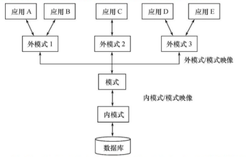

# 数据库系统概述

- 适用于：软考-中级-软件设计师

## 绪论	

### 一、数据库系统概述

数据库的基本概念：

1. 数据：描述事物的符号，数据库中存储的基本对象。
2. 数据库（DB）：**⻓期储存在计算机内、有组织的、可共享的⼤量数据的集合**
3. 数据库管理系统（DBMS）：位于⽤户和操作系统之间的⼀层数据管理软件，数据定义、数据操作、数据组织等
4. 数据库系统（DBS）：由数据库（DB）、数据库管理系统（DBMS）组成

数据库系统的基本特征：共享性、独立性、亢余度小

数据库系统的特点：

1. 数据结构化

2. 数据的共享性高，亢余度低且容易扩充

3. 数据独立性高：

    物理独立性：应用程序与物理存储相互独立，数据的物理存储改变，应用程序不改变

    逻辑独立性：应用程序与逻辑结构相互独立，数据的逻辑结构改变，应用程序不改变

4. 数据由数据库管理系统统一管理和控制

### 二、数据模型

#### Ⅰ、数据模型的组成要素

- 数据结构：1对1、1对多、多对多联系
- 数据操作：CURD
- 数据完整性约束条件：例如int、double、长度等

#### Ⅱ、两类数据模型

1. 概念模型：按⽤户观点来对数据和信息建模，主要⽤于数据库设计。

    主要表示方法E-R图

2. 逻辑模型与物理模型：

    - 逻辑模型：它是按计算机系统的观点对数据建模，主要⽤于数据库管理系统的实现。包括：层次模型、⽹状模型、关系模型
    - 物理模型：是对数据最底层的抽象，它描述数据在系统内部的表示⽅法和存取⽅法，或在磁盘或磁带上的存储⽅式和存取⽅法，是⾯向计算机系统的。

概念模型的基本概念

1. 实体（Entity）：客观存在并可相互区别的事物称为实体。

2. 属性（Attribute）：实体所具有的某一特性称为属性。

3. 码（关键字，Key）：唯一标识实体的（最小的）属性集称为码。

4. 域（Domain）：属性的取值范围称为该属性的域。

5. 实体型（Entity Type）：单一个体

6. 实体集（Entity Set）：单一个体的集合

7. 联系（Relationship）：一对一联系、一对多联系、多对多联系


#### Ⅲ、常见数据模型

| 名称           | 内容                                                         |
| -------------- | ------------------------------------------------------------ |
| 层次模型（树） | 只有一个根节点 <br>1、有且只有⼀个结点没有双亲结点，这个结点称为根结点。<vr> 2、根以外的其他结点有且只有⼀个双亲结点。 |
| ⽹状模型（图） | 1、允许⼀个以上的结点⽆双亲。<br> 2、⼀个结点可以有多于⼀个双亲。 |
| 关系模型（表） | 关系：⼀个关系对应通常说的⼀张表。  <br>元组：表中的⼀⾏。 <br>属性：表中的⼀列。 <br/>码：也称码键，表中的某个属性组。（主键）<br/>域：是⼀组具有相同数据类型的值的集合。  <br/>分量：元组中的⼀个属性。 |

### 三、数据库系统结构

三级模式结构：外模式+模式+内模式



- 外模式（⼦模式或⽤户模式） ：应⽤程序员和最终⽤户能够看⻅和使⽤的局部数据的逻辑结构和特征的描述，是数据库⽤户的数据视图，是与某⼀应⽤有关的数据的逻辑表示。
- 模式（逻辑模式）：是数据库中全体数据的逻辑结构和特征的描述，是所有⽤户的公共数据视图
- 内模式（存储模式）：⼀个数据库只有⼀个内模式。它是数据物理结构和存储⽅式的描述，是数据在数据库内部的组织⽅式。

数据库的二级映射

- 外模式/模式映射：保证数据的逻辑独立性
- 模式/内模式映射：保证数据的物理独立性

### 四、数据库设计步骤

1. 需求分析：生成数据字典和用户需求说明书

2. 概念结构设计：生成E-R图

3. 逻辑结构设计：关系模式

    将E-R图转换为DBMS相符的逻辑结构（包括数据库的外模式和模式）

4. 物理结构设计

5. 数据库实施

6. 数据库运行和维护

### 五、ER图题型


1. 文字描述转ER图

    注意：题目中出现的属性是固定的，当条件中提出多个属性时，应添加在条件上

2. ER图转关系

    | 关系         | 说明                                                         |
    | ------------ | ------------------------------------------------------------ |
    | 1：1（AB表） | 把关系上的属性放到任意一个表中（设A），并把 B表的主键放到一个 A表 中 |
    | 1：n         | **关系**上的属性放到 n表 中，把**1的主键**也放到n表中        |
    | n：m         | 将**关系属性**生成一个新表，并保存**nm表的主键**             |

### 六、候选码

> 若给定的模式为R，U={A，B，C}，F={AB->C，C->B}则关系R

- 只出现在左边的⼀定是候选码：A一定是候选码

- 只出现在右边的⼀定不是候选码：无

- 求确定候选码的闭包：$(A)+ = 空$

    如果可以推出全部，那么当前确定的就是候选码

- 求不确定候选码的闭包：$(AB)+、(AC)+$​

    $(AB)+=CB+AB$：AB是候选码

    $(AC)+ = B+AC$​​：AC是候选码

    则：主属性为不重复的集合：AB+AC = ABC

- 求主属性：候选码的去重集合，⽐如ABC

- ⾮主属性: 不包含在候选码中的属性 

- 全码: 所有的属性都是主码

- 主码: 从候选码⾥⾯任意跳出⼀个作为主码

### 七、数据库恢复

事务概念

- 事务是数据库操作序列，这些操作要么全做要么不做，是不可分割的工作单位。
- 事物是恢复的基本单位，也是并发控制的基本单位

定义事物的sql语句

- 开始语句：begin transaction
- 结束语句：commit
- 回滚语句：rollback

**事务（ACID）的4个特性** 

- 原子性：一个事务要么全做，要么不做
- 一致性：事务执行的结果必须一致
- 隔离性：一个事务的执行不能被其他事务干扰
- 持续性：一个事务一旦提交，他对数据中数据的改变应该是永久的

数据库系统的故障种类

- 事务内部故障
- 系统故障
- 介质故障
- 计算机病毒

数据库恢复技术：数据转储、登记日志文件

### 八、并发控制

1. 并发带来的问题：丢失修改、读脏数据、不可重复读
2. 解决方法：
    - 排它锁：也叫写锁（X锁）Xlock  unlock（写锁不能再加其他锁）
    - 共享锁：也叫读锁（S锁）Slock（可加读锁，不能加写锁）
3. 封锁协议
    - ⼀级封锁协议：修改时，必须加X锁，直到结束（解决丢失修改）
    - ⼆级封锁协议：读的时候，加S锁，⽤完就放（解决读脏数据）
    - 三级封锁协议：读的时候，加S锁，直到结束（解决不可重复度）

> 若事物T1对数据D1添加了共享锁，事物T2、T3分别对数据D2、D3添加了排他锁

- D2、D3加了写锁，不能加其他锁
- D1加了读锁，可加其他读锁

## 关系数据库

### 一、关系数据结构定义

1. 域：一组具有相同数据类型的集合，例如{1，100}、长度小于100的字符串

2. 笛卡尔积：$D_1\times D_2\times ...\times D_n $

3. 关系：笛卡尔积的有限子集

    $D_1\times D_2\times ...\times D_n $的子集叫做在域$D_1、D_2...D_n$的关系，记为$R(D_1、D_2...D_n)$ 

    R：关系名称

    n：关系的目或度

    n=1：单元关系

    n=2：二元关系

### 二、关系完整性

1. 实体完整性：主键（主码）不能为空
2. 参照完整性：外键
3. 用户自定义完整性：大量广泛

### 三、关系代数

1. 关系数据语言可分为3类：SQL语言、关系演算语言、关系代数语言

2. 集合运算符

    - **并**（∪）：2个集合，合并在一起

    - **差**（-）：A-B，从A中去除B的内容

    - **交**（∩）：2个集合相同的部分

    - **笛卡⼉积** （$\times$）：$A\times B$，先取A中的第一行，与B的每一样组合在一起，然后取A的下一行继续，直到全部组合完毕

3. 专门的关系运算符

    - **选择**（$\sigma$）：

        $\sigma_{sdept='IS'}(Student) $ ：查询Student表，sdept='IS'的值（行选择）

    

    - **投影**（$\prod$）：（列选择）

        $\prod_{sname, sdept}（Student）$ ：选中Student表的snme，sdept列。

    - 连接（⋈）：（应先做笛卡尔积，然后根据条件筛选）

        1. **等值连接（=）**：$\frac{A⋈B}{A.a=B.b}$，根据条件$A.a=B.b$保留所有条目
        2. **自然连接（⋈）**：A⋈B，在等值连接的基础上去掉重复的列。
    
    - 悬浮数组：R与S做自然连接时，保留被舍弃的数据
    
        1. **外连接**（⋈）：A$\times$B中所有行，不相等的也保留，没有的属性写NULL
        2. **左连接（⋊）**：A⋊B，保留左边（A）的所有属性
        3. **右连接（⋉）**：A⋉B，保留左边（B）的所有属性
    
    - **除（ / ）**：
    
        例如：R / S
    
        1. 保留R与S中列属性值相等的行。生成一个新的表C
        2. 在C中保留除S中的列之外的所有列
    

### 四、查询效率优化

1. 提早执行选择运算
2. 合并乘积与其后的选择运算为连接运算
3. 将投影运算与其他运算同时进行
4. 将投影运算与其他的二目运算结合起来
5. 在执行连接前对关系作适当处理
6. 存储公共子表达式

## 关系数据标准语言SQL

### 一、SQL概述

1. 综合统一
2. 高度非过程化
3. 面向集合操作
4. 以同一种语法结构提供多种使用方式

### 二、数据定义

#### Ⅰ、变量类型

|   变量类型   | 含义                                      |
| :----------: | :---------------------------------------- |
|   char(n)    | 长度为N的定长字符串                       |
|  varchar(n)  | 最大长度为n的不定长字符串                 |
|     clob     | 字符串对象                                |
|     blob     | 二进制对象                                |
|     int      | 整型（4                                   |
|   smallint   | 短整型（2                                 |
|    bigint    | 长整型（8                                 |
| numeric(p,d) | 定点数，一共有p位数字，d位是小数点后面的  |
| decimal(p,d) | 同numeric                                 |
|   dec(p,d)   | 同numeric                                 |
|     real     | 取决于机器精度的单精度浮点数              |
|    double    | 高精度浮点数                              |
|   boolean    | 逻辑布尔型                                |
|     date     | 日期，YYYY-MM-DD                          |
|     time     | 时间，HH：MM：SS                          |
|  timestamp   | 时间戳                                    |
|   interval   | 时间间隔类型                              |
|   not null   | 非空                                      |
| primary key  | 主键，也可primary key (id)                |
| foreign key  | 外键，forergn key(id) Reference table(id) |
|    unique    | 唯一                                      |
|    check     | sex char(2) check(sex in(1,2)             |

#### Ⅱ、模式（schema）

创建模式格式：模式相当于一个命名空间

- `create schema <模式名> authorization <用户名> [<视图> | <表定义句> | <授权>]`

``` sql
# 为用户TREE定义一个ST模式
create schema "ST" authorization Tree
```

删除模式格式：

- `drop schema <模式名> <cascade | restrict>`

- CASCADE(级联) ：

    删除模式的同时也把该模式的所有数据库对象删除.

    相当于`rm -rf ` 

- RESTRICT(限制)：如果该模式下有下属对象，⽐如表视图，就拒绝这个删除语句的执⾏

指明某一个表属于某个模式：

1. 在创建表的同时指定模式名

    ``` sql
    # 指定user表是在ST模式下
    create table "ST".user( 
        id int primary key, 
        age int,
        name varchar(255)
    );
    ```

2. 在创建模式的同时创建表

    ``` sql
    # 为用户Tree创建一个ST模式，同时创建一个表User
    create schema "ST" authorization Tree
    create table user( 
        id int primary key, 
        age int,
        name varchar(255)
    );
    ```

3. 设置所属的模式

    ``` sql
    SET 路径 to "ST", PUBLIC;
    ```

#### Ⅲ、表（table）

创建表格式：

- `create table <表名>(<属性>)` 
- 主键关键字：primary key（不能为空）
- 取值唯一：UNIQUE（不能为空）
- 非空：NOT NULL

``` sql
# 创建主键，方式一
create table course(
    id int not null primary key,
    time varchar(255)
);
# 方式二
create table course(
    id int not null, # 非空
 	time int UNIQUE，# 取值唯一
    primary key(id), # 主键
);

```

创建外键：

- 外键关键字：foreign key

``` sql
# 创建外键
create table course (
    id int primary key(cid),  # 声明主键
    cid int,
    # 当前表的cid是外键，与c表的c_id相联系
    foreign key (cid) references c(c_id)
)
```

删除表格式：

- `drop table <表名>[restrict | cascade]`

修改表格式：

- `alter table <表名>[add <约束>]`

``` sql
# 向user表增加S_time和Date列
ALTER TABLE user ADD S_time date

# 修改user表中的sage列为int
# mysql中式使用modify代替alter
ALTER TABLE user ALTER COLUMN sage INT;
```

#### Ⅳ、索引

创建索引：

- `create [unique][cluster] index <索引名> ON <表名(列名)>` 

    CLUSTER：聚簇索引，物理顺序与索引的逻辑顺序相同。⽐如书 
    
    UNIQUE：唯⼀索引

``` sql
# 在student表中的SNO列创建索引，索引名为st_id
CREATE UNIQUE INDEX st_id ON student(sNo);
```

修改索引：`alter index <旧索引名> rename to <新索引名>`

删除索引：`drop index <索引名>` 

### 三、数据查询

#### Ⅰ、单表查找

语法格式：

- `SELECT [All | Distinct] <列名> FROM <表名>  [特殊]`

    ALL：默认

    DISTINCT：去重

- 特殊：

    `WHERE 条件表达式`：条件查询

    - 字符匹配like

        %：任意长度；a%b以a开头，b结尾

        _：任意的单个字符；

    | 查询条件 | 谓词                         |
    | -------- | ---------------------------- |
    | 比较     | =,>,<,>=,<=,!=,等等          |
    | 范围     | between and，not between and |
    | 集合     | in，not in                   |
    | 字符匹配 | like，not like               |
    | 空值     | is null，not is null         |
    | 多重条件 | and，or，not                 |

    `GROUP BY <列名> [Having <条件表达式>] `：分组查询

    ``` sql
    # 查询t字段从edu，并通过title分组
    SELECT t FROM edu GROUP BY t
    # 查询t字段从edu通过title分组，并筛选其中t=s的字段
    SELECT t FROM edu GROUP BY t Having t="s"
    ```

    `ORDER BY <列名> [ASC | DESC]`：排序

    - ASC：默认，升序
    - DESC：降序

``` sql
# 查询所有列
SELECT * FROM t
# 查询指定列
SELECT n FROM t
# 结果去重(+ distinct)
SELECT DISTINCT n FROM t
# 列起别名
SELECT n AS name FROM t
# 表起别名
SELECT n FROM t AS Tab_name
```

#### Ⅱ、聚集函数

- 加上DISTINCT是去除列⾥⾯重复的 来计算

``` sql
# 统计title的数量，count不忽略空值
select count(title) from table
# 去重统计
select count(distinct title) from table

# 求price列的平均值
select AVG(price) from table
select AVG(distinct price) from table
# 求price列的最大值
select MAX(price) from table
select MAX(distinct price) from table
# 求price列的最小值
select MIN(price) from table
select MIN(distinct price) from table
```

#### Ⅲ、连接查询

1. 并没有专用的关键字表示连接、使用比较运算符实现连接

等值连接:

- 使用“=”连接

``` sql
# 等值连接
SELECT t,c 
FROM edu_t as t, edu_c as c 
where t.id = c.id
```

自身连接

``` sql
SELECT S1.sno, S1.sname, S1.sdept
FROM Student as S1, Student as S2
WHERE S1.sdept = S2.sdept
```

外连接：

- 关键字：left outer join 、right outer join

``` sql
# 外连接，把保留所有结果,没有的填NULL
# 左外连接 A left outer join B, 保留A的所有
# 右外连接 A right outer join B, 保留B的所有
select * 
from student 
left outer join SC 
on(student.id=SC.id)
```

#### Ⅳ、嵌套查询

1. 不相关子查询：子查询的结果与父查询的结果不相干，可以独立分开查询
2. 相关子查询：子查询的结果依赖父查询的结果

带IN谓词的查询

- 不相关查询，查询从最内层的查询开始

``` sql
SELECT Sno,Sname,Sdept
FROM Student
WHERE Sdept IN (
    # 先查询，其结果作为父查询的条件
	SELECT Sdept FROM Student WHere Sname ='LT';
);
```

带有比较运算符的查询

- 能确切知道内层查询结果的情况下，使用“=,>,<,!=”等等运算符

``` sql
# 找出每个学生超过他选修课程平均成绩的课程号
SELECT Sno, Cno
FROM sc as x
WHERE grade >= (
	SELECT AVG(grade) FROM sc as y WHERE y.Sno=x.Sno
);
```

带有ANY、EXIST、ALL的子查询

- ANY：某一个值

    当$>ANY，<ANY、>=ANY、<=ANY$可以理解为最小值

- ALL：所有值（可以理解为最大值）

    $=ALL$：没有实际意义

    $!=ALL$：不等于任何一个值

- EXIST：后面的子查询有值返回1，没有返回0

- not exists：后面的子查询没有值返回1，有值返回0

``` sql
# >any 大于最小值
# >all 大于最大值
SELECT * 
FROM edu_course 
WHERE price >ANY(
    select price from edu_course
)

# EXIST查询结果
select Sname from student where exists(
    select * from course where id =1
) 
```

#### Ⅴ、集合查询

1. 注意参与查询的结果列数必须相同，数据类型也必须相同

并（UNION）

- UNION：将多个表合并起来，并去掉重复元组
- UNION ALL：保留重复元组

```sql
SELECT * FROM student WHERE sdept="cs" 
UNION
SELECT * FROM student WHERE sage<=19
```

交（INTERSECT）

```sql
# 计算机系的学生同时年龄小于19
select * from student where sdept = "cs" 
INTERSECT
select * from student where sage <19
```

差（EXCEPT）

```sql
select * from student where sdept="CS"
EXCEPT
select * from student where sage<19
```

### 四、数据更新

数据插入

- `insert into <表名> [(字段列表)] values (值)`

``` sql
# 例
insert into student(id, name, age) values(1, liming, 19)
insert into student values(1, liming, 19)
# 插入多条数据
insert into student 
values(1, liming, 19),(2,zhangsan, 18)
```

数据修改

- `update <表名> set <属性名>=<值>` 

``` sql
# 例
update stu set age=33, sex=1
```

数据删除

- `delete from <表名> [where 条件]` 

``` sql
# 例
delete from stu where id=100;
```

### 五、空值处理

1. 空值：不知道、不存在、无意义的值

2. IS NULL：为空

3. IS NOT NULL：不为空

4. NULL与任何值进行逻辑计算都是NULL 

    例如：`T and NULL = NULL`

``` sql
SELECT * 
FROM Student
WHERE sex IS NULL OR age IS NULL;
```

### 六、视图

#### Ⅰ、定义视图

- 格式：`create view <视图名> [(列名)] as <子查询> [with check option]`

    with check option：保证插入删除更新时满足视图表达式条件，防止用户对不属于视图范围的数据进行操作

``` sql
# 创建视图
create view IS 
# SELECT后面不推荐使用*号
AS SELECT Sno,Sname,Sage 
FROM student
```

#### Ⅱ、删除视图

- `drop view <视图名> [cascade]` 

    如果视图还导出了其他视图，使用cascade可删除所有相关视图

#### Ⅲ、查询

- 与基本表的查询相同

#### Ⅳ、更新视图

- 对视图的操作会转换为普通的插入删除操作

``` sql
# 更新视图
# 由于视图是不存在的，所有直接更新表
update IS set name=“123” where id = 3
相当于
update student set name="123" where id=3
```

## 数据库安全性

### 一、数据库安全性概述

不安全因素：

- ⾮授权对数据库的恶意存取和破坏
- 数据库中重要的数据泄露
- 安全环境的脆弱性

安全标准简介

1. TCSEC标准
2. CC标准

### 二、数据库安全性控制

1. ⽤户身份鉴别：静态⼝令鉴别，动态⼝令鉴别，⽣物特征鉴别，智能卡鉴别

2. 存取控制：用户定义权限、合法权限检查

    C2级别的数据库支持**自主存取控制**（DAC），实现方式GRANT语句

    B1级别的数据库支持**强制存取控制** （MAC）

3. 视图

4. 审计

5. 数据加密：防止数据库在存储和传输时泄密

#### Ⅰ、授权（grant）

1. 格式：`grant <权限> on <对象类型> <对象名> to <用户名> [with grant option]`

    - 权限：select、delete、update、insert、all privileges等

    - 对象类型：table、view等

    - 对象名：表名，视图名等

    - 用户名：授权给某个用户，publc所有用户

    - with grant option：没有此选项，当前用户不能将此权限授予其他用户

2. 给用户授予角色

    格式：`grant <角色> to <用户> [with admin option]`

    - with admin option：此用户可以把权限授权给其他角色
    - 注意：新创建的角色权限是空的，需要Grant语句授权

``` sql
# 将表mmm的select权限授予tree
GRANT SELECT ON TABLE mmm TO tree
GRANT select ON table mm@ TO tree WITH GRANT OPTION

# 授权给角色
grant select on Student to CEO
```

#### Ⅱ、收回权限（revoke）

1. 格式：`revoke <权限> on <对象类型> <对象名> from <用户名> [cascade| restrict]`

    - 权限：select、delete、update、insert、all privileges等
    - 对象类型：table、view等
    - 对象名：表名，视图名等
    - 用户名：授权给某个用户，publc所有用户
    - cascade：级连回收，将用户传播出去的权限一块回收
    - restrict：受限回收，如果用户传播过权限，回收失败

``` sql
REVOKE update(studen) ON table student FROM tree
```

#### Ⅲ、创建数据库模式权限

1. 格式：`create user <用户名> [with dba | resource | connect]`

    - with dba：此用户可以创建新用户、创建模式、创建基本表和视图，拥有对所有数据库对象存取权限，还可以把这些权限授权给其他用户
    - resource：此用户可以创建基本表和视图
    - connect：默认创建用户，只能登录，没有任何权限

#### Ⅳ、创建数据库角色

1. 格式：`create role 用户名` 

#### Ⅴ、审计功能

``` sql
# 开启对sc表的修改、更新审计功能
AUDIT ALTER,UPDATE ON sc

# 取消审计
NOAUDIT ALTER,UPDATE ON sc
```

## 数据库完整性

1. 数据的正确性：必须符合现实世界语义

2. 数据的相容性：一个数据在不同的表中表示的语义相同

3. 维护完整性需要实现的功能

    - 提供定义完整性约束条件的机制
    - 提供完整性检查的方法
    - 进行违约处理

三大完整性-属性上的约束

- 实体完整性：主码唯一，不为空
  违约处理：拒绝；
- 参照完整性：外码的约束

    

- 用户定义完整性：（check语法）

    违约处理：拒绝

    1. 非空，NOT NULL
    2. 唯一，UNIQUE
    3. 检查是否符合表达式，CHECK

三大完整性-元组上的约束

- 在create table语句中可以用check短语定义元组上的约束条件，元组级的限制可以设置不同属性之间的取值的相互约束条件
- 检查和违约：插入元组和修改属性值时，关系数据管理系统将检查元组上的约束条件是否被满足，如果不满足则拒绝操作

### 一、实体完整性

1. 使用`PRIMARY KEY`设定实体完整性

2. 实体完整性检查和违约处理

    只有在插入和更新操作自动检测

    违约处理：拒绝

### 二、参照完整性

1. 使用`FOREIGN KEY`定义外码，`REFERENCES`指明外码对应的主码

2. 插入删除修改会引发参照完整性检测

3. 违约处理：默认操作是拒绝

    插入：拒绝

    删除：级联操作、设置为空值

显式说明参照完整性操作

``` sql
create TABLE SC(
FOREIGN KEY(id) REFERENCES student(sno)
    ON delete CASCADE /*指定删除是级联操作*/
    ON update NO ACTION /*指明更新是拒绝操作*/
)
```

### 三、用户定义完整系

1. 属性上的约束条件

    非空（NOT NULL）、唯一（UNIQUE）、检查（CHECK）

2. 插入删除：拒绝

### 四、完整性约束命名语句

格式：`CONSTRAINT <完整性约束条件名称><完整性约束条件>`

- 完整性约束条件包括：NOT NULL、UNIQUE、PRIMARY KEY等

``` sql

```

### 五、断言

1. 断言可以定义复杂的完整性约束

断言创建格式：`CREATE ASSERTION <断言名><check 子句>` 

- 只有check语句为真的时候，才执行对表的操作

``` sql
# 检查SC数据库中的表，如果<60执行
CREATE ASSERTION ASSE_SC_DB
CHECK (60 > (select count(*) from SC))

# 删除断言
drop assertion ASSE_SC_DB
```

### 六、触发器

语法格式：

`create trigger <触发名>`
`{before | after} `
`<触发事件> on <表名>`
`referencing `
`    { oldrow, newrow } as <变量>`
`for each row`
`[when ( <触发条件> )] <触发动作> `# 只有触发条件为真，才触发动作

``` sql
create trigger <触发名>
{before | after} # before在触发事件之前发生，after在触发事件完成之后发生
<触发事件> on <表名> # 触发事件例：update of grade ,更新grade字段
referencing 
    { oldrow, newrow } as <变量>
for each row
[when ( <触发条件> )] <触发动作> # 只有触发条件为真，才触发动作

#例
create trigger Student_1
after insert on student #在student表中的所有插入动作
referencing 
    newtable as delta
for each statement
    insert into student values()
```

## 关系理论

### 一、函数依赖

1. Y完全函数依赖于X：X  $\underrightarrow{F}$  Y
2. Y部分函数依赖于X：X  $\underrightarrow{P}$​  Y
3. 若K为关系R(U)中的属性，K  $\underrightarrow{F}$  U，则K为R的一个候选码
4. 若K为关系R(U)中的属性，K  $\underrightarrow{P}$  U，则K为R的一个超码
5. 若关系模式R有多个候选码，则选其中一个作为主码
6. 包含在任何一个候选码中的属性，为主属性
7. 不包含任何一个候选码的属性为非主属性

### 二、范式

- **1NF**：所有字段值都是<u>不可分解的原⼦值</u>、不能表中有表
- **2NF**：<u>⼀个表中只能保存⼀种数据</u>（消除主属性对候选码的部分依赖），不可以把多种数据保存在同⼀张数据库表中（比如订单表，不能包含商品信息）
- **3NF**：不包含⾮主属性对主码的<u>传递函数依赖</u>，确保数据表中的每⼀列数据都和主键直接相关，⽽不能间接相关
- **BCNF**：消除每⼀属性对候选键的<u>传递依赖</u> ,BCNF是修正的第三范式（例，书号->书名，(书名，书号)->作者

### 三、公理系统

1. 推理规则：$\to$ 表示推理得到
    - 合并规则：$X\to Y，X\to Z，则X\to Z$ 
    - 伪传递规则：$X\to Y, WY\to Z，则WX\to Z$ 
    - 分解规则：$X\to Y, Z属于Y，则X\to Z$​​ 
2. 2个函数依赖集等价：其闭包相同
3. 闭包$F^+$：在关系模式中R<U, F>中为F所蕴含的函数依赖的全体叫F的闭包

#### Ⅰ、求闭包

> 已知关系模式R<U,F>，其中U={A,B,C,D,E}；$F=\{AB\to C, B\to D, C\to E, EC\to B, AC\to B\}$，求$(AB)^+$​ 

- 设$X^0=AB$ 

- 由$AB\to C, B\to D$ 得$X^1=X^0\cup CD=ABCD$ 

- 因为$X^0\neq X^1$ 

    由$X^1=ABCD$可得$AB\to C, B\to D,C\to E,AC\to B$​ 

    去掉$X^0$得到得重复关系$AB\to C, B\to D$得$C\to E,AC\to B$

    $X^2=X^1\cup EB=ABCDE$

- $X^0\neq X^2$，但此时$X^2$已经是U得全部

    $(AB)^+=ABCDE$​ 

> 若提前由$X^0 = X^i$则算法终止，当前得$X^i$​就是所求闭包

#### Ⅱ、求最⼩函数的依赖集

> 已知关系 R<U,F> ，U={A,B,C,D}，$F=\{A\to BD，AB\to C，C\to D\}$ 

-  分解为单一属性：

    ⽐如$A\to BC 拆为 A\to B 和A\to C$ 

    $F=\{A\to B, A\to D，AB\to C，C\to D\}$​ 

- 去除F左侧多余元素，因为F中左侧只有AB是多个元素

    $(A)^+=(A,B,C,D)$

    $(B)^+=(B)$ 

    因为A的闭包包含C，所以B是多余元素

    得：$F=\{A\to B, A\to D，A\to C，C\to D\}$ 

- 去除F中多余得关系

    假设$A\to D$是多余得关系，去掉其得到$F=\{A\to B, A\to C，C\to D\}$ 

    求$(A)^+=(A,B,C,D)$ 与U相同所以$A\to D$这个关系是多余得

### 四、模式分解

1. 准则: ⽆损连接 和 保持函数依赖
2. ⽆损: 就是分解后再次连接,和分解之前⼀样
3. 依赖: 依赖不变
4. 保持函数依赖分解

已知R(ABCDEGH)，F={A->D，E->D，D->B，BC-D，DC->A}，求保持函数依赖的3NF的分解

1、求出最⼩函数依赖集

F={A->D，E->D，D->B，BC->D，DC->A}

2、把不在F⾥⾯的属性都找出来单独分⼀类

F的属性是ADEBC，R的属性是ABCDEGH，所以得结果{GH}

3、把每⼀个依赖左边相同的分成⼀类，没有⼀样的，那么就把A->D改为{AD}

    相同：{A->B，A->C} => {ABC}

    不同：{A->D} => {AD}

{AD}，{ED}，{DB}，{BC}，{DCA}

4、求候选码，如果候选码没出现在分离⾥⾯, 把任意⼀个候选码作为⼀类

候选码：CE

将最小函数依赖写下：{AD}，{ED}，{DB}，{BC}，{DCA}

添加**候选码**和**不在F⾥⾯的属性**则最终结果

{AD}，{ED}，{DB}，{BC}，{DCA}   {CE}{GH}

## 数据库编程

1. 与C语言通信：`EXEC SQL <sql语句>` 
2. 与Jave语言通信：`#SQL {<sql语句>}` 

嵌入式SQL与主语句得通信包括

- SQL向主语言传递指向状态，主要通过**SQL通信区实现** 

    SQL通信区：SQL语句执行后得状态将送到SQL通信区中，应用程序从中取得这些信息，据此决定接下来得语句

- 主语句向SQL提供参数，主要通过**变量实现** 

    主变量：SQL语句中使用得主语言程序变量（即SQL使用主语言得变量）

- 将SQL语句查询数据库结果交给主语句处理，主要通过**变量和游标**实现 

    游标：SQL是面向集合得，一条SQL语句可以产生或处理多条记录，而主语言是面向记录得，一组变量一次只能存放一条记录，因此引入游标

- 建立连接：嵌入sql必须先连接数据库

- 关闭连接：对新得嵌入式sql为EXEC SQL DISCONNECT

C语言与SQL通信实例


