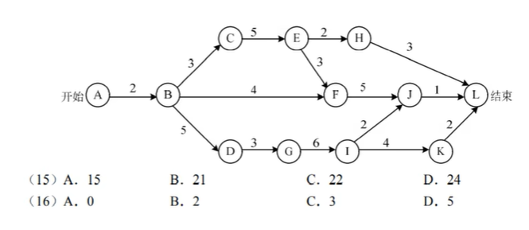
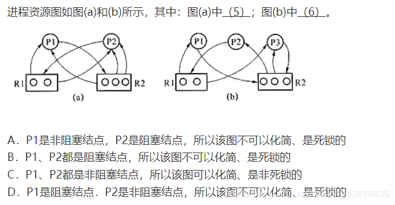
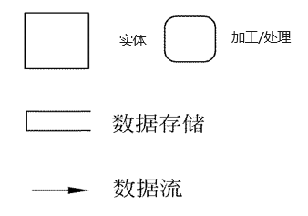
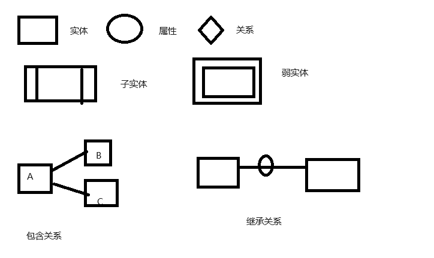

# 软考-软件工程师

- 适用于：软考-中级-软件工程师

## 程序设计语言

1. 低级语言：机器语言、汇编语言
2. 高级语言：C/C++
3. 程序设计语言的定义：语法、语义、语用、语境
4. 程序设计语言必须有类型：
    1. 为数据合理分配存储单元
    2. 规定数据的取值范围、能够进行的运算
    3. 对表达式求值进行合法检测

### 一、语法推导树

> 文法G=({a，b}，{S，A}，S，P)，其中S$\to$ aAS | a；A$\to$ SbA | SS | ba。请构造aabAa的推导树

- 由题目得$S\to aAS，S\to a，A\to SbA，A\to SS，A\to ba$​ 
- 注意$S\to a$，但a不能推出任何，所以，一开始只能选S，
- 只有S才能分解出a，所以，也不能使用A开始分解

### 四、传值和引用

1. 形参：形式参数，函数定义中的参数
2. 实参：实际参数，函数调用传递的值

### 五、各个语言的特点

1. Fortran：科学计算
2. Pascal：为教学而开发，
3. C：指针操作能力强
4. Lisp：函数式语言，符号处理，人工智能
5. C++：面向对像
6. Java：面向对像，中间代码，跨平台
7. C#：面向对象，中间代码，Net
8. Prolog：逻辑推理，数据库和专家系统

## 软件工程

1. 配置数据库一般包括：开发库、受控库、产品库
2. 对于大多数通用程序设计语言，用上下文无关描述其语法
3. 对高级语言编译过程中，使用符号表来记录源程序中各个符号的必要信息
4. 对高级语言进行编译或解释的过程可以分为多个阶段，解释方式不包含目标代码生成
5. 对于高级语言编译或解释过程中需要进行语法分析

    - 递归子进程分析属于自上而下
    - 分配寄存器属于目标代码生成阶段
    - 中间代码可以使用栈和队列表示，好处是有利于进行与机器无关的优化处理
    - 堆区一般进行函数调用和返回时由系统进行控制和管理
6. 反编译通常不能把可执行文件还原成源代码，只能转换成等价的汇编程序
7. 基本COCOMO软件成本估算模型是一种静态单变量模型，用于对整个软件系统进行估算

### 一、软件工程

1. 模块划分不是软件工程模型的内容

#### Ⅰ、能力成熟度模型CMM

1. 初始级：软件工程是杂乱无章的，软件成功完全依赖个人
2. 可重复级：建立了**基本的**项目管理和实践来跟踪项目费用、进度和功能
3. 已定义级：管理和工程两方面软件几经**文档化**和**标准化**
4. 已管理级：（**关键字管理**）
   - 制定了软件和产品质量的详细度量标准
   - 对软件和产品都有定量的理解和控制
   - 关注产品和过程质量
5. 优化级：加强了定量分析，通过反馈不断更新（关键字更新，改进）

#### Ⅱ、能力成熟度模型CMMI

1. 阶段试模型
   - 初始级：不可预测且不可控
   - 已管理：为项目服务
   - 已定义：为组织服务
   - 定量管理：过程已度量和控制
   - 优化的：集中于过程改进
2. 连续式模型
   - CL0未完成级：过程未执行或未达到CL1的目标
   - CL1已执行级：关键字：输入输出
   - CL2已管理：
   - CL3已定义：关键字：标准化
   - CL4定量管理：
   - CL5优化级：关键字：优化、改进

### 二、软件工程模型

1. 瀑布模型
   - 大规模系统
   - 明确需求：具备开发经验、替换原有系统、系统功能有清晰定义、项目初期对软件需求有准确全面的认识、需求被清晰定义
   - 容易理解，管理成本低
   - 瀑布模型难以适应需求突然变化
   - 强调开发阶段的早期计划

2. V模型
   - 瀑布模型的变体
   - V模型描述了质量保证和沟通、建模相关活动之间关系
   - V模型与瀑布模型同时出现，一般选择瀑布模型

3. 增量模型
   - 第一个可交付版本时间少、成本少（可快速构造可运行版本）
   - 是一种适用于商业产品创新的版本
   - 适合商业产品开发
   - 最高级优先功能首先交付
   - 具有瀑布模型的优点，瀑布模型的变体
   - 用户需求要清晰，不然会影响开发进度
   - 开发由增量表示的小系统所承受的风险低
   - 增量模型的管理、进度、配置的复杂性高

4. 演化模型
   - 系统功能在使用过程中经常改变
   - 可以尽快的使用

5. 原型模型
   - 有效的捕获系统需求（用户需求不明确）
   - 用户需求经常变化
   - 系统规模不是很大、不是很复杂

6. 螺旋模型
   - 特点：风险评估、适合大规模软件

7. 喷泉模型
   - 以用户需求为动力、以对象为驱动（面向对象的开发方法）

   - 开发过程具有迭代性和无间隙性

     各软件开发活动（如分析、设计、编码）之间没有间隙

   - 克服了瀑布模型不支持软件重用和多项开发活动集成的局限性

8. 统一过程模型（UP）

### 三、敏捷开发

1. 极限编程（XP）

   4大价值观：沟通、简单性、反馈、勇气

   5个原则：快速反馈、简单假设、逐步修改、提倡修改、优质工作

   12个最佳实践：

   - 计划游戏：快速制定计划
   - 隐喻：找到合适的比喻传达信息
   - 小型发布：系统设计尽可能早交付 
   - 简单设计：只处理当前需求、使设计保持简单
   - 测试先行：先写测试代码、再写程序
   - 重构：重新审视需求和设计
   - 结对编程：
     - 支持共同代码拥有和共同对系统负责
     - 非正式的代码审核
     - 代码质量更高
   - 集体代码所有制
   - 持续集成：可以按日或小时为客户提供可运行版本

2. 水晶法（crystal）：不同的项目需要不同的策略约定和方法

3. 并列争求法（scrum）：使用迭代方法

4. 自适应软件开发（ASD）：

5. 敏捷统一过程（AUP）

   - 在大型上连续、在小型上迭代
   - 采用经典的UP阶段性活动，即初始化、精化、构件、转换

### 四、系统设计

#### Ⅰ、概要设计

1. 设计软件总体结构
   - 划分功能模块、将系统划分为多个子系统
   - 确定模块之间的调用关系
   - 确定模块之间的接口
   - 评价模块质量
2. 数据结构和数据库设计
   - 数据结构设计
   - 数据库设计：概念设计、逻辑设计、物理设计
3. 编写概要设计文档：
4. 评审：

#### Ⅱ、详细设计

1. 对模块进行详细算法设计
2. 对模块内的数据结构进行设计
3. 对数据库进行物理设计

### 五、系统测试

1. 软件产品的 Alpha 测试和 Beta 测试属于（ 确认测试）。

2. 软件测试是为了发现软件中存在的错误，不存的错误无法发现

3. 软件测试是在开发的每一个阶段（并不是从编码阶段开始）

4. 成功的测试是发现一个尚未发现的错误

5. 测试用例不仅要设计有效合理输入，也要包含不合理，失效输入

6. 系统测试阶段的测试目标来自需求分析阶段

7. 在设计测试用例时应考虑数据输入和预期输出结构

8. 软件测试的目的不是为了证明软件的正确性

#### Ⅰ、单元测试

- 模块接口
- 局部数据：是否使用了尚未赋值的变量
- 重要的执行路径
- 出错处理
- 边界条件

#### Ⅱ、集成测试

1. 自顶向下的集成测试：不需要编写驱动程序，需要桩程序
2. 自底向上的集成测试：不需要编写桩程序，需要驱动程序
3. 回归测试：改正现有BUG，会出现新的BUG
4. 冒烟测试
5. 单元测试：对模块进行测试

### 六、测试方法

1. 静态测试：人工测试、计算机辅助静态
2. 动态测试：分为黑盒测试和白盒测试

#### Ⅰ、黑盒测试（功能测试）

1. 不用知道软件内部是如何实现的
2. 黑河测试功能
   1. 等价内容划分
   2. 边界值分析
   3. 错误猜测
   4. 因果图
3. 如何判断测试用例好坏，测试用例应包含一个正确的结果一个错误的结果

#### Ⅱ、白盒测试

1. 使用白盒测试应根据程序内部结构和指定的覆盖标准确定测试数据

2. 语句覆盖是最弱的覆盖准则，路径覆盖是最强的覆盖准则

3. 逻辑覆盖

   - 语句覆盖：不包含语句（长方形）的分支可以不计入

     注意：由菱形直接到结束，没有语句，不用计入

     最少语句覆盖，最少为1个

   - 判定覆盖（分支覆盖法）：包含所有判定框（菱形框）

   - 条件覆盖：菱形框中的条件都满足1次

   - 条件/判断组合覆盖：

   - 条件组合覆盖：

   - 路径覆盖：包含所有路径

   - 注意循环语句的表示，循环语句不算一条路径

     

4. 循环覆盖

5. 基本路径测试

#### Ⅲ、MCCabe

1. McCabe度量法计算程序环路复杂度：$V = m-n+2$ 
2. M：图中边的个数
3. N：图中节点个数

### 七、运行和维护知识

#### Ⅰ、系统维护

1. 系统可维护性评价指标：可理解性、可测试性、可修改性

2. 提高软件的可维护性，不是在维护阶段就开始的、各个时期的关键目标

3. 可维护性是衡量软件质量的一个重要特征

4. 文档对软件的可维护性非常重要

5. 编写高质量文档可以提高软件开发质量

6. 文档也是软件产品的一部分，没有文档不能称为软件

7. 软件文档的编制在软件开发工作中占有突出地位和相当大的工作量

8. 高质量文档对于软件产品的效益有重要意义

9. 系统维护：硬件维护、软件维护、数据维护

10. 软件维护包括

    - 正确性维护：改正开发期间没有发现的BUG、防错性程序设计

    - 适应性维护：关键字：适应

      由于外部市场环境和管理需求的变化对现有软件系统提出新的需求

    - 完善下维护：扩充功能和完善功能、提高性能（没有适应关键字的添加功能）

    - 预防性维护：关键字：预防

11. 可靠性：系统在给定的时间内、条件下无失效运行的概率

    公式：MTTF/（1+MTTF）

12. 可用性：系统正确运行的概率

    公式：MTBF/（1+MTBF）

13. 可维护性：完成维护的概率

14. 沟通路径：无向图

#### Ⅱ、软件项目估算

1. 基本cocomo模型：静态单变量模型
2. 中级cocomo模型：静态多变量模型
3. 详细cocomo模型： 子模型
4. cocomo Ⅱ模型：分为三个阶段模型
5. cocomo Ⅱ模型在层次结构中有3种不同的规模
   - 应用组装模型-对象点
   - 早期设计阶段模型-功能点
   - 功能点可转为-代码行

### 八、进度管理

- Gantt图和PERT图了解，15年后基本没考过
- 必考项目活动图

#### Ⅰ、Gantt图

1. Gantt图不能清楚描述各个任务之间的依赖关系

#### Ⅱ、PERT图


- 最早开始时间：一个节点有多个入度，选择时间**最大**的作为最早开始时间
- 最迟开始时间：从结束节点计算，一个节点有多条出度，选择时间**小的**
- 松弛时间：
- 关键路径：时间最长的一个

#### Ⅲ、项目活动图

> 某软件活动图如下，顶点表示项目里程碑，边表示持续时间，完成该项目最少__天，活动BD最多可以晚开始\_\_天，不会影响整个项目进度



- 从开始到结束：选择数值大的

- 从结束到开始：选择数值小的

- 完成项目最少天数：

  - 求关键路径，关键路径是消耗时间最长的路径

  - 关键路径可能有多条

  - 关键路径：$A\to B\to D\to G\to I\to K\to L$ 

- 活动最多可以晚天数（推迟开始时间、松弛时间）：

  - **活动在关键路径上**：一天都不能晚（0）

  - 活动不在关键路径上：

    活动松弛天数 = 关键路径长度 - 当前路径的长度

    - 当前路径的长度：若有多条路径，选择当前路径（包含指定节点）花费最大的路径

- 活动最早开始天数：

  - 活动在关键路径上：直接由最早开始时间相加获得

    > 活动AB最早从1天开始，活动BD最早开始时间

    直接选择2

  - 活动不在关键路径上

    > 活动AB最早从1天开始，活动FJ最早开始时间

    有2条路径，选择时间小的路径（最早开始时间，自然是时间少的）：$A\to B\to F$ 

    $A\to B\to F$​ ：花费时间为 2 + 4 = 6，最早开始时间为6

### 四、风险管理

1. 风险管理一般包含2个特性：不确定性和损失

2. 风险是可能发生的事、对其进行干预，可能会减少损失

3. 风险管理不能只看风险造成的损失，来对风险排优先级

4. 风险不能完全去除，不能去除所有风险

5. 项目开发过程中，需要定期评估风险

6. 风险管理包括：项目风险、技术风险、商业风险

   项目风险：项目复杂度、规模、结构不确定


风险识别：

风险预测：

- 风险预测从2个方面评估，风险发生可能性（概率）、风险产生的后果

风险评估

- 定义风险参照标准

风险控制

- 风险控制目的是辅助项目建立处理风险的策略
- 应对风险的最好办法就是主动避免风险，风险避免是最好的风险控制策略

### 十、软件质量

1. 一个软件的时间和资源质量特性属于效率质量特性
2. 恢复性能和受影响的数据，易恢复性（没有容错性）
3. 将用户数据与其他用户数据隔离开，安全性（功能性中的）
4. 功能性：适合性、准确性、互用性、依从性、安全性
5. 效率：时间特性、资源特性
6. 易使用性：易理解性、易学性、易操作性
7. 可维护性中有：易分析性、易改变性、稳定性、易测试性
8. 可移植性：适应性、易安装性、一致性、易替换性

## 面向对象

### 一、基础构成

1. 面向对象设计与面向对象分析是面向对象软件工程中2个重要阶段
5. 面向对象设计应该依赖于面向对象分析的结果
6. 面向对象设计产生的结果在形式上可与面向对象分析产生的结果类似，都可以使用UML表示
7. 关联（Association)的特殊种类
   - 组合（Composition)：一种很强的“拥有”关系。组合成的新对象完全支配其组成部分，
   - 聚合（Aggregation)：但其程度不如组合强，

#### Ⅰ、类、对象、消息

1. 类是对象的抽象

2. 对象是封装一组数据和行为的集合

3. 控制类：用于控制活动流、充当协调者

4. 实体类：核心类，保存系统中

5. 边界类：系统内部与外部联系的媒介

6. 类中一般与特殊关系

   一般是名称，如交通工具

   特殊是具体的，如汽车

7. 类可用创建很多对象，类是具有相同属性和服务的一组对象的集合

8. 对象由对象名、属性（状态）、操作（行为）三个部分组成

9. 类定义的对象，这些对象共享属性、行为

10. 一个类可用有多个同名，但参数不相同的方法：重载

11. 一个类中有多个同名，同参数的方法：重写

12. 面向对象设计，对象之间通过消息通信

#### Ⅱ、封装、继承、多态

1. 封装是一种信息隐藏技术，其目的是使对象的使用者和生产者分离
2. 两个类及以上作为一个类的超类时，称为多重继承
3. 多重继承可能会造成二义性
4. 继承在已存在的类的基础上创建新的类（添加新方法、新属性错误）
5. 继承定义了超类和子类的关系（继承才会出现子类、父类、超类）
6. 过载多态：指同一个名字在不同上下文代表不同含义
7. 包含多态：最常见的例子是子类型化
8. 参数多态：关键字最纯多态
9. 强制多态：
10. 不同对象收到同一消息会产生不同结果这是多态，多态由继承机制支持

#### Ⅲ、动态绑定、静态绑定

1. 绑定在编译时是静态绑定（关键字编译）
2. 绑定在运行时是动态绑定（关键字运行）
3. 动态绑定支持多态

#### Ⅳ、面向对象设计原则

1. 依赖倒置原则：细节依赖抽象，抽象不依赖细节（高层模块不依赖底层模块）
2. 开闭原则：软件应该对扩展开放，修改关闭
3. 里氏代换原则（LSP）：父类（基类）可用出现的地方，子类一定可用出现
4. 单一责任原则：一个类应该有一个引起它变化的原因
5. 共同封闭原则：一个变化只对一个对象产生影响，其他对象不产生影响
6. 接口分离：关键字接口，依赖于抽象，不依赖具体
7. 共同重用：关键字重用

### 二、设计模式

1. 设计模式要素：模式名称、问题、解决方案、效果
1. 面向对象设计开发过程中，采用设计模式复用成功的设计

#### Ⅰ、创建型类设计模式

1. 简单工厂模式

   - 定义一个工厂类，可以根据不同参数返回不同的实例，被创建的类都有共同的父类
   - 结构图关键字：Factory

2. 工厂模式

   - 结构图关键字：Factory、interface(接口)
   - 当一个类希望由他的子类指定需要创建的对象

3. 抽象工厂(Abstract Factory)模式：

   - 结构图关键字：AbstractFactory
   - 提供一个创建一系列相关或相互依赖对象的接口，而无需指定他们具体的类。
   - 一个系统要独立于他的产品创建、构成、表示
   - 可用于一个系统要由多个产品系列中的一个来配置时
   - 当强调一系列相关的产品对象的设计以便进行联合使用
   - 提供一个产品类库，只想显示他们接口而不是实现
   - 为图形用户组件定义不同的平台并进行类层次结构适合使用抽象工厂类

#### Ⅱ、创建型对象设计模式

1. 生成器模式

   - 结构图关键字：Director（使用生成器的对象）、Builder（生成器）

   - 将一个复杂对象的构建与他的表示分离，使得同样的构建过程有不同的表示

     当创建复杂对象的算法独立于该对象的组成部分

   - 抽象复杂对象构建过程

   - 基于构建过程的具体实现构建复杂对象的不同表示

2. 原型模型

   - 结构图关键字：Prototype
   - 使用原型实例指定创建的对象的种类，并且通过复制这些原型创建新的对象

3. 单例模式

   - 结构图关键字：Singleton
   - 保证一个类仅有一个**实例**，并且提供一个可以访问的全局访问点

#### Ⅲ、结构型设计模式

1. 适配器设计模式
   - 结构图关键字：Adapter
   - 适配器模式使得原本不兼容的接口可以在一起工作
2. 桥接设计模式
   - 结构图关键字：Implementor（用于定义实现接口）
   - 将抽象部分与其实现部分分离，使他们可以独立的工作
3. 组合设计模式
   - 结构图关键字：component（存储子组件，实现子组件相关操作）、client（通过component提供的接口操作）
   - 组合模式将对象组合成树形结构以表示“**部分-整体**”的层次结构
   - 组合模式使得用户对单个对象和组合对象的使用具有一致性
4. 装饰器模式
   - 结构图关键字：Decorator
   - 动态给对象添加额外的功能
5. 外观模式
   - 结构图关键字：Facade、有一个大方块包住了很多功能
   - 为子系统的一组接口提供一个统一的界面，Facade定义了一个高级接口，使得子系统更加容易使用
   - 为复杂的子系统提供一个简单接口
6. 享元模式
   - 结构图关键字：Flyweight
   - 运用**共享**技术有效的支持大量细粒度的对象
7. 代理模式
   - 结构图关键字：Proxy
   - 为其他对象提供一种代理**控制对这个对象的访问**

#### Ⅳ、行为型设计模式

1. 责任链设计模式
   - 结构图关键字：Handler
   - 需要一组相关对象
   - 进多个对象的请求连成一条链，并沿着这条链传递请求
2. 命令模式：
   - 结构图关键字：Command、Operation（声明执行操作接口）
   - 通过将请求封装为一个对象，可将不同的请求对客户进行**参数化**
   - 对请求或排队支持可撤销
3. 解释器模式（了解）
   - 结构图关键字：AbstractExpression、Interpreter
   - 给定一中语言，定义他的语法，并定义一个解释器，解释文中句子
4. 迭代器模式
   - 结构图关键字：Iterator
   - 提供一种方法，顺序访问对象的各个元素
5. 中介者模式
   - 结构图关键字：Mediator
   - 中介者模式使用一个中介对象封装一些列对象交互，使对象之间不需要显示引用，使其耦合松散
6. 备忘录模式
   - 结构图关键字：Memento、
   - 在不破坏封装性的前提下捕获一个对象的内部状态
7. 观察者模式
   - 结构图关键字：Observer、subject
   - 定义对象间一对多的依赖关系，当一个对象改变时，所有依赖他的对象都会接收通知和更新
   - 一个对象改变需要改变其他对象
   - 一个对象（subject）可以有多个观察者
   - Observer至少要维护一个对象
   - subject需要通知observer自身的变化
   - 发布-订阅模式适合使用观察者模式
8. 状态模式
   - 结构图关键字：state
   - 允许一个对象在**内部状态**改变时改变他的行为
   - State定义了一个接口，其子类实现与特定状态相关行为
   - connect对象收到其他类请求时，根据自身状态做出不同响应
9. 策略模式
   - 结构图关键字：strategy
   - 定义一系列算法，把他们封装起来，并使他们可以互相替换，此模式使算法独立于客户
   - 需要使用一个算法的不同变体、题目中包含算数类的描写
   - 一个系统需要支持不同时期推出、打折、返利、满减不同的促销
10. 模板模式
    - 结构图关键字：class
    - 定义一个操作算法骨架，将一些步骤延迟到子类中
11. 访问者模式
    - 结构图关键字：visitor、accept方法
    - 表示一个作用于某对象结构中的各个元素的操作，它允许在不改变元素类型的前提下定义这些元素的新操作
    - 超市购物采用了访问者模式

### 三、UML

#### Ⅰ、事务


1. uml有4种事务：结构事务、行为事务、分组事务、注释事务
   - 类、接口、构件属于结构事务
   - 一个依附于一组元素之上，对其进行约束或解释的简单符号，注释事务

#### Ⅱ、关系

1. 有4种关系：依赖、关联、泛化、实现

2. 关联：

   关联描述了一组链，链是对象之间的连接，两个类之间可以有不同角色标识

   - A $\underrightarrow{0..1 }$    $ \underrightarrow{0..*}$ B ：

     1个A对应0个或多个B

     1个B对应0个或1个A

   - 聚合：（A $-\square$ B）

     - 整体B消失，A可以存在
     - 关键字：部分、整体、生命周期不同

   - 组合：A $-\blacksquare$ B

     - A或B消失，则都消失
     - 关键字：部分、整体、生命周期一样
     - 整体完全支配其组成部分
     - 表示整体和部分之间的关系

3. 依赖：

   - A $\cdots >$​B （A依赖B）
   - 依赖是2个事务之间的语义关系，一个事务发生变化，会影响另外的事务发生变化
   - A调用/使用B类，A的其他部分代码都不涉及B
   - 类A需要使用标准

4. 泛化：A $-\triangle$ B（

   - 子类A指向父类B

   - 表现一般与特殊的关系

5. 实现：

   - 类A指向接口B
   - 类与接口之间最常见的关系

#### Ⅲ、图

1. 考试内容主要包括类图、对象图、用例图、序列图、通信图、状态图、活动图、构建图、部署图、序列图、通信图、
2. 序列图和通信图称为交互图

类图：展现了一组对象、接口、协作和它们之间的关系


- +：public公有方法
- -：private私有方法
- #：Protected受保护方法
- ~：package包

对象图：展现了某一时刻一组对象以及它们之间的关系

- 与类图相同，类名更加详细（带有：说明）

用例图：展现了一组用例、参与者（Actor）以及它们之间的关系


- 特点是有参与者、参与者表示人、硬件、或其他系统可扮演角色
- 记住途中图例解释
- 包含扩展带有英文说明

交互图：包含时序图、通信图

- 序列图（顺序图）：强调消息时间顺序的交互图

  

  - 发送消息：—>
  - 返回消息：-->

- 通信图：强调接收和发送消息的对象结构组织图

  

  - 消息的序号是通信图特点
  - 通信图表示对象之间消息流及其顺序
  - c：Client表示对象
  - ：Transaction匿名对象

状态图：展现了一个状态机、他由状态、转换、事件、活动组成

- 状态图用于描述一个对象在多个用例中的行为、通常对反应型对象进行建模
- 用于某些拥有多个状态的对象而不是系统中大多数或全部对象
- 可以用于用户界面或控制对象
- 活动可以在转换时执行也可以在状态内执行
- 监护条件只有在相应的事件发生时才进行检查
- 事件触发转换

活动图：特殊的状态图


- 适应于复杂用例中业务处理流程进行进一步建模的最佳工具是UML的活动图

构件图（组件图）：构建之间的组件和依赖


- order System调用InventorySystem的Product Accessor接口

部署图：是用来对面向对象系统的物理方面建模的方法


- 部署图通常在实施阶段使用
- 体现软件与硬件组件之间的物理关系


### 耦合：

1. 公共耦合：多个模块访问同一个数据环境
2. 非直接耦合：两个模块之间没有联系，通过主模块连接
3. 数据耦合：一组模块借助参数传递简单的数据
4. 标记耦合：一组模块通过参数传递记录数据
5. 控制耦合：模块之间传递信息，包含用于控制模块内部的逻辑信息
6. 外部耦合：一个模块都访问同一全局简单变量
7. 内容耦合：一个模块直接访问另一个模块内部数据

### 内聚：

1. 偶然内聚，巧合内聚：模块内没有任何联系
2. 时间内聚：同时执行的工作组合在一起形成的模块
3. 过程内聚：一个模块完成多个任务，这些任务必须指定过程
4. 通信内聚：模块内所有元素都在同一个数据结构操作，或有相同的输出和输入
5. 顺序内聚：顺序执行
6. 功能内聚：完成同一个功能
7. 巧合内聚：功能直接没有任何联系

## 算法设计

1. 动态规划算法

    - 关键字：重叠子结构
    - 子结构都是最优子结构
    - 子问题被重复求解
2. 贪心算法

    - 典型：迪杰斯特拉算法、部分（分数）背包、Prim、Kruscal、哈夫曼编码
3. 回溯算法

    - 典型：N-皇后问题
4. 分治算法
    - 典型：归并算法、分治、折半查找
    - 递归相关算法
5. 分支算法
    - 了解问题的解空间，以广度优先的方式搜索解空间

> 背包问题：共有5个物品，背包容量为w=10，物品得重量w={2, 2, 6, 5 ,4}，价值v = {6，3，5，4，6} 求最包的最大价值，

- 0-1背包问题：包的最大价值

    从价值最大的开始算起，{w2，v6 }、{w4，v6}；

    已选了重力2，4两个，总重量为10，所以最终只能放下{w2，v3}

    所以最终放下了3样：{w2，v6 }、{w4，v6}、{w2，v3}总价值为：6+6+3=15

- 部分背包问题：

    计算单个物品价值公式：$v / w$；

    物品的单位价值为：3、1.5、0.83、0.8、1.5

    根据单位价值选取**单位价值最大**的物品，且计算物品的重力为10

    根据重力w计算：$2+2+4+0.83\times2 = $​ 

- 

## 编译原理

1. 中间代码
    - 可以跨平台
    - 不同的高级语言可以产生同一种中间代码
    - 使用中间代码有利于进行与机器无关的优化处理
    - 使用中间代码有利于提高编译程序的可移植性
    - 常用的中间代码：后缀式、三地址码式、语法树
    
2. 编译程序
    - 编译程序分析源程序的阶段是词法分析、语法分析、语义分析

        语法分析：输入的是记号流、判断程序语句是否正确、程序语句结构是否合法

        词法分析：分析构成程序的字符及由字符构造规则构成的字符是否符合程序语言规定

    - 对于可执行语句，翻译成中间代码或目标代码
    
3. 语法制导翻译是一种静态语义分析方法

4. 语法分析分为：自上而下、自下而上分析

    - 自上而下：递归下降分析法、预测分析法
    - 至低向上：移进-归约分析法
    
5. 编译器中，中间代码生成、代码优化并不是每一个编译器所必须的

## 数据库

1. 分布式数据库有分片透明、复制透明、位置透明、逻辑透明
    - 分片透明：不需要知道**逻辑上**访问的表具体是怎么分块存储的
    - 复制透明：复制技术的分布方法、用户不知道复制的哪些数据，如何复制
    - 位置透明：用户无需知道数据存放的物理位置
2. 关系模式

> 例题01


- 元件关系主键：根据函数依赖关系F可以确定

  由$\to$ 符号左边有：元件号、元件号供应商、供应商

  去重得元件号，供应商即为主键

- 

## 操作系统

1. 系统级初始化的主要任务是：以软件初始化为主，主要进行操作系统的初始化

2. 操作系统层次结构

   ``` shell
   |-应用软件
   |    |--面向：用户
   |    |--各种常见的普通软件
   |
   |-系统软件
   |    |--面向：应用软件开发人员
   |    |--汇编软件、编译软件、解释器等
   |    |--数据库系统管理软件
   |
   |-操作系统
   |    |--面向：系统软件开发人员
   |
   |-计算机硬件
   	 |--面向：系统软件开发人员
   	 
   ```

### 一、进程管理

#### Ⅰ、前趋图

1. 程序顺序执行图
2. 前趋图是一个有向无环图：
3. PV 操作
   - P：申请资源，申请前驱节点的信号
   - V：释放资源，通知后续节点

> 例题 00


- 由图确定信号S1、S2、S3、S4的位置

  一般都是由上到下、由左到右进行标注

- 25空：P1执行后应释放信号量$V(s_1)、V(s_2)$ 

- 26空：C应$P(s_2)、P(s_3)$、D应是$P(s_4)$ 

> $P_1\to s_1\to P_2\to s_2\to P_3$ 

- $P_1释放资源V(s_1)$
- $P_2申请资源P(s_1)，释放资源V(s_2)给P_3$​ 

#### Ⅱ、前驱图

1. 程序并发执行的图

   列：并行执行

   

2. 程序并发执行的特征

   - 失去了程序的封闭性
   - 程序和机器的执行的活动不在一一对应
   - 并发程序的相互制约性

#### Ⅲ、进程的状态

三态模型：

- 运行态：正在被CPU处理的情况
- 就绪态：等待CPU处理的情况（其他资源都拥有）
- 阻塞态：等待某一事件的发生（没有资源，也没有CPU）


1. 运行态 → 阻塞态：等待使用资源；如等待外设传输；等待人工干预。
2. 运行态 → 就绪态：运行时间片到；出现有更高优先权进程。
3. 阻塞态 → 就绪态：资源得到满足；如外设传输结束；人工干预完成。
4. 就绪态 → 运行态：CPU 空闲时选择一个就绪进程。

五态模型：新建态、运行态、就绪态、等待态、终止态

1. 新建态：只能切换到就绪态、在这个阶段操作系统会为进程分配资源、初始化**PCB**。
2. 运行态可以到终止态

>  在单处理机系统中，采用先来先服务调度算法。系统中有4个进程P1、P2、P3、P4 （假设进程按此顺序到达），其中P1为运行状态，P2为就绪状态，P3等待打印机，P4等待扫描仪，若P1 __(23)\_\_，则P1、P2、P3、P4 的状态为：(24)

- 由题目得：

  1. 注意：P1转变成就绪态并不意味着释放了打印机扫描仪资源
  2. 注意：P1释放打印机扫描仪资源，并不意味着P1转换为就绪态
  3. P1正在运行、P3P4阻塞中、P2等待时间片调用

- 因为P1为运行态，有2种转换

  P1$\to$就绪态（时间片结束）

  P1$\to$阻塞态（等待事件发生）

- 若P1$\to$​就绪态：时间片结束，调用**就绪态P2**

- 若P1$\to$阻塞态：等待事件发生

- P3$\to$就绪态、P4$\to$​就绪态需要**运行态P1**释放对应的资源

#### Ⅳ、进程间通信

1. 同步是合作进程的直接制约问题
2. 互斥是申请临界资源间接制约问题
3. 利用PV操作，可以实现进程同步和互斥使用
4. 信号量S>0：表示系统中有资源可用
5. 信号量S<0：表示系统中等待资源的进程 
6. P操作 = S - 1（每申请1个资源，信号减1）

> 假设系统采用PV操作实现进程同步与互斥，若有n个进程共享1台打印机，那么当信号量为 -3 时，系统中有__个进程等待使用打印机

- 信号量S < 0时表示系统中有 | S |个进程等待使用
- S=-3，|S| = 3，所以系统中有3个进程等待使用

> 假设系统采用PV操作实现进程同步与互斥，若有n个进程共享2台打印机，那么信号量的取值范围

- 信号量取值范围：系统中可用资源 —  系统需求资源
- 系统可用资源（信号量）= 2（2台打印机）
- 系统需求资源：-(n-2)

#### Ⅵ、进程资源图



- 资源先分配

  R1资源分配给P1-1，P2-1

  R2资源分配给P1-1，P2-2

  此时，资源全部分配完毕

- 进程再申请资源

  P1申请R2，不满足，R资源已经分配完毕

  P2申请R1，不满足，R资源已经分配完毕

- （a）中P1、P2都是阻塞节点

- 能不能化简：能化简即非死锁进程

### 二、死锁

1. 必要条件：
   - 互斥：只有对互斥的资源争抢才会造成死锁
   - 请求和保持条件：当已经锁定一个资源时，需要再请求其他资源，不释放已经占有的资源
   - 不可剥夺：进程资源不能强行被其他进程剥夺
   - 循环等待条件：存在一种进程资源的循环等待链
2. 处理死锁：预防死锁、避免（银行家算法）、检测解除（允许发生死锁）。
3. P代表进程，R代表资源

> 某系统有3个进程竞争资源R、每个进程需要5个资源，至少需要多少个R才能保证不发生死锁

- 会发生死锁的情况：每个进程需要5个资源

  每个进程分配4个资源（共12个资源）

- 不会发生死锁：发生死锁情况的资源数 + 1

> 09年上


- 发生死锁的公式：$ m < n\times(k-1)+1 $

  m：系统资源总数

  n：进程数

  k：进程需要资源数

- 计算a情况是否会发生死锁

  m = 2

  $1\times(2-1)+1 = 2 = m$ 所以不会发生死锁

- 计算e情况释放会发生死锁

  m = 4

  $3\times(3-1)+1 = 7 > m$ 会发生死锁

### 三、死锁处理

1. 死锁处理方式：鸵鸟策略（不理睬）、预防策略、避免策略、检查死锁

> 银行家算法（避免策略）


- 根据图示算出，进程仍需资源，系统剩余资源
- 例如P1，仍需资源为5、3、1，系统剩余资源：7、6、3

### 四、线程

1. 一个进程内的线程之间可以共享这个进程的全部资源（代码、全局变量、文件等）
2. 线程之间是不可见的，线程与线程之间的资源不能共享（线程栈指针不可共享）

### 五、程序局部性原理

1. 时间局限性：刚访问过，在不久的将来被访问的概率大
2. 空间局限性：刚访问过，在不久的将来被访问的概率大


- 原则：
  - 页帧号为空，不在内存中
  - 状态位、访问位、修改位为0的优先调出内存
- 答案应为D

### 六、分页存储管理


1. 逻辑地址结构是：页号+页内地址

2. 页内地址：

   - 计算机系统页面大小为$4K\to 2^{12}\to$ 页面地址的位数为12位（bit）$\to$​对应十六进制3位（12/4=3）
   - 业内地址是十六进制得3位
   - 1C20H$\to$ C20是业内地址

3. 页号：逻辑地址去除业内地址既是$1C20H\to1$是页号

4. 物理地址：物理块号+页内地址

   逻辑地址页号1对应物理地址块号3：3C20H是物理地址

### 七、分段存储


- 最多有__段：$31-24+1=8\to2^8=256$个段
- 每个段**最大**允许有__个页：$23-12+1=12\to2^{12}=4096$个页
- 页的大小：$11-0+1=12\to2^{12}=4096bit = 4K$​ 

### 八、磁盘调度算法

1. 先到先服务：不考虑磁头位置，根据顺序依次服务
2. 最短寻道时间：优先考虑距离磁头近的磁道
3. 扫描算法（电梯调度）：类似电梯，接到最外围一个顾客即返回
4. 单向扫描算法：类似打印机的转向
5. 注意柱面号，与磁头号，扇区号无关，计算磁盘调度算法顺序时
6. 先到先服务与最短寻道算法会随时改变磁头方向

### 九、多级索引

> 某文件采用链式存储，磁盘块大小为1024字节，文件M由5个逻辑记录构成，每个逻辑记录大小与磁盘大小相等，并依次存放在121、75、86、65、114号磁盘上，若要读取5120字节数据应访问__号磁盘

- 由题意链式存储：$121\to75\to86\to65\to114$
- 每块磁盘1024字节，所以字节应是$1-1024\to1025-2048\to2049-3512\to3513-4096\to4097-512$ 

### 十、位示图

> 某文件管理系统建立位视图，记录磁盘使用情况，若系统字长32位，磁盘上的物理块编号依次为0、1、2、3.。。。那么4096号磁盘块的使用情况在位示图第__个字中描述；若磁盘容量为200GB，物理块大小为1MB，那么位示图的大小为\_\_个字

- $4096 \div 32 = 128$​；

  因为从0开始编号，所以128+1=129，4096号磁盘块在第129个字中描述

- $200GB=200GB \times1024 = 204800MB$ 

  $204800MB \div 1MB = 204800$个物理块

  因为系统是32位，$204800块\div 32位=6400$个字

### 十一、微内核操作系统

|        | 实质                                                         | 优点                                                         | 缺点                                                         |
| ------ | ------------------------------------------------------------ | ------------------------------------------------------------ | ------------------------------------------------------------ |
| 单内核 | 将图形、设备驱动及文件系统等功能<br全部在内核中实现<br>运行在内核状态和同一地址空间。 | 减少进程间通信和状态切换的系统开销<br>获得较高的运行效率。   | 内核庞大,占用资源较多且不易剪裁。                            |
| 微内核 | 只实现基本功能                                               | 内核精练<br>便于剪裁和移植系统服务程序运行在用户地址空间<br>系统的可靠性、稳定性和安全性较高。可用于分布式系统 | 用户状态和内核状态需要频繁切换,<br>从而导致系统效率 不如单体内核。 |


## 多媒体基础知识

1. 水平分辨率表示显示器在横向上具有的像素点数目
2. CIF的分辨率为：352*288
3. 人耳能听到的频率：20Hz~20KHz
4. RGB 8:8:8表示颜色$2^{24}$种
5. dpi是显示器每英寸像素点
6. 一些媒体
    - 感觉媒体：直接作用于人的感官
    - 传输媒体：传输媒体的物理介质，光缆，电磁波等
    - 表示媒体：图像编码、声音编码等
    - 表现媒体：鼠标、话筒、进行输入输出的设备
7. 文件格式
    - WAV：声音格式
    - BMP：图片
    - MOV：视频、
8. FM改变数字载波，可以改变音调
9. FM改变信号幅度，可以改变音高
10. 声音信号数字化过程，首先要进行A/D转换
11. 数字语音信号采样频率为8KHz，因为语音信号定义频率最高位4KHz
12. 计算机数字音乐合成技术主要有FM、Wave Table；WaveTable合成音乐更好
13. 彩色打印机中所采用的颜色空间是（ CMY色彩空间）、计算机（RGB）、电视机（YUV=8:4:4）

> 10000张分辨率为1024$\times$768的真彩图片（32位）刻录到DVD上，假设每个光盘可以存放4GB数据，需要_光盘

- 图像数据量 = 图像总像素 $\times$ 图像深度(b)

    $1024\times768\times32 = 25,165,824$

- 光盘数量 = 图像数据量$\div$ 每个光盘存放的数据量

    $(10000张 \times 25,165,824)\div 4GB = 7.3张$ ​

> RGB图，分辨率为256$\times$ 512，每一种颜色使用8b表示，则，这个图有多大

- $256\times512\times3(2^3=8)\times8$ 

## 网络与信息安全知识

1. 防范网络监听最有效的方法是：数据加密

2. 运行 Web 浏览器的计算机与网页所在的计算机要建立 （TCP） 连接，采用（www）协议传输网页文件。

4. 集线器的所有端口组成一个冲突域

5. 交换机是一种多端口网桥、交换机的各个端口形成一个广播域

6. 防火墙是指设置在不同网络或网络安全域之间的一系列部件组合

   是不同网络安全域之间信息的唯一出入口，

   能根据安全策略控制出入网络的信息流。

   一般由软件以及支持该廉运行的硬件系统构成

   能控制经过防火墙的双向信息，而不仅仅是某个方向的信息；

   防火墙可以过滤一些网络攻击，但一般无法定位攻击

   防火墙的主要支撑技术是包过滤技术。

7. CIF视频格式的图像分辨率为352×288

8. MPEG-I编码器输出视频的数据率大约为（1.5Mb/s）

9. 如果某主机开机后没有得到DHCP服务器的响应。则会发送无效的IP地址：169.254.X.X（windows） 和 0.0.0.0（linux）。

10. 路由器可以隔离ARP广播帧。

11. MPEG-I编码器输出视频的数据率大约为（1）。PAL制式下其图像亮度信号的分辨率为（352×288），帧速为（3）。

    MPEG视频中的时间冗余信息可以采用（帧间预测和运动补偿 ）的方法来进行压缩编码。

12. TLS安全协议位于传输层

## 知识产权基础知识

1. 根据专利法实施细则，职务发明创造是指：

     ①在本职工作中做出的发明创造；

     ②履行本单位交付的本职工作之外的任务所做出的发明创造：

     ③退职、退休或者调动工作后**1年内**做出的，与其在原单位承担的本职工作或者原单位分配的任务有关的发明创造。

     计算机程序代码、游戏的规则和方法、计算机算法都不能取得专利权

2. 不正当竞争法保护：描述商业秘密相关内容

3. 商标权：注册商标

     商标权的保护期是可以延长的

4. 著作权：是自作品完成之时就开始保护。

   向客户提供工具软件的复制品，这里侵犯了工具软件的软件著作权。

   接受他人委托开发的软件，其著作权的归属由委托人与受托人签订书面合同约定；无书面合同或者合同未作明确约定的，其著作权由受托人享有。

5. 合理使用指可以不经著作权人许可，不需支付报酬，使用其作品

6. 发表权的保护期受时间限制

7. 利用（商业秘密权）可以对软件的技术信息、经营信息提供保护。

8. 按照我国著作权法的权利保护期，以下权利中，（修改权 ）受到永久保护。

9. 有可能无限期拥有的知识产权是（商标权）

10. 商业秘密的构成条件是：商业秘密必须具有未公开性，即不为公众所知悉； 商业秘密必须具有实用性，即能为权利人带来经济效益；商业秘密必须具有保密性，即采取了保密措施。

11. 目前根据我国法律法规的规定必须使用注册商标的是烟草类商品。

12. 软件商标权的权利人是指软件注册商标所有人

13. 软件著作权的客体包括：源程序、目标程序、软件文档

14. 《中华人民共和国著作权法》和《计算机软件保护条例》是构成我国保护计算机软件著作权的两个基本法律文件。

## 下午题总结

1. 基本就是看图填空、注意纯虚函数的编写

### 一、数据流图

#### Ⅰ、基本符号



#### Ⅱ、原则

1. 补充实体名称：根据说明和图文来确定、实体也是主要功能

2. 补充数据存储：根据说明和图文确定，没给出的要自己拟名（用户表等）

3. 补充缺失的数据流起点和终点
   - 看加工：输入输出都有
   - 根据描述说明确定缺失
   - 根据父图和子图的平衡确定缺失

4. 问答题

   如何保持数据流平衡

   1. 父图加工输入输出数据流要和子图加工输入输出数据流名字和数量一致
   2. 如果父图一个输入输出流对应子图几个输入输出流，而子图中组成这些数据流的全体正好是父图中数据流，那么他们仍然是平衡的

### 二、数据库系统

#### Ⅰ、图形含义



#### Ⅱ、原则

1. 关系模式存在的问题：数据冗余、插入异常、修改异常、删除异常、函数依赖问题

### 三、UML图

参考上午题

### 四、算法题

1. 背诵数据结构-算法部分
2. 背诵本文-算法设计部分

### 五、面向对象

参考上午题

