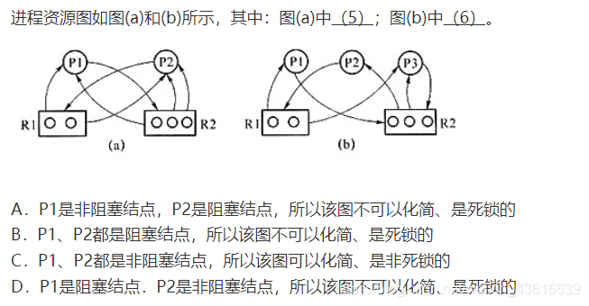

# 操作系统

适用：软考-中级-软件设计师

## 概述

### 一、操作系统的概念

### 二、目标和功能

1. 操作系统的目标：有效性、方便性、可扩充性、开放性

    有效性：操作系统的资源利用率、系统吞吐量

2. 操作系统的功能：计算机的资源管理者、用户与计算机硬件之间的接口、对计算机资源的抽象

### 三、操作系统的特性

1. 并发、共享、虚拟、异步
2. 并发是虚拟和异步的前提
3. 并发与共享互为前提

### 四、操作系统的发展

1. 手工操作阶段
2. 批处理阶段
3. 分时操作系统
4. 实时操作系统
5. 微机操作系统

## 进程管理

### 一、进程间通信：

#### Ⅰ、进程同步与异步

1. 同步：在完成任务时协调他们工作次序产生的制约关系
2. 异步：

#### Ⅱ、进程互斥与共享

1. 临界资源：一段时间内只允许一个进程适用的资源，临界资源必须互斥访问
2. 临界资源的互斥访问状态：
    - 进入区：检测是否可以进入，若可以进入，则设置可进入标志
    - 临界区：正在访问
    - 退出区：解除正在访问临界区标志
    - 剩余区：其他处理
3. 临界区互斥访问原则
    - 空闲让进：临界区空闲，允许请求访问
    - 忙着等待：临界区已有访问，其他访问必须等待
    - 有限等待：其他进程的等待访问，不能是无限等待
    - 让权等待：进程不能进入临界区，应立即释放处理机，防止进程等待

#### Ⅲ、PV 操作

1. P：申请资源，申请前驱节点的信号
2. V：释放资源，通知后续节点

> $P_1\to s_1\to P_2\to s_2\to P_3$

- $P_1释放资源V(s_1)$
- $P_2申请资源P(s_1)，释放资源V(s_2)给P_3$​ 

信号量

1. 信号量就是一个变量，对应一个资源
2. 信号量机制
    - 实现进程互斥
    - 实现进程同步
    - 实现进程前驱关系

### 二、进程的状态

三态模型：运行态、就绪态、等待态

1. 运行态 → 等待态：等待使用资源；如等待外设传输；等待人工干预。

2. 等待态 → 就绪态：资源得到满足；如外设传输结束；人工干预完成。

    ---

    运行态和就绪态可以相互转换

3. 运行态 → 就绪态：运行时间片到；出现有更高优先权进程。

4. 就绪态 → 运行态：CPU 空闲时选择一个就绪进程。

五态模型：新建态、运行态、就绪态、等待态、终止态

1. 新建态：只能切换到就绪态、在这个阶段操作系统会为进程分配资源、初始化**PCB**。
2. 运行态可以到终止态

### 四、进程调度

三级调度。
调度算法：先来先服务、时间片轮转（固定、可变）、优先级调度、多级反馈调度。
进程优先级确定。

### 五、死锁

1. 必要条件：
    - 互斥：只有对互斥的资源争抢才会造成死锁
    - 请求和保持条件：当已经锁定一个资源时，需要再请求其他资源，不释放已经占有的资源
    - 不可剥夺：进程资源不能强行被其他进程剥夺
    - 循环等待条件：存在一种进程资源的循环等待链
2. 处理死锁：预防死锁、避免（银行家算法）、检测解除（允许发生死锁）。
3. P代表进程，R代表资源

> 某系统有3个进程竞争资源R、每个进程需要5个资源，至少需要多少个R才能保证不发生死锁

- 会发生死锁的情况：每个进程需要5个资源

    每个进程分配4个资源（共12个资源）

- 不会发生死锁：发生死锁情况的资源数 + 1

> 例题2

- R资源，P进程

    $P\to R:进程申请资源（2条线申请2个资源）$ 

    $R\to P:分配资源给进程（n条线分配n个资源）$​ 

- P进程的资源不够，P成为堵塞节点：（b）中的P1

银行家算法

1. 安全序列：每个进程都能顺利完成任务的序列

> 

## 存储管理

### 一、存储结构
1. 寄存器－Cache－主存－外存。
2. 虚拟地址：又称相对地址、程序地址、逻辑地址等。
3. 地址空间。
4. 存储空间。

### 二、存储管理方案

1. 固定分区
2. 可变分区：
    - 最佳适应：从低地址开始查找，优先使用最小的内存空间
    - 最差适应：从低地址开始查找，优先使用最大的内存空间
    - 首次适应：从低地址开始找，找到第一个能满足大小的内存空间
    - 邻近适用算法：每次都从上次查找结束的位置开始查找

### 三、分页存储

1. 存分页存储管理：分页原理、地址结构、地址映射。
2. 快表。
3. 两级页表机制。

### 四、分段存储

### 五、段页式存储

1. 优点：空间浪费小、存储共享容易、存储保护容易、能动态链接
2. 缺点：由于管理软件的增加，复杂性和开销也增加，使得运行速度下降

### 六、虚拟存储

1. 程序局部性原理：时间局部性、空间局部性。
2. 虚拟存储器的实现：分页、分段、段页。
3. 页面置换算法：将暂时用不到的换出内存
    - 最佳置换（OPT）：以后不会使用，或长时间内不会使用
    - 先进先出置换（FIFO）：最早进入内存的页面替换出去
    - 最近久未使用置换（LRU）：淘汰最近最久未使用
    - 时钟置换（CLOCK）：

## 设备管理

I/O控制方式

|                  | 读/写的过程                                                  | CPU干扰频率 | 数据传输单位 | 数据流向                       |
| ---------------- | ------------------------------------------------------------ | ----------- | ------------ | ------------------------------ |
| 程序直接控制方式 | CPU发出I/O命令后需要不断轮询                                 | 极高        | 字           | 设备→CPU→内存 内存→CPU→设备 |
| 中断驱动方式     | CPU发出I/O命令后可以做其他事 本次I/0完成后设备控制器发出中断信号 | 高          | 字           | 设备→CPU→内存 内存→CPU→设备 |
| DMA方式          | CPU发出I/O命令后可以做其他事 本次I/0完成后 DMA控制器发出中断信号 | 中          | 块           | 设备→内存 内存→设备         |
| 通道控制方式     | CPU发出I/O命令后可以做其他事 本次I/0完成后通道发出中断信号 | 低          | 一组块       | 设备→内存 内存→设备        |

## 文件管理

### 一、文件与文件系统

1. 文件的定义：一组有意义的信息集合
2. 文件的属性：文件名、创建时间、标识符等
3. 文件的逻辑结构：文件在内部如何组织
4. 目录结构：文件之间如何组织
5. 文件的物理结构：文件如何存放
6. 存储空间的管理：
7. 操作系统需要提供的文件管理功能：文件共享、文件保护

### 二、文件结构和组织

（1）逻辑结构。
（2）物理结构：连续、链接、索引、索引表。

### 三、目录

- 文件控制块、目录结构（一级、二级、多级）。

### 四、存储方法与空间

1. 空闲区表。
2. 位示图：在外存上建立一个位示图，0表示空闲、1表示占用
3. 空闲块链
4. 成组链接法。

### 五、共享与保护

（1）文件共享：硬链接、符号链接（软链接）。
（2）文件保护：存取控制矩阵、存取控制表、用户权限表、密码。

### 六、安全与可靠性

（1）系统安全：系统级、用户级、目录级、文件级。
（2）文件系统的可靠性：转储和恢复、日志文件、一致性。

### 七、作业管理

1．作业与作业控制
（1）作业控制。
（2）作业状态及转换：提交、后备、执行、完成。
（3）JCB 和作业后备队列。
2．作业调度
先来先服务、短作业优先、响应比高优先、优先级调度算法、均衡调度算法、调度算法均衡
指标。

## 微内核操作系统

|        | 实质                                                         | 优点                                                         | 缺点                                                         |
| ------ | ------------------------------------------------------------ | ------------------------------------------------------------ | ------------------------------------------------------------ |
| 单内核 | 将图形、设备驱动及文件系统等功能<br全部在内核中实现 运行在内核状态和同一地址空间。 | 减少进程间通信和状态切换的系统开销 获得较高的运行效率。   | 内核庞大,占用资源较多且不易剪裁。                            |
| 微内核 | 只实现基本功能                                               | 内核精练 便于剪裁和移植系统服务程序运行在用户地址空间 系统的可靠性、稳定性和安全性较高。可用于分布式系统 | 用户状态和内核状态需要频繁切换, 从而导致系统效率 不如单体内核。 |

