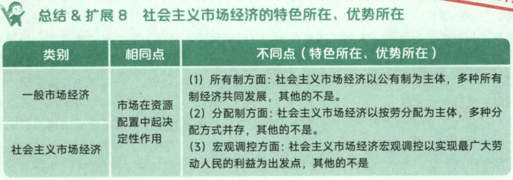
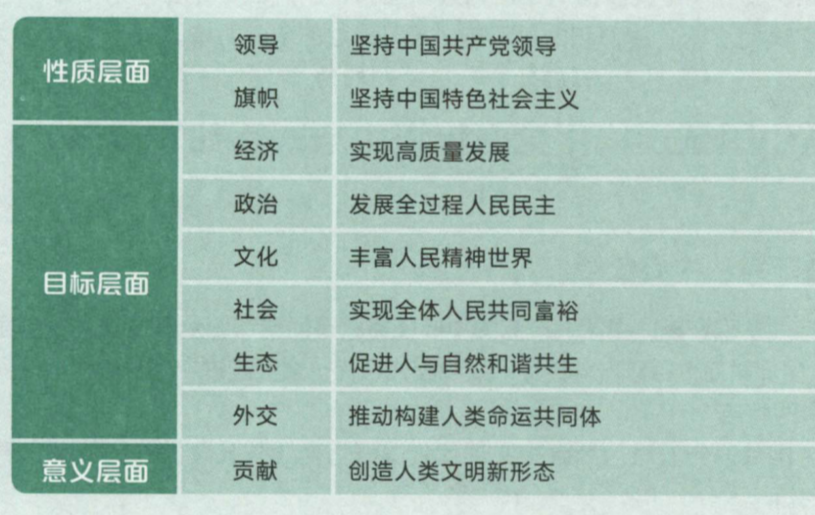
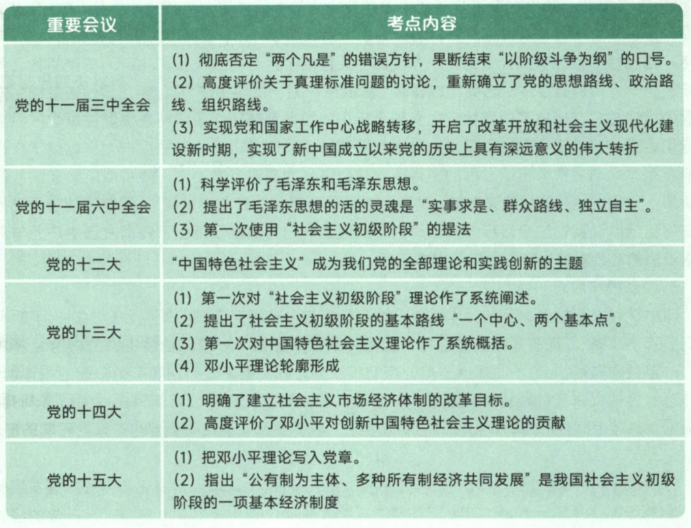

# 马克思主义中国化

马克思主义中国化时代化的根本途径：“两个结合”

- 坚持和发展马克思主义，必须同中国具体实际相结合，

    我们必须坚持解放思想、实事求是、与时俱进，一切从实际出发，着眼解决新时代改革开放和社会主义现代化建设的世界问题，不断回答中国之问，人民之问，时代之问，做出符合中国实际和时代要求的正确回答

- 坚持和发展马克思主义，必须同中华优秀传统文化相结合

    中华优秀传统文化源远流长，博大精深，是中华文明的智慧结晶，是中国人民长期生产生活中积累的宇宙观、天下观、社会观、道德观的重要体现，同科学社会主义价值观主张具有高度契合性

马克思主义中国化时代化的内涵：用马克思主义理论指导中国化的实践，另一方面中国的实践丰富马克思主义理论形成新理论

为什么要用马克思主义中国化：中国实践有需要，马克思主义的理论有需要

马克思主义中国化的可能性：中国的实践有需要，马克思主义的理论有需要，马克思主义理论与中国的文化有相容性（高度的契合性）

首次提出马克思主义中国化：六届六中《论新阶段》

毛泽东思想与中国特色社会主义理论体系是并列关系

1. 中国特色社会主义理论体系包括：邓小平理论、“三个代表”、科学发展观

## 一、毛泽东思想

### Ⅰ、毛泽东思想及其历史地位

毛泽东思想的背景

1. 时代背景：世界进入帝国主义和无产阶级革命时代（革命与战争）
2. 实践基础：中国共产党领导人民进行革命与建设的成功实践

毛泽东思想的形成与发展（与新民主主义理论形成发展相同）

| 时期                             | 形成过程                 |                            代表作                            | 标志                                                         |
| -------------------------------- | :----------------------- | :----------------------------------------------------------: | ------------------------------------------------------------ |
| 第一次国内革命战争               | 提出思想                 |     《中国革命各阶级的分析》 《湖南农民运动考察报告》     |                                                              |
| 土地革命时期                     | 初步形成 （开始形成） | 《中国政权为什么能够存在》 《井冈山斗争》 《星星之火可以燎原》 《反对本本主义》 | 新民主主义**道路**的初步形成 农村包围城市的革命道路理论 提出工农武装割据思想 |
| 遵义会议 抗日战争时期         | 趋于成熟                 | 《实践论》《矛盾论》《论持久战》 《共产党人发刊词》 《中国革命和中国共产党》 《新民主主义论》 | 新民主主义**理论**的系统阐明                                 |
| 党的七大                         | 正式确立                 |                        《论联合政府》                        | 毛泽东思想写入党章                                           |
| 解放战争 中华人民共和国成立后 | 继续发展                 | 《在晋绥干部会议上的讲话》 《论人民民主专政》 《论十大关系》 《关于正确处理人民内部矛盾的问题》 |                                                              |

### Ⅱ、毛泽东思想活的灵魂

十一届六中全会通过《中国共产党中央委员会关于建国以来党的若干历史问题》（《历史决议》）提出毛泽东活的灵魂

毛泽东活的灵魂（党的根本路线、原则）

- 实事求是：

    毛泽东思想的精髓、

    党的根本思想路线、

    马克思主义的根本观点、

    我们党的基本思想方法、工作方法、领导方法

- 群众路线：我们党的生命线、根本工作路线

    一切为了群众、一切依靠群众、从群众中来、到群众中去

- 独立自主：党的根本政治原则

毛泽东思想的意义

- 毛泽东思想是马克思主义中国化的第一个重大理论成果
- 中国**革命和建设**的科学指南，毛泽东思想是证明了的关于中国革命和建设的正确的理论原则和经验总结
- 中国共产党和中国人民的宝贵精神财富

毛泽东的评价：《历史决议》十一届六中全会做出了评价

### Ⅲ、新民主主义革命理论

1. 毛泽东在《中国革命和中国共产党》中第一次提出了“新民主主义革命”的科学概念
2. 毛泽东在《在晋绥干部会议上的讲话》中完整的表述了**总路线**的内容：无产阶级领导的，人民大众的（革命动力、革命依靠力量），反对帝国主义，封建主义官僚资本主义的革命
3. 新民主主义的根本目的是：解放生产力、扫除落后的生产关系
4. 新民主主义的对象是帝国主义、封建主义、官僚资本主义
5. 新民主主义的性质是资产阶级民主革命；因为反帝反封建

**新民主主义革命的首要问题**：分清敌友

- 帝国主义：革命的首要对象，帝国主义是中国社会进步和发展的最大阻碍，是近代中国贫困和落后的总根源
- 封建主义：封建地主阶级是帝国主义统治中国和封建军阀实行专制统治的社会基础，是在政治上，经济上，文化上阻碍中国前进，没有丝毫进步作用的阶级
- 官僚资本主义：反官资=反帝封

新民主主义革命的动力

- 无产阶级：中国革命的最基本的动力（革命的领导力量），无产阶级是中国沦为半殖民半封建过程中最早出现的一个新的社会阶级

- 农民阶级：农民问题是中国革命的基本问题，中国革命的主力军，贫雇农是无产阶级最可靠的同盟军，中农是无产阶级可靠的同盟军，**农民问题是中国革命的基本问题**，新民主主义革命实质上就是党领导下的农民革命，中国革命战争实质上就是党领导下的农民战争

- 城市小资产阶级：无产阶级的可靠同盟者（不是剥削阶级，受剥削阶级剥削）

- 民族资产阶级：革命力量之一、具有两面性、且同帝国主义和封建主义有各种关系

    中华人民共和国成立前：革命性和动摇性、软弱性和妥协性

    中华人民共和国成立后：剥削工人取得利润、接受社会主义改造

新民主主义革命的领导力量

- **无产阶级的领导权是中国革命的中心问题**，也是新民主主义革命理论的核心问题

    区分新旧两种不同范畴的新民主主义革命的根本问题是：革命的领导权是掌握在无产阶级手中还是掌握在资产阶级手中

    无产阶级及其政党-中国共产党的领导，是中国革命取得胜利的根本保证

- 一般的无产阶级优点
    1. 与先进的生产方式联系
    2. 没有私人占有的生产资料
    3. 富于组织纪律性
    
- 中国无产阶级的特点和优点

    1. 具有一般的无产阶级所有优点
    2. 受外国资本主义、本国封建势力、资产阶级压迫，中国无产阶级在革命斗争中比任何别的阶级都坚决彻底
    3. 分布集中，有利于无产阶级队伍的组织和团结，有利于革命思想的传播和强大革命力量的形成
    4. 无产阶级同农民组成亲密，共同战争

无产阶级领导权的实现：无产阶级领导权不是自然而来的，而是在与资产阶级争夺领导权而来的

1. 领导同敌人作坚决斗争，并取得胜利
2. 对被领导者给予物质福利，至少不损害其利益
3. 同时对被领导者进行政治教育
4. | 标题     | 内容                                                         |
    | -------- | ------------------------------------------------------------ |
    | 条件     | 率领被领导者斗争并取得胜利，给被领导者以物质福利，进行政治教育 |
    | 关键     | 建立工农联盟为基础的广泛统一战线                             |
    | 基本策略 | 保持党在思想上、政治上、组织上的独立性，实行又联合又斗争的方针 |
    | 坚强支柱 | 革命武装力量                                                 |
    | 根本保证 | 党的建设                                                     |

中国革命分“两步走”：新民主主义革命是社会主义革命的必要准备，社会主义革命是民主主义革命的必然趋势

错误思想：

1. “一次革命论”：只看到了民主革命与社会革命的联系，没看到区别
2. “二次革命论”：只看到了区别，没看到联系

新民主主义的基本纲领

1. 政治纲领：推翻帝国主义和封建主义统治，建立一个无产阶级领导的、工农联盟为基础的，各革命阶级联合专政的新民主主义共和国

    国体：各革命阶级联合专政

    政体：民主集中制的人民代表大会制度

2. 新民主主义的经济纲领：

    1. 没收封建地主阶级的土地归农民所有，是新民主主义革命的主要内容；
    2. 没收官僚资本归新民主主义挂架所有，是新民主主义革命应有之义；没收官僚资本，包含着新民主主义革命和社会主义革命双重性质
    3. 保护民族工商业，是新民主主义经济纲领中具有特色的一项

新民主主义的文化纲领：民族的、科学的、大众的文化，在新民主主义文化中居于指导地位的是共产主义思想

1. 新民主主义文化是民族的：

    内容反对帝国主义亚洲，主张中华民族的尊严和独立的；

    形式具有鲜明的民族风格、民族形式和民族特色，具有中国作风和中国气派

2. 新民主主义文化是人民大众的：民主的文化

3. 新民主主义文化是科学的：

    反对一切封建思想和迷信思想，主张实事求是

    剔除封建糟粕，吸收民主性精华，尊重中国历史

    反对民族虚无主义

### Ⅳ、新民主主义道路

道路的理初步形成（农村包围城市的革命道路）：

- 《中国的红色革命为什么能够存在》《井冈山斗争》《星星之火可以燎原》

    多选题3篇都得选，单选题选《星星之火可以燎原》

- 《中国红色革命政权为什么能够存在》《井冈山斗争》提出了“工农武装割据”

- 道路理论的初步形成标志着毛泽东思想的初步形成

道路理论的最终确立：六届六中全会，《论新阶段》

新民主主义革命道路的必要性（为什么要走这个路）

1. 中国所处的时代特点和具体国情决定的（单选题选这个）
2. 在双半社会中，受封建、帝国主义压迫，中国革命的主要斗争形式只能是武装斗争
3. 中国是一个农业大国，农民占大多数，是无产阶级可靠的同盟军和革命的主力军

新民主主义革命道路的可能性（中国红色政权能够存在的原因）（题目中出现关键词：农村包围城市、武装夺取政权）：

1. 社会经济发展极不平衡（国情，根本原因），为建设革命根据地提供了缝隙和可能
2. 经过大革命的洗礼，革命群众基础好
3. 全国革命形式向前发展，为农村建设革命根据地提供了客观条件
4. 相当力量的红军存在，为革命提供了坚强后盾（农村根据地创立、巩固和发展的坚强后盾）
5. 党的领导有力量及其政策的不错误，提供了主观条件

新民主主义道路的内容（怎么走这条路）：土地革命（基本内容）、武装斗争（主要形式）、农村革命根据地建设（依托）

新民主主要革命的三大法宝（总经验）

1. 提出：《共产党人发刊词》，统一战线、武装斗争、党的建设

2. 统一战线：

    必要性：

    1. 这是由中国国情决定的，农民小资占大多数，这决定了无产阶级必须和农民联合起来；
    2. 建立统一战线也是中国革命的长期性、残酷性及其发展不平衡性决定的

    可能性：在两半社会，各种矛盾交织在一起，客观上为无产阶级及其政党利用这些矛盾建立统一战线的可能性

    统一战线的联盟：

    1. 工人阶级同农民阶级、广大知识分子及其他劳动者的联盟
    2. 工人阶级同民族资产阶级的联盟（工人阶级同可以合作的非劳动者联盟）

    党建立统一战线的经验：

    1. 巩固的工农联盟（最重要的联盟）
    2. 正确对待资产阶级（最重要的经验）
    3. 坚持独立自主的原则
    4. 采取区别对待原则

    抗日民主统一战线经验：

    1. 坚持独立自主原则
    2. 发展进步势力、争取中间势力、孤立顽固势力
    3. 对顽固派团结又斗争，坚持有理、有利、有节地原则

3. 武装斗争：中国革命的特点和优点

    建设人民军队的经验：

    1. 坚持党对军队的绝对领导（核心）
    2. 建设全心全意为人民服务的军队（准则归宿）
    3. 坚持正确的战略战术原则

4. 党的建设：

    加强党的建设的经验：始终把思想建设放在首位、任何时候都重视党的组织建设，根本就是贯彻民主集中制原则；重视党的作风建设；联系党的政治路线加强党的建设

新民主主义革命意义

1. 实践上：找到了一条农村包围城市、武装夺取政权的正确道路，经过浴血奋战，完成了新民主主义革命，建立了中华民国，中国人民从此站了起来，劳动人民成为国家和社会的主人
2. 国际上：有力的鼓舞和推动了世界上被压迫民族和被压迫人民反抗帝国主义、殖民主义的斗争，极大的增强了他们反对帝国主义斗争的信心，有力得支持世界人民反帝国主义得斗争，增强了世界人民争取和平得力量

### Ⅶ、社会主义改造理论

新民主主义社会的经济方面：

1. 社会主义性质的国营经济（不能说是主体地位，只能说是领导地位）

2. 半社会主义性质的合作社经济

    由个体经济向社会主义集体经济的过渡

3. 农民手工业者的个体经济（49-56年个体经济占绝大多数）

4. 私人资本主义经济

5. 国家资本主义经济

    私人资本主义经济向社会主义国营经济过渡

社会主义经济（工人阶级）、个体经济（农民、小资阶级）、资本主义（民族资产阶级），所以随着土改完成、工人阶级和资产阶级的主要矛盾变为我国社会的主要矛盾

新民主主义社会的总路线：一化三改

新民主义主义社会农业的社会主义改造

1. 积极引导农民组织起来，走互助合作道路；积极性表现在2个方面
    1. 个体经济的积极性
    2. 互助合作的积极性
2. 遵循自愿互利、典型示范和国家帮助原则，以互助合作的优越性走互助合作道路
3. 正确分析农村的阶级和阶级状况，制定正确的阶级政策
4. 坚持积极领导、稳步前进的方针，采取循序渐进的步骤（互助组、初级社、高级社）

新民主义主义社会手工业的社会主义改造

1. 手工业供销小组
2. 手工业供销合作社
3. 手工业生产合作社

资本主义工商业改造

1. 用和平赎买的**方法**改造社会主义工商业
2. 对社会主义工商业实行赎买的必要性：
    1. 有利于发挥私营工商业在国计民生方面的积极作用
    2. 有利于争取和团结民主资产阶级
    3. 有利于团结各民主党派和各界爱国民主认识、巩固统一战线
    4. 有利于发挥民族资产阶级中大多数人的知识才能
    5. 有利于正确团结那些原来同资产阶级相互联系的知识分子为社会主义建设服务
3. 对社会主义工商业进行和平改造的可能性
    1. 民族资产阶级具有两面性，民族资产阶级具有剥削工人的一面，又有愿意接受社会主义改造的一面
    2. 共产党与民族资产阶级长期保持统一战线的关系
    3. 我国已经有了以工人阶级年到、工农联盟为基础的人民民主专政的国家政权，这就造成了私人资本主义在政治上对社会足以的依赖
4. 采取从低级到高级的社会主义的过渡**形式**：国家资本主义
5. 步骤：
    1. 初级形式的国家资本主义：委托加工、计划订货、统购包销、经销代销
    2. 个别企业公私合营
    3. 全行业公私合营

社会主义改造的历史经验

1. 坚持社会主义工业化建设和社会主义改造并举
2. 采取积极引导，逐步过渡的方式
3. 用和平方法进行改造

1956年底，我国对农业、手工业和资产阶级工商业的社会主义改造的基本完成，标志着中国历史上长达数千年的阶级剥削制度的结束，思想了新民主主义向社会主义的转变，社会主义基本制度在我国初步确立，我国进入社会主义初级阶段

社会主义基本制度的重要意义

1. 社会主义基本制度确立是中国历史上最深刻最伟大的社会变革，为中国一起发展奠定了制度基础，也为中国特社会主义制度的创新和发展提供了重要前提
2. 极大提高了工人阶级和广大劳动人民的积极性、创造性，极大地促进了我国社会生产力地发展，初步显示了社会主义地优越性
3. 使广大劳动人民真正成为了国家的主人（中国人民成为国家的主人->新中国成立）
4. 这是社会主义运动史上又一个伟大胜利
5. 不仅再次证明了马克思列宁主义的真理性，而且以独创的理论丰富和发展了马列主义

### Ⅷ、社会主义初步建设探索

1. 社会主义初级阶段：公有制经济成为社会经济的主体

《论十大关系》：调用一些积极因素为社会主义事业服务的思想（归根到底是为了发展社会生产力）

1. 原则（指导思想）：明确提出以苏为鉴，独立自主地探索适合中国情况的社会主义建设道路

2. 基本方针：努力把党内党外、国内国外一切积极因素，直接地间接地积极因素全部调动起来，为社会主义建设服务

3. 两标志：

    1. 论十大关系标志着探索社会主义建设道路地良好开端
    2. 马克思主义与中国实际第二次结合地开始

4. 具体实行方法：

    1. 坚持党的领导

    2. 必须发展社会主义民主政治

    3. 如何认识社会主义发展阶段和社会主义建设规律问题

        第一个阶段：不发达地社会主义

        第二个阶段：比较发达的社会主义

《关于正确处理人民内部矛盾地问题》：毛泽东指出矛盾是普遍存在地，社会主义社会同样充满着矛盾，正是这些矛盾推动着社会主义社会不断向前发展

1. 关于社会主义社会地基本矛盾：

    仍然是生产关系和生产力之间的矛盾，上层建筑和经济基础之间的矛盾；

    社会主义的基本矛盾是在生产关系和生产力基本适应、上层建筑和经济基础基本适应条件下的矛盾，是在人民根本利益一致基础上的矛盾，是非对抗性矛盾

2. 我国社会的主要矛盾和根本任务：
    1. 已经是人民对于建立先进的工业国的要求同落后的农业国之间的矛盾，
    2. 已经是人民对于经济文化迅速发展的需要同当前经济文化不能满足人民需要的状况之间的矛盾

3. 关于社会主义社会存在两类不同性质社会矛盾的理论：
    1. 敌我矛盾：人民同反抗社会主义革命、敌视破坏社会主义建设的社会势力和社会集团的矛盾（对抗性矛盾）
    2. 人民内部矛盾：非对抗性矛盾

4. 关于正确处理两类不同性质社会主义矛盾的基本方法
    1. 解决敌我矛盾，是分清敌我的问题，采用专政的方法（依法治罪，剥夺政治权利）
    2. 解决人民内部矛盾，是分清是非问题，采用民主方法（讨论批判，说服教育）

5. 正确处理人民内部矛盾的方针
    1. 用民主的方法解决人民内部矛盾，是总方针
    2. 政治思想领域：团结-批判-团结
    3. 物质利益、分配方面：统筹兼顾、适当安排
    4. 国家、集体、个人之间的利益：民主集中制
    5. 科学文化：百花齐放、百家争鸣
    6. 党和民主党派之间：长期共存、互相监督
    7. 民族之间：民主平等、团结互助

6. 关于正确处理人民内部矛盾的问题是社会主义国家政治生活的主题

走中国工业化道路

1. 在《关于正确处理人民内部矛盾的问题》中，毛泽动明确提出了中国工业化道路的问题，主要是指**重工业、轻工业和农业**发展关系问题，要走一条区别于苏联的中国工业化道路

    以农业为基础，以工业为主导，以农轻重为序发展国民经济的总方针

    “两条腿走路”的方针，既重工业和轻功也并举，中央工业和地方工业并举，沿海工业和内地工业并举，大型企业与小型企业并举

2. 党的八大提出及反保守又反冒进，在综合平衡中稳步前进

3. 毛泽东、刘少奇、周恩来提出了把资本主义经济作为社会主义经济的补充思想，既“三个主体”“三个补充”

    工商业经营方面：国家经济和集体经济是主体，个体经济为补充

    生产计划方面：计划生产是工农业生产地主体，自由生产为补充

    社会主义统一市场中：国家市场是主体，自由市场为补充

4. 毛泽东提出了发展商品生成、利用价值规律的思想，认为商品生产在社会主义条件下，是一个不可缺少的，有利的工具，要有计划地发展社会主义地商品生产

初步探索地意义：

1. 巩固和发展了我国社会主义制度
2. 为开创中国特色社会主义提供了宝贵经验、理论准备、物质基础
3. 丰富了科学社会主义地理论和实践

改革开放前后地两个历史时期：

- 本质上都是我们党年到人民进行社会主义建设地实践探索，
- 改革开放前地社会主义探索为改革开放后地社会主义实践探索积累了经验并准备了条件
- 改革开放后地社会主义探索是对前一个时期的探索的坚持、改革、发展

## 二、邓小平理论

### Ⅰ、时代背景

和平发展成为了时代背景：南北问题是核心问题

- 东西问题：和平问题
- 南北问题：发展问题

邓小平理论形成的历史依据：社会主义建设的经验教训

邓小平理论形成的现实依据：改革开放和现代化建设

### Ⅱ、邓小平理论形成的过程

1. 十一届三中全会：重新确立了解放思想、实事求是的思想路线

2. 十二大：“中国特色社会主义”成为了理论和实践的主题（注意，没有理论）

3. 十三大：第一次对中国特色社会主义理论进行了系统的概述，**邓小平理论轮廓形成** 

    十三大成就：

    1. 第一次比较系统得论述了我国社会主义初级阶段**理论**，明确概括和全面阐述了党得“一个中心、两个基本点”得基本路线
    2. 第一次对中国特色社会主义理论的主义内容做了系统的概述

4. 南方谈话：邓小平理论走向了成熟

5. 十五大：正式命名“邓小平理论”写入党章

### Ⅲ、邓小平理论的基本问题

1. 毛泽东回答了：“什么是马克思主义，怎么对待马克思主义”

2. 邓小平理论回答了：“什么是社会主义、怎么建设社会主义”

    搞清楚什么是社会主义，怎么建设社会主义：关键是在坚持社会主义基本制度的基础上进一步认清社会主义的本质

3. 习近平回答了：“新时代坚持和发展什么样的中国特色社会主义，怎样坚持和发展中国特色社会主义”

社会主义的本质：解放生产力、发展生产力、消灭剥削、消灭两极分化、达到共同富裕

1. “解放生产力、发展生产力”：社会主义根本任务、共同富裕的根本途径
2. “消灭剥削”：社会主义制度的本质要求
3. “消除两极分化”：社会主义目标之一、非根本目标
4. “达到共同富裕”：社会主义的根本目标

社会主义发展生产力的根本原则（中国社会主义与西方资本主义的本质区别）：

1. 以社会主义公有制经济为主体
2. 共同富裕
3. 集中体现在：生产资料所有制与发展目的不同

### Ⅳ、邓小平理论的主要内容

邓小平思想路线（党的思想路线）：

1. 一切从实际出发：前提和基础
2. 理论联系实际：方法和途径
3. 实事求是：实质和核心
4. 在实践中检验和发展真理：验证条件和目的

|        | 活的灵魂                             | 精髓               |
| ------ | ------------------------------------ | ------------------ |
| 毛泽东 | 实事求是、群众路线、独立自主         | 实事求是           |
| 邓小平 | 解放思想、实事求是（解放思想是前提） | 解放思想、实事求是 |
| 马哲   | 具体问题具体分析                     | 实事求是           |

社会主义初级阶段理论形成过程：

1. 十一届六中全会：首次使用“社会主义初级阶段”
2. 十三大前夕：我们首次将“社会主义初级阶段”作为事关全局的国情加一把握
3. 十三大：首次对“社会主义初级阶段”理论做了概阔

社会主义初级阶段的论断包括：

1. 我国已经进入社会主义社会，必须坚持而不能离开社会主义
2. 我国社会主义社会还处于不发达的阶段，必须正视而不能超越初级阶段

党在社会会主义初级阶段的基本路线（十三大）：领导和团结全国各族人民、以经济建设为重，坚持实现基本原则，坚持改革开放，自力更生、艰苦创业，为把我国建设成富强民主文明的社会主义现代化国家而奋斗

1. 富强、民主、文明的社会主义现代化国家：目标
2. 一个中心、两个基本点：最主要的内容，实现社会主义现代化奋斗目标的基本途径
3. 领导和团结全国人民：实现社会主义现代化奋斗目标的领导力量和依靠
4. 自力更生、艰苦创业：根本立足点

改革的前提是稳定（中国实现社会主义现代化发展的战略前提的必要前提、中国最高利益）

改革开放的性质：

1. 社会主义制度的自我完善和发展；
2. 改革不是原有经济制度的细枝末节的修补，而是对体制的根本变革

改革是社会主义社会发展的直接动力（重要动力，不是根本动力）：社会主义社会的基本矛盾仍然是生产关系和生产力、上层建筑和经济基础之间的矛盾，正是这些矛盾推动了社会主义社会的发展

判断改革是非得失的标准：

1. 是否有利于社会主义社会的生产力
2. 是否有利于增强社会主义国家的综合国力
3. 是否有利于提高人民生活水平

对外开放的必要性：开放也是改革，对外开放是建设中国特色社会主义的一项基本国策

1. 对外开放、一国两制、节约资源、保护环境、男女平等，整个书就这几个基本国策

对外开放的的要求：

1. 开放格局：全方位、宽领域、多层次
2. 在学习内容上开放：实现对外开放要正确对待资本主义社会创造的现代文明成果
3. 开放原则上：坚决维护中国人民经过长期奋斗得来的独立自主权力

社会主义市场经济理论：

1. 我国经济体制改革的核心问题：如何正确认识和处理计划与市场的关系

2. 确立社会主义市场经济体制改革目标：党的十四大确立

3. 资源配置最有效的方式：市场配置资源

4. 社会主义市场经济理论的要点

    1. 计划经济和市场经济不是划分社会主义制度的标志，计划经济不等于社会主义，市场经济也不等于资本主义
    2. 计划和市场都是经济手段，对经济活动的调节各有优势和长处，社会主义实行市场经济要把二者结合起来
    3. 市场经济作为资源配置的一种方式本身不具有制度属性，可以和不同社会制度结合，从而表现不同的性质
    4. 市场配置资源是市场经济具有的一般特征，非社会主义市场经济的特色
    5. 把非公有制经济纳入基本经济制度中，是因为他们为社会主义服务
    
    

和平统一、一国两制：

社会主义本质理论（邓小平提出）

1. 把我们对社会主义得认识提高到了一个新科学水平
2. 摆脱了长期以来拘于具体模式而忽略了社会主义本质得错误倾斜
3. 进一步明确了建设社会主义的发展目标和根本目的
4. 片面强调公有制、按劳分配、认为公有制范围越大程度越高，越有利于社会主义发展 ❌

邓小平理论的重要意义

1. 马克思列宁、毛泽东思想的继承和发展
2. 中国特色社会主义理论体现的开篇之作
3. 改革开放和社会主义现代化建设的科学指南

## 三、新时代新思想

### Ⅰ、2012-2022

党的十八大（2012）以来，中国特色社会主义进入新时代，这时我国发展新的**历史方位**

- 历史方位：可变
- 历史阶段：社会主义初级阶段，不变
- 发展阶段：可变，2012年开始

2012-2022以来，我们今日了对党和人民事业具有重大现实意义和深远历史意义的三件大事

1. 迎来了中国共产党成立一百周年
2. 中国特色社会主义进入新时代
3. 完成脱贫攻坚、全面建成小康社会的历史任务，实现第一个百年奋斗目标

2012-2022以来，取得了什么样的成就

1. 我们创立了新时代中国特色社会主义思想（习近平新时代）
2.  明确中国特色社会主义最本质的特征是中国共产党的领导，中国特色社会主义制度的最大优势是中国共产党领导，坚持党的领导是最高政治原则
3. 实现了小康这个中华民族的千年梦想，打赢了人类历史上规模最大的脱贫攻坚战
4. 基础研究和创新不断加强，进入了创新型国家行列
5. 许多领域的改革实现了历史性变革、系统性重塑、整体性重构，新一轮党和国家机关改革全面完成
6. 全面依法治国整体格局基本形成（还没形成）
7. 意思形态领域形式发生了全局性、根本性改变
8. 建成了世界上规模最大的教育体系、社保体系、医疗体系
9. 生态环境保护发生历史性、转折性、全局性变化
10. 牢固树立战斗力这个唯一的根本标准、坚决把全军工作重心归正到备战上来
11. 党找到了自我革命这一跳出治乱兴衰历史周期率的第二个答案，管党治党宽松软状况得到了根本扭转

2017年党十九大指出：我国主要矛盾已经转化为人民日益增长的美好生活需要与发展不平衡不充分之间的矛盾

主要矛盾变法的依据：

1. 我国社会生产力水平总体上显著提高，很多方面进入世界前列
2. 人民生活水平显著提高，对美好生活的向往更加强烈，不仅对物质文化生活提出了更高要求、而且在民主、法治、 公平、正义、安全、环境等方面的要求利益增长
3. 影响满足人们美好生活的因素很多，但主要是发展的不平衡不充分问题

进入新时代的重大意义（“三个意味着”）

1. 从中华民族复兴的历史进程来看：意味着中华民族迎来了从站起来、富起来到强起来的伟大飞跃，迎来了中华民族伟大复兴的光明前景
2. 从科学社会主义发展进程来看：科学社会主义在21世纪的中国焕发出生机活力，高举中国特色社会主义旗帜
3. 从人类文明进程来看：意味着中国特色社会主义的发展拓展了发展中国家走向现代化的途径，给其他国家提供了全新选择，为解决人类问题贡献了中国智慧和中国方案

百年未有之大变局

1. 经济方面：新兴经济体和发展中国家在世界经济中占据越来越大的份额，世界经济重心加快“自西向东”转移
2. 新一轮科技革命和产业变革带来的新陈代谢和竞争前所未有
3. 国际力量对比发生的革命性变法前所未有、一大批发展中国家群体性崛起、成为影响国际政治格局的重要力量
4. 全球治理体系的不适应、不对称前所未有，发展中国家在国际事物中的代表性和发言权威不断扩大，全球治理越来越向着更加公平合理的方向发展
5. 人类前途命运的休戚与共前所未有

世界百年未有之大变局加速变化的同时、和平与发展仍然是时代的主题，中国日益策划了各位世界格局演变的主要力量

中共共产党的领导是伟大复兴的根本保证

### Ⅱ、习近平新时代中国特色社会主义思想的主要内容

习近平新时代中国特色社会主义思想的核心要义

1. 回答了：
    1. 新时代坚持和发展什么样的中国特色社会主义、怎样坚持和发展中国特色社会主义
    2. 建设什么样的社会主义现代化强国、怎样建设社会足以现代化强国
    3. 建设什么样的长期执政的马克思主义政党、怎么建设长期执政的马克思主义政党
2. 核心要义就是：坚持和发展中国特色社会主义，这也是改革开放以来我们党全部理论和实践的鲜明主题

十个明确（新时代坚持和发展的什么样的中国特色社会主义的答案）（最重要最核心）

1. 明确中特最本质特征党的领导，中特最大优势是党的领导、坚持四个自信、做到2个维护

    四个意识：政治意识、看齐意识、核心意识、大局意识

    四个自信：道路自信、理论自信、制度自信、文化自信（最根本）

2. 明确和发展中国特色社会主义，总任务是实现社会主义现代化和中华民族伟大复兴

    根本任务：解放发展生产力

3. 明确了主要矛盾是人民日益增长的美好生活需要与发展不平衡不充分之间的矛盾

4. 明确了总体布局是“五位一体”、战略布局是“四个全面”

5. 明确全面深化改革的总目标

    1. 完善和发展中国特色社会主义制度
    2. 推进国家治理体系和治理能力现代化

6. 明确全面推进依法字段的总目标

    1. 建设中国特色社会主义法制体系
    2. 建设社会主义法制国家

7. 明确坚持和发展社会主义基本制度、使市场在资源配置总其决定性作用，更好发挥政府作用

8. 明确党在新时代建设一支听党指挥、能打胜仗、作风优良的人民军队，把人民军队建设成为一流军队（21世纪中叶建成）

9. 推动构建人类命运共同体构建人类命运共同体

10. 提出新时代党建的总要求

十四个坚持回答了怎样坚持和发展中国特色社会主义

习近平新时代中国特色社会主义是全国全党各族人民的共同思想基础：

1. 提供了全面建设社会主义现代化国家，实现中华民族伟大复兴中国梦的**行动指南**
2. 为新时代坚持和发展中国特色社会主义提供了**根本指引**
3. 为新时代治国理政提供了**基本遵循**
4. 为全面从严治党、把党建设成中国特色社会主义事业的坚强领导核心提供了**思想武器** 

## 四、新时代总任务

### Ⅰ、实现中华民族伟大复兴的中国梦

坚持和发展中国特色社会主义的总任务：实现社会主义现代化、实现中华民族伟大复兴

中国梦的科学内涵

1. 本质（核心内容）：国家富强、民族复兴、人民幸福

2. 三者之间的关系：

    国家富强、民族复兴是人民幸福的基础和保障；

    人民幸福是国家富强、民族复兴的出发点和落脚点、题中之义和必然要求；

怎么才能实现中国梦（中国梦的实现途径）

1. 实现中国梦必须走中国道路，就是中国特色社会主义道路
2. 实现中国梦必须弘扬中国精神，这就是以爱国主义为核心的民族精神和以改革创新为核心的时代精神
3. 实现中国梦必须凝聚中国力量，这就是全国各族人民大团结的力量

二十大开始：中国共产党的中心任务就是团结带领全国各族人民全面建成社会主义现代化强国，实现第二个百年奋斗目标，以中国式现代化推进中华民族伟大复兴

中国式现代化：物质文明和精神文明相协调现代化、人与自然和谐共生现代化、和平发展现代化、全体人民共同富裕、物质文明和精神文明相协调的现代化

中国式现代化的本质要求

推动中国式现代化必须牢牢掌握的重大原则

1. 坚持和加强党的全面领导（领导力量）
2. 坚持中国特色社会主义道路（方向道路）
3. 坚持以人民为中心的发展思想（价值立场）
4. 坚持深化改革开放（根本动力）
5. 坚持发言斗争精神（精神状态）

### Ⅱ、新发展阶段、理念、格局

新发展阶段（2012年以来，进入了新时代，2021年后，新发展阶段）

1. 全面建成小康社会、实现第一个百年奋斗目标，标志我国进入新发展阶段
2. 依据（原因）：
    1. 从理论依据来看，马克思主义是远大理性和现实目标相结合、历史必然性和发展阶段性相统一的统一论论，坚信人类社会必然走向共产主义，实现这一崇高目标必然今日若干历史阶段
    2. 从历史依据来看，新发展阶段是我们党带领人民迎来从站起来、富起来到强起来历史阶段的新阶段
    3. 从现实来看，我们已经拥有开启新征程，实现新的更高目标的雄厚物质基础

新发展理念：

1. 创新是发展的第一动力
2. 协调是持续健康发展的内在要求
3. 绿色是永续发展的必要条件
4. 开放是国家繁荣的必由之路
5. 共享是中国特色社会主义的本质要求：必须坚持全民共享、全面共享、共建共享、渐进共享

新发展格局：国内大循环为主体，国内国际双循环相互促进的新发展格局

1. 为什么要构建新发展格局：是与时俱进提升我国经济发展水平的战略抉择，也是塑造我国国际经济合作和竞争新优势的战略选择
    1. 怎么构建新发展格局：
    2. 关键在于经济循环畅通无阻，必须坚持深化供给侧结构性改革这条主线
    3. 最本质的特征是实现高水平的自立自强
    4. 释放内需潜力，必须充分发挥我们市场资源优势，以国内市场形成构建新发展隔绝的雄厚支撑
    5. 实现狗水平对外开放

新发展阶段是历史方位（现实依据）、新发展理念是指导原则（行动指南）、新发展格局是路径选择（战略选择）

1. 新发展阶段是新发展理念、新发展格局的现实依据
2. 新发展理念是新发展阶段、新发展格局的行动指南
3. 新发展格局是新发展阶段、新发展理念的战略选择

## 五、五位一体

### Ⅰ、经济建设

> 分为：基本经济制度、供给侧改革、高质量发展、市场与政府关系

1. 中国没有进入老龄化社会，只是面临老龄化问题
2. 公有制的主体地位，且现在流行混改（混合所有制是公有制的主要形式）
3. 新生社会阶级是社会主义事业的建设者，工人阶级才是领导者
4. 市场调节不能调节某些公共资源
5. 非公有制经济会造成两极分化
6. 社会主义公有制经济的要求是促进共同富裕

我国社会主义基本经济制度：

1. 所有制层面的公有制为主体、多种经济所有制共同发展
2. 分配制层面按劳分配为主体、多种分配方式并存
3. 体制制度层面完善社会主义市场经济体制

所有制层面：公有制和非公有制经济都是社会主义市场经济的重要组成部分，都是我国经济社会发展的重要基础，强调“两个毫不动摇”

1. 要毫不动摇巩固和发展公有制经济，深化国资国企改革，深化国有企业混合所有制改革

2. 要毫不动摇鼓励、支持、引导非公有制经济发展：

    民营经济是社会主义市场经济发展的重要成果，

    - 是推动社会主义市场经济发展的重要力量
    - 是推动供给侧结构性改革、推动高质量发展、建设现代化经济体系的重要主体
    - 是我们党长期执政、团结带领全国人民全面建成社会主义现代化强国和实现中华民族伟大复兴中国梦的重要力量

分配层面：分配制度是促进共同富裕的基础性制度，要坚持按劳分配为主体、多种分配方式并存、构建初次分配、再分配、第三次分配协调配套的制度体制

1. 初次分配：靠市场、增加低收入者收入、扩大中等收入，调高劳动报酬在初次分配中的比重
2. 再次分配：靠政府（手段：税收、社会保障、转移支付）
3. 第三次分配：靠社会（公益慈善事业）
4. 完善分配制度：增加低收入人群收入、扩大中等收入群体、规范收入分配秩序、规范财富积累机制

体制机制层面

1. 经济体制改革必须以完善产权制度和要素市场化配置为**重点** 
2. 构建全国统一大市场，深化要素市场改革，建设高标准市场体系，
3. 着力扩大内需，增强消费对经济发展的基础性作用和投资对优化供给结构的关键作用

深化供给侧改革

1. 什么是供给侧结构性改革：

    需求侧：重在解决**总量性**问题，注重短期调控

    供给侧：重在解决**结构性**问题，注重激发经济增长动力

2. 供给侧改革的重点（主要致力于）：优化要素配置、调整生产结构

3. 深化供给侧改革的措施

    1. 推进增长动能转换
    2. 深化要素市场配置改革
    3. 加大人力资本培育力度
    4. 激发各类市场主题活力
    5. 持续推进“三去一降一补”
    
4. 根本目的：满足人民利益增长的美好生活需求

全面建设社会主义现代化的**首要任务**是*高质量发展*、坚持推动高质量发展为主线（主体供给侧改革）

1. 建设现代产业体系：实体经济是一国经济的立身之本，是财富创造的根本源泉、是国家强盛的重要支柱、是现代化经济体系的坚实基础，必须以先进制造业为重点

    1. 推进新型工业化、建造制造强国、航天强国等
    2. 实施产业基础再造工程和重大计数装备攻关工程，推动制造业高端化、智能化
    3. 推动战略新兴产业融合集群发展、构建新一代信息技术、人工智能、生物技术
    4. 构建优质高效的服务业新体系，与制造业、农业相结合
    5. 发展物联网
    6. 发展数字经济
    7. 优化基础设施布局、结构、功能和系统继承

2. 实施科教兴国战略、人才强国战略、创新驱动发展（强化人才支柱）

    1. 教育科技人才是社会主义现代化国家的**基础性、战略性支持**
    2. 科技是第一生产力、人才是第一资源、创新是第一动力
    3. 加快实施创新驱动发展战略
        - 坚持面向世界科技前沿、面向经济主战场、面向国家重大需求、面向人民声明健康，加快实现高水平科技自立自强
        - 加强基础研究、突出创新、鼓励自由探索、激发创新活力
        - 加强起义主要的产业学研深度融合，提高科技成果转化和产业化水平，强化企业科技创新主体地位
    4. 完善科技创新体系
    5. 深入实施人才强国战略

3. 促进区域协调发展（缩小区域差距）（题目中出现各种区域，例如珠三角地区、长江经济带）：

    推动以人为核心的新型城镇化、

    加快农业转移人口市民化、以城市群、都市圈为依托构建大中小城市协调发展格局、

    以推进县城为重要载体的城镇化建设

4. 全面推进乡村振兴（弥补城乡差距）

    我国人民日益增长的美好生活需要和不平衡不充分的发展之间的矛盾在乡村最为突出，我国仍长期处于社会主义初级阶段的特征很大程度上表现在乡村

    实施现存振兴战略的目标要求

    - 总目标（农业强国的头等大事）：农业农村现代化
    - 总方针：坚持农业农村优先发展
    - 总要求：产业兴旺、生态宜居、乡风文明、治理有效、生活富裕
    - 制度保障：建立健全城乡融合发展体制和政策体制

    乡村振兴的举措：

    - 坚持农业农村优先发展
    - 牢牢守住十八亿亩耕地红线
    - 巩固扩展脱贫攻坚成果，增强脱贫地区和脱贫群众内生发展动力
    - 巩固和完善农村基本经营制度
    - 发展新型农村集体经济、发展新型农业经营主体和社会化服务，发展农业适度规模经营
    - 赋予农民更加充分的财产权益
    - 保证进城落户农民合法土地权益，鼓励依法自愿有偿转让
    
    三农工作的底线：牢牢守住国家粮食安全、不发生规模性返贫

市场与政府的关系

1. 市场决定资源配置是市场经济的一般规律，市场经济本质上就是市场决定资源配置的经济；推动资源配置实现效益最大化效率最优化
2. 市场在资源配置总起决定性作用，并不是全部作用，我国实行的是社会足以市场经济体制，仍然要坚持和发挥社会足以制度的优越性、发挥党和政府的积极作用
3. 政府要保持宏观经济稳定、加强和优化公共服务，促进共同富裕，弥补市场失灵，政府要更好发挥作用，而不是更多的发挥作用

### Ⅱ、政治建设

> 统战、人民当家做主、中国社会政治文明建设

1. 人民当家做主是社会主义民主政治的本质和核心

2. 党的领导制度在中国特色社会主义制度具有统领地位

3. 社会主义政治文明建设的根本出发点和归宿是人民当家做主

4. 社会主义政治文明建设最为重要的制度载体是人民代表大会制度

5. 党的领导是人民当家做主和依法治国的根本保障

6. 坚持社会主义道路是实现我国社会主义现代化的必由之路

7. 民主集中制是马克思主义政党的组织原则

8. 协商民主是我国社会主义民主政治的特有形式

9. 协商民主是我国人民民主的重要形式

10. 中国共产党领导的多党合作和政治协商制度体现了我国：

    社会主义民主的广泛性

    社会主义政治制度的特点和优点

11. 中国共产党领导的多党合作和政治协商制度是我国的一项基本政治制度

12. 人民代表大会制度是我国根本政治制度

13. 团结和民主是人民政协工作的主题

14. 求同存异是统战工作的关键

15. 大团结大联合是统战工作的本质要求

怎么走好中国特色社会主义政治发展道路

1. 坚持党的领导（根本保证）、人民当家作主（政治本质特征）、依法治国（基本方式）的有机统一
2. 必须坚持正确的政治方向、借鉴国外政治文明的有益成果，但不放弃中国政治制度的本质

人民当家做主的根本制度体系

1. 根本政治制度：人民代表大会（政体）

2. 人民代表大会制度好在哪里

    - 符合我国国情和实际、体现社会主义国家性质、保证人民当家做主、保障实现中华民族伟大复兴的好制度
    - 是我国党领导人民在人类政治制度史上伟大的创造
    - 是在我国政治发展史乃至世界政治发展史上具有重大意义的全新制度
    - 党带领人民创造经济快速发展和社会长期稳定的两大奇迹的保障

3. 坚持和完善人民代表大会制度的举措

    - 人民行使国家权力的机关是全国人民代表大会和地方各级人民代表大会，保证和支持人民通过人民代表大会行使国家权力
    - 坚持和保证人大及其常委会依法行使立法权、监督权等等权力
    - 加强人大代表工作能力建设、密切人大代表同人民群众的联系

4. 基本政治制度：中国共产党领导的多党合作和政治协商制度

    - 人民政协具有中国特色的制度安排，是社会主义协商民主的重要渠道和专门协商机构，人民政协工作要坚持人民政协为人民，聚焦党和国家中心任务，围绕团结和民主两大主题（政协工作的主题）
    - 政协制度是中国共产党、中国人民和各民族党派、无党派人士的伟大创造、是从中国土壤中生长出来的新型政党制度

5. 基本政治制度：民主区域自治

    - 民族区域制度制度的核心：保障少数民族当家做主，管理本民族、本地事物的权力
    - 处理民族问题的原则：维护祖国统一，反对民族分裂（前提）；坚持民主平等、民族团结、各民族共同繁荣（出发点、落脚点）

6. 基本政治制度：基层群众自治制度

    - 我国的基层自治组织：农村村民委员会、城市居民委员会、企业职工代表大会
    - 基层政治民主的职能：自我管理、自我服务、自我教育、自我监督
    - 基层民主是全过程民主的重要体现

7. 发挥社会主义协商民主的重要性：

    协商民主的内涵：人民内部各方面围绕改革发展稳定重大问题和涉及群众利益的实际维妮塔，在决策之前和决策总实施中，开展广泛协商

    协商民主的重要性：是实践全过程人民民主的主要形式，是中国社会主义民主政治的特有形式和独特优势

    协商民主的举措：人大协商、政府协商、人民团体协商等等

    协商民主是实现党的领导的重要方式

8. 全过程人民民主是社会主义民主政治的本质属性、是最广泛、最真实、最有用的民主

新时代巩固和发展爱国统一战线工作的重要任务

1. 长期共存、相互监督、肝胆相照、荣辱以共（16字方针），支持民主党派按照中国特色社会主义参政党的要求更好履行职能

2. 深化民主团结进步教育，筑牢中华民主同体意识

3. 全面贯彻党的宗教工作方针

    中国独立自主自办、政教分离

4. 牢牢把握大团结大联合的主题

### Ⅲ、文化建设

1. 文化改革（建设）发展的全局的根本问题：坚持马克思主义为指导
2. 文化改革（建设）发展的全局的具体措施：坚持中国特色社会主义、坚持社会主义核心价值观、做到古为今用，洋为中用
3. 我国文化软实力的核心内容：社会主义核心价值观
4. 我国文化软实力的具体表现：为人名服务
5. 社会主义核心价值观回答了：我们要建设什么样的国家、建设什么样的社会、培育什么样的公民的重大问题
6. 建设社会主义文化强国的关键：增强全民族的文化创造活力
7. 建设意识形态的原因：意思形态关乎旗帜、关乎道路、关乎国家安全，决定文化前进方向和道路

意识新形态工作是为国家立心、为民族立魂的工作

1. 牢牢掌握党对意识形态工作领导权
2. 健全用党的创新理论武装全党，教育人民、指导实践工作体系
3. 深入实施马克思主义理论研究和建设工程，加快构建中国特色哲学社会科学学科体系、学术体系、话语体系、培育壮大哲学社会科学人才队伍
4. 加强全媒体传播体系建设、塑造主流舆论新格局

文化强国的内涵：

1. 具有强大的文化力量
2. 表现为具有高度文化素养的国民、发达的文化产业，强大的文化软实力

建设文化强国的具体措施

1. 坚定文化自信、事关国运兴衰、事关文化安全、事关民族精神独立性的大问题，坚定中国特色社会主义道路自信、理论自信、制度自信，说到底就是要坚持文化自信

2. 推动中华优秀传统文化创造性转化、创新性发展，中华优秀传统文化是中华民族的“根”和“魂”，是最深厚的文化软实力，是中国特色社会主义根植的沃土

3. 提升公共文化服务水平

4. 大力发展文化事业和文化产业

    文化事业：政府主导，公益性、基本性、便利性，满足基本需求，导向是社会效益

    - 例如：丰富群众文化生活、广泛开展全民健身、以基层和农村为重点、深入实施文化惠民工程

    文化产业：市场主导，全面协调可持续，多样化要求，社会效益放首位

    - 例如：完善文化融资体系、完善文化市场准入机制、培育新型文化业态、推动文化科技旅游相结合

5. 提高文化软实力

### Ⅳ、社会建设

1. 发展和改善民生：为民造福是立党为公、执政为民的基本要求
2. 全面建成多层次社会保障体系的基本要求：兜底线、织密网、建机制
3. 全面建成多层次社会保障体系的奋斗目标：覆盖全民、城乡统筹、权责清晰、保障适度、可持续
4. 全面建成多层次社会保障体系的基本方针：全覆盖、保基本、多层次、可持续
5. 全面建成多层次社会保障体系在组织上：坚持政府主导、积极发挥市场作用、促进社会保险与商业保险相衔接
6. 最基本的民生：就业

如何保障和改善民生

1. 办好教育：培育什么人、怎么培养人、为谁培养人是教育的根本问题
    - 全面贯彻党的教育方针，立德树人的根本任务，培养德智体美劳全面发展的社会主义建设者和接班人
    - 加快义务教育优质均衡发展和城乡一体化
    - 深化教育领域综合改革
    - 加强师德师风建设
    - 推进教育数字化
2. 实施就业优先战略：就业就是最基本的民生，强化就业优先政策，健全就业促进机制，促进高质量充分就业
3. 健全社会保障体系：社会保障体系是人民生活得安全网和社会运行得稳定器，健全覆盖全民、统筹城乡、更漂亮公平统一
4. 推动健康中国建设：人民健康是民族昌盛得重要标志

如何加强和创新社会治理：

1. 创新社会治理体制：打造共建共享共治得社会治理格局
2. 完善正确处理新形式下人民内部矛盾有效机制
3. 完善社会治安防控体系
4. 构建基层社会主义新格局，尽可能把资源、服务、管理放到社区，便社区有职有权有物，更好为群众提供搞笑得服务

### Ⅴ、生态建设

1. 坚持可持续发展、坚持以人为本是科学发展观的的核心，并不是生态文明核心
2. 在资源开发和利用中，应把节约放首位（绿色、低碳环保放首位都错误）
3. 环境保护中，预防为主，源头治理放首位
4. 生态保护和修复中，自然修复放首位，人工修复为辅助

生态文明思想

1. 坚持人与自然和谐共生（核心）：坚持节约优先，保护优先、自然恢复为主得方针
2. 绿水青山就是金山银山：生态与经济的关系
3. 树立尊重自然（首要态度）、顺应自然（基本原则）、保障自然（重要责任）的生态文明理念
4. 良好生态环境是最晋惠的民生福祉
5. 统筹山水林田湖草沙系统治理
6. 用最严格制度最严密法制保护生态环境
7. 共谋全球生态文明建设

促进人与自然和谐发展

1. 加快发展方式绿设转型，推动经济社会发展绿色化、低碳化是实现高质量发展的关键环节（生产发展）
2. 深入推进环境污染防治（污染治理）
3. 提升生态多样性、稳定性、持续性，以国家重点生态功能区、生态保护红线，自然保护地为重点，推进以国家公园为主体的（生态系统建设）
4. 积极稳妥推进碳达峰碳中和（能源和气候全球化治理）

## 六、四个全面

全面建设社会主义现代化国家

1. 全面建社会主义现代化国家战略2步走：2020-2035：基本建成社会主义现代化；2035-2050建成社会主义现代化国家

2. 2035大目标：

    - 大部分都是含糊说法：大幅提升、基本实现

    - 具体说法：

        人均GDP达到中等发达国家水平

        进入创新型国家前列

        建成现代化体系，形成新发展格局

        建成教育强国、科技强国、人才强国、文化强国、体育强国、健康强国

        基本公共服务实现均等化

        共同富裕取得**实质性进展**

        生态环境根本好转

3. 2050年，建成社会主义现代化强国的目标

    其他都确切实现，而共同富裕是基本实现

全面深化改革

1. 解决中国现实问题的根本途径是：全面深化改革

2. 全面深刻改革的必要性

    - 顺应当今世界发展大势的必然选择
    - 解决中国现实问题的根本途径
    - 关系党和人民事业前途命运，关系党的执政基础和执政地位

3. 全面深化改革的方法、立场、原则

    - 必须坚持和完善中国特色会主义制度、国家治理体系和治理能力现代化（总目标）

    - 必须坚持改革沿着中国特色社会主义方向前进

    - 必须坚持党对改革的集中统一领导

    - 必须坚持改革往有利于维护社会主义正义、增进人民福祉方向前进（根本目的，出发点落脚点）

        促进社会公平正义、增进人民福祉是全面深化改革的出发点和落脚点，是坚持党全新全意为人民服务根本宗旨的必然要求

    - 必须坚持社会主义市场经济改革方向

4. 全面深化改革的总目标和主要内容：

    总目标：完善和发展中特社会主义制度、推进国家治理体系和治理能力的现代化

    根本方向：完善和发展中特社会主义制度

    实现途径：推进国家治理体系和治理能力的现代化

5. 国家治理体系和治理能力

    国家治理体系：在党领导下管理国家的制度体系

    国家治理能力：运用国家制度管理社会各方面事物的能力

    二者关系：两者相互促进，但没有必然关系

6. 全面深化改革的正确方法：注重系统性、整体性、协调性是全面深化改革的内在要求，也是推进改革的重要发展

    - 加强顶层设计和摸着石头过河相结合，是富有中国特色、符合中国国情的改革方法，
    - 全面深化改革胆子要大、步子要稳（齐头并进，平均用力是错误的）
    - 改革（动力）、发展（关键）、稳定（前提）是我国社会足以现代化建设的三个重要支点
    - 凡属重大改革都要于法有据，改革和法制如鸟之两翼、车之两轮，相辅相成，相伴而生

推动全面开放

1. 全面开放是实现国家繁荣富强的根本出路

2. 为什么要坚定不移实施对外开放的基本国策：全面开放是我国现代化建设不断取得成就的重要法宝

3. 如何推进高水平对外开放

    立足于国内，吸引外部资源（放宽外资市场准入），做到国内外联动

    共建一带一路高质量发展

    建设贸易强国

    完善投资促进和保护、信息报告等制度

    完善知识产权保护法

    缩减负面清单

    优化区域开放布局（对外开放的格局：海内外联动，东西双向互济）

    加快海南自由贸易港建设，扩大向全球的高标准自由贸易区网络

    深度参与全球产业分工和合作，维护多元稳定的国际经济格局和贸易关系

全面依法治国（推进法治中国建设）

- 完善宪法为核心的中国特色社会主义法律体系，坚持依法治国首先要坚持依宪治国，坚持依法执政首先要坚持依宪执政
- 扎实推进依法行政，法治政府建设是全面依法治国的重点任务和主体工程
- 严格公正司法。公正司法是维护社会公平正义的最后一道防线
- 加快建设法治社会，法治社会是构建法治国家的基础

全面从严治党

- 执政、改革开放、市场经济、外部环境考验（4大考验）
- 精神懈怠、能力不足、脱离群众、消极腐败危险（4大危险）
- 从严治党的根本是：制度治党
- 密切联系群众是中国共产党的最大政治优势

1. 把党的政治建设摆首位的原因：
    1. 旗帜鲜明政治就是我们党作为马克思主义政党的根本要求
    2. **党的政治建设是党的根本性建设（首位）**，决定党的建设方向和效果
    3. 注重抓党的政治建设是党的十八大以来全面从严治党的成功经验
    4. **党的政治建设首要任务**：保证全党服从中央，坚持党中央权威和集中统一领导
2. 把全面从严治党引向深入
    - 加强党的思想建设，思想建设是党的**基础性建设**（党的政治建设是党的根本性建设），坚持用科学理论引领，用科学理论武装，是我们党永葆先进性，纯洁性的根本保障。
    - 加强党的组织建设
    - 加强党的作风建设
    - 加强党的纪律建设，严明党的纪律，首要是严明政治纪律
    - 将制度建设贯穿党的各项建设中，制度问题带有根本性、全局性、稳定性、长期性、加强制度建设是全面从严治党的长远之策，根本之策
    - 巩固发展反腐败斗争压倒性胜利，廉政建设和腐败斗争是从严治党的重中之重
3. 新时代党建的总要求：
    - 坚持加强党的全面领导（原则）
    - 坚持党要管党、全面从严治党（方针）
    - 以加强党的长期执政的能力建设，先进性和纯洁性建设为主线
    - 以党的政治建设为统领
    - 以坚定思想信念宗旨为根基
    - 以调动全党积极性、主动性、创造性为着力点
    - 全面推进党的政治建设、思想建设、组织建设、作风建设、记录建设、把制度建设贯穿其中

## 七、新时代内外条件

1. 香港长治久安的必然要求：政权必须在爱国者手中
2. 香港实行一国两制，只有高度自治权，不能是完全自治权
3. 九二共识识台海两岸发展的基础和前提
4. 中国是不结盟国家，与俄国没有结盟
5. 四个伟大，其中其决定性作用是党的建设的伟大工程
6. 坚持党对一切的领导必须增强“4个意识”：政治、大局、核心、看齐意识

国家安全

1. 国家安全是民族复兴的根基，社会稳定是国家强盛的前提
2. 国家安全要以人民安全为宗旨（基石），
3. 国家安全以政治安全为根本，
4. 国家安全以经济建设为基础，
5. 国家安全以军事、科技、文化、社会为保障

伟大复兴的战略支撑，强军使命，战略支撑主要是

1. 国防军队
2. 教育、人才科技
3. 科技自立自强
4. 国有企业

明确党对军队的领导是人民解放军建军之本

政治建军是人民军队的建军之本；

1. 改革是我军发展壮大、制胜未来的关键一招；
2. 科技是现代战争的核心战斗力；
3. 一流军队必须有一流军事科技；
4. 依法治军、从严治军是我们党建军治军的基本方略；
5. 明确军民融合发展是兴国之举，强军之策；

军民融合的格局：全要素、多领域、高效益军民融合深度发展格局

新时代强军目标：听党指挥、能打胜仗、作风优良

- 听党指挥是灵魂，决定军队建设的政治方向，党对军队绝对领导的根本原则和制度，发端于南昌起义，奠基于三湾改编，定型于古田会议，是人民军队完全区别于一切旧军队的政治特制和根本优势
- 能打胜仗是核心，牢固树立**战斗力**这个唯一的根本标准
- 作风优良是保证

经济建设是国防建设的依托，国防建设是经济建设的保障

一国两制的根本宗旨：

- 维护国家主权、安全和发展力（最高原则）
- 保持港澳长期繁荣稳定

新时代党和国家的三大历史任务

1. 现代化
2. 祖国统一
3. 世界和平 

习近平外交思想是我国外交工作的根本遵循

1. 对新中国外交理念的继承与发展
2. 21世纪马克思主义在外交领域的最新成果
3. 对中华优秀传统文化的传承和创新
4. 对传统国际关系理论的扬弃和超越

独立自主的外交政策，如何理解

1. 把国家主权和安全放在第一位，坚定维护国家利益，反对任何国家损害我国的独立领导、主权、安全和尊严
2. 从我国人民和世界人民的根本利益出发，对一切国际事务，秉持公道，伸张正义
3. 坚持各国事物应由本国政府和人民决定，反对一切形式霸权主义和强权政治
4. 主张和平解决国际争端和热点问题
5. 奉行防御性的国防政策，不称霸，不扩张

中国共产党是中国工人的先锋队、也是中国人民和中国民族的先锋队，是中国社会主义事业的领导核心

## 附录-重要会议总结

