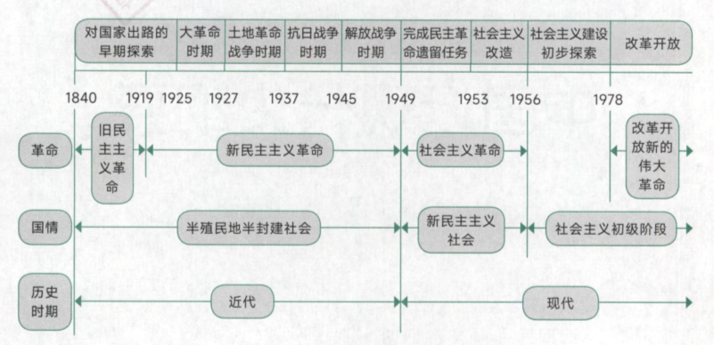
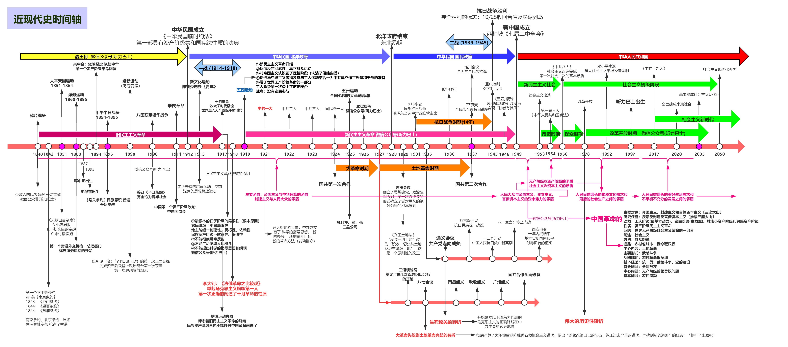

# 中国近现代史

## 一、中国近现代史时间表

更加详细的时间表

## 二、旧民族主义革命

### Ⅰ、鸦片战争

1. 林则徐在广东虎门销毁所缴收鸦片的行动，完全是维护国家利益和民族尊严的正义行动
2. 鸦片战争是为了打开中国市场

鸦片战争的影响

- 条约：
  1. 中英：南京条约（第一个不平等的条约），虎门条约
  2. 中美：望厦条约
  3. 中法：黄埔条约

- 影响（国情发生变化、社会主义矛盾发生变化）：
  1. 通过一系列的不平等条约，西方列强在中国汲取了大量侵入特权
  2. 破坏了中国主权（领土完整、领海主权、司法主权、关税主权）
  3. 中国逐渐沦为半殖民半封建国家
  4. 中国逐渐开始了反帝反封建的资产阶级民主革命

### Ⅱ、半殖民半封建社会

中国变成半殖民地的原因

- 中国丧失了完全的独立地位，相当程度被殖民化
- 中国仍然维持着独立国家和政府的名义
- 中国人民顽强、持久的反抗
- 帝国主义列强间争夺中国的矛盾无法协调

中国逐渐变成半封建社会的原因

- 外国资本主义列强把中国卷入世界资本主义经济体系和世界市场中。中国出现了资本主义生产关系，不是完全的封建社会（中国封建社会开始瓦解）
- 西方列强不希望中国成为独立的资本主义国家。
- 封建生产关系在社会经济生活中依然占据明显优势
- 中国经济不再是完全的封建经济，也不是完全的资本主义经济，而成为半殖民半封建经济

中国半封建半殖民社会的特征

- 资本-帝国主义成为支配中国的决定性力量（导致中国近代落后的总根源）

- 中国封建势力日益衰败并同外国侵略者勾结

    （以上政治特征）

- 封建制度的根基（封建地主的土地所有制）依然在广大地区保持着，成为中国走向现代化和民主化的严重障碍

- 中国新兴民族资产主义经济发展缓慢，力量软弱

    （以上经济特征）

- 中国近代各地区经济、政治文化发展极不平衡（最大特征、国情）；原因：
  1. 我国一直是一个地域广阔统一的大国
  2. 我国处于资本帝国主义的争夺和间接统治下
  3. 在地方的农业经济的基础上形成的地方割据势力存在
  
- 中国广大人民尤其是农民日益贫困化以致大批破产，过着饥寒交迫和毫无政治权的生活

近代中国阶级的变化

- 地主阶级变成官僚地主/城居地主、资本家
- 农民阶级向贫农/雇农转化，失去土地的人变成工人
- 工人阶级/无产阶级（新生阶级），
  1. 近代中国最革命的阶级
  2. 伴随着外国资本在中国直接经营企业而来
  3. **独立**登上历史舞台是五四运动
- 资产阶级（新生阶级）【小资不是资产阶级，是劳动人民】
  1. 官僚买办资本家（封建与帝国勾结一起）
  2. 民族资本家（民族资产阶级是随着洋务运动而出现的）

近代中国主要矛盾

- 帝国主义和中华民族的矛盾（主要）
- 封建主义和人民大众的矛盾
- 这两对主要矛盾及斗争贯穿整个中国半殖民地半封建社会的始终，并对中国近代社会的发展变化起着决定性作用

近代中国的历史任务

- 争取民族独立（救亡，只能靠革命）
  1. 争取民族独立是从根本上推翻半殖民半封建的统治秩序，改变落后的生产关系和上层建筑
- 人民解放
  1. 人民解放是改变近代中国经济、文化落后的地位和状况，发展社会生产力实现中国现代化
- 民族独立为人民解放**扫除障碍、开创道路、创建必要条件**；人民解放是民族独立的最终目的和必然要求。
- 国家富强，人民富裕（发展）

### Ⅲ、列强的侵略

| 领域                 | 表现                                                         |
| -------------------- | ------------------------------------------------------------ |
| 军事侵略             | 发动战争、屠杀中国人民、侵占中国领土、划分势力范围、勒索赔款、抢夺财富 |
| 政治控制             | 控制中国内政、外交；镇压中国人民的反抗； 扶持、收买代理人 把持海关行政权 |
| 经济掠夺 控制经济 | 控制中国的通商口岸、剥夺中国的关税自主权、实行商品倾销和资本输出； 操纵中国的经济命脉（建银行） 勒索赔款、抢夺财富 控制中国交通运输业等 |
| 文化渗透             | 披着宗教的外衣，进行侵略活动（宣传） 为侵略中国制造舆论，“黄祸论”，中国威胁论 |

### Ⅳ、反抗外国武装侵略

1. 三元里人民的抗英斗争，是中国近代史上**中国人民**第一次大规模的反侵略武装斗争
2. 爱国官兵的反抗（政府抵抗）-都带军衔、政府官员

义和团运动：

1. 对帝国主义的认识还停留在感性认识，存在笼统的排外主义错误
2. 没有认识帝国主义联合中国封建地主阶级压迫中国人民的实质，义和团蒙受封建统治的欺骗
3. 存在迷信、落后的倾向
4. 义和团在粉碎帝国主义瓜分中国的斗争中，发挥了重大历史作用

帝国主义侵略中国的最终目的是要瓜分中国，爆发“边疆危机”（**甲午战争以前**，19世纪7，80年代）

- 英国：从印度入侵西藏，从缅甸入侵云南
- 法国：从越南入侵广西
- 俄国：从中亚入侵新疆
- 日本：吞并琉球，侵犯台湾

帝国主义瓜分中国的图谋在**甲午战争爆发后**达到高潮

马关条约（甲午战争）：

- 把台湾、澎湖列岛、辽东半岛割让给日本；
- 俄、德、法三国以干涉还辽“有功”要求租界中国港湾为报酬（建立租界）；

瓜分中国图谋破产的原因：

- 列强之间的矛盾和互相制约，重要原因
- 最根本的原因是中华民族进行的不屈不挠的反侵略斗争

### Ⅴ、反侵略战争的失败

反侵略失败：

- 根本原因：社会制度的腐败
- 重要原因：经济技术的落后

民族意识觉醒：

- 开始觉醒（少数人）：鸦片战争之后
- 普遍觉醒：甲午战争之后
- 全面觉醒：五四运动

代表人物

- （鸦）林则徐：近代中国睁眼看世界第一人，《四洲志》
- （鸦）魏源：师夷长技以制夷，《海国图志》
  1. 以期富国强兵，抵御外来侵略，开创向西方学习的新风
  2. 学习军事和科技
- （早期维新）郑观应：主张学习西方技术、政治、经济学说
  1. 具有反对外国侵略，追求中国独立的思想
  2. 具有一定程度的反对封建专制的民主思想
- 戊戌变法要求君主立宪制
- （甲午后）严复：“求亡”口号，“物竞天择”，“适者生存”；《救亡绝论》《时局图》
- （辛亥）孙中山：“振兴中华”

## 三、不同社会对中国出路的早期探索

### Ⅰ、太平天国（农民）

太平天国爆发原因：清政府加重了赋税的征收，农民负担加重，由于西方资本主义的入侵，中国自然经济逐渐解体

天朝田亩制度（纲领性文件，最具特色）

- 定位：最能体现太平天国社会理想和这次起义特色的纲领性文件
- 内容：
  1. 平均分配土地方案，既“凡天下田，天下人同耕”（耕者有其田）
  2. 是一个以解决土地问题为中心的比较完整的社会改革方案
  3. 从根本上否认了封建社会的基本问题，既封建地主土地所有制
- 评价：
  1. 他没有超出农民小生产者的狭隘视野
  2. 具有不切实际的空想性质
  3. 并未付出实施
- 为什么天朝田亩制只是空想：在分散的小农经济基础上不可能实现均贫富

资政新篇（纲领性文件）

- 定位：太平天国后期颁布的社会发展方案
- 评价：
  1. 是一个具有资本主义色彩的方案
  2. 中国近代史上第一个比较系统的发展资本主义的方案
  3. 并未实施

太平天国的历史意义

- 太平天国沉重打击了封建统治阶级，撼动了清政府的统治根基

- 太平天国是中国旧式农民战争的最高峰

- 太平天国冲击了孔子和儒家经典的正统权威

- 天平天国有力的打击了外国侵略势力（没有明确的反帝纲领）

    反帝反封建的任务：：有（不是人决定的，是国情决定的）

    反清反封建纲领：：有，没有反帝纲领

    结果：：没有纲领却打击了帝国侵略

- 太平天国在19世纪中叶亚洲民族解放运动中，是时间最长久，规模最大、影响最深的一次

太平天国运动失败的原因和教训

- 农民阶级不是新的生产力和生产关系的代表，无法克服小生产者所固有的**阶级局限性**（根本原因）

    小生产者阶级局限性表现在哪里：

    1. 无法从根本上提出完整的正确的政治纲领和社会改革方案
    2. 无法制止和克服领导集团自身腐败现象的滋生
    3. 无法长期保持领导集团的团结

- 太平天国在军事战略上出现了重大失误

- 太平天国是以宗教发动，组织群众的，但是拜上帝教教义不仅不能正确指导斗争，而且给农民战争带来了危害（没有科学的理论指导）

- 太平天国没有正确对待儒学

- 太平天国的领袖对西方资本主义侵略者缺乏理性的认识

太平天国失败表明：在半封建半殖民的中国，农民具有伟大的革命潜力，但自身不能担负起领导反封建反帝斗争取得胜利的重任，单纯的农民战争不可能完成民族独立和人民解放的历史任务

### Ⅱ、洋务运动（地主）

洋务运动的原因（19世纪60年代-90年代，失败的标志：甲午战争）

1. 首先是购买洋枪洋炮镇压农民起义
2. 加强海防、边防、趁机发展封建地主阶级的实力

洋务派的指导思想：中学为体，西学为用；口号/目标：自强求富（包含抵御外来侵略的意图）

洋务派兴办的事业

- 最先兴办的是军用工业

    上海江南制造总局（最大兵工厂）、金陵机器局、福州船政局、天津机器局

- **民用企业**是因为在办军事工业时，资金、原料、燃料不足，运输条件落后兴办的

- 大多数民用企业（基本都是**资本主义性质**的近代企业）采用：官督商办

    轮船招商局、开平矿务局、天津电报局、上海机器织布局

- 新式学堂：翻译、工艺、军事学堂（不学法律政治）、派遣留学生

洋务运动的历史作用

- 在客观上对中国早期工业和民主资本主义发展起到了促进作用
- 中国近代教育的开始，给当时的中国带来了新知识，使人们开阔了眼界
- 社会风气和价值观开始改变，工商从业者地位上升（冲击了“重农抑商”的思想）
- 有利于资本主义经济的发展，**改变了社会风气**

洋务运动失败的原因

- 洋务运动具有封建性
- 洋务运动对外国具有依赖性
- 洋务运动的管理具有腐朽性

### Ⅲ、维新派（资产阶级）

起因时间

- 19世纪90年代以后（洋务运动失败，甲午战败后），中国资本主义有了初步发展
- 起因：内忧外患的冲击和中西文化的碰撞，人民形成一个共识要救国
- 甲午海战后中华民族普遍觉醒

维新派与守旧派（洋务派）的论战

- 要不要变法

- 要不要兴民权设议院，实行君主立宪

- 要不要废八股，改科举和兴西学

- 评价：

    实质上是资产阶级思想与封建主义思想在中国得第一次正面交锋

维新派宣传活动

- 向皇帝上书：公车上书
- 著书立说：《新学伪经考》《孔子改制考》
- 介绍外国变法经验
- 办学会
- 设学堂
- 办报纸

戊戌维新（百日维新）的意义和教训

- 意义：
  1. 戊戌维新是一次爱国救亡运动
  2. 戊戌维新是一场资产阶级性质的**政治改良运动** 
  3. 戊戌维新是一场思想启蒙运动
  4. 京师大学堂的设立，成为中国近代国立高等教育的发端
- 维新派失败的原因：维新派自身的局限性（阶级局限性=主观原因）和以慈禧为核心的强大守旧势力的反对
  1. 民族资产阶级力量弱小（客观原因）
  2. 维新派的局限性（主观原因）
      - 政治上：不敢否认封建主义（不封否定封建君主制度）
      - 经济上：要求发展民族资本主义，却未触及封建主义经济的基础（封建土地所有制）
      - 思想上：提倡学习西学，却打着孔子的旗号，托古改制
      - 对帝国主义抱有幻想
      - 惧怕人民群众（走精英路线）
- 教训：戊戌维新作为中国资产阶级登上历史舞台的第一次表演，却失败了，说明在旧中国企图同通过统治者走自上而下的改良实现国家独立，民主富强是根本行不同的

百日维新的主要内容：

1. 政治方面：改革行政机构、裁撤闲散
2. 经济方面：保护建立农工商业和交通矿业，提倡开办实业、建立发明创造，广办邮政，修筑铁路，开办商学、商报，改革财政
3. 军事方面：裁减旧时绿营兵，改练新式陆军，采用西洋兵制，练洋操，习洋枪
4. 文化教育方面：创设京师大学堂，提倡西学，废八股，改试策论，开经济特科

百日维新的性质

1. 戊戌维新是资产阶级性质的改良运动
2. 并没有采纳维新派多次提出的开国会，定宪法等政治主张
3. 并未触及封建制度的根本（有一定的反封建性质，但不多），是一种十分温和的不彻底的改良方案

### Ⅳ、革命派（资产阶级）（旧民主主义革命）

辛亥革命爆发的历史条件

- 民族危机加深，社会矛盾激化（辛丑条约）
- 清末“新政”破产：正式废除科举，宣布“预备仿行政”，颁布《钦定宪法大纲》
- 资产阶级革命派的阶级基础和骨干力量（资产阶级、小资产阶级、知识分子）

资产阶级革命派的活动：

- 孙中山创立第一个资产阶级革命团体“兴中会”，发誓“驱除鞑虏、恢复中国、创立合众政府”；

    孙中山（资产阶级革命派）高举民主革命旗帜，以**武装斗争起义**推翻清政府，这是革命派与改良派的根本不同

- 章炳麟：《驳康有为论革命书》

- 邹容：《革命军》

- 陈天华：《警示钟》《猛回头》

- 革命团体：兴中会、华兴会、科学补习所、光复会、岳王会等

- 孙中山、黄兴、宋教仁等人在日本创立中国同盟会

    同盟会是近代第一个领导资产阶级革命的**全国性政党**，他成立标志着中国资产阶级民主革命进入新阶段

    同盟会以《民报》为机关报，确立了革命纲领

    同盟会政治纲领是“驱除鞑虏、恢复中华、创立民国、平均地权”

三民主义学说（民族、民主、民生是对同盟会政治纲领的高度概括）

- 民族主义（反抗其他民族的革命）：
  1. 民族革命，“驱除鞑虏、恢复中华”，
  
      以革命手段推翻清政府，建立中华民族的“独立的国家”
  
  2. 缺点：
  
      **没有明确的反帝纲领**，没有把汉族军阀、官僚、地主作为革命对象，从而给了他们从内到外破坏革命的可乘之机
  
- 民权主义（国家归谁）：
  1. 政治革命，“创立民国”
  
      推翻封建君主专制
  
  2. 缺陷：
  
      建立资产阶级专政的国家
  
      广大人民群众的民主权力很难得到保障（因为是资产阶级）
  
- 民生主义
  1. 社会革命，“平均地权”
  
      核定全国土地地价，现有地价归原主，革命后增值，归国家所有
  
  2. 缺点：
  
      **未正面触及封建地主所有制**，没有耕者有其田
  
- 三民主义初步描绘了中国不曾有过的资产阶级共和国方案，是一个比较完整而明确的资产阶级民主革命纲领

维新派与革命派论战

- 要不要以革命手段推翻清政府（焦点）
- 要不要推翻帝制，施行共和
- 要不要进行社会主义革命
- 这场论战的意义在于：
  1. 划清了革命派与改良派的界限
  2. 传播了民主革命的思想
  3. 促进了革命形势的发展
  4. 暴露了革命派在思想理论方面的弱点

武装起义（辛亥革命早期运动）

- “萍浏醴起义”是同盟会发动的第一次武装革命

- 影响最大的是“黄花岗起义”

- 保路风潮，四川最为激烈

- “武昌起义”：

    1. 武装起义第一枪；

    1. 拉开了中国民族民主革命的序幕；

    3. 辛亥革命的高潮

- 1912年2月12日，清帝退位，封建帝制覆灭

- 1912年1月1日，中华民国临时政府成立

南京临时政府是一个资产阶级共和国性质额革命政权；

- 临时政府的优势：
  1. 从政权的组成人员来看，资产阶级革命派在政权中占领导和主体地位
  2. 从政策来看，各项政策集中代表和反映了中国民族资产阶级的利益和愿望
  3. 相当程度上也符合广大中国人民的利益
- 临时政府坏处：
  1. 企图承认清政府与列强所定的一系列不平等条约和清政府的欠款来换取列强的承认
  2. 没有提出任何可以满足农民土地要求的政策和措施
  3. 反而以保护私有财产为借口，维护封建土地制度和官僚、地主的土地和财产

《中华民国临时约法》的内容：这是中国历史上第一部具有资产阶级共和国宪法性质的法典

1. 中华门民国之主权属于国民全体
2. 中华民国国民一律平等，享有人身、财产、集会、结社、出版、言论自由、享有请愿、陈述、考试、选举、被选举等民主权力

《中华民国临时约法》的评价：

- 进步性：《临时约法》以根本大法的形式废除了封建君主专制，确立了资产阶级共和国的政治制度
- 局限性：《临时约法》企图用承认清政府与列强所签订的一切不平等条约和清政府所有一切外债，来换取列强承认中华民国；南京临时政府也没提出任何可以满足农民土地要求的政策和错误，反而维护封建土地制度

辛亥革命的历史意义

- 辛亥革命推翻了封建势力的政治代表，打击了中外反动势力、帝国主义侵略势力（从结果来看）
- 辛亥革命结束了封建君主专制，建立了中国历史上第一个资产阶级共和政府，并形成了“敢有帝制自为者，天下共击之”的民主主义观点
- 辛亥革命推动了中国人民的思想解放
- 辛亥革命推动了中国社会变革，促进了社会经济、思想习惯和社会风气等方面发生新的变化
- 辛亥革命打击了帝国主义的侵略势力，推动了亚洲各国民主解放运动的高潮

孙中山挽救共和的努力（辛亥革命失败后）

- **孙中山**发动武装反袁（反袁武装斗争）的“二次革命”（**宋教仁**被刺杀）
- 孙中山联合 *蔡锷* 在云南组织“护国军”宣独立，变成“护国运动”，（袁世凯恢复帝制）
- **孙中山**发动“护法运动”（段祺瑞拒绝恢复国会和临时约法）

对孙中山的评价：孙中山具有往前的革命精神，他首先喊出“振兴中华”的口号，不断摸索救国救民的道路，并坚持奋斗，是中国民主革命伟大的先行者，他在领导人民推翻帝制，建立共和国的斗争中建立了历史功勋，是20世纪初期推动中国发生历史性变革的主要代表

旧民主主义革命终结的标志：护法运动的失败不仅是孙中山个人的失败，也标志整个中国民族资产阶级领导的旧民主主义革命的终结，表明中国民族资产阶级不能领导中国革命前进

辛亥革命失败和教训

- 根本原因：是在帝国主义时代，在半封建半殖民的中国，资产主义建国方案行不通
- 主观原因：资产阶级革命派本身存在很多弱点和错误
  1. 没有提出彻底的反帝反封建革命纲领
  2. 不能充分发动和依靠人民群众
  3. 不能建立坚强的革命政党
- 资产阶级的这些弱点根源在于资产阶级的软弱性和妥协性
- 旧民主主义革命接连失败说明：资产阶级不能领导中国革命走向胜利

## 三、新民主主义革命（1919-1949）

### Ⅰ、早期新文化运动

> 五四运动之前的五四运动，主要宣言资本主义观点

初期新文化运动的主要阵地：《新青年》杂志和北京大学

初期新文化运动的基本内容

- 提倡民主和科学
- 反对专制和迷信（向封建主义发起了强烈攻击）
- 提倡个性解放，反对封建礼教
- 提倡新文学，反对旧文学（文言文），实行文学革命

新文化运动提出的口号：民主和科学；新文化运动的倡导者并没有因为批判孔学就否定中国的全部传统文化（新文化运动的思想家们对孔学的批判是充满理想的

五四以前的新文化运动的历史意义：新文化运动是中国历史上**前所未有**的启蒙运动和**空前深刻**的思想解放

五四以前的新文化运动的局限性

- 提倡资产阶级民主主义，由于资产阶级共和国方案行不通，并不能提供一种有效的思想武器去认识中国
- 忽视了封建思想产生的社会环境，致力于**优先**改造国民性，走精英路线
- 没有马克思主义的批判精神（辩证精神），他们使用的还是资产阶级的方法（形而上学）

十月革命对中国的影响

- 经济文化落后的国家也可以用社会主义思想指引自己走向解放之路
- 十月革命诞生的社会主义俄国号召反对帝国主义，并以平等的态度对待中国，有利的推动了社会主义在中国的传播
- 十月革命中俄国工人、农民、士兵群众的广泛发动由此胜利的事实，给中国先进分子新的革命方法（群众路线）

### Ⅱ、五四运动

> 五四运动前马克思主义并没有广泛传播（但已经有了马克思主义），五四运动后才广泛传播
>
> 五四运动后就是新民主义革命

在中国大地上率先举起马克思主义旗帜的是：李大钊

李大钊写的书：

- 《法俄革命之比较观》第一次正确阐述了十月革命的性质
- 《庶民的胜利》歌颂了十月革命和布尔什维主义的胜利，揭露了第一次世界大战的本质
- 《我的马克思主义观》对马克思唯物史观、剩余价值学说和阶级斗争理论做了系统介绍；也是表明李大钊成为中国第一个马克思主义者

五四运动历史条件

- 新的社会力量的成长壮大（无产阶级）
- 新文化运动的思想解放潮流
- 俄国十月革命队中的影响
- 巴黎和会上中国外交的失败（主要导火索）

五四运动的过程

- 北京大学的学生在天安门门前集会，示威游行，提出“外争主权，内除国贼”“废除二十一条”“还我青岛”，主张拒绝在合约上签字，要求惩办曹汝霖、章宗祥、陆宗舆
- 中国工人阶级以独立的姿态登上历史舞台：上海工人罢工
- 五四爱国运动，突破了知识分子的狭小范围，发展成为有工人阶级，小资产阶级和资产阶级参加的全国范围的群众反帝爱国运动
- 运动的主力由学生转向了工人，运动中心由北京转向了上海

五四运动的历史特点与意义

- 特点：
  1. 彻底的反帝反封建的伟大爱国革命运动
  2. 这是一次真正的群众运动
  3. 五四运动促进了马克思主义在中国的传播与中国工人运动的结合，为中国共产党的成立作了思想上和干部上的准备
  4. 五四运动发生在俄国十月革命之后，发生在无产阶级社会主义革命的新时代，属于世界无产阶级社会主义革命的一部分
- 意义：
  1. 五四运动是中国旧民主主义革命走向新民主主义革命的转折点，在近代以来中华民族追求民族独立和发展进步的历史进程中具有里程碑意义
  2. 孕育了以爱国，进步，民主科学为主要内容的伟大五四精神，其核心是爱国主义
  3. 中国人民和中华民族自鸦片战争以来第一次全面觉醒
  4. 五四运动标志着中国新民主主义的开端
  5. 五四运动对帝国主义有了理性认识

五四运动的主要内容：爱国、进步、民主、科学；其中爱国是核心

### Ⅲ、新民主主义革命

> 五四运动后新文化运动改名为新民主主义革命，五四运动是新民主义革命的开端

早期马克思主义队伍由哪些构成：

1. 新文化运动的精神领袖：李大钊、陈独秀等
2. 五四运动的左翼爱国骨干：毛泽东、周恩来
3. 一部风中国同盟会成员、辛亥革命时期的活动家：董必武

早期马克思主义队伍思想运动的特点

- 重视对马克思主义基本理论的学习
- 从一开始就坚持了马克思主义的革命原则和正确方向，明确同第二国际的社会民主主义划分界限
- 注意从中国实际出发，学习运用马克思主义的理论，**初步形成**（非明确提出）了马克思主义与中国实际相结合的思想
- 开始提出知识分子应当同劳动群众相结合的思想，主张知识分子“到农村去”“到民间去”

新文化运动的发展

- 中国先进分子在接受马克思主义后，继承了五四运动的科学和民主精神，并赋予他们新的含义
  1. 民主：民主不再是指狭窄的资产阶级民主，而是大多数人的民主，以劳动群众为主体的民主
  2. 科学：除自然科学外，对社会研究来说，主要指马克思的科学世界观和方法论
- 五四运动后的新文化运动，马克思主义开始逐渐在思想文化领域发挥指挥作用

共产党**早期组织**在上海《新青年》编辑部成立（第一个党小组）

中国共产党**早期组织**的活动有以下几个方面

- 加强对马克思主义的研究和宣传
- 在工人中进行宣传和组织工作
- 进行有关建党问题的研究和讨论

中国共产党成立

- 第一次全国代表大会在1921年7月上海举行
- 一大建党，二大纲领（民主革命纲领），大会确定党的名字“中国共产党”
- 中国共产党成立的历史特点
  1. 区别于第二国际旧式社会改良党的新型工人阶级革命政党
  2. 接受的是没有被修正阉割的马克思主义的完整科学世界观和社会革命论
  3. 中国工人阶级深受帝国主义、本国资产阶级、封建势力的三重压迫，具有坚定的革命性
- 中国共产党必须加强自身建设的原因
  1. 内部环境：工人阶级不多，出身小资阶级的党员占大多数，中国共产党不能不受到小资产阶级思想的影响
  2. 外部环境：人口众多，情况复杂，经济文化落后的半殖民地半封建社会
- 中国共产党成立的伟大意义
  1. 中国人民有了一个先进的坚强的政党作为自己力量的领导核心，踏上了争取民主独立、自身解放的光明道路，开启了思想国家富强、人民富裕的历史征程
  5. 深刻的改变了近代以后中华民族发展的方向和进程，深刻改变了中国人民和中华民族的前途和命运，深刻改变了发展的趋势和格局
- 中国共产党人的初心和使命：为了中国人民谋幸福，为中华民族某复兴

### Ⅳ、中国革命新格局

中国革命的首要问题（斗争革命成效甚小的原因）：“分清敌友”

中共二大内容：

- 制定（第一次提出）反帝反封建的民主革命纲领。
- 提出了统一战线的思想
- 提出当前阶段的纲领应该是：打到军阀、推翻国际帝国主义的压迫、统一中国为真正的民主共和国
- 开始采取群众路线的方法

中国共产党成立后，党的工作重点在发展工人运动方面

- 工人运动：京汉铁路罢工（工人运动高潮的顶点）、安源路矿工人罢工（胜利）
- 农民运动：浙江萧山县衙前村成立第一个农民协会，反抗地主压迫

### Ⅴ、第一次国共合作

第一次国共合作形成的条件：

1. 一战结束后，帝国主义卷土重来，社会矛盾加深，“打倒列强，除军阀”成为全国人民的强烈愿望（国内原因）
2. 中共二大在上海召开，做出了建立民族主义联合战线的决议（统一战线的思想）
3. 孙中山和苏俄代表越飞联名发表《孙文越飞联合宣言》，标志着孙中山联俄政策的确立
4. 中共三大以个人名义加入国民党，同孙中山领导的国民党建立统一战线

新三民主义的内容：

- 民族主义：突出反帝内容，强调对外实行中华民族的独立，主张国内各民族一律平等
- 民权主义：强调了民主权利应为“为一般平民所共有”
- 民生主义：概括为“平均地权”和“节制资本”两大原则（后又提出“耕者有其田”的主张），并提出了改善工农的生活状况
- 新三民主义的政治纲领同中国共产党的民主革命阶段的纲领基本一致，因此成为了国共和作的政治基础

## 五、大革命时期（1925-1927）

> 也叫国民革命

1925年以五卅运动为起点，掀起了全国范围的大革命高潮

国民革命的中心问题：毛泽东发表《国民革命与农民运动》一文，指出“农民问题乃国民革命的中心问题”，“所谓国民革命运动，其大部分即是农民运动”

大革命的评价：1925-27年，中国的反帝反封建革命，比之前任何一次革命，包括辛亥革命五四运动，群众的动员更为广泛，斗争规模更加宏伟，革命的社会内涵更加深刻

大革命时期中国共产党的作用

- 共产党提出了反帝国主义、反军阀的政治口号
- 共产党是国共合作的倡导者和统一战线的组织者
- 中国共产党是人民群众的发动者和组织者
- 共产党帮助和推动国民革命军的建立

大革命的失败及其原因

- “四一二”反革命政变和“七一五”反革命政变成为大革命失败的标志
- 大革命失败的客观原因：
    1. 反革命力量的强大；
    2. 资产阶级发生严重的动摇；
    3. 统一战线出现剧烈的分化（蒋介石、汪精卫的背叛）
- 大革命失败的主观原因：
  1. 中共领导层换了左倾机会主义错误，放弃了无产阶级对农民群众、城市小资、民主资产阶级的领导权，尤其是对武装力量的领导权
  2. 不擅长将马克思主义基本原理同中国革命具体实际相结合
  3. 共产国际及其代表不了解中国的具体情况，对中国的革命做出了一些不切实际的指导

大革命的经验教训：

  1. 中国民主革命必须建立包括工人、农民、小资产阶级和民族资产阶级在内的广泛的革命统一战线
  2. 在中国民主革命中，无产阶级领导权的中心问题是农民问题
  3. 中国革命的斗争形式是武装斗争，主要组织形式是军队，无产阶级要实现对革命的领导，必须建立和暂无哦革命的武装
  4. 领导革命的中国共产党必须不断加强思想上、政治上、组织上的建设

大革命的意义

1. 大革命沉重打击了帝国主义在华势力，基本推翻了北洋军阀
2. 大革命教育和锻炼了各个革命阶级，为后来共产党领导土地革命奠定了群众基础
3. 大革命提高了中国共产党在全国人民中的政治威望

## 六、土地革命时期（1927-1937）

### Ⅰ、国民党建立统治

东北易帜：张学良宣布“遵守三民主义，服从国民政府，改易旗帜”

国民党的阶级代表发生变化：国民党已经不是工人、农民、城市小资阶级和民族资产阶级的革命联盟，变成一个代表地主阶级、买办的大资产阶级利益的反动集团所控制的政党

国民政府的性质：

1. 中国仍然处在帝国主义和封建主义统治下的半殖民半封建社会（国情没变）
2. 中国革命的对象仍然是帝国主义和封建主义（任务对象没变）
3. 中国革命的性质也是反帝反封建的资产阶级民主革命（革命性质没变）

### Ⅱ、土地革命兴起

八七会议（1927年8月7日）【大革命与土地革命的转折点】

- 会议彻底清算了大革命后期的陈独秀右倾机会主义错误
- 确定了实行土地革命和武装起义（武装反抗国民党反动统治）的方针，提出土地革命是中国资产阶级民族革命的中心问题
- 毛泽东提出“枪杆子里出政权”

八七会议的评价：中国革命从此开始了从大革命失败到土地革命战争兴起的转折点

三大起义：

1. 南昌起义
    - 打响了武装反抗国民党反动派的第一枪
    - 这是中国共产党独立领导革命战争
    - 独立领导革命，创建人民军队和武装夺取政权的开端

2. 秋收起义：打出来“**工农革命军**”的旗帜，开创了井冈山革命根据地

3. 广州起义：--

4. 三大起义均失败的深刻教训：必须走符合中国国情的革命道路

### Ⅲ、土地革命前期（井冈山）

井冈山时期的文章

- 《中国的红色政权为什么能够存在》《井冈山斗争》：论证了红色政权能够长期存在并发展的客观条件，提出了**工农武装割据**的思想（属于道路）
- 《星星之火，可以燎原》：提出了党把中国重心转移到农村，待条件成熟再夺取全国政权的中国新道路思想
- 《反对本本主义》：思想路线
  1. 坚持理论与实际相结合的原则和极端重要性；坚持辩证唯物主义思想
  2. 提出“没有调查，就没有发言权”、“中国革命斗争的胜利要依靠中国同志了解中国情况”
- 革命新道路理论的提出，标志者中国化马克思主义（毛泽东思想）的初步形成

古田会议：

- 确立了思想建党，政治建军（新型军队，新在用无产阶级思想武装军队）
- 规定红军是一个执行革命任务的武装集团，必须绝对服从共产党的领导
- 必须担负打仗、筹款和做群众工作的惹怒我，必须加强政治工作

土地革命（井冈山）

- 土地革命任务：消灭封建地主的土地私有制，实行农民土地私有制，使农村生产力得到了解放和发展
- 土地革命的政策：
    1. 毛泽东在井冈山制定中国共产党第一个土地法
    2. 毛泽东在兴国制定了第二个土地法；
        1. 将没收一切土地改为没收一切公共土地和地主阶级的土地，保护了中农的利益
        2. 鉴定依靠贫农、雇农
        3. 联合中农、限制富农（最严重就是限制、建国后才消灭富农）
        4. 保护中小工商业者，消灭土地阶级
        5. 以乡为单位，按人口平分土地，在耕地的基础三实行抽多补少，抽肥补瘦

土地革命的建设

1. 中华苏维埃第一次全国工农兵代表大会在江西省瑞金县叶平村举行
2. 大会通过《中华苏维埃和国宪法大纲》
3. 中华苏维埃共和国实行工农兵代表大会制度

左倾教条主义错误表现：（王明）

1. 在革命性质和统一战线的问题上，混淆民主革命与社会主义革命的界限，将反帝反封建与资产阶级并列
2. 在革命道路问题上，继续坚持以城市为中心
3. 在土地革命问题上，提出坚持打击富农和“地主不分田，富农分坏田”的主张
4. 在军事斗争问题上，思想进攻的冒险主义、防御中的保守主义，退却中的逃跑主义
5. 在党内斗争和组织问题上，推行宗派主义和“残酷斗争，无情打击”的方针

左倾错误的原因：

1. 八七会议后党内一直存在浓厚的“左”倾情绪始终没有得到认识的清理
2. 共产国际对中国共产党内部事物的错误干预和瞎指挥
3. 不善于把马克思列宁主义与中国的实际情况相结合

### Ⅳ、土地革命后期（遵义会议为分界）

遵义会议（长征途中）的结果：解决了军事和组织问题

遵义会议的评价：

- 遵义会议开始确立了毛泽东为代表的马克思主义的正确路线
- 在及其危急得情况下，挽救了党，挽救了红军（结束了“左”倾教条主义在中央得统治，博古李德被撤职）
- 标志中国共产党在政治上**开始**走向了成熟

长征胜利的意义

- 长征胜利宣告了国民党反动派消灭中国共产党和红军的图谋彻底失败
- 宣告中国共产党和红军肩负民主希望实现了北上抗日的战略转移
- 实现了中国共产党和中国革命事业从挫折走向胜利的伟大转折

### Ⅴ、全面抗战前期的文章

《论反对帝国主义的策略》：阐述了抗日民族统一战线的新政策，系统的解决了党政治策略上的诸多问题

《中国革命战争的战略问题》：系统说明了中国革命战争战略方面的问题（军事问题）

《实践论》《矛盾论》：高度总结了中国共产党的历史经验，揭露和批评党内的主观主义尤其使教条主义的错误，深入论证马克思列宁主义同中国具体世界相结合的原则，**科学阐述**了党的马克思主义的思想路线

## 七、全面抗战时期（1937-1945）

### Ⅰ、日本侵略

1931年9月18日，日本发动九一八事变，占领我国东北

- 九一八事变是中国人民抗日战争的起点
- 揭开了世界反法西斯战争的序幕

1937年7月7日爆发卢沟桥事变，日本全面侵华开始（七七事变）

- 全面抗战的开始（全民族抗战）
- 开辟了世界反法西斯战争的东方主战场

### Ⅱ、129运动

八一宣言：中国共产党1935年8月1日发表《中国苏维埃政府、中国共产党中央为抗日救国告全体同胞书》

- 呼吁全国各党派、各界同胞、各军队团结起来，一致抗日
- 中国共产党抗日救亡的正确主张，有力的推动了全国抗日救亡运动的开展

一二九运动：促进了中华民族的觉醒，标志着中国人民抗日救亡运动的新高潮

### Ⅲ、西安事变（1936）

毛泽东朱德联合发布《停战议和一致抗日》通电，放弃了“抗日反蒋”的口号，变“逼蒋抗日”

意义：西安事变的和平解决成为时局扭转的枢纽（土地革命与全面抗战的转折），**十年内战结束，国内和平初步实现** 

### Ⅳ、抗日民族统一战线

瓦窑堡会议

- 提出**抗日民族统一战线** 
- 批判了“左”倾关门主义错误，强调共产党在抗日民族统一战线中的领导作用
- 规定了建立广泛的抗日民族统一战线的具体政策，决定用“人民共和国”代替“工农共和国”

国共第二次合作

- 形成标志（**抗日民族统一战线**正式形成）：《中共中央为公布国共合作宣言》、蒋介石发表承认共产党合法地位的谈话
- 与第一次国共合作的区别
    1. 广泛的民族性和复杂的阶级矛盾
    2. 国共双方有政权有军队的合作
    3. 没有正式的固定的组织形式和协商一致的具体的共同纲领

### Ⅴ、抗日战争的正面战场

台儿庄大捷：抗日战争正面战场最大一次胜利

广州、武汉失守：中国抗日战争战略防御阶段转向战略相持阶段

抗日民族统一战线的巩固、发展和壮大，是抗日战争最后胜利的根本保证

### Ⅵ、抗日战中的中流砥柱

洛川会议

- 强调必须坚持统一战线中无产阶级的领导权
- 在敌后发动独立自主的游击战
- 在国民党的统治区放手发动群众
- 全面抗战，全民族抗战，总动员，放手发动

《论持久战》速胜论速亡论都是错误的

- 日本是强国，中国是弱国，决定了抗日战争只能是持久战
- 日本是小国，发动的是退步的，野蛮的侵略战争，在国际上失道寡助
- 中国是大国，进行的是进步的，正义的反侵略战争，国际上得道多助
- 毛泽东还科学的预言了抗日战的发展进程，既抗日战争经过战略防御、战略相持、战略反攻三个阶段；战略相持阶段是中国抗日战争取得最后胜利的关键阶段

国共合作胜利

- 平型关大捷是全民族抗战以来中国军队第一次重大胜利，粉碎了日军不可战胜的神话
- 祈口会战时抗战初期，华北战场规模最大，最激励的一场，也是国共两党合作抗战配合最好的一次

游击战的战略地位和作用

- 战略防御阶段：从全局来看，国民党正面战场的正规战是主要的，敌后游击战是辅助的
- 战略相持阶段：敌后游击战争成为主要的抗日作战方式，百团大战
- 游击战还为人民军队进行战略反攻准备了条件

坚持抗战、团结、进步的方针

- 统一战线的独立自主原则：

    1. 共产党必须保持在思想上、政治上和组织上的独立性
    2. 必须坚持对人民军队的绝对领导
    3. 必须对国民党采取又团结又斗争、以斗争求团结的方针

- 坚持抗战、团结、进步、反对妥协、分裂、倒退

    国民党发动了第二次反共高潮，共产党进行了针锋相对的斗争：军事上自卫反击，政治上进行揭露和声讨

- 巩固抗日民族统一战线的策略总方针（瓦窑堡）

    （这时候敌人是日本人，其他人都是朋友）

    - 发展进步势力，争取中间势力，鼓励顽固势力
        1. 进步势力：工人、农民、城市小资产阶级
        2. 中间势力：民族资产阶段、开明绅士、地方实力派
        3. 顽固势力：大地主、大资产阶级的抗日派（蒋介石）
    - 争取中间势力需要的条件
        1. 共产党有充足的力量
        2. 尊重他们的利益
        3. 同顽固派做坚决斗争，并能一步一步取得胜利
    - 顽固派：采用既联合又斗争的政策，坚持<u>有理、有利、有节</u>的原则

三三制民主政权建设

1. 政治建设方面：
    - 三个党派：共产党、非党的左派进步分子、不左不右的中间派
    - 三三制时共产党领导的抗日民族统一战线性质的政权
    - 加**强政权建设**是抗日根据地建设的首要任务、根本任务
2. 经济方面建设（抗日战争时期的土地政策）：
    - 地主减租减息（核心）
    - 农民交租交息照顾富农利益
    - 实现这个政策既调动了广大农民的抗日积极性，又有利于争取地主阶级的大多数站在抗日民族统一战线
3. 文化建设与干部教育方面：创建中国人民抗日军事政治大学、鲁迅艺术学院、马列学院、延安自然科学院

抗日民主运动与进步文化工作

1. 宪政运动：批评国民党一党专政
2. 中国民主政团同盟：创办《光明报》
3. 联合政府的主张：建立各抗日党派民主联合政府主张
4. 文化界抗敌协会：成为文化界抗日民族统一战线建立的标志
5. “马克思主义中国化”的命题提出：六届六中全会，毛泽东提出（早就开始马克思中国化，文章《论新阶段》）

延安整风（思想）

- 《改造我们的学习》（针对学风）：党的高级干部中进行

- 《整顿党的作风》（针对党风）《反对党八股》（针对文风）：全党

- 主要内容：反对主观主义以整学风、反对宗派主义以整党风、反对党八股以整文风

- 反对主观主义是主要任务（重点）

    主观主义的实质：理论脱离实际

    主观主义的主要表现形式：教条主义和经验主义，尤其是教条主义是整风运动的重点

    调查研究是把理论和实际结合一起的中间环节

中共七大内容（实现了马克思主义中国化第一次飞跃）：

- 中共七大制定了党的政治路线：“放手发动群众，壮大人民力量”
- 总结了历史经验，提出了三大作风：理论练习实际、人民群众紧密联系在一起、自我批评
- 将马克思列宁主义基本原理同中国具体实际相结合所创造的理论成果命名为毛泽东思想，将毛泽东思想规定为一切工作的指针，把毛泽东思想确立为党的指导思想写入党章
- 三大作风：理论和实践相结合的作风、人民群众紧密联合在一起的作风、批评的作风

七大意义：

1. 标志着我们党在思想、组织走向了成熟
2. 政治上：经过延安整风，使全党团结在毛泽东的旗帜下，思想了空前统一团结
3. 思想上：党确立了毛泽东思想在全党的指导地位，把毛泽东思想写入党章
4. 组织上：党形成了一支高举毛泽东旗帜的久经考验的政治家集团

延安的13年，领导中国革命事业从低潮走向高潮、思想历史性转折、扭转了中国前途和命运

### Ⅶ、抗日战争的胜利

《波茨坦公告》：中国台湾、澎湖列岛由中国收回，这是抗日战争取得完全胜利的重要标志

- 《开罗宣言》《日本投降书》都提到了台湾，澎湖列岛属于中国

中国人民抗日战胜在世界反法西斯战争总的重要地位

1. 中国抗日战争时世界反法西斯的重要组成部分，中国时世界反法西斯的东方主战场
2. 世界反法西斯力量对中国的援助，中国人民抗战的胜利，时同世界所有爱好和平与正义的国家和人民、国际组织以及各种反法西斯力量的同情和支持分不开的

抗日战争胜利的原因

- 以爱国主义为核心的民族精神是中国人民抗日战争胜利的决定因素
- 中国共产的中流砥柱作用是中国人民胜利的关键
    1. 坚持和发展抗日民族统一战线
    2. 中国共产党坚持全面抗战
    3. 中国共产党始终坚持反抗，反对投降
- 全民族抗战时中国人民抗日战争胜利法宝
- 中国人民抗日战争的胜利，同世界所有爱好和平和正义的国家人民，国际组织以及各种反法西斯力量的同情和支持也是分不开的

抗日战争的意义

- 彻底粉碎了日本军国主义殖民奴役中国的图谋，有力捍卫了国家主权和领土完整
- 促进了中华民族的大团结，形成了伟大的抗战精神
- 对世界各国夺取反法西斯战争的胜利、维护世界和平的事业产生了重大影响
- 开辟了中华民族伟大复兴的光明前景

## 八、解放战争时期（1945-1949）

### Ⅰ、争取和平

蒋介石在积极准备内战的同时，又表示愿意与中共进行和平谈判，其目的是

- 敷衍国内外舆论，掩盖正在积极准备内战
- 诱使中共交出人民军队和解放区政权
- 如果谈判不成功，就放手发动内战，把责任转嫁给中共
- 国民党的反共方针得到了美国政府的支持

重庆谈判：签署《政府与中共代表会谈纪要》既双十协定，确认和平建国的基本方针，同意“长期合作，坚决避免内战”

重庆政治协商会议：

- 参加党派有：国民党、共产党、民主党派
- 会议达成：
    1. 政府组织案、国民大会案、和平建国纲领、宪法草案案、军事问题案
    2. 政协的上述协议及其他协议，并不是新民主主义性质，
    3. 有利于冲破蒋介石的独裁统治、实行民主、和平建国

解放战争三个阶段

- 战略防御：共产党**粉碎**了国民党军队的进攻
- 战略反攻：共产党**三路大军**进攻国民党
- 战略决战：最终决战对应国民党被摧毁

### Ⅱ、解放区土改

《五四指示》（《关于土地问题的指示》）

- 使地主阶级剥削农民而占有的土地转移到农民手中
- 不侵犯中农土地，一般不变动富农土地
- 不可将农村中反对封建地主阶级的方法，应用于城市中反对工商业资产阶级的斗争
- 这意味着党在抗日战中实行的减租减息改为实行耕者有其田，标志着解放区在农民土地问题上，开始由抗战时期的消弱封建剥削向废除封建剥削制度的过度
- 建国前的土改，只在解放区废除封建剥削

《中国土地法大纲》：明确规定“废除封建性及半封建性剥削的土地制度，实现耕者有其田的土地制度”

土地制度改革是从根本上摧毁中国封建制度根基的社会大变革

### Ⅲ、第二条战线

第二条战线形成原因：

1. 国民党专制独裁统治和官员腐败，大发国难财
2. 国民党顽固坚持内战政策
3. 对人民征收苛重捐税
4. 恶性通货膨胀引起物价飞涨
5. 民族工商业走向破产
6. 工农生产严重萎缩，农村经济急剧衰退

### Ⅳ、中国共产党与民族党派的团结合作

民主党派的性质：主要是民族资产阶级、城市小资产阶级、同这些阶级相联系的知识份子、其他爱国份子

中国民族党派地位的转变，发表《对时局的意见》

- 这个政治声明表示
  1. 中国各民族党派和无党派民主人士自愿接受中国共产党的领导、决心走人民革命的道路
  2. 拥护建立人民民主的新中国，民主党派参加新政协，标志着民主党派地位的根本转变（他们不在是中国反动政权下的在野党，而是中共人民民主专政的参加者）
  3. 在中国共产党的领导下，和共产党一道担负起管理国家和建设国家的历史重任
- 中国共产党领导的多党合作和政治协商制度，就是在这个基础上形成的

第三条道路的破灭，某些民主党派的领导人鼓吹“中间路线”

- 政治上：必须实现英美式的民主政治
- 经济上：“应当施行改良的资本主义”
- 所提倡的是资产阶级共和国方案，实质上是旧民主主义道路

为什么走不了第三条道路

1. 民族资产阶级具有2面性（革命性，软弱妥协性），中国民族阶级没有足够力量带领中国人民走向资产阶级
2. 国民党独裁统治不允许
3. 帝国主义不允许中国成为独立的、自强的国家

### Ⅴ、建立人民民主的新中国

战略决战战役：辽沈、淮海、平津三大战役，国民党赖以维持其反动统治的主要军事力量基本被毁

1949年春，人民革命即将取得全国胜利的前夕，召开7届二中全会

- 提出了迅速夺取全国胜利的方针
- 党的中国重心必须由乡村转移到城市（主要内容）
- 中国由农业国转变为工业国，由新民主主义社会转变为社会主义的总任务和主要途径
- 提出“2个务必”思想，务必使同志们继续保持谦虚、谨慎、不骄不躁的作风；务必使同志们继续保持艰苦奋斗的作风

《论人民民主专制》：

1. 资产阶级共和国方案在中国行不通
2. 人民民主专政需要工人阶级的领导
3. 人民民主专政的基础是工人阶级、农民阶级和城市小资产阶级的联盟，主要是工人和农民联盟
4. 我们必须利用一切国计民生有利而不是有害的城乡资本主义因素，团结民族资产阶级，但是民族资产阶级不能充当革命的领导者，也不能在国家政权总占主导地位
5. 工人阶级经共产党领导的以工农联盟为基础的人民民主专政

北京政协（建国前夕召开）

- 参与人员：共产党、民主党派

- 性质：新民主主义性质

- 主要内容：

    通过《中国人民政治协商会组织法》《中华人民共和国中央人民政府组织法》《中国人民政治协商会议共同纲领》

    《共同纲领》是全国人民的大宪章，起临时宪法的作用

中国革命胜利的原因：

1. 中国革命的发生，有着深刻的社会根源和雄厚的群众基础
2. 中国革命之所以能胜利，是因为有中国工人阶级的先锋队，中国共产党的领导
3. 中国革命之所以能赢得胜利，同国际无产阶级和人民群众的支持是分不开的

中国革命胜利得意义：

1. 结束了100多年中华民族受资本-帝国主义侵略和压迫剥削得历史
2. 结束了国家战乱频发、四分五裂得局面，实现了中国人民梦寐以求得民族独立和人民解放
3. 从根本上改变了中国社会发展方向，为中国建设社会主义制度，创造了政治前提
4. 是继十月革命和世界反法西斯战争胜利后世界历史中最重大事件

中国共产党革命胜利得基本经验：统一战线、武装斗争、党的建设（3大法宝）

## 九、新中国成立后的奋斗

### Ⅰ、新民主主义社会

> 1949-1956也是过渡时期
>
> 1949-1953：完成民主革命的遗留任务、恢复国民经济
>
> 1953-1956：三大改造、工业化

新中国成立的伟大意义：

1. 彻底结束了旧中国半殖民地半封建社会（国情变了）、彻底结束了极少数剥削统治者统治广大劳动人民的历史，彻底结束了旧中国一盘散沙的局面，彻底废除了列强强加给中国的不平等条约和帝国主义在中国的一切特权，实现了中国从封建专制向人民民主的伟大飞跃，改变了世界的 格局，鼓舞了全世界被压迫民族和被压迫人民争取解放的斗争
2. 中华人民共和国成立，具有世界意义的伟大胜利，冲破了帝国主义东方战线，极大的改变了世界的政治格局，赚大了世界和平民主和社会主义的力量，对世界历史进程产生了深远影响
3. 中华人民共和国成立，是马克思列宁主义在中国的胜利，是马克思列宁主义基本原理和中国革命具体实际相结合的思想（毛泽东思想的胜利）
4. 标志着中国的新民主主义革命取得了基本的胜利（并没有彻底完成），标志着半殖民半封建社会的结束和新民主主义社会在全国范围内的建立

新中国成立面临的考验：

- 能不能保卫住革命胜利的成果，巩固新生的人民政权
- 能不能战胜严重的经济困难，迅速恢复和发展国民经济
- 能不能巩固民族独立，维护国家主权和安全
- 能不能经受住全国执政的新考验，继续保持优良传统和作风

完成民主革命的遗留任务

- 军事：人民解放军继续追剿国民党的军队力量
- 政治：普遍召开各级各届代表会议或人民代表会议，在全国范围人民开始行使当家做主的权力
- 经济：《中华人民共和国土地改革法》
  1. 废除地主阶级封建剥削的土地所有制，实行农民土地所有制
  2. 解放农村生产力，发展农业生产，为中国工业化开辟道路
  3. 对待富农的政策：由解放战争时期征收富农多余土地转变为**保存富农经济**
  4. 这是历次土改运动中进行最好的一次
- 《中华人民共和国婚姻法》废除了封建婚姻制度

中共七届三中全会：**确定了当时全党和全国人民的中心任务是在三年左右的时间内，争取国家政治经济状况好转**（恢复和发展国民经济）

维护国家主权：“另起炉灶”、“打扫好屋子再请客”、“一边倒”的外交方针，签订《中苏友好同盟互助条约》

加强党的自身建设（大规模**群众性政治**运动）：

1. 党政军机关：三反运动（反贪污、反浪费、反官僚主义）；
2. 全国大中城市：五反运动（反对行贿、反对偷税漏税、反对盗窃国家财产、反对偷工减料、反对盗窃经济情报）

抗美援朝战争胜利的意义

- 不仅支援了朝鲜人民，还保卫了中国的国家安全，维护亚洲和世界和平作出了重要贡献
- 这一胜利极大的增加了中国人民的民族自信心和民族自豪感
- 全世界对中国刮目相看，新中国的国际威望空前提高
- 帝国主义不敢轻易侵犯新中国的尝试，我国经济建设和社会改革赢得了一个相对稳点的和平环境
- 粉碎了美军不可战胜的神话

为社会主义改造（一化三改）创造条件

- 没收官僚资本，确立社会主义国营经济的领导地位

    双重性质：反帝反封建（官僚买办）：民族主义革命性质；反资（大资产阶级）：社会主义性质

- 开始将资本主义纳入国家资本主义轨道

- 引导个体农民再土地改革后逐渐走三互助合作的道路

### Ⅱ、一化三改

为什么要边化边改：

1. 随着民主革命遗留任务的彻底完成，国内的阶级关系和主要矛盾发生了深刻的变法
2. 随着国民经济的恢复和初步发展，中国社会的经济成分（生产关系）发生了重大变法

过渡时期的总路线（总路线就是一化三改）：从中华人民共和国成立，到社会主义改造基本完成，这是一个过渡时期，党在这个时期的总路线和总任务，是要在一个相当长的时期内，逐步实现国家的社会足以工业化，逐步思想国家对农业、手工业、资本主义工商业的社会主义改造

一化三改的首要任务：工业化

社会主义改造的必要性和条件

1. 社会主义性质的国营经济力量相对来说比较大，他实现国家工业化的主要基础，社会主义工业化是国家富强的首要条件
2. 资本主义经济力量弱小，发展困难，不可能成为中国工业化起飞的基础
3. 对个体农业进行社会主义改造，是保证工业发展，实现国家工业化的必要条件
4. 当时的国际环境也促使中国选择社会主义

工业化（一五）发展

1. 集中主要力量发展重工业，建立国家工业化和国防现代的初步基础
2. 相应的发展运输业、轻工业

工业化（一五）成就

1. 鞍山、包头、武汉三大钢铁基地
2. 武汉长江大桥通车
3. 青藏、康藏、新藏公路建成

土改后农民的2种积极性：个体经济的积极性和劳动互助的积极性

农民走向社会主义的集中过渡性经济组织形式

1. 互助组：社会主义萌芽性质
2. 初级农业生产合作社：半社会主义性质
3. 高级农业生产合作社：社会主义性质

农业合作化的基本方针

1. 先合作化，后机械化道路
2. 积极发展、稳步前进、逐步过渡
3. 自愿和互利的原则，采用典型示范，逐步推广的方法
4. 始终把是否增产作为衡量合作社是否办好的标准
5. 在实现农业合作化后，国家应该努力用先进的技术和装备发展农业经济

手工业合作化实现

1. 共产党采取积极领导、稳步前进的方针
2. 由手工业生产合作小组（萌芽）、手工业供销社（半社会主义）到手工业生产合作社（完全社会主义）

资本主义工商业改造的实质：对资本主义工商企业进行社会主义改造，就是把民族资本主义工商业改造成社会主义性质的企业，并对民族资产阶级实行**赎买政策** ，

为什么资本家会同意：民族资产阶级具有2面性

资本主义工商业改造的步骤（国家资本主义形式）

1. 初级形式的国家资本主义（社会主义萌芽）：加工订货、经销代销（四马分肥）
2. 高级形式的国家资本主义：（主要形式：公私合营）
    1. 个别企业公司合营（半社会）：四马分肥
    2. 全行业公私合营（社会主义）：定股定息

对资本家的改造：

1. 用赎买和国家资本主义的方法，有偿的，逐步的改变资产阶级的所有制
2. 改造他们的同时，给与工作安排
3. 不剥夺资产阶级的选举权

社会主义基本制度在全国全国确立

1. 社会主义改造基本完成（一化三改），表明我国已经从新民主义到社会主义的过渡
2. 社会主义基本制度在中国得到了全面确立，社会主义经济制度也确立起来
3. 社会主义经济制度确立是中国进入社会主义最主要的标志

### Ⅲ、社会主义初级阶段

> 1956-1976：初步探索社会主义如何建设

1956年生产资料所有制改造完成，标志着社会足以基本制度在中国确立，中国进入全面建设社会主义历史阶段（国情发生变化）

毛泽东提出了马克思主义与中国“第二次”结合，寻找符合中国国情的社会主义建设

中共八大提出内容

1. 正确分析了国内形式和主要矛盾的变化，明确提出新形势下党和人民的主要任务
2. 国内主要矛盾已经是人民对于经济文化迅速发展的需要同当前经济文化不能满足人民需要的状况的矛盾
3. 全国人民的首要任务hi集中力量发展社会生产力，实现国家工业化，逐步满足人民日益增长的物质文化需要
4. 阶级斗争、人民民主专政还是需要的，但根本任务是保护生产力
5. 既反冒进又反保守，在综合平衡中稳步前进的经济建设方针

57整风运动《关于整风运动的指示》：反官僚主义、反宗派主义、反主观主义；采用了开门整风形式

《一九五七年夏季的形式》：提出“6又”政治局面，又集中又自由，又纪律又自由，又有统一意志，又有个人心情舒畅生动活泼

全面建设社会主义的成就：

1. 独立的、比较完整的工业体系和国民经济体系的建立
2. 人民生活水平提高
3. 文化教育医疗事业得到了发展
4. 取得了一批重要的科技成果
    1. 中国成功爆炸第一颗原子弹
    2. 成功爆炸第一颗氢弹
    3. 中远程导弹发射成功
    4. 第一颗人造卫星“东方红一号”发射成功
    5. 成功发射中国第一颗返回式遥感人造地球卫星
5. 国际地位的提高与国际环境的改善
    1. 中印共同倡导和平共处五项原则，成为处理国与国关系公认的国际准则
    2. 中国恢复联合国的一切合法权利
    3. 美国尼克松访华，在上海发表联合公报，中美关系正常化
    4. 中日建交

### Ⅳ、改革开放

> 1978-2012：国情没有变，还是社会主义初级阶段

真理标准问题的讨论是继五四运动、延安整风运动后又一场马克思主义思想解放运动，实质在于是不是坚持马列主义、毛泽东思想。成为拨乱反正和改革开放的思想先导，为党重新确立事实求是的思想路线，纠正长期以来的“左”倾错误，思想历史性的转折做了思想理论准备

十一届三中全会

- 《解放思想、实事求是、团结一致向前看》把“解放思想、实事求是、坚持实践”提高到了思想路线，重新确立党的思想路线奠定了基础，因而成为开辟中国特色社会主义新道路、开场中国特色社会主义新理论的宣言书
- 主要内容：
    1. 全会冲破了长期“左”的错误的严重束缚，彻底否认了“两个凡是”的错误方针，高度评价了关于真理标准问题的讨论，
    2. 否定“以阶级斗争为纲”的指导思想，做出了把工作重点转移到社会主义现代化建设上来和实行改革开放的战略决策，
    3. 重新确立了马克思主义的思想路线、政治路线、组织路线
    4. 会议形成了以邓小平为核心的党中央领导集体，中国进了改革开放和社会主义现代化建设的新时期
    5. 开始了拨乱反正

邓小平《南方谈话》的主要内容

1. 计划和市场都是手段
2. 阐明了社会主义本质
3. 提出了“发展才是硬道理”
4. 提出了判断改革开放和各项工作成败得失的“三个有利于”标准
5. 强调加强党的建设
6. 关于社会主义初级阶段的长期性和前途

### Ⅳ、新时代

> 2012-现今：国情未变：社会主义初级阶段

1. 十八大：中国特色社会主义进入了新时代
2. 2012年提出了“中国梦”
3. 十八届三中全会：全面深化改革
4. 十九大：形成了习近平新时代中国特色社会主义思想，思想了马克思主义中国化的新飞跃，确定为指导思想，写入党章；提出了新时期的主要矛盾
5. 2021年：建党100年，打赢了脱贫攻坚战，建成了全面小康社会
6. 20大：中国式现代化推进中华民族伟大复兴

