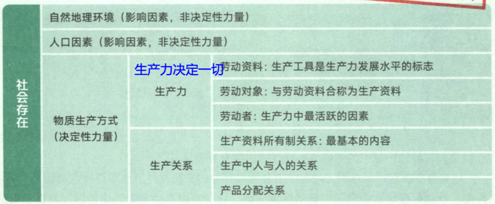
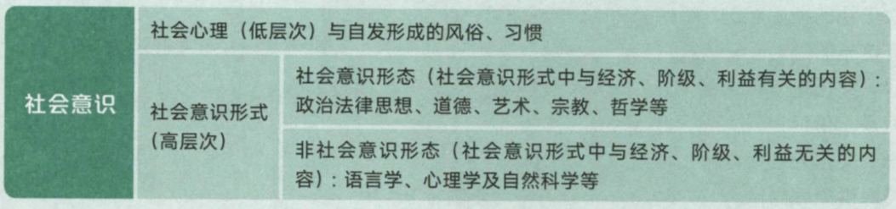

# 马克思主义哲学

## 马克思主义基本原理

### 一、导论

#### Ⅰ、马克思主义

马克思主义的构成（由恩格斯的《反杜林论》将马克思分为3部分）

- 马克思主义哲学（基本方法）
- 马克思主义政治经济学（主体）
- 科学社会主义（目的和归宿）

马克思主义的基本立场：以人民为中心（关键字“人民”“无产阶级”）

马克思主义的基本观点：关于自然、社会和人类思维发展一般规律的科学认识（马克思的观点包罗万象，使用“仅仅”等局限性的词是错误的）

马克思主义的基本方法：

- 辩证唯物主义和历史唯物主义（主要，单选题）
- 实事求是法、辩证分析法、社会基本矛盾和主要矛盾分析方法、历史分析方法、阶级分析法、群众路线等（多选题）

#### Ⅱ、马克思主义的创立背景

- 由**工人组织** “正义者同盟” 改名为 “共产主义者同盟”
- 世界上第一个无产阶级政党的党纲《共产党宣言》
- 《共产党宣言》标志着马克思主义的公开问世

社会根源（经济社会背景）：工业革命和科技，资产注意生产方式在欧洲已经有了相当的发展

阶级基础（实践理论）：无产阶级在反抗资产阶级剥削和压迫

思想渊源：德国古典哲学、英国古典政治经济学、英法两国的空想社会主义

#### Ⅲ、列宁

列宁认为资本主义发展到垄断阶段，**经济政治发展的不平衡**（原因）成为了资本主义发展的绝对规律，提出社会主义革命可能在一国或数国首先发生并取得胜利的论断，列宁把马克思主义基本原理同俄国实际相结合，创立了列宁主义，把马克思主义发展到一个新的历史阶段

#### Ⅳ、马恩列的经典著作

| 著作                             | 内容                                                         | 关键词         | 补充                                                         | 作者     |
| -------------------------------- | ------------------------------------------------------------ | -------------- | ------------------------------------------------------------ | -------- |
| 《德意志意识形态》               | 首次阐述唯物史观，标志马克思主义哲学的诞生                   | 创立唯物史观   | 既可以是唯物史观的创立也可以是马哲创立                       | 马恩合著 |
| 《资本论》                       | 系统说明剩余价值理论，标志马政经的诞生                       | 政治经济学     | 工人阶级的圣经                                               | 马克思   |
| 《共产党宣言》                   | 标志着科学社会主义诞生 标志马克思主义诞生 世界第一个无产阶级政党的党纲 | 科学社会主义   |                                                              | 马恩合著 |
| 《反杜林论》                     | 全面阐述马克思主义理论体系                                   | 全面阐述       | 首次将马克思主义以三个组成部分进行说明                       | 恩格斯   |
| 《德法年鉴》                     | 标志马克思和恩格斯“2个转变”                                  | “2个转变”      | 从唯心主义转变为唯物主义 从革命民主主义转向共产主义 这为马恩创建自己的理论奠定了思想前提 | 马恩合著 |
| 《关于费尔巴哈的提纲》           | 首次确立了科学的实践观                                       | 实践观         | 历史唯物主义的起源                                           | 马克思   |
| 《家庭、私有制和国家起源》       | 马克思国家学说的代表作                                       | 马恩的国家学说 |                                                              | 恩格斯   |
| 《帝国主义是资本主义的最高阶段》 | 《资本论》的继续，指出帝国主义是无产阶级革命的前夜           | 革命前夜       | 帝国主义=垄断资本主义                                        | 列宁     |
| 《论欧洲联邦口号》               | 首次提出“一国胜利论”                                         |                | 这时对马恩的“同时胜利论”的革新                               | 列宁     |
| 《无产阶级的军事纲领》           | 进一步发挥了“一国胜利论”                                     |                |                                                              | 列宁     |
| 《国家与革命》                   | 发展了马克思主义的国家与革命理论，马克思主义国家学说的代表作之一 | 列宁的国家学说 |                                                              | 列宁     |

#### Ⅵ、马克思的鲜明特征和当代价值

马克思主语具有鲜明的科学性、人民性、实践性、发展性

- 科学性：马克思是对自然、社会和人类思维发展本质和规律的正确反应
- 人民性：人民性是马克思主义的政治立场
- 实践性：马克思主义是从实践中来，到实践中去，在实践中接受检验
- 发展性：马克思主义是不断发展的学说，具有与时俱进的理论品质

马克思主义的鲜明特征就是科学性和革命性的统一

### 二、辩证唯物论

#### Ⅰ、哲学基本问题

马克思在哲学史上2大历史贡献：

- 创立唯物史观
- 组合了辩证法和唯物主义 $\to$ 辩证唯物主义

马克思在理论上的2大贡献：

- 唯物史观
- 剩余价值学说

由分辨世界是怎样的得出：

- 联系、全面、发展、矛盾（辩证法）
- 孤立、片面、静止、不矛盾（形而上学）

物质意识何为第一性区分唯物主义和唯心主义：

- 唯物主义（物质第一性）
    1. 古代朴素唯物主义（金木土水火）：物质就是一种或几种实物
    2. 近代形而上唯物主义（机械唯物主义）：物质就是原子等粒子
    3. 现代辩证唯物主义（马克思）：物质是一切客观存在
- 唯心主义（意志第一性）
    1. 主观唯心主义：世界本源就是我的意识
    2. 客观唯心主义：上帝、道、等等

物质意识是否具有同一性可以分为可知论和不可知论：

- 可知论（意识可以认识物质）：有同一性（唯物唯心都是）

- 不可知论（意识不能认识物质或不能完全认识）：没有同一性（二元论）

    不可知论是不彻底的唯心主义

唯心主义不能伴随人类认识始终，人类的认识水平增加，唯心主义终将灭亡

#### Ⅱ、不同哲学流派

马克思哲学与其他哲学的区别

1. 世界的本源不同：唯心主义$\to$ 意识；唯物主义$\to$ 物质
2. 唯物主义在认识论上坚持能动反应论，唯心主义坚持先验论
3. 彻底的辩证法（历史也是物质），唯心主义部分辩证法
4. 历史观上唯物，唯心主义历史观上唯心

马克思哲学与旧唯物主义的区别

1. 认识论上能动反应，旧唯物主义坚持机械反应论
2. 彻底的辩证法，旧唯物主义不认同辩证法（形而上学）
3. 历史观上唯物，旧唯物主义历史观上唯心
4. 马克思坚持实践观点，旧唯物没有实践观

#### Ⅲ、物质定义

恩格斯关于物质的定义：“物，物质无非是各种物的总和，而这个概念就是从这一总和中抽象出来的”

哲学物质概念与自然科学关于物质形态结构的概念之间是**共性与个性**的关系

- 共性与个性；普遍与特殊；具体与抽象这是一个意思，同时也是正确选项
- 整体和部分错误选项

列宁的物质概念：

- 物质是客观存在的哲学范畴
- 不以人的意识而转移
- 为我们的感觉所复写、摄影、反应

列宁是从物质与意识的关系上来把握物质，物质的**共同特性（唯一特性）**是客观实在性

#### Ⅳ、物质和运动

> 运动=变化

运动概念：运动是标志一切事物和现象的变化及其过程的哲学范畴，

- 运动是物质的存在方式和根本属性
- 物质的存在方式和根本属性：运动

物质和运动的关系：不可分割，运动是物质的运动，物质是运动的物质

> 不可分割：A是B的A，B是A的B，A离不开B，B离不开A

错误观点：脱离物质的运动 $\to$ 唯心主义；脱离运动的物质 $\to$ 形而上学

#### Ⅴ、静止和运动

> 绝对性特指运动，相对性特指静止

静止的概念：相对静止时物质运动在一定条件下的稳定状态，包括空间相对静止和根本性暂时未变这2中状态

运动和静止关系：对立统一

- 对立统一：相互区别，相互联系

运动静止相互区别：

- 运动的绝对性体现物质运动的变化性，无条件性
- 静止的相对性体现了物质运动的稳定性，有条件性

运动和静止的联系：相互依赖，相互渗透，相互包含，**动中有静，静中有动**

错误观点：

- 夸大静止，否定运动 $\to$ 形而上学
- 夸大运动，否定静止 $\to$ 诡辩论

#### Ⅵ、物质运动和时空

时空（时间+空间）：时间指物质运动的持续性，**特点是一维性**；空间是物质运动的广延性，**特点是三维性**

物质运动和时空关系：不可分割，物质运动是时空中的物质运动，时空是物质运动的时空；

- 时空（时间+空间）是运动着的物质的基本存在形式【记忆：运动+物质=时空】
- 运动着的物质的基本存在形式：时空

时空（时间）特点：

- 一维性：时间不能返回
- 客观性：物质运动与时间和空间的不可分割证明了时间和空间的客观性（不以人的意志为转移）
- 有限性：具体的物质形态是有限的，
- 无限性：整个物质世界的时空是无限的
- 绝对性：物质运动的时间和空间的客观实在性是绝对的
- 相对性：物质运动的时间和空间的具体特性是相对的（当速度超过极限，时空是变化的）

世界上除了运动的物质，什么也没有

#### Ⅶ、物质与意识

物质与意识的辩证关系：物质决定意识，意识依赖于物质并反作用于物质

意识的起源：

- 意识是**自然界长期发展**的产物，意识也是**社会历史发展**的产物
- **社会实践（劳动）**在意识的产生和发展中起到了决定性作用。
- **劳动**为意识的产生和发展提供了客观需要和可能，
- **语言**促进了意识的发展（语言是重要原因）

意识的本质：意识是人脑的机能和属性，是客观世界的主观映像。意识在内容上是客观的（内容是物质的映射），形式（表达形式，经过人脑加工）上是主观的，是客观内容和主观形式的统一，意识是物质的产物，但又不是物质本身

- 意识是人脑主观自生的❌（意识是外部世界在人脑中的反应，没有外部世界，意识不能产生）
- 意识是人脑的分泌物❌
- 意识是某种特殊物质❌
- 意识就是人来到对外部世界的模仿❌（能动反应）

意识的能动反应主要表现在

- 意识具有目的性和计划性（等价词：目标、蓝图等等）
- 意识具有创造性（人只能对外部世界进行近似正确的反应）
- 意识具有指导实践改造客观世界的作用（实践受意识指导，实践具有能动性）
- 意识具有调控人的行为和生理的作用
- 自觉活动=能动反应（简单理解，自觉活动正确）
- 能动反应=创造性反应

物质和意识的相互区别（相互对立）

- 物质是本源，意识是派生
- 物质不是意识，意识不是物质
- 物质不能代替物质，意识也不能代替物质

物质和意识的相互联系（相互同一）

- 物质可以转化为意识，意识可以转化为物质（通过实践）

- 意识对物质既有依赖性，又有相对独立性

    意识的相对独立性表现在意识对物质的超前或滞后的反应，例如，做某件事之前我可以先思考流程，但这时还没有进行实践

- 物质决定意识，意识反作用于物质（意识根源于物质）

主观能动性（意识）和客观实在性（物质）

- 尊重客观规律是发挥主观能动性的前提
- 只有充分发挥主观能动性，才能正确认识和利用客观规律

#### Ⅷ、实践与客观规律

实践是客观规律（物质）与主观能动性（意识）统一的基础

如何正确发挥主观能动性

- 尊重客观规律是发挥主观能动性的前提
- 只有充分发挥主观能动性，才能正确认识和利用客观规律（并不是所人在规律面前毫无能力）
- 实践是发挥主观能动性的基本途径（实践是客观规律与主观能动性统一的前提）
- 主观能动性的发挥还要依赖一定的物质条件和物质手段

#### Ⅸ、人工智能

人工智能对人类的影响：

- 首先明确，意识是人类独有，人工智能不可能有意识
- 人工智能是对人来到结构与思维的模仿，是人类智能的物化
- 人工智能可能在某方面超越人类

人工智能不能超越人类，取代人类的原因

- 人类的意识是知情意统一体，人工智能只是对人类的理性智能的模拟，不具备情感、信念、意志
- 社会性是人的意识固有属性（人类的固有属性：社会性、关系）
- 人类的自然语言是思维的外壳和意识的思想形式，人工智能难以完全具备理解自然语言的能力

#### Ⅹ、世界的物质同一性原理

- 世界是统一的，世界的本源只有一个（一元论）
- 世界的同一性在于他的物质性，世界统一的基础是物质
- 物质世界的同一性是多样性的统一，而不是单一无差别的统一（构成世界的物质是不同的）

世界的物质统一性体现在：意识统一于物质、人类社会统一于物质

人类社会的物质性表现在

- 人类社会是整个物质世界的组成部分
- 人类获取物质资料的活动是物质性的活动
- 人类社会存在和发展的基础是物质资料的生产方式

世界统一性原理是马克思主义的基石，一切从实际出发，是世界的物质统一性原理在现实生活中和实际工作中的生动体现

### 三、唯物辩证法

#### Ⅰ、联系与发展

1、唯物辩证法的两大总特征：联系与发展

2、联系的概念：联系是指事物内部各要素之间相互影响，相互制约，相互作用的关系

3、联系特点：

- 客观性：事物本身的固有属性
- 普遍性：
    1. 事物内部是相互联系的
    2. 事物之间相互联系
    3. 整个世界都是联系的
- 多样性：例如，内部联系、外部联系、直接联系、间接联系、偶然联系等等
- 条件性：
    1. 条件对事物发展和人的活动具有支持或制约作用（就是天时地利人和）
    2. 条件是可以改变的（人的努力可以改变条件）
    3. 改变和创造条件不是任意的，必须尊重客观规律

4、事物普遍联系的原理和方法论意义：系统观念是唯物辩证法普遍联系观点的应有之义，要善于分析事物的具体联系，树立整体观念、系统观点、开放的观点从动态中把握事物的普遍联系

5、发展的内涵：一切形式的变化就是运动，运动变化的基本趋势是发展（注意，这里指的是前进的运动，合乎规律的变化）

6、发展的实质：发展是前进上升的运动，发展的实质就是新事物的产生和旧事物的灭亡

7、新事物与旧事物

- 新事物：合乎历史前进方向，具有远大前途的东西
- 旧事物：丧失历史必然性，日趋灭亡的东西

8、新事物必然战胜旧事物的原因：

- 新事物具有新的结构和功能，适应了已经变化的环境
- 新事物否定了旧事物中腐朽的东西，又保留了旧事物中合理的、符合新条件的因素
- 新事物符合人民的利益和要求，能够得到人民群众的拥护

9、事物发展的过程性：事物的发展是一个过程（例如：一切现存事物终将灭亡），世界不是即成事物的集合体，二十过程的集合体

10、事物永恒发展的方法论及意义：坚持事物发展是过程的实现，就是要用历史的眼光看问题，把一切事物如实看作变化、发展的过程，既要把握事物的现在，还要善于预测事物的未来

#### Ⅱ、对立统一（矛盾）

> 矛盾具有：同一性、斗争性、特殊性、普遍性

##### 1、同一性和斗争性

> 事物发展的内在动力、相互对立得词（有无、上下）

对立统一规律是唯物辩证法的实质和核心，这是因为：对立统一规律揭示了事物普遍系的根本内容和永恒发展的内在动力，从根本上回答了事物为什么会发展的问题

矛盾的统一性（同一性）和对立性（斗争性）

- 同一性是矛盾双方相互依存（互为存在的前提，共同处于一个整体中）、相互贯通（在一定条件下可以相互转换）的性质和趋势
- 斗争性是矛盾的对立面相互排斥、相互分离的趋势
- 斗争性与同一性是每时每刻都在进行，而且是同时进行

斗争性寓于同一性（同一性可以理解为平台）之中，没有同一性就没有斗争性，同一性也不能脱离斗争性

矛盾的斗争性是无条件的、绝对的（物质运动的绝对性）；同一性是有条件的、相对的（物质静止的相对性）

方法论与意义：

- 矛盾的斗争性和同一性是同时存在的，因此事物总是有2面性，要求我们看待事物要做到“一分为二”（例如：对待传统文化要“批判的继承”，对待外来的文化要“批判的吸收”

矛盾的同一性在事物发展中的作用

- 矛盾双方相互依存：矛盾双方可以利用对方来发展自己
- 矛盾双方相互包含：矛盾双方可以相互吸取有利自身的因素而得到发展
- 矛盾双方可向彼此的对立面转化而得到发展，并规定事物发展的方向

斗争性在事物发展中的作用

- 矛盾双方力量发生变化，造成量变
- 矛盾双方地位或性质发生变化，造成质变

##### 2、普遍性和特殊性

> 骏马能历险、耕田不如牛

矛盾的普遍性：矛盾无处不在，无时不有

矛盾的特殊性：具体事物在其运动中的矛盾及每一矛盾的各个方面各有特点

- 不同事物的矛盾各有特点
- 同一矛盾的矛盾在不同发展过程和发展阶段各有不同特点（题目中事物必须都是一个矛盾）
- 构成事物的诸多矛盾以及每一矛盾的不同方面各有不同的性质、地位作用

矛盾的共性是无条件的、绝对的，矛盾的个性是有条件的、相对的；共性寓于个性中，没有离开个性的共性，也没有离开共性的个性

普遍性和特殊性的方法论和意义

- 矛盾的普遍性和特殊性是马克思基本原理同各国实际情况相互结合的哲学继承
- 矛盾的“共性和个性”是事物矛盾问题的精髓，人的认识的一般规律就是由个别上升到一般，在由一般到个别的辩证发展过程
- 具体问题具体分析是马克思主义活的灵魂

##### 3、主要矛盾和次要矛盾

> 例如：擒贼先擒王、射人先射马

矛盾的不平衡发展原理（主要矛盾与次要矛盾）

- 主要矛盾对事物发展起决定做用
- 矛盾的性质由锚段的主要矛盾的主要方面决定

方法论和意义：处理问题做到“两点论”和“重点论”相结合

##### 4、内因和外因

- 内因是事物的内部矛盾，是事物发展的根本原因。
- 外因即外部矛盾，它是事物发展的重要条件，是事物发展的第二位原因，
- 外因通过内因对事物发展起作用。
- 外因能加速或减缓事物发展的变化

#### Ⅲ、质量互变

> 事物发展得形式和状态

- 质：一事物区别于其他事物的该定性
    1. 认识质是认识和实践的起点和基础，只有认识质才能区别事物
    2. 度是保持事物的稳定性的数量界限，既事物的界限、幅度、范围（度的两端叫关节点或临界点）
    3. 度告诉我们在认识和处理问题时要保持适度原则

- 量：事物的规模、程度、速度等可以用数量关系规定
    1. 认识事物的量是认识的深化和精确化
    2. 只有正确认识事物的量，才能正确估计事物在实践中的地位和位置

质变和量变的区别：

- 事物的量和质是统一的，量和质的统一在度中得到体现
- **量变**：事物数量的增减和组成要素排列次序的变动，时保持事物的质的相对稳点性的不显著变化，体现了事物发展渐进过程的连续性（不间断）
- **质变**：事物性质的根本变化，体现了事物渐进过程和连续性的中断

质变和量变的联系

1. 质变是量变的必要准备（没有量的积累，质变不会发生）
2. 质变是量变的必然结果（量变达到一定程度，必然会质变）
3. 质变和量变相互渗透
    - 总的量变过程中有阶段性和局部性的部分质变
    - 质变变化过程中也有量的扩涨和收缩
4. 质变量变规律体现了事物发展的渐进性和飞跃性的统一

#### Ⅳ、否定之否定规律

> 事物发展得方向和道路

- 肯定因素：维持现存事物存在的因素（没有肯定因素就立马消失）
- 否定因素：促进现存事物灭亡的因素

辩证否定观：

1. 否定是事物的自我否定
2. 否定是事物发展的环节（旧事物转向新事物的转变）
3. 否定是新旧事物联系的环节（新旧事物通过否定环节联系起来）
4. 辩证的否定实质是“扬弃”

否定之否定规律:

- 肯定 $\to$ 否定 $\to$ 否定之否定
- 事物发展呈现波浪式前进或螺旋式上升的总趋势

形而上学的否定观:

1. 外在力量对事物进行否定和消灭
2. 要么肯定一切、要么否定一切（非黑即白）

#### Ⅴ、内容和形式

> 内在形式，期望寄托

1. 内容是构成事物一切要素的总和、是事物存在的基础（内容是基础）
2. 形式是内容诸多要素相互结合的结构和表现方式（形式是表现方式）

内容与形式的关系：

1. 内容和形式不可分割、相互依赖（任何事物内容都有一定的形式）
2. 内容决定形式，形式反作用于内容（内容与形式相符合时，可以促进事物发展）
3. 内容和形式都是多种多样的，但形式受限于内容

#### Ⅵ、现象和本质

> 所有表面表面现象的描述都是现象和本质：狐假虎威

1. 现象分为真相、假象
2. 真相：客观的，正确，没有正确错误之分
3. 真相从正面表现本质，假象从侧面表现本质（现象是本质的外部表现）
4. 假象：虚假的现象，客观的，例如海市蜃楼
5. 错觉：错误的感觉，主观的，主观上的错误

现象是个别的，具体的，而本质是一般的、普遍的；现象是多变的（生动的，丰富的），而本质是稳定的（深刻的，单纯的）

#### Ⅶ、原因和结果

> 种豆得豆、种瓜得瓜

1. 原因结果是揭示事物的前后相继、彼此制约的关系
2. 原因和结果的区别是确定的又是不确定的（在一个逻辑关系中确定，没有前缀关系是不确定的）
3. 原因结果相互作用（原因产生结果，结果反过来影响原因
4. 原因结果相互渗透，结果存在于原因中，原因表现在结果中
5. 原因结果的关系是复杂多样的（有一因多果、同因异果、一果多因等等）
    - 有其因必有其果，错误，因为一因多果

#### Ⅷ、偶然和必然

> 常见的偶然和必然：机遇

必然偶然相互区别

1. 必然产生于事物内部的根本矛盾，偶然产生于非根本矛盾和外部条件
2. 他们的表现形式不同，必然在事物发展过程中比较稳定，偶然是不稳定、暂时的
3. 他们在事物发展中的地位和作用不同，必然在事物发展中居于支配地位，决定事物发展的方向；偶然居于从属地位

必然偶然相互统一：

1. 必然存在于偶然之中，通过大量的偶然表现出来，并为自己开辟道路
2. 偶然背后隐藏着必然，受必然支配
3. 偶然是必然的表现形式和补充
4. 必然和偶然在一定的条件下可以相互转化

#### Ⅸ、可能与现实

**可能**与**不可能**：现实中有无根据（有根据 $\to$ 可能）

**现实的可能**和**抽象的可能**：现实中的根据是否充分 （抽象可能 $\to$ 不能实现）

#### Ⅹ、客观辩证法与主观辩证法

客观辩证法与主观辩证法的统一

- 客观辩证法是指客观事物或客观存在的辩证法（大自然的辩证法，没有人，自然界还是正常运行）
- 主观辩证法是人类认识和思维运动的辩证法（人掌握了自然规律，利用自然规律来思考世界）
- 唯物辩证法包含客观辩证法和主观辩证法
- 客观辩证法与主观辩证法在本质上是统一的，但在表现形式上却不同
- 主观辩证法和客观辩证法是反应与被反应得关系

### 二、认识论

#### Ⅰ、实践的本质与基本特征

实践性是马克思主义理论区别其他理论的根本特征：实践（实践是马哲独有）

错误的实践观点：

1. 中国古代哲学中，把实践理解为道德伦理行为
2. 西方哲学中，把实践看成道德活动

正确的实践观点：实践是感性的（受头脑指挥、具有能动性、精神力量可以转化为物质力量）、对象性（实践必须指向一个物质）、提出全部社会生活在本质上是实践的、实践是客观见于主观的活动（主观与客观相统一）

实践的基本特征：

1. 客观实在性（直接现实性，能将脑中的物，变成现实中的物，强调做到，不光想象）
2. 自觉能动性（本质特征）
3. 社会历史性（随着实践的推移，实践有所不同）

#### Ⅱ、实践的基本结构和形式

实践的基本结构：

- 主体、客体和中介
- 认识也有主体客体和中介，所以实践和认识有同构性

实践的主体：

- 必须是有一定主体能力、从事社会实践的人

- 实践主体能力包含自然能力（例如长得高，力量大）和精神能力

    精神能力：包含知识因素（首要能力）和非知识因素

    非知识因素：情感和意志因素

实践的客体：

- 客体是实践所指的对象
- 客体事物只有在被纳入主体活动范围之内，为主体实践活动所指向并与主体相互作用才能成为现实的实践客体（客体是物，但不是所有的物都是客体，必须是人能接触到的）

实践的中介：

- 各种实践所用到的工具都是中介

- 中介可分为2个子系统：

    一是为人的肢体延长、感官的延长、体能放大的物质性工具系统（例如斧子）

    二是语言符号工具系统（思维方式也是中介）

#### Ⅲ、主体客体化、客体主体化

主体客体化：强调客体，客体发生变化，主体将自身的需要加载于客体，对客体进行改造

客体主体化：强调主体，主体发生变化，客体融入主体，成为主体的一部分

#### Ⅳ、实践的形式

1. 物质生产实践（劳动）：最基本的实践活动
2. 社会政治实践（交往，社交）
3. 科学文化实践（探索）

社会政治实践和科学文化实践在物质生产实践基础上产生和发展，受物质生产实践制约并对其产生反动作用

虚拟实践是实践活动的派生形式，具有相对独立性

#### Ⅴ、实践对认识的作用

1. 实践是认识的唯一来源（马克思不否认天赋、间接经验，但是这些都是重要影响）
2. 实践是认识发展的动力（实践为认识发展提供必要的条件，实践提高了主体的认识能力）
3. 实践是认识的目的（认识活动的目的不在于认识本身，而在于更好的改造客体，指导实践）
4. 实践是检验真理的唯一标准
5. 实践是认识起点，也是认识的归宿，是全部认识的基础

#### Ⅵ、唯心主义认识论（直观反应）和唯物主义认识论（能动反应论）

1. 唯心主义认识论（先验论）：认识过程是从思想和感觉到物；否认认识是人脑对客观世界的反应
2. 唯物主义反映论：认识过程是从物到思想和感觉；

直观反映论：错误认识

能动反映论：（强调创造）

1. 认识的本质是主体在实践的基础上对客体的能动反映；可以反应客体内容的特征，还具有主体的能动的、创造性的特征
2. 认识的反应特性是人类认识的基本规定性（必须以客观事物为原型）
3. 认识的能动反应具有创造性（意识可以转化为物质力量）

认识的反映特性和创造特性之间的关系：不可分割，是同一本质的两种不同的功能

能动反映论的2个有点：

1. 把实践观点引入认识论
2. 把辩证法应用于反映论

#### Ⅶ、两次飞跃（认识过程）

##### 1、从感性认识到理性认识（实践到认识）

> 感性认识：阅历
>
> 理性认识：书、实践、理解

感性认识是人们在实践的基础上关于

1. 事物的现象、事物的外部联系、事物的各个方面的认识（对象）
2. 包括感觉、知觉和表象（形式）
3. 感性认识是认识的初级阶段（直接性 $\to$ 突出特点） 
4. 不能反映事物的本质
5. 使用具体的生动的、形象的反应外部世界

理性认识是认识的高级阶段，指人们借助抽象思维

1. 事物的本质、全体、内部联系和事物自身规律的认识（对象）
2. 包括概念、判断、推理（形式）
3. 理性认识的特点间接性、抽象性、反映事物的本质内容

感性认识和理性认识关系：辩证统一

1. 感性认识有待于发展和深化为理性认识
2. 理性认识依赖于感性认识
3. 感性认识和理性认识相互渗透、相互包含

概念是思维的细胞，也是最基本的思维形式

##### 2、理性认识到感性认识（认识到实践）

- 这时认识过程中的第二次飞跃，是认识过程中更为重要的一次飞跃
- 已有认识会影响感性认识
- 经过理性思考的认识有可能是错误的，没有思考的认识也有可能是正确的

##### 3、人类认识的至上性

至上性：人类完全有能力认识这个无限发展的世界

非至上性：我们的认识受一定的制约，还不能完全认识世界（对应真理的相对性）

#### Ⅷ、理性因素和非理性因素

理性因素：人的理性直观、理性思维能力；在认识活动中主要是指导作用、解释作用和遇见作用

非理性因素：主要指人的情感和意志；在认识过程中主要起激活、驱动和控制作用

理性因素和非理性因素在认识过程中都有重要作用；感性认识不是非理性因素，理性认识不是理性因素

#### Ⅸ、认识的反复性和无限性

认识的反复性：人的认识不断提高，对一个复杂的事物认识往往要经历多次感性认识和理性认识；从客观上来看，事物的各个方面及本质暴露有一个过程，从主观上来看，人的认识不断提高

认识的无限性：人类的认识永无止境，无限发展，表现为“实践-认识-再实践-再认识”的无限循环（实质是前进上升的）

人的认识过程不能停滞，应该不断扩展和深化

#### Ⅹ、真理（规律）客观性

真理是人们对于客观事物及其规律的正确反应，真理具有客观性

1. 真理的内容是客观的，形式是主观的
2. 真理的标准是客观的，实践是检验真理的唯一标准

真理的错误观点：

1. 马赫主义认为真理是“思想形式”，凡是多数人承认的就是真理
2. 实用主义认为，有用既真理❌（但真理一定有用）

真理的客观性决定了真理的一元性：对于特定认识客体来说，真理只有一个，它不以主体的认识而改变（在一定条件下，只能有一个正确答案）

#### ⅩⅠ、真理的绝对性和相对性

绝对性：真理的内容表明了主客观统一的确定性和无限性

1. 任何真理必然包含同客观对象相符合的客观内容，同谬误有本质区别
2. 人类能正确认识无限发展的世界

相对性：人们在一定条件下对事物的认识是有限度的

1. 真理反应的对象是有条件的、有限的（并不能一次认清事物）
2. 真理反应客观对象的正确程度也是有条件的、有限的（现在正确，随着认识的发展，可能变得不正确）

真理的绝对性和相对性是辩证统一的，

1. 二者相互依存
2. 二者相互包含，真理的绝对性寓于相对性之中
3. 无数的相对真理构成了绝对真理

任何一个真理都是绝对的和相对的，只是看的角度不同：因为真理的绝对性与相对性根源于人的认识能力、思维能力的矛盾性，是人的思维的至上性和非至上性或人的认识能力的无限性和有限性的矛盾

真理的发展规律：从相对性走向绝对性，接近绝对性的过程

#### ⅩⅡ、真理和谬误

谬误是错误的、真理是正确的

1. 真理和谬误是相伴而生的（没有正确，就没有错误）
2. 在一定条件下真理和谬误可以相互转化（必须有条件才可以）
3. 真理和谬误有原则性的界限，不能混淆

#### ⅩⅢ、真理的检验标准

实践是检验真理的唯一标准，这是由真理的本性和实践的特点决定的（真理的本性是主观和客观相统一）

实践是主观和客观的桥梁，具有直接现实性

马克思并不排斥逻辑证明，认为逻辑证明是对实践的重要补充

#### ⅩⅣ、实践标准的确定性和不确定性

实践作为认识真理的标准，既是确定的也是不确定的

1. 确定性既绝对性：实践是检验真理的唯一标准，经过实践证明的都是真理
2. 不确定性：历史上具体实践具有局限性，不能充分证明真理性，实践检验真理是一个过程，不是一次完成的，已经证明的真理，也还要继续接受检验

#### ⅩⅤ、价值（有用的）

简单来说，对我有用的就有价值

价值的基本特性：

1. 主体性：不同的人，价值对不同的人影响不同
2. 客观性：不以人的意志为转移，例如，米饭对饥俄的人来说一定有价值，不能因为我说没价值，就没价值
3. 多维性
4. 社会历史性：价值会根据时间的变化而变化

价值评价的特点：（这个就是问你喜不喜欢吃，爱不爱吃）

> 评价分为：认知性评价（这个东西是什么）、价值性评价（有没有用）

1. 评价以主体的价值关系为认识对象（评价是评价物与主体的关系）

2. 评价结果与主体相关（主体认为有用就多给好评）

3. 评价结果的正确与否依赖于客体状况和主体需要的认识（主体要是宝石专家就能分辨各种石头，不然，钻石也是石头）

4. 价值评价有科学和非科学之分（正确与错误）

    评价有主观性，但并不是随意的认识活动，只有反应价值关系的评价才是正确的，要有利于人类主体的生存和发展，与社会历史发展的客观规律相一致

真理和价值在实践中的辩证统一（真理既是制约实践的客观尺度，又是实践追求的目标之一，价值是实践追求的根本目标，又是制约时间的主体尺度）

1. 成功的实践必须以价值和真理的辩证统一为前提（既遵循真理尺度，又符合价值尺度）
2. 价值的形成和实践必须坚持真理为前提，
3. 真理和价值在实践和认识活动中是相互制约、相互引导

加持真理尺度和价值尺度的辩证统一，要求我们在实践中必须坚持红颜科学精神和人文精神

#### ⅩⅥ、必然（规律）和自由（能动）

认识必然和争取自由（认识必然是实现自由的前提），是人类认识世界和改造世家的根本目标，人类历史就是由必然走向自由王国的过程

自由是历史发展的产物，自由是有条件的

1. 认识条件（认识的越多越自由）
2. 实践条件（以规律为前提，不牺牲他人自由为前提）

## 唯物史观

### 一、社会基本矛盾及运动规律

1. 生产力是社会基本矛盾运动中最基本的运动因素，
2. 生产力是人类社会发展的决定性力量
3. 社会基本矛盾是“一切历史冲突的根源”
4. 社会基本矛盾具有不同的表现形式和解决方式

#### Ⅰ、唯物史观和唯心史观的对立

社会历史观的基本问题：社会存在和社会意识的关系问题

唯心史观和唯物史观的分水岭：历史创造者问题

唯心史观的缺陷：

1. 光考察人们活动的思想动机，没有进一步追究思想动机背后的物质原因（人们历史发展是人们思想决定的，人们想历史证明发展就怎么发展）
2. 只看到个人在历史上的作用，忽略了人民群众创造历史的决定作用
3. 没有看到社会存在决定社会意识

#### Ⅱ、社会存在

1. 生产力决定生产关系、生产关系反作用于生产力（题目应强调生产关系重要性）
2. 生产关系是社会关系中最基本的关系，生产关系是不以人的意志为转移的经济关系（物质）
3. 生产关系的总和构成了经济基础
4. 生产关系是区分不同生产方式、判定社会经济结构的客观依据
5. 社会关系各种各样包括友情、爱情不是社会存在

#### Ⅲ、社会意识内容

经济基础 = 生产关系

上层建筑 = 意识形态 + 政治法律制度及设施 + 政治组织

- 意识形态（观念上层建筑）：政治法律思想、道德、艺术、宗教、哲学

    （注意非意识形态包括：自然科学、语言学、形式逻辑等）

- 政治法律设施和政治组织（政治上层建筑）：国家政治制度、立法司法制度和行政制度、政党、军队、警察

- 整个上层建筑中，**政治上层建筑居主导地位**，国家政权是核心

经济基础与上层建筑的辩证关系

1. 经济基础决定上层建筑
2. 上层建筑对经济基础具有反作用
3. 判断上层建筑是否先进，取决于经济基础是否适应生产力的发展

#### Ⅳ、社会存在和社会意识的辩证关系

社会存在决定社会意识，社会意识反作用社会存在

1. 社会存在是社会意识内容的客观来源
2. 社会意识是社会物质生活的主观反应
3. 社会意识是人们进行社会物质交往的产物
4. 随着社会的发展，社会意识也相应的或迟或早的发生变化（并不是同时变化）

社会意识具有相对独立性（以下都是相对独立性的表现，首选相对对立性）

1. 社会意识与社会存在发展具有不完全同步性和不平衡性（有些国家经济高度发展，但思想落后）
2. 社会意识内部各种形式之间存在相互影响
3. 社会意识内部各种形式各自具有历史继承性（父信子信）
4. 社会意识对社会存在具有能动的反作用，这是社会意识相对独立性的突出表现（学生教老师）
5. 先进的社会意识对社会发展起积极作用，落后的社会意识对社会发展起消极作用

#### Ⅴ、生产力和生产关系

>  社会基本矛盾

生产力是标志人类改造自然的实际程度和实际能力的范畴，代表人与自然的关系

生产力的基本要素

1. 劳动资料（劳动手段）：最重要的是生产工具，他是生产力发展水平的客观尺度，是区分社会经济时代的客观依据
2. 劳动对象：劳动资料和劳动对象叫生产资料
3. 劳动者：劳动者是生产力中最活跃的因素，生产资料和劳动者相结合，才能变成生产力
4. 生产力还包含科学技术，但科技不是独立要素，科技只有和生产力在一起才能是关键要素

生产力和生产关系的辩证关系

1. 生产力是生产的物质内容，生产关系是生产的社会形式
2. 生产力决定生产关系，生产关系反作用于生产力
3. 生产力决定生产关系

#### Ⅵ、人类的普遍交往

1. 普遍交往是世界历史的基础特征
2. 生产方式的发展变革是世界历史形成和发展的基础
3. “交往”属于生产关系范畴，他是生产关系的应有之义（不是世界历史发展的决定性因素）

“交往”与“生产力”的关系：

1. 促进生产力的发展
2. 促进社会关系的进步
3. 促进文化的发展和传播
4. 促进人的全面发展

人类历史向世界历史转变是资本主义生产方式出现和向世界扩展的结果，世界历史的形成又反过来促进生产力的普遍发展和人类的普遍交往，推动了社会发展，为人的发展创造条件

#### Ⅶ、社会形态更替

社会形态 = 经济基础 + 上层建筑

社会形态更替的特点：

1. 社会形态更替的同一性（封建 $\to$ 资本 $\to$ 社会主义）和多样性（同样的社会主义，中国和越南的不同）

2. 社会形态更替的必然性与人们的历史选择性

    1. 社会发展的客观性必然造成了一定历史阶段社会发展的基本趋势，为人们的历史选择提供了基础、范围和可能性空间

    2. 社会形态交替的过程是目的性和规律性相统一的过程

    3. 人们的历史选择性（人民群众的选择性）：

        人们对社会形态的历史选择，最终取决于人民群众的根本利益、根本意愿以及对社会发展规律的把握顺应程度

        人们不能随意选择社会制度并决定社会的发展，必须尊重客观规律

3. 社会形态更替具有前进性和曲折性

自然规律（自发、盲目、不需要人参与）：包括太阳东升西落

社会规律（自觉、有意识、人来参与）：包括社会发展

### 二、社会发展的动力

1. 社会基本矛盾是社会发展的根本动力

    既生产力和生产关系、经济基础和上层建筑的矛盾是社会基本矛盾

2. 阶级斗争

    阶级社会的直接动力

    阶级斗争是物质利益引起的（拥有生成资料的人占有他人劳动）

    国家是阶级矛盾不可调和的产物

3. 社会革命：

    阶级斗争的最高级形式

    实质：革命阶级推翻反动阶级的统治

4. 改革（实质：社会制度的自我完善和发展）

5. 科学技术

    改变了体力与脑力劳动的比例

    改变了人民劳动的形式

    改变了社会经济结构、产业结构

社会发展是多种力量共同作用的结果，但这些力量中起决定性作用的只有1个

### 三、人们群众在历史的发展中作用

- “大多数人”：错误选项
- 符合历史发展规律的是：能解放发展生产力的道路
- 群众是划分阶级的，阶级由政党领导、政党由领袖主持

#### Ⅰ、历史的创造者

1. 唯心史观：英雄
2. 唯物史观：人民群众

唯物史观立足于现实的人及其本质来把握历史的创造者，人的本质不是单个人所固有的抽象物，而是社会关系的总和，人的本质属性是社会属性，而不是自然属性

#### Ⅱ、人民群众

人民群众是对社会历史发展起推动作用的人，是指社会人口总的绝大多数；人民群众有不同的内容，包含不同的阶级、阶层、和集团（任何时候都不包含剥削阶级❌ ：资本主义早期，资本家是推动历史发展）；人民群众中最稳定的主体部分是劳动群众和知识份子

在社会发展过程中，人民群众起着决定性作用

1. 人民群众是社会历史实践的主体
2. 人民群众是社会精神财富的创造者
3. 人民群众是社会变革的决定力量
4. 人民群众既是先进的生产力和先进文化的创造主体

历史是人民群众创造的，但人民群众创造历史的活动受到一定社会历史条件的制约（包括经济条件，根本制约因素、政治条件和精神文化条件）

#### Ⅲ、无产阶级政党的群众路线

唯物史观关于人民群众是历史创造者的原理，是无产阶级政党的群众观点和群众路线的理论基础

群众路线的基本内容

1. 坚持人民群众自己解放自己的观点
2. 全心全意为人民服务的观点
3. 一切向人民群众负责的观点

#### Ⅳ、个人在历史中的作用

历史人物是一定历史事件的主要倡导者、组织领导者或思想理论、科学文化的重要代表

杰出人物是历史人物中推动历史发展的人、新的历史任务往往是具有进步意义的历史人物首先提出或发现

不管什么样的历史人物，在历史上发挥什么作用，都受到社会发展客观规律的制约，而不能决定和改变历史发展的总进程和总方向

任何历史人物的出现都体现了必然性和偶然性的统一

## 马克思政治经济学

### 一、商品经济和价值规律

#### Ⅰ、商品经济

> 简单商品经济，资本主义以前的商品经济

商品经济是以交换为目的而进行生产的经济形式，商品经济产生的历史条件

1. 社会分工的存在
2. 生产资料和劳动产品属于不同的所有者

劳动产品不是商品，只有用于交换的劳动产品才是商品

商品的本质体现了人与人之间的关系（商品把人与人之间的关系物化）

#### Ⅱ、商品的二因素

物品成为商品的前提条件：

1. 劳动产品，具有使用价值（商品的有用性=使用价值）

    价值的存在以物的有用性为前提，反之不对

2. 必须用于交换，劳动产品才能成为商品

商品具有“使用价值”和“价值”2个属性

使用价值：既商品的有用性（资本家关注点）

1. 反映人与自然的物质关系
2. 商品的自然属性，是一切劳动产品共有的属性

使用价值的源泉：

1. 具体劳动
2. 自然物质

价值：无差别的一般人类的劳动，既脑力和体力的消耗，就是劳动

1. 价值是商品特有的社会属性
2. 反映人与人的关系

交换价值是如何被决定的：使用价值是交换价值的物质承担者，是一种使用价值同另一种使用价值交换的量的比例；

商品为什么可以交换：因为商品存在价值（无差别的一般人的劳动），决定商品交换量的比例的是价值

使用价值和价值的关系：对立统一

- 对立性：商品使用价值和价值只能获得一个（买卖商品时，要么获取使用价值，要么获取价值）
- 统一性：商品必须同时有价值和使用价值
- 商品使用价值与价值之间的矛盾（商品最基本的矛盾：不能同时占有价值与使用价值）：通过交换解决

#### Ⅲ、抽象劳动和具体劳动

具体劳动：产生**使用价值**（具体劳动创造商品的使用价值）

抽象劳动：产生**价值**（无差别的一般劳动，人的体力和脑力的消费）（抽象劳动价值的唯一源泉）

抽象劳动和具体劳动是同一劳动的2种规定，任何劳动都同时存在具体劳动和抽象劳动

#### Ⅳ、价值如何衡量

决定商品价值量的是社会必要劳动时间

商品价值量与劳动生产率的关系（劳动效率）

| 条件                                 | 单位商品的价值量 | 商品的数量 | 商品价值总量 | 使用价值的价值量 | 使用价值的总量 |
| ------------------------------------ | ---------------- | ---------- | ------------ | ---------------- | -------------- |
| 整个社会生产力提高 （社会、部门） | 不变             | 变多       | 不变         | 不变             | 上升           |
| 个别劳动生产率提高                   | 提高             | 变多       | 变多         | 不变             | 上升           |

影响劳动生产率的因素包括

1. 劳动者的平均熟练程度
2. 科学技术的发展程度及其在生产中的应用
3. 生产过程中的社会结合，生产资料的规模和效能以及自然条件

复杂劳动等于自乘多倍的简单劳动

#### Ⅴ、货币的形式

1. 劳动力沉稳商品是货币转化为资本的前提条件

商品价值形成经历了四个阶段

1. 简单的或偶然的价值形式（物物交换，没有等价物）
2. 总和的或扩大的价值形式（存在等价物）
3. 一般的价值形式以及货币形式（出现钱）

货币概念：商品的交换是以货币为媒介的，货币是在长期交换过程中形成的固定的充当一般等价物的商品

货币的5种职能：价值尺度、流通手段是货币的2个最基本的职能

1. 价值尺度：货币为什么可以有价值尺度，一是货币本身就有价值，二是价值尺度可以是观念货币
2. 流通手段：必须是现实中的货币（金银等）可以不足值（衍生出纸币，纸币不能执行价值尺度）
3. 支付手段：清偿、偿还、结算（可以不是现货交易、流通手段必须是现付交易）
4. 贮藏手段：
5. 世界货币：货币在世界范围内流通

货币产生后整个世界的变化

1. 各种各样的具体商品、他们代表不同的使用价值
2. 货币，他们只代表商品的价值
3. 商品的内在使用价值和价值的矛盾就发展成为外在的商品和货币的矛盾

货币的出现并没有解决商品的基本矛盾、反而是使矛盾更加扩大和加深

#### Ⅵ、价值规律

价值规律的内容：

1. 商品的价值量由商场商品的社会必要劳动时间决定
2. 商品交换以价值量为基础，按照等价交换的原则进行

价值规律的表现形式：价格围绕价值自发波动

价值规律的积极作用：

1. 自发地调节生产资料和劳动力在社会各生产部门之间的分配比例
2. 自发的刺激社会生产力的发展
3. 自发调节社会收入分配

价值规律的消极作用

1. 导致社会资源浪费
2. 导致收入两极分化
3. 阻碍技术的进步（提高生产率的商家，为了保持其在竞争中的优势，往往会限制技术的扩散，严守经营秘密）

#### Ⅶ、私人劳动和社会劳动

> 任何一个矛盾既是私人劳动也是社会矛盾，主要是看的角度不同

私人劳动和社会劳动的矛盾构成**私有制商品经济的基本矛盾**、其进一步发展成资本主义的基本矛盾（既生产资料的私人占有和生产社会化之间的矛盾）

结论：资本主义必将灭亡

商品生产者的命运其实是由商品能否顺利卖出决定的（只有顺利卖出，私人劳动才能转化为社会劳动）

#### Ⅷ、马克思劳动价值论

马克思在继承古典政治经济劳动创造价值理论的同时，创造了劳动二重性理论，因此劳动二重性理论成为理解政治经济学的枢纽

马克思劳动价值论的意义：揭示了私有制条件下商品经济的基本矛盾

为啥加深马克思劳动价值论的认识：

1. 深化对创造价值的劳动的认识，对生产性劳动作出新的界定（出现了新的劳动）
2. 深化对科技人员、经营管理人员在社会生产和价值创造中起的作用的认识（CEO并不是资本持有者，却管理资本）
3. 深化对科技、知识、信息等新的生产要素在财富和价值创造中的认识
4. 深化对价值创造与价值分配关系的认识

### 二、资本主义经济制度的本质

1. 本质就是在物质外壳掩盖下的资本主义生产关系

#### Ⅰ、资本主义生产方式的形成

1. 资本主义生产关系的形成途径（黑社会、小商小摊）：
    1. 从小商品经济分化出来
    2. 从商人和高利贷者转化而成
2. 资本的原始积累途径（就是抢）：
    1. 暴力夺取农民土地
    2. 暴力掠夺货币财富
3. 资本主义生产方式确立（有组织有纪律后就闹革命）：
    1. 英法先后进行资产阶级革命
    2. 产业革命

#### Ⅱ、劳动力

劳动力的概念：劳动力是人的劳动能力，是人的体力和脑力的总和（劳动=劳动力的使用）

劳动力成为商品的条件：

1. 劳动者是自由人
2. 劳动者没有任何生产资料，自由的一无所有

劳动力商品的价值：是生产、发展和延续劳动力所必须的生活必须并的价值决定的

1. 维持劳动者本人所需的生活资料的价值
2. 维持劳动者家人的生活必须的生活资料的价值
3. 劳动者接受教育和训练的费用

劳动力商品的使用价值（价值的源泉，使用价值创造价值）

#### Ⅲ、剩余价值

> 工人的剩余劳动是剩余价值产生的唯一源泉

资本主义生产过程具有二重性

1. 生产物资资料的劳动过程
2. 生产剩余价值的过程
3. 资本主义生产过程就是价值增殖和劳动过程的统一

资本主义劳动过程的2个特点

1. 工人在资本家的监督下劳动，他们的劳动属于资本家
2. 劳动成果或劳动产品全归资本家所有

价值增殖过程是剩余价值的生产过程，这是资本主义生产过程的主要方面，是超过劳动力价值的补偿这个一定点而延长了价值的形成过程

剩余价值的实质：在价值增殖过程中，工人的劳动分为2部分

1. 必要劳动
2. 剩余劳动，体现了资本家与雇佣工人之间剥削和被剥削的关系

剩余价值与利润本质上是相同的

1. 剩余价值就是利润的本质、来源，利润是剩余价值的表现形式
2. 二者在量上也是相同的
3. 不同的地方是：剩余价值是针对可变资本而言，利润针对的是全部预付资本而言（资本家的骗局）

#### Ⅳ、不变资本与可变资本

资本的本质：资本的本质不是物，而是一定的历史社会形态下的生产关系

不变资本：以生产资料形态存在的资本，它通过工人的具体劳动转移到新的产品中

可变资本：**购买劳动力的资本**，在生产中不是被转移到新的产品中去，而是由工人的劳动再生产出来

#### Ⅴ、绝对/相对/超额剩余价值

绝对剩余价值：延长工作时间

相对剩余价值：提高技术

超额剩余价值：企业提升了劳动生产率，而使个别商品价值低于社会价值的差额（只有个别企业提高劳动生产率，才能获得超额剩余价值，但所有企业都提高了生产率，超额剩余价值就变相对剩余价值）

自动化是资本家获得高额剩余价值的手段，而雇佣公认的剩余劳动仍然是这种剩余价值的唯一源泉

#### Ⅵ、资本的积累

> 把剩余价值转化为资本，剩余价值资本化，就是资本的积累（资本家用剩余价值的钱，买设备）

1. 资本积累的本质：资本家不断无偿占有工人的剩余价值，扩大自己的资本，进一步加大对工人的剥削和统治
2. 资本积累的唯一源泉：剩余价值
3. 资本积累不但是社会财富占有两极分化的原因，还是资本主义社会失业现象产生的根源
4. 资本积累的历史趋势是资本主义制度的必然灭亡和社会主义制度的必然胜利
5. 资本积累规模大小取决于

    1. 对工人的剥削程度
    2. 劳动生产率的高低
    3. 所用资本和所费资本之间的差额
    4. 资本家垫付的资本大小

资本主义简单再生产：资本家获取剩余价值后，全部用于消费，则生产就是在原有的规模基础上重复进行

资本主义扩大再生产：

1. 资本家将剩余价值的一部份转化为资本，使生产在扩大规模上进行重复
2. 资本积累是资本主义扩大再生产的源泉
3. 资本主义扩大在生产的源泉是资本积累
4. 实质是资本主义生产关系的再生产

社会在生产顺利进行的要求

1. 生产中所消耗的资本在价值上得到补偿
2. 生产资料和消费资料得到实物的替换
3. 2大部类之间保持一定的比例

资本循环的要求

1. 三中职能形式必须在空间上并存
2. 三种职能时间上继起

资本主义劳动过程的特点：

1. 工人的劳动属于资本家
2. 劳动产品全部归于资本家所有

#### Ⅶ、资本的有机构成/价值构成

有机构成：由科技决定的

价值构成：不变资本与可变资本

在资本主义生产过程中，资本有机构成成不断提高的趋势（技术导致价值变，有机变），由于有机构成变高，资本对劳动力的需求就会变低，最终就造成了大量工人失业

#### Ⅷ、资本的循环

1. 购买阶段：执行资本的货币资本职能
2. 生产阶段：执行资本的生产资本职能
3. 售卖阶段：执行资本的商品资本职能

循环的2个基本条件：空间上并存，时间上继起

影响资本周转的快慢因素

1. 资本周转时间
2. 生产资本中固定资本和流动资本构成

社会再生产的核心问题是：社会总产品的实现问题（社会总产品的价值补偿和实物补偿）（就是商品卖的出去，原材了买的到）

#### Ⅸ、马克思对资本的三次划分

1. 固定资本：多次转移才能全部转移到商品中，例如：和面的盆、购买机械设备

2. 流动资本：一次转移就可全部转移到商品中，例如：面粉、购买原料、燃料

3. 资本的循环（强调“职能”）

    购买阶段（货币资本）：流通、支付手段职能

    生产阶段（生产资本）：发挥生产剩余价值的职能

    售卖阶段（商品资本）：发挥实现价值与剩余价值的职能

| 划分次数 | 内容                         | 依据                                               |
| -------- | ---------------------------- | -------------------------------------------------- |
| 第一次   | 不变资本、可变资本           | 资本在剩余价值生产中起的作用                       |
| 第二次   | 货币资本、生产资本、商品资本 | 资本在不同阶段所发挥的职能不同（资本的循环）       |
| 第三次   | 固定资本、流动资本           | 生产资本的不同部分在价值转移和价值周转方式上的不同 |

劳动力属于：

- 第一次划分：可变资本（只有生产力才是可变资本，其他都是不变资本）
- 第二次划分：生产资本
- 第三次划分：流动资本（第二可以重新产出，一天全部消耗）

#### Ⅹ、工资和利润

1. 揭露资本主义工资骗局首先要区分：劳动力与劳动

工资：劳动力的价格或价值，这是资本主义工资的本质，但工资表现为“劳动的价格”或工人全部劳动的报酬，这掩盖了资本主义剥削的关系

资本家获得利润的本质：剩余价值是利润的本质，利润是剩余价值的转化形式，当剩余价值转变为利润时，剩余价值和可变资本的关系就被掩盖了

利润平均化：

1. 资产解决同无产阶级之间的矛盾
2. 资本家在加强对工人剥削上存在共同利益
3. 资本家在瓜分剩余价值上存在矛盾
4. 资本家都想占有剩余价值，在瓜分剩余价值上是竞争关系，利益并不一致

同一行业内，不同企业竞争：形成超额剩余价值和相对剩余价值

随着利润转化为平均利润，商品的价值就变成生产价格（商品的成本价格+平均利润）

生产价格形成后：商品不在以价值进行基础交换，而是用生产价格为基础交换，市场价格的变动也以生产价格为中心

#### ⅩⅠ、资本主义基本矛盾/经济危机

资本主义基本矛盾

1. 生产资料资本主义私人占有和生产社会化之间的矛盾是资本主义的基本矛盾
2. 资本主义基本矛盾具体表现为：

    1. 生产无限扩大的趋势和劳动人民支付能力有限的矛盾
    2. 个别企业内部有序，而整个社会生产无序之间的矛盾

经济危机

1. 生产相对过剩是资本主义经济危机的本质特征
2. 经济危机表面上是由货币作为支付手段和流通手段造成的，根本上是资本主义的基本矛盾
3. 资本主义经济危机的周期性是由于其基本矛盾运动的阶段性决定的
4. 经济危机的4个阶段：危机、萧条、复苏、高涨

### 三、资本主义政治制度

#### Ⅰ、资本主义国家的职能

资本主义国家的职能是以服务资本主义制度和资产阶级利益为根本内容，是资产阶级进行政治统治的工具

1. 对内：政治统治和社会管理
2. 对外：国际交易和维护国家安全及利益

资本主义民主制度的思想：主权在民、天赋人权、分权制衡、社会契约、自由、平等、博爱

资本主义法制原则：私有制原则、“主权在民”原则、分权与制衡原则、人权原则

资本主义国家政权采取的是：分权制衡（国家立法权、行政权、司法权）

## 资本主义的发展

### 一、垄断资本主义发展

#### Ⅰ、资本主义发展阶段

1. 自由竞争资本主义
2. 垄断资本主义
    1. 私人垄断资本主义
    2. 国家垄断资本主义

#### Ⅱ、生产集中、资本集中

生产集中：生产资料、劳动力和商品的生产集中于少数大企业的过程

资本集中：大资本吞并小资本，小资本合并成大资本的过程

#### Ⅲ、垄断

垄断产生的原因：

1. 获取高额利润
2. 企业为了避免两败俱伤，达成协议
3. 企业规模巨大，形成对竞争的限制，也会产生垄断

垄断的形式：最简单、初级的垄断组织形式是短期价格协定。

垄断组织的本质就是：通过联合实现独占和瓜分商品生产和销售市场，操纵垄断价格，以摄取高额垄断利润

垄断资本主义存在竞争的原因：

1. 垄断没有消除产生竞争的经济条件（只要私有制存在，就一定会垄断）
2. 垄断必须通过竞争来维持
3. 社会生产是复杂多样的，任何垄断组织都不能把包罗万象的社会生产都包下来

垄断下的竞争的新特点：

1. 竞争目的上：
    - 自由竞争：是获取更多利润和超额利润
    - 垄断条件：获取垄断利润
2. 竞争手段上：
    - 自由竞争：主要经济手段
    - 垄断条件：不光采取经济手段、还有非经济手段
3. 竞争范围上：
    - 自由竞争：主要在经济领域、而且主要在国内市场
    - 垄断条件：竞争的范围扩大、范围遍及各个领域和部门

垄断利润的来源：垄断资本所获得的高额利润，归根到底来自无产阶级和其他劳动人民创造的剩余价值

垄断利润的实现：垄断利润主要是通过垄断组织制定的垄断价格来实现

垄断价格的计算方式：成本价格+平均利润（这两个是生产价格）+垄断利润

垄断价格分为2种：垄断高价和垄断低价

- 垄断高价：出售商品的时候卖的高价
- 垄断低价：购买原材了的时候用低价

垄断价格的产生并**没有否认价格规律**

1. 但是改变了价值规律的表现形式
2. 它是价值规律在垄断资本主义阶段作为的具体表现
3. 垄断高价和垄断低价不能完全背离商品价值
4. 垄断价值只是对商品价值和剩余价值作了有利于垄断的再分配

垄断资本向世界范围扩展的经济动因

1. 将国内过剩的资本输出，以便在国外谋求高额利润
2. 将部分非要害技术转移到国外，以取得高额垄断利润
3. 争夺商品销售市场
4. 确保原材料和能源的可靠来源

垄断资本向世界范围扩展的基本形势

1. 借贷资本输出（借钱）
2. 生产资本输出（建厂）
3. 商品资本输出（卖商品）

从输出资本的来源来看

1. 私人资本输出
2. 国家资本输出

垄断资本向世界范围的扩展，产生了一系列的经济后果：

1. 对于资本输出国来说：资本带来了巨额利润、带动和扩大了商品输出、大大改善了国际收支状况、对发展中国家的经济命脉形成了控制

2. 对于资本输入国来说：

    好处：引进了先进的机器设备、工艺技术、培训了技术、管理人员、利用外贸和技术办厂、促进了经济发展、增加了就业、扩大了外贸

    坏处：付出了经济、环境资源代价、冲击了民族工业、债务加重、对国际资本依赖性增强

早期的国际垄断同盟主要是国际卡特尔

当代国际垄断同盟的形式以国家垄断资本主义的国际联盟为主

国际协调组织主要有三个：

1. 国际货币基金组织
2. 世界银行
3. 世界贸易组织

垄断组织在一定程度上促进了经济全球化的发展，从根本上来说，他们是为了维护资产阶级的利益、是为资产阶级摄取高额垄断利润而服务

#### Ⅳ、金融资本和金融寡头、金融垄断

金融资本形成：金融资本是由工业垄断和银行垄断资本融合在一起的一种垄断资本

金融资本的形成主要途径

1. 金融联系
2. 资本参与
3. 人事参与

金融寡头控制社会的方式

1. 经济中统治：参与制（金融寡头通过一定数量的股票来控制企业）
2. 政治中统治：个人联合（亲自担任或指派代理人担任政府要职实现）
3. 社会上：通过建立政策咨询机构等方式对政府政策施加影响，并通过掌握新闻科教文化等上层建筑的各个领域左右国家的内政外交与社会生活

金融垄断资本形成的条件：金融自由化与金融创新是金融垄断资本得以形成和壮大的重要制度条件

金融垄断产生的根源：生产规模的扩大、企业内部积累赶不上在生产资金的需求

金融垄断资本推动下的资本主义社会变化

- 金融业在国民经济中的地位大幅上升
- 实体经济部门不得不把利润的一部风投向金融领域，导致金融资本的急剧膨胀；制造业就业人数严重减少，以金融为核心的服务业就业人数逐年增加；虚拟经济越来越脱离实体经济

#### Ⅴ、国家垄断资本主义发展

> 国家垄断资本主义是国家政权和私人垄断融合在一起的垄断资本主义

国家垄断资本形成的原因：（国家垄断资本主义是科技进步和生产社会进化的进一步提高的产物）

1. 社会生产力的发展（根本原因）
2. 经济波动和经济危机的深化
3. 缓和社会矛盾、调节利益关系

国家垄断资本主义的主要形式有5种：

1. 国家所有并直接经营的企业

2. 国家与私人共有、合营企业

3. 国家通过多种形式参与私人垄断资本的在生产过程

4. 宏观调节（针对整个社会）：运用财政政策、货币政策（各种政策）

    实现经济快速增长、充分就业、物价稳定、国际收支平衡等目标

5. 微观调节（针对单个公司）：运用法律手段规范市场秩序、限制垄断、保护竞争、维护社会公众的合法权益

    微观制度主要是3种类型（各种规则）

    - 反托拉斯法
    - 公共事业规制
    - 社会经济规则

#### Ⅵ、经济全球化

经济全球化，社会分工得以在更大的范围内进行，前提是资金、技术等生产要素可以在国际社会流动和优化配置

全球化的主要表现在四个方面

1. 生产全球化（生产经营全球化）
2. 贸易全球化
3. 金融全球化
4. 投资全球化

导致经济全球化快速发展的主要因素：

1. 科学技术的进步和生产力的发展（根本原因）
2. 跨国公司的发展为经济全球化提供了适宜的企业组织形式
3. 各国经济体制的变革是经济全球化的体制保障

经济全球化对发展中国家的积极作用表现在

1. 经济全球化为发展中国家提供先进的技术和管理经验
2. 经济全球化为发展中国家提供更多的就业机会
3. 经济全球化推动发展中国家国际贸易发展
4. 经济全球化促进发展中国家跨国公司的发展

经济全球化对发展中国家的负面影响

1. 发达国家和发展中国家在经济全球化中的地位和收益不平衡
2. 加剧了发展中国家资源短缺和环境污染恶化
3. 一定程度上增加经济风险

### 二、当代资本主义与二战前相比

#### Ⅰ、生产资料所有制变化

- 资本主义发展初期：私人资本所有制占主导地位
- 资本主义发展：私人股份资本所有制
- 二战后：国家资本所有制，法人资本所有制成为了主要地位

#### Ⅱ、垄断资本变化

垄断资本与第二次世界前的资本相比，垄断资本的变化表现在

1. 国家行为与金融垄断资本的日益结合
2. 资本主义国家经济运行基本空前债务化
3. 通过控制政府决策部门实现对整个国家的政治控制

#### Ⅲ、劳资关系和分配关系

职工参与制、终身雇佣、职工持股

#### Ⅳ、社会阶级变化

1. 资本家的地位和作用发生了很大变化
2. 高级职业经理成为大公司经营活动的实际控制者
3. 知识型和服务型劳动者的数量不断增加，劳动方式发生了新变化

#### Ⅴ、经济调节机制和经济危机形态变化

经济危机出现新特点：去工业化和产业化日益严重，产业竞争力下降；经济高度金融化，虚拟经济和实体经济严重脱节；财政严重债务化，债务危机频繁爆发；两极分化和社会对立加剧；经济增长乏力；周期性变化与结构性危机交织在一起；金融危机频发，全球经济屡受打击

#### Ⅵ、政治变化

政治制度出现多元化，公民权益有所扩大，其次法制建设得到重视和加强；改良主义政党在政治舞台上的影响日益扩大

#### Ⅶ、当代资本变化的原因

1. 科举技术革命和生产力的发展（根本原因）
2. 工人阶级争取自身权益的斗争
3. 社会主义制度初步显示优越性
4. 主张改良主义的政党对资本主义制度的改革

当代资本主义新变化的实质

1. 当代资本主义发展的变化从根本上来说是人类社会发展一般规律和资本主义经济规律作用的结果

2. 当代资本主义发生的变化是在资本主义制度基本框架内的变化，并不意味着资本主义生产关系的根本性发生变化

    周期性经济危机仍然是当代资本主义发展的基本经济特征

## 科学社会主义

1. 社会主义改革的根源于社会主义社会的基本矛盾，是社会主义基本矛盾运动发展的内在要求

2. 科学社会主义的基本原则

    生产资料公有制：公有制经济、共同富裕

    推翻资本主义，无产阶级是最革命的阶级

    无产阶级革命是无产阶级进行斗争的最高形式

    无产阶级政党是无产阶级的先锋队，领导无产阶级事业

#### Ⅰ、空想社会主义

批判的空闲社会主义：19世纪圣西门、傅立叶、欧文为代表的空想社会主义是科学社会主义的直接思想来源

空想社会主义的局限性表现在：

1. 空想社会主义只能看到了资本主义必然灭亡的命运，却没能揭示资本主义必然灭亡的经济根源
2. 他们要求埋葬资本主义，却看不见埋葬资本主义的力量
3. 想取代资本主义，却找不到通往理想社会的现实道路

#### Ⅱ、第一国际和巴黎公社

马克思、恩格斯阐述了各无产阶级政党相互关系的原则

1. 坚持无产阶级的国际联合
2. 坚持各国的独立自主和完全平等

巴黎公社的经验：

1. 无产阶级政权是为人民服务的机关；
2. 要建立无产阶级的新型国家：必须建立无产阶级武装，必须要无产阶级政党领导

无产阶级革命是迄今人类历史上最广泛、最彻底、最深刻的革命

1. 无产阶级革命是要消灭一切私有制
2. 消灭一切阶级和阶级统治的革命
3. 无产阶级革命是为大多数人谋利益的运动
4. 无产阶级革命是不断前进的历史进程

#### Ⅲ、十月革命的意义

1. 建立了世界上第一个社会主义国家
2. 沉重打击了帝国主义的统治
3. 激励了殖民地、半殖民地的民族民主革命
4. 促进了马克思列宁主义的传播

#### Ⅳ、苏联

列宁提出社会主义会在一国或数个国家首先取得胜利的理论依据：资本主义经济政治发展不平衡

列宁领导的苏维埃对社会主义道路的探索

1. 时期一：进一步巩固苏维埃政权时期、列宁制定了苏维埃俄国向社会主义过渡的初步计划，提出了进行社会主义改造的方法和途径的措施
2. 时期二：外国武装干涉和国内战争时期（战时共产主义），列宁领导的苏维埃政权实行了以取消商品货币关系为主要特征的战时共产主义政策，在经济上采取一系列非常的、特殊的又带有强制性措施
3. 时期三：战时共产主义转变成新经济政策，标志着列宁正在寻找一条符合俄国情况的建设社会主义的道路
    - 把建设社会主义作为一个长期探索、不断实践的过程
    - 大力发展生产力、提高劳动生产率放在首地位
    - 多种经济并存的条件下，利用商品、货币和市场发展经济
    - 利用资本主义，建设社会主义

苏联模式的基本特征，主要是经济发展战略和经济体制2部分组成

- 经济方面：主要以高数发展国民经济为首要人物，以工业发展为重点，实现从农业国到工业国的改变
- 政治方面：主要表现为过度集权和国家领导体制、自上而下的干部任命制、软弱而低效的监督机制

#### Ⅴ、社会主义在经济落后的国家取得胜利的原因

1. 革命的客观形势和条件所决定
2. 经济文化相对落后的国家先进入发展于资本主义国家进入社会主义，并不违背生产关系一定要适应生产力状况的规律（经济文化落后的国家也可以跨越一种或多种社会形态，只是人类总体历史进程不能超越）
3. 也是社会发展规律作用的结果

#### Ⅵ、社会主义建设

社会主义建设的艰巨性和长期性的原因

1. 生产力发展状况的制约
2. 经济基础和上层建筑状况的制约
3. 国际环境的严重挑战
4. 马克思主义执政党对社会主义发展道路的探索和对社会主义建设规律的认识

社会主义发展道路呈现多样性的原因

1. 各个国家的生产力发展状况和社会发展阶段决定了社会主义发展道路具有不同的特点
2. 历史文化传统的差异性是造成社会主义发展道路多样性的**重要条件**
3. 时代和实践的不断发展，是造成社会主义发展道路多样性的现实原因

## 社会主义崇高理想

1. 矛盾无处不在，共产主义也存在矛盾
2. 共产主义社会没有国家概念

马克思主义的科学方法论原则主要有

1. 揭示人类社会发展一般规律上指明社会发展的方向
2. 刨析资本主义旧世界的过程中阐发世界新世界的特点
3. 在社会主义社会发展中不断深化对未来共产主义社会的认识
4. 立足于解释未来社会的一般特征，但没有对各种细节作具体描述

共产主义社会的基本特征

1. 物质财富极大丰富，消费资料按需分配
2. 社会关系高度和谐，人们精神境界极大提高
3. 实现每个人自由而全面的发展，人类从必然王国向自由王国的飞跃

实现共产主义是一个长期的过程，这是因为

1. 资本主义向社会主义转变是一个长期过程
2. 社会主义向共产主义过渡是一个长期过程
3. 共产主义在全世界范围的实现是长期的、曲折的

