# 计算机网络

- 适用于：软考-中级-软件设计师

## 概述

### 一、计算机网络定义 

1. 计算机网络定义：一些互联的自治的计算机集合

    互联：计算机之间通过有线或无线的方式连接

    自治：独立的计算机系统，有自己的硬件和软件

    集合：至少2台计算机

### 二、网络性能指标

1. 速率：计算机网络中主机在数字信道上传送比特（bit）的速率（比特率或数据率）

    常见单位：

    - $bit/s 也写成b/s或bps$ 
    - $1 kb/s = 10^3 b/s = 1000b/s$ 
    - $1Mb/s = 10^3kb/s = 10^6 b/s$ 
    - $1Gb/s = 10^3Mb/s = 10^6kb/s = 10^9b/s$   

    > 例：有一块待发送数据，大小为100MB，网卡发送速率为100Mbps， 则需要多少时间可把数据发送完毕

    精确计算，MB与Mbps不相等：

    $100MB =100\times 2^{10}KB = 100\times 2^{10}\times 2^{10}B=100\times 2^{20}\times 8b$  

    $100Mbps = 100\times 10^3kbps = 100\times 10^6bps$ 

     $\frac{100MB}{100Mbps}=\frac{MB}{Mbps}=\frac{2^{20}\times 8b}{10^6bps}=8.3886s$ 

    粗略计算，MB与Mbps相等

    $\frac{100MB}{100Mbps}=\frac{B}{bps}=\frac{8b}{bps}=8s$ 

2. 带宽：信号所包含的不同频率所占用的频率范围

    带宽在模拟信号系统中的单位：$Hz（kHz、Mhz、GHz）$

    带宽在计算机网络中的单位：$b/s（kb/s、Mb/s、Gb/s）$ 

3. 吞吐量：单位时间内，通过某个网络、接口的数据量

4. 时延：

    发送时延计算公式：$\frac{分组长度(b)}{发送速率(b/s)}$ 

    传播时延计算公式：$\frac{信道长度（m）}{电磁波传播速率（m/s）} $ （光纤传播速率：$2\times 10^8(m/s)$）

    > 例：数据长度100MB，信道带宽1Mb/s，传送距离1000 KM，计算发送时延和传播时延

    - 分组长度 = 数据长度 = 100MB
    - 发送速率 = 信道带宽 = 1Mb/s
    - 发送速率是主机最大速率、信道传输速率、交换机接口速率中最小者

    发送时延：$\frac{100\times 2^{20}\times8b}{10^6b/s}=838.86s$ 

    传播时延：$\frac{1000\times 10^3m}{2\times 10^8m/s}= 0.005s$

5. 时延带宽积：传播时延$\times$带宽

6. 往返时间：RTT

7. 利用率：

    - 信道利用率：信道的使用时间
    - 网络利用率：全网络的信道利用率加权平均

8. 丢包率：反映网络拥堵情况

### 三、网络体系结构

1. OSI结构（法律上的标准）

    应用层、表示层、会话层、传输层、网络层、数据链路层、物理层

    - 表示层：通信双方交换信息的表示问题（数据格式转换、文本压缩、数据加密、数据解密等）
    - 会话层：建立管理会话
    - 数据链路层：VLAN tag

2. TCP/IP结构（实际标准）

    应用层、传输层、网络层、网络接口层

3. 原理体系机构（学习）

    应用层、传输层、网络层、数据链路层、物理层

    - 应用层：一个主机中进程之间通信
    - 传输层：端到端连接、不同网络中进程之间基于网络通信
    - 网络层：分组在多个网络上的传播（路由选择）
    - 数据链路层：分组在一个网络中的传播
    - 物理层：信号

### 四、名词解释

- SDU：同一系统中，层与层之间交换的数据包称为服务数据单元
- PDU：对等层次之间传递的数据包
- RIP：内部网关协议，动态路由选择协议
- OSPF：网际协议
- BGP：边界网关协议

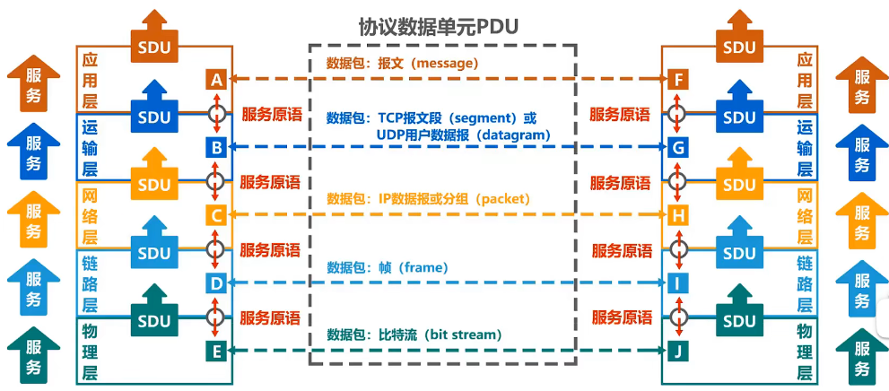

### 五、网络标准

- ISO：国际标准化组织
- ANSI：美国国家标准研究所
- NIST：美国国家标准和技术研究所
- IEEE：电子和电器工程师协会
- EIA：电子工业协会

### 六、TCP/ IP

1. TCP面向连接、UDP是无连接
2. TCP提供可靠服务
3. TCP是面向字节流、UDP面向报文
4. TCP是点对点；UDP支持一对多、多对多等交互
5. TCP首部20字节；UDP首部8字节
6. TCP是全双工可靠通信；UDP开销更小

### 七、每层的主要协议

1. 应用、表示、会话层

    POP3：110；邮件收取协议，采用TCP协议

    SMTP：25；邮件传输协议

    IMAP4：143；

    MIME：邮件传输协议

    ---

    FTP：控制端口21，传输端口20、使用TCP协议

    TFTP：69；FTP的简化版本

    SFTP：22；使用SSH加密认证的FTP

    ---

    WWW：80

    HTTP：80

    HTTPS：443，HTTPS使用SSL协议对报文封装

    ---

    Telnet：23；基于TCP的远程登录协议

    RFB：访问远程桌面的简单协议

    ---

    DHCP：自动分配IP地址、DHCP可从服务器获取DNS服务器地址，DHCP服务器地址

    DNS：53

    SNMP：采用UDP封装

2. 传输层：TCP、UDP

    - UDP和TCP均提供：端口寻址
    - TCP：采用可变大小的滑动窗口协议

3. 网络层：三层交换机、路由器、ARP、RARP、IP、ICMP、IGMP

    - ARP：将IP地址转换为物理地址、ARP请求（request）使用广播传送、ARP响应（response）使用单播传送
    - RARP：将物理地址转化为IP地址
    - IP：IPv6地址长度为128bit，IPv6是IPv4的$2^{96}$倍
    - ICMP：将数据单元封装在IP数据报中传送
    - IGMP：主机与本地路由器组播的协议

4. 数据链路层：

    网桥、交换机、网卡、PPTP、L2TP、SLIP、PPP

5. 物理层：中继器、集线器

### 八、其他例题

> 如果子网掩码为255.255.192.0，则该网络最大可用主机

- 子网中1代表网络位，0代表主机位（二进制表示）

- 255.255.192.0 = 11111111 11111111 11000000 00000000

- 共$2^{14}=1024$个主机（0的个数）

- 广播地址：每个子网的第一个与最后一个地址

    1024-2 = 1022

> IP地址155.32.80.192/26包含了多少个主机地址

> B类子网掩码255.255.224.0，则这个网络被划分为_个子网

- B类子网255.255.0.0

    255.255.000.0 = 11111111 11111111 00000000 00000000

    255.255.224.0 = 11111111 11111111 11100000 00000000

- 255.255.224.0比B类子网多出$2^3=8$，多3个子网

## 物理层

### 一、物理层基本概念

1. 物理层实现怎么在连接各种计算机的网络上传输数据比特流

2. 传输媒体

    引导型传输媒体：双绞线、同轴电缆、光纤、电线

    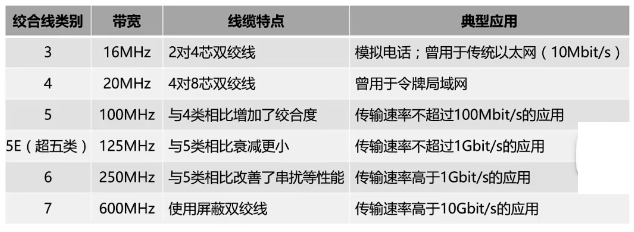

    会引导型传输媒体：微波通信（2.4G、5G）、红外线、可见光

3. 物理层协议主要任务

    - 机械特性：接口所使用的接线器形状、尺寸、引脚数目等
    - 电器特性：接口电缆的电压范围
    - 功能特性：电缆上电压的意义
    - 过程特性：对于不同功能的各种可能事件出现顺序

### 二、编码与调制

1. 数字信号$\to$ 数字信道，编码，曼彻斯特编码

2. 数字信号$\to$ 模拟信道，调制，WIFI（CCK/DSSS/OFDM调制）

3. 模拟信号$\to$ 数字信道，编码，脉冲调制PCM

4. 模拟信号$\to$ 模拟信道，调制，频分复用FDM

5. 码元：在使用时间域的波形表示数字信号

    

#### Ⅰ、常见编码：

1. 不归零编码

    存在同步问题，需要额外的一条线路同步时钟信号，

    

2. 归零编码

    优点：自同步；缺点编码效率低

    

3. 曼彻斯特编码

    只有正跳变和负跳变表示信息，

    正跳变表示0还是1没有明确规定（负跳变也没有明确规定）

    

4. 差分曼彻斯特编码

    跳变只表示时钟

    码元开始处是否发生变化，表示信息

    

> 若下图为10BaseT网卡接受的信号波形，则网卡收到的比特串是

- 

- 10BaseT表示：10表示10Mbps；Base基带传输；T双绞线；这种网络使用曼彻斯特编码
- 可假设正跳变为0，负跳变为1
- 可得答案为：0011 0110

#### Ⅱ、基本调制方法

计算题中的调制方法：

1. 4相位调制：

    可以调制出4种不同的波形（码元）

    $log_2(4) = 2$：每个码元可以携带2bit信息

2. 采用4个相位，每个相位有4种振幅的QAM的调制技术

    可以调制出$4\times 4=16$ 个不同的波形（码元）

    $log_2(16)=4$：每个码元可以携带4bit信息

### 三、信道极限容量

1. **数据传输速率** = 波特率(码元传输速率) $\times$ 每个码元携带的信息量
2. 香浓公式可知信噪比、频率带宽影响数据传输率
3. 奈氏准则可知调制速度影响数据传输速率

#### Ⅰ、奈氏准则

1. 在理想条件下，为避免码间串扰，码元传输效率有上限

2. 理想底通信道的最高码元传输速率 = 2w Baud = 2w (码元/s)

3. 理想带通信道的最高码元传输速率 = w Baud = w (码元/s)

    W：信道带宽（单位:Hz）

    Baud：波特（单位:码元/s）

#### Ⅱ、香农公式

1. 带宽受限且具有高斯白噪声干扰的信道的极限传输速率
2. 用于题目种有信噪比的的题目

$c = W \times log_2(1+\frac{S}{N})$  单位：bit/s

- C：信道极限传输速率（b/s）

- W：信道带宽（Hz）

- S：信道内所传信号的平均功率

- N：信道内的高斯噪声功率

- S/N：信噪比（db）

    $dB = 10\times log_{10}(\frac{S}{N})$ 

#### Ⅲ、常见例题

1. 对于多么厉害的调制技术，我们不用关心，只关系这种调制技术能调制出多少种波形即可

> 无噪声的情况下，某通信链路带宽为3kHz，采用4个相位，每个相位有4种振幅的QAM的调制技术，该链路的最大通信速率

- 最高码元传输速率：2w Baud = $2\times 3kHz = 6k （码元/s）$ 

- 4个相位，4种振幅QAM：$4\times 4=16$ 个不同的波形（码元）

- 采用二进制对16个码元进行编码，需要$4bit（log_216=4)$ 

    每个码元可携带的信息量为 4bit

- 最大速率：$6k(码元/s)\times 4(bit/码元) = 24kbps$ 

> 连接R2和R3的链路频率带宽为8kHz，信噪比为30dB，该链路的实际传输速率为理论最大传输速率的50%，则该链路的实际传输速率约为

- $dB = 10\times log_{10}(\frac{S}{N})$ 可得 $30 = 10\times log_{10}(\frac{S}{N})$ 

    $\frac{S}{N}= 1000 $

- $8kHz \times log_2(1+1000) = 80kbps$ 

- 该链路的实际传输速率为理论最大传输速率的50%：

    $80kbps\times 0.5 = 40kbps$ 

## 数据链路层

1. 数据链路层的数据结构名为：帧

### 一、封装成帧

1. 概念：数据链路层给上层交付的协议数据添加帧头和帧尾
2. 帧头和帧尾的作用就是为物理层的二进制数据划分帧

### 二、差错检测

1. FCS：帧检验序列，差错检测用到的数据

#### Ⅰ、奇偶校验

1. 原理：在发送数据的后面添加1位奇偶校验位，检测整个数据中“1”的个数为奇数还是偶数（包含奇偶校验位的1）

    - 偶校验：待发送数据有偶数个1，则+0

        偶校验保证待发送数据一定有偶数个1

    - 奇校验：待发送数据有偶数个1，则+1

        奇校验保证待发送数据一定有奇数个1

    > 例：待发送数据101101，双方提前约定为奇校验，接受方接受到的数据为1101100（发送干扰的数据）

    - 发送的数据为：1 101101
    - 发送方的1的个数为奇数（5个），接收方的1的个数为（4个）

#### Ⅱ、循环冗余校验码（CRC）

1. 原理

    - 双方约定一个生成多项式G(x)
    - 发送方基于待发送数据和G(x)计算出冗余码，将冗余码一起发送
    - 接受方根据G(x)和冗余码计算是否发生改变

2. 生成多项式举例

    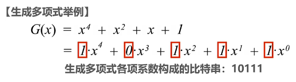

3. 常用的生成多项式

    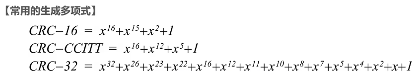

4. 检测是否产生误码

    利用CRC计算得结果为0，没有产生误码

    利用CRC计算得结果不为0，产生误码

5. 无法纠正错误，只能检测出错误

> 循环冗余校验码（CRC），待发送数据为101001，生成多项式为$G=x^3+x^2+1$ ，计算余数

-  构造被除数（待发送数据后添加生成多项式最高次数个0）

    $101001\to 101001 000$ 

- 构造除数（多项式各项系数构成的比特串）

    $G=x^3+x^2+1\to 1x^3,1x^2,0x^1,1x^0\to 1101$  

- 做除法（异或运算）

    ⊕：异或运算符；缩写：xor

    ab相同为0

    ab不同为1

    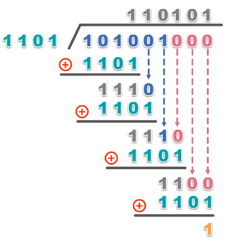

- 检查余数

    余数位数应与生成多项式最高次数相同，若位数不够，添0

    生成多项式最高次：$x^3\to 3位 \to001$ 

- 将计算得来得数据添加到待发送数据后面发送

### 三、可靠传输

1. 

#### Ⅰ、停止-等待协议（SW）

1. 发送方发送数据后等待接受方返回ACK确认
2. 超时重传：发送方长时间没有收到ACK确认或其他，将会重传

> 利用率例题

#### Ⅱ、回退N帧协议（GBN）

1. 发送方的发送窗口尺寸$W_t$的取值范围：$1<W_t\le 2^n-1$ 

    n：构成分组序号的比特数量

    $W_t=1$：变成停止-等待协议

    $W_t>2^n-1$：接收方无法分辨新旧分组

2. 接收方的接收窗口尺寸$W_t$的取值：1

> 13：15

#### Ⅲ、选择重传协议（SR）

1. 不支持累计确认

> 数据链路层使用选择重传协议，发送方已发送0~3号数据帧，现在收到1号的确认，0，2号确认超时，此时要重传的帧是

- 因为是选择重传，只重传没有接收的即可，即0，2号帧

### 四、点对点协议PPP

1. 点对点协议主要使用场景

    - PPPoE：PPP over Ethernet，使得ISP通过DSL、电路调制解调器、以太网等宽带接入技术，以以太网接口的形式为用户提供上网服务

        用户  $\underrightarrow{PPPoE}$   ISP  $\to$ 因特网

    - 广泛应用于：广域网路由器的专用线路

2. PPP的组成

    - 对数据的封装方法
    - 链路控制协议LCP（建立、配置测试数据链路的连接）
    - 网络控制协议NCPs（支持不同的网络层协议）

3. PPP的组成

    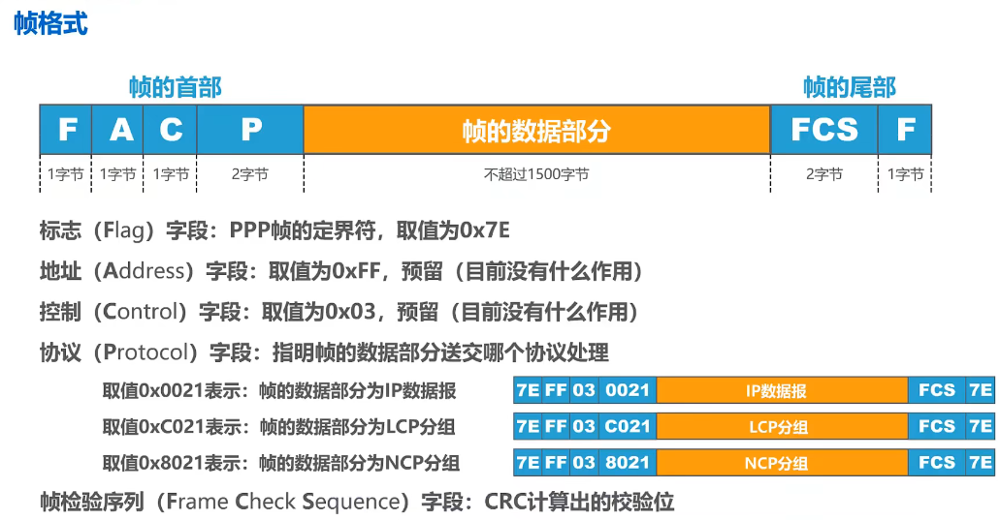

4. 透明传输-面向字节的异步传输，采用插入转义字符填充

    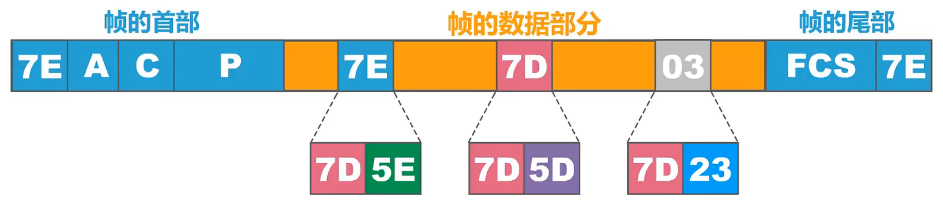

    - 7E：转移为7D5E

    - 7D：转移为7D5D

    - 数值小于0x20的字符：

        （1）+7D（2）+0x20

5. 透明传输-面向比特的同步链路，采用比特0填充法

    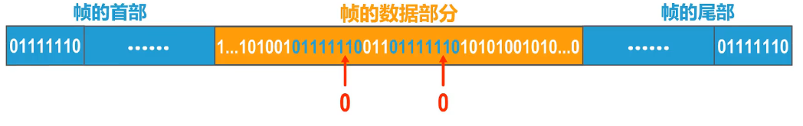

    - 发现连续的5个1，立刻填充一个0

### 五、媒体接入控制

1. 主要应用于总线结构、无线网的计算机网络中

2. 可分为2类

    - 静态划分信道

        频分多址、时分多址、码分多址

    - 动态接入控制

        受控接入、随机接入

#### Ⅰ、静态划分信道

1. 信道复用

    频分复用FDM（所有用户同时占用不同频段的资源进行通信）

    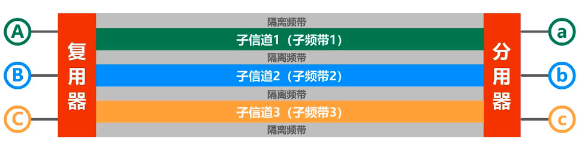

    时分复用TDM（所有用户在不同时间占用同样的频带宽度）

    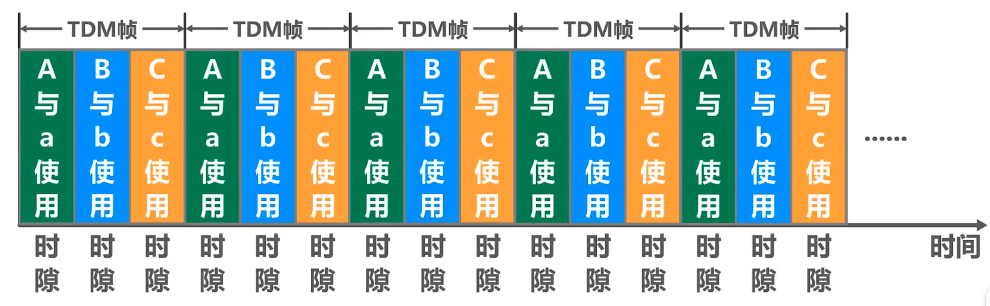

    波分复用WDM

    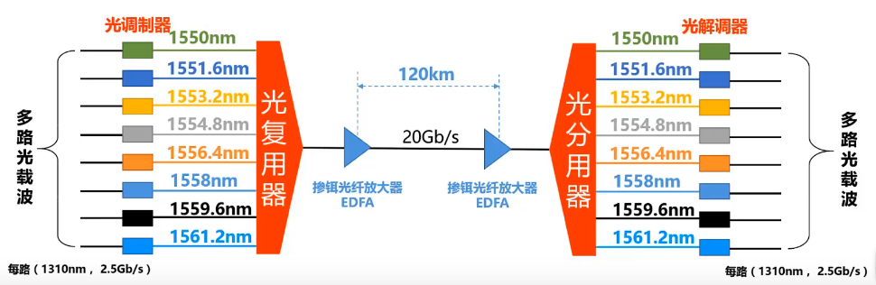

    码分复用CDM

    > P30 13:14

#### Ⅱ、CSMA/CD协议

1. CSMA/CD协议就是载波监听多址接入/碰撞检测，
2. CSMA/CD协议适用于各种总线结构以太网和双绞线以太网的早期版本，现在的以太网基于交换机全双工连接，不会有碰撞
3. 多址接入MA：即多个主机连接在一个总线结构中

CSMA/CD工作原理

CSMA/CD以太网争用期

CSMA/CD最小帧长/最大帧长

CSMA/CD退避算法

#### Ⅲ、CSMA/CA协议

1. CSMA/CA协议适用于无线局域网

2. 为什么不能在无线局域网中使用CSMA/CD协议

    在无线网中检测碰撞检测对硬件要求高

    在无线网中进行碰撞检测意义不大（隐蔽站）

3. 无线网中802.11协议使用了CSMA/CA协议进行发送检测

#### Ⅳ、MAC地址

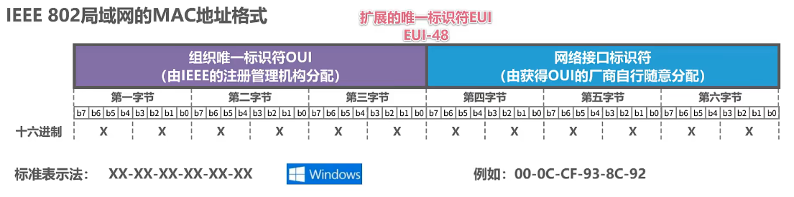

1. MAC地址（数据链路层）、ARP协议、IP地址（网络层）他们3个存在一定的联系，

#### Ⅴ、集线器和交换机

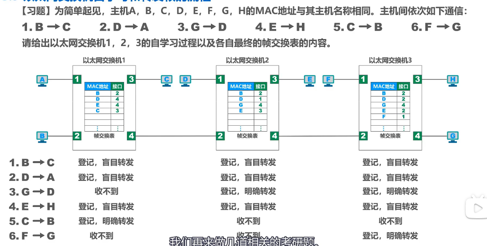

#### Ⅵ、以太网交换机生成树协议

1. 为防止网络环路带来的各种问题

#### Ⅶ、虚拟局域网VLAN

1. 路由器可以分割广播域，路由器工作在第三层
