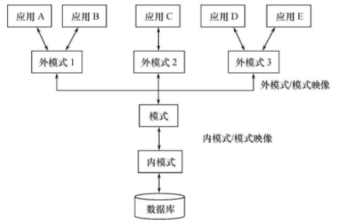
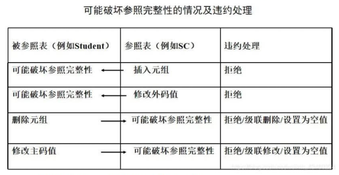
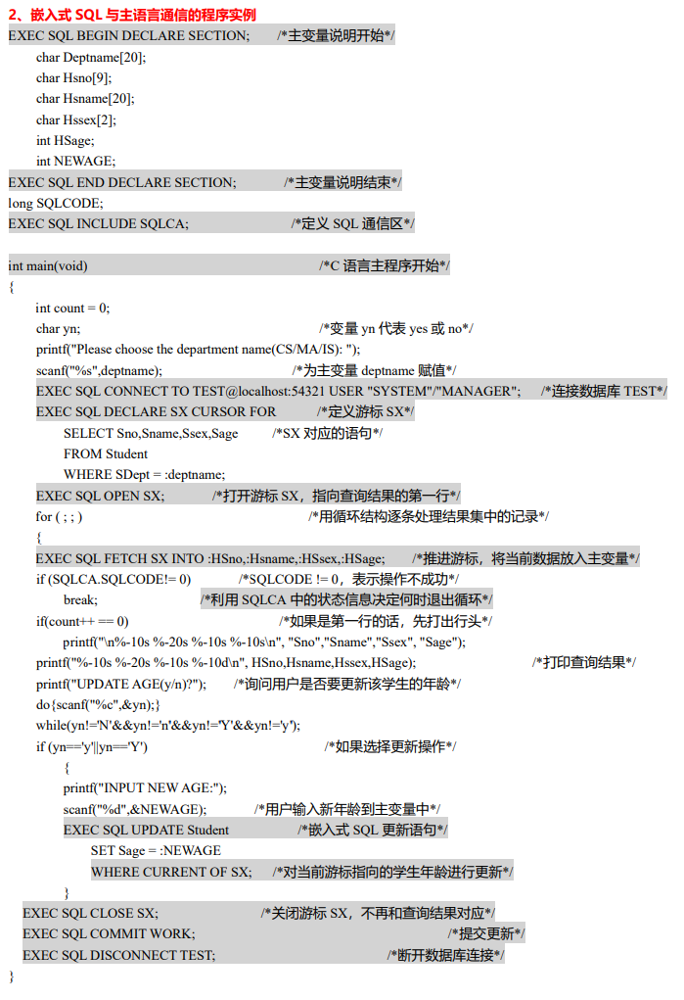

# 数据库系统概述

## 选填技巧

### 一、 数据库的基本概念

①数据：描述事物的符号，数据库中存储的基本对象。

②数据库（DB）：⻓期储存在计算机内、有组织的、可共享的⼤量数据的集合

③数据库管理系统（DBMS）：位于⽤户和操作系统之间的⼀层数据管理软件。

④数据库系统（DBS）：是由**数据库**、**数据库管理系统**（及其应⽤开发⼯具）、**应⽤程序**和**数据库管理员**（DBA）组成的存储、管理、处理和维护数据的系统。

数据库系统的基本特征：共享性、独立性、亢余度小

### 二、数据库系统的特点

1、数据结构化

2、数据的共享性高，亢余度低且容易扩充

3、数据独立性高：

- 物理独立性：应用程序与物理存储相互独立，数据的物理存储改变，应用程序不改变
- 逻辑独立性：应用程序与逻辑结构相互独立，数据的逻辑结构改变，应用程序不改变

4、数据由数据库管理系统统一管理和控制

### 三、数据模型

1、数据模型包括：概念模型（信息模型）、逻辑模型、物理模型

2、概念模型：按⽤户观点来对数据和信息建模，主要⽤于数据库设计。

3、逻辑模型：它是按计算机系统的观点对数据建模，主要⽤于数据库管理系统的实现。

- 包括：层次模型、⽹状模型、关系模型

| 名称      | 内容                                                                                                              |
| ------- | --------------------------------------------------------------------------------------------------------------- |
| 层次模型（树） | 只有一个根节点 1、有且只有⼀个结点没有双亲结点，这个结点称为根结点。 2、根以外的其他结点有且只有⼀个双亲结点。                                                |
| ⽹状模型（图） | 1、允许⼀个以上的结点⽆双亲。 2、⼀个结点可以有多于⼀个双亲。                                                                            |
| 关系模型（表） | 关系：⼀个关系对应通常说的⼀张表。 元组：表中的⼀⾏。 属性：表中的⼀列。 码：也称码键，表中的某个属性组。（主键） 域：是⼀组具有相同数据类型的值的集合。 分量：元组中的⼀个属性。 |

4、物理模型：是对数据最底层的抽象，它描述数据在系统内部的表示⽅法和存取⽅法，或在磁盘或磁带上的存储⽅式和存取⽅法，是⾯向计算机系统的。

5、**数据模型组成要素**：数据结构、数据操作、数据完整性约束条件

- 数据结构：描述系统的静态特征（描述数据库的组成及对象之间的关系）
- 数据操作：描述系统的动态特征（是对数据库中各种对象的实例所允许的操作集合，增删改查）
- 数据库的完整性约束条件：用以限定符合数据模型的数据库以及状态的变化，保证数据的正确、有效与相容、完整性约束条件是一组完整性规则的集合

### 四、三级模式结构

1、三级模式结构：外模式+模式+内模式

- 外模式（⼦模式或⽤户模式） ：应⽤程序员和最终⽤户能够看⻅和使⽤的局部数据的逻辑结构和特征的描述，是数据库⽤户的数据视图，是与某⼀应⽤有关的数据的逻辑表示。
- 模式（逻辑模式）：是数据库中全体数据的逻辑结构和特征的描述，是所有⽤户的公共数据视图
- 内模式（存储模式）：⼀个数据库只有⼀个内模式。它是数据物理结构和存储⽅式的描述，是数据在数据库内部的组织⽅式。

2、数据库的二级映射

- 外模式/模式映射：保证数据的逻辑独立性
- 模式/内模式映射：保证数据的物理独立性

### 五、数据库不安全因素

1、不安全因素：

- ⾮授权对数据库的恶意存取和破坏
- 数据库中重要的数据泄露
- 安全环境的脆弱性

2、数据库安全性控制

- ⽤户身份鉴别：静态⼝令鉴别，动态⼝令鉴别，⽣物特征鉴别，智能卡鉴别
- 存取控制
- ⾃主存取控制⽅法

3、**为什么要授权**

授权是指授予（grant）和收回（revoke），是数据库安全控制中的自主存取控制方法，是为了保护数据库，防止不合法使用所造成的数据泄露、更改和破坏

**4、授权（grant）**

格式：grant 权限 on 对象类型 对象名 to 用户名 [with grant option]

- 权限：select、delete、update、insert、all privileges等
- 对象类型：table、view等
- 对象名：表名，视图名等
- 用户名：授权给某个用户，publc所有用户
- with grant option：没有此选项，当前用户不能将此权限授予其他用户

例子：

- GRANT select ON table mmm TO tree
- GRANT select ON table mm@ TO tree WITH GRANT OPTION

**5、收回权限（revoke）**

格式：revoke 权限 on 对象类型 对象名 from 用户名 [cascade| restrict]

- 权限：select、delete、update、insert、all privileges等
- 对象类型：table、view等
- 对象名：表名，视图名等
- 用户名：授权给某个用户，publc所有用户
- cascade：级连回收，将用户传播出去的权限一块回收
- restrict：受限回收，如果用户传播过权限，回收失败

例子：

- REVOKE update(studen) ON table student FROM tree

6、创建数据库模式权限

格式：create user 用户名 [with dba | resource | connect]

- with dba：此用户可以创建新用户、创建模式、创建基本表和视图，拥有对所有数据库对象存取权限，还可以把这些权限授权给其他用户
- resource：此用户可以创建基本表和视图
- connect：默认创建用户，只能登录，没有任何权限

7、数据库角色

格式：create role 用户名

8、在一个角色中添加用户

格式：grant 角色 to 用户[with admin option]

- with admin option：此用户可以把权限授权给其他角色

9、给角色授权

格式：grant 权限 on 对象类型 对象名 to 角色

10、回收角色权限

格式：revoke 权限 on 对象类型 对象名 from 角色

11、视图机制

为不同的用户定义不同的视图，把不需要的数据隐藏，防止用户误操作

12、审计

把对数据库的操作都记录到审计日志中，然后就可以通过日志审查确定有没有违法行为

13、数据加密

通过一些加密算法，把明文变成密文，这样别人就无法查看

###  六、数据库完整性

1、数据的完整性是指数据的正确性和相容性

- 正确性：符合现实世界语义
- 相容性：同一对象在不同表中的数据符合逻辑

2、维护完整性需要实现的功能

- 提供定义完整性约束条件的机制
- 提供完整性检查的方法
- 进行违约处理

3、三大完整性-属性上的约束

- 实体完整性：主码唯一，不为空

  违约处理：检查主码时候唯一、不为空，不唯一、空则拒绝；

- 参照完整性：外码的约束

  

- 用户定义完整性：

  1. 非空，NOT NULL
  2. 唯一，UNIQUE
  3. 检查是否符合表达式，CHECK

4、三大完整性-元组上的约束

在create table语句中可以用check短语定义元组上的约束条件，元组级的限制可以设置不同属性之间的取值的相互约束条件

检查和违约：插入元组和修改属性值时，关系数据管理系统将检查元组上的约束条件是否被满足，如果不满足则拒绝操作

### 七、数据库设计步骤

- 需求分析-生成数据字典和用户需求说明书
- 概念结构设计-生成E-R图
- 逻辑结构设计
- 物理结构设计
- 数据库实施
- 数据库运行和维护

### 八、数据库编程

1、嵌入式SQL与主语句得通信包括

- SQL向主语言传递指向状态，主要通过**SQL通信区实现** 
- 主语句向SQL提供参数，主要通过**变量实现** 
- 将SQL语句查询数据库结果交给主语句处理，主要通过**变量和游标**实现 

2、SQL通信区：SQL语句执行后得状态将送到SQL通信区中，应用程序从中取得这些信息，据此决定接下来得语句

3、主变量：SQL语句中使用得主语言程序变量（即SQL使用主语言得变量）

4、游标：SQL是面向集合得，一条SQL语句可以产生或处理多条记录，而主语言是面向记录得，一组变量一次只能存放一条记录，因此引入游标

5、建立连接：嵌入sql必须先连接数据库

6、关闭连接：对新得嵌入式sql为EXEC SQL DISCONNECT

## 九、数据库恢复

1、事务概念

- 事务是数据库操作序列，这些操作要么全做要么不做，是不可分割的工作单位。
- 事物是恢复的基本单位，也是并发控制的基本单位

2、定义事物的sql语句

- 开始语句：begin transaction
- 结束语句：commit
- 回滚语句：rollback

3、事务的4个特性

- 原子性：一个事务要么全做，要么不做
- 一致性：事务执行的结果必须一致
- 隔离性：一个事务的执行不能被其他事务干扰
- 持续性：一个事务一旦提交，他对数据中数据的改变应该是永久的

4、数据库系统的故障种类

- 事务内部故障
- 系统故障
- 介质故障
- 计算机病毒

5、数据库恢复技术

# 关系数据库

关系数据语言可分为3类：SQL语言、关系演算语言、关系代数语言

## 1、 关系模式

任何一个关系模式一定有键

2个属性一定没有传递依赖（因为至少3个才有传递依赖）

## 2、关系代数语⾔

5种基本的运算：并、差、笛卡尔积、选着、投影

关系代数操作的对象和操作结果都是**关系**

**并**（∪）：2个集合，合并在一起

**差**（-）：A-B，从A中去除B的内容

**交**（∩）：2个集合相同的部分

**笛卡⼉积** （$\times$）

> A\*B，先取A中的第一行，与B的每一样组合在一起，然后取A的下一行继续，直到全部组合完毕

**选择**（$\sigma$）：

$\sigma_{sdept='IS'}(Student) $ ：查询Student表，sdept='IS'的值

**投影**（$\prod$）：

$\prod_{sname, sdept}（Student）$ ：选中Student表的snme，sdept列。

**等值连接（=）**：$\frac{A⋈B}{A.a=B.b}$，A$\times$B中所有A，B相等的行

**自然连接（⋈）**：A⋈B，A$\times$B中所有A，B相等且不重复的行。

**外连接**（⋈）：A$\times$B中所有行，不相等的也保留，没有的属性写NULL

**左连接（⋊）**：A⋊B，保留左边（A）的属性

**右连接（⋉）**：A⋉B，保留左边（B）的属性

**除（ / ）**

> R / S
>
> 1、在R中选中属性值为S中的属性值，有多个保存多个，每一行算1个
>
> 2、去掉列名为S中的列名

# 数据库的完整性

1. 正确性：符合现实世界的描述

2. 相容性：同⼀对象在不同表⾥⾯是符合逻辑的，⽐如我的地址，年龄在两个表⾥⾯都应⼀致

3. 维护完整性：提供定义完整性约束条件的机制、提供完整性检查的⽅法、进⾏违约处理

**三大完整性**

1. 实体完整性，主码（主属性）唯⼀，且⾮空

2. 参照完整性，外码的要么没有,要么只有⼀个

3. ⽤户定义完整性：⾮空（not null），列值唯一（unique）、满⾜某⼀个条件表达式（check）

# 数据库恢复技术

## 1、事务ACID

1. 原⼦性（autom）：要么全做，要么全不做

2. ⼀致性（consistent）：⼀致性与原⼦性密切相关，要么全做要么全不做

3. 隔离性（isolate）：⼀个事务的执⾏不能被其他事务所⼲扰

4. 持久性 （duration）： 数据库的改变是永久的。

## 2、故障种类

事物内部故障、系统故障、介质故障（外部存储损坏）、硬件损坏、计算机病毒

# 关系数据理论

## 1、三大范式

**1NF**：所有字段值都是<u>不可分解的原⼦值</u>（地址 可以分为 省份，城市，详细地址）

**2NF**：不包含⾮主属性对码的部分函数依赖，<u>⼀个表中只能保存⼀种数据</u>，不可以把多种数据保存在同⼀张数据库表中（比如订单表，不能包含商品信息）

**3NF**：不包含⾮主属性对码的<u>传递函数依赖</u>，确保数据表中的每⼀列数据都和主键直接相关，⽽不能间接相关

**BCNF**：消除每⼀属性对候选键的<u>传递依赖</u> ,BCNF是修正的第三范式（例，书号->书名，(书名，书号)->作者

## 4、公理系统

1、自反律、增广律、传递律

合并规则，（X->Y，X->Z，则X->Z）

伪传递规则，（X->Y, WX->Z，则XW->Z）

分解规则, （X->Y, Z属于Y，则X->Z）

## 5、模式分解

准则: ⽆损连接 和 保持函数依赖

⽆损: 就是分解后再次连接,和分解之前⼀样

依赖: 依赖不变

# 关系数据库设计

6个阶段：需求分析、概念结构设计、逻辑结构设计、物理结构设计、数据库实施、数据库运行、维护阶段

# 并发控制

**并发带来的问题**：丢失修改、读脏数据、不可重复读

**解决方法**：

1. 排它锁：也叫写锁（X锁）Xlock  unlock

2. 共享锁：也叫读锁（S锁）Slock

**封锁协议**

+ ⼀级封锁协议：修改时，必须加X锁，直到结束（解决丢失修改）

+ ⼆级封锁协议：读的时候，加S锁，⽤完就放（解决读脏数据）

+ 三级封锁协议：读的时候，加S锁，直到结束（解决不可重复度）

**三级锁协议题型**

# + 例题

## + 保持函数依赖分解

已知R(ABCDEGH)，F={A->D，E->D，D->B，BC-D，DC->A}，求保持函数依赖的3NF的分解

1、求出最⼩函数依赖集

F={A->D，E->D，D->B，BC->D，DC->A}

2、把不在F⾥⾯的属性都找出来单独分⼀类

F的属性是ADEBC，R的属性是ABCDEGH，所以得结果{GH}

3、把每⼀个依赖左边相同的分成⼀类，没有⼀样的，那么就把A->D改为{AD}

    相同：{A->B，A->C} => {ABC}

    不同：{A->D} => {AD}

{AD}，{ED}，{DB}，{BC}，{DCA}

4、求候选码，如果候选码没出现在分离⾥⾯, 把任意⼀个候选码作为⼀类

候选码：CE

将最小函数依赖写下：{AD}，{ED}，{DB}，{BC}，{DCA}

添加**候选码**和**不在F⾥⾯的属性**则最终结果

{AD}，{ED}，{DB}，{BC}，{DCA}   {CE}{GH}

## + ER图题型

1、文字描述转ER图

注意：题目中出现的属性是固定的，当条件中提出多个属性时，应添加在条件上

2、ER图转关系

| 关系         | 说明                                                         |
| ------------ | ------------------------------------------------------------ |
| 1：1（AB表） | 把关系上的属性放到任意一个表中（设A），并把 B表的主键放到一个 A表 中 |
| 1：n         | **关系**上的属性放到 n表 中，把**1的主键**也放到n表中        |
| n：m         | 将**关系属性**生成一个新表，并保存**nm表的主键**             |

## + 候选码

> 步骤1
>
> 只出现在左边的⼀定是候选码
>
> 只出现在右边的⼀定不是候选码
>
> 左右都出现的不⼀定
>
> 左右都不出现的⼀定是候选码
>
> 步骤2
>
> 再求**确定的候选码**的闭包,如果可以推出全部,那么当前确定的就是候选码。否则，你要吧每⼀个可能的值，放进当前确定的候选码⾥⾯进⾏求 闭包

例：R<U,F> ,U(A，B，C，D，E，G) , F={AB->C，CD->E，E-->A，A-->G)

1、B，D⼀定是候选码，G⼀定不是候选码，A，C，E不⼀定

2、确定候选码，BD什么也不能推出，

3、进行BD与可能是候选码的关系进行闭包推算，

(BDA)+= C E A G 所以可以推出ABCDEG

> (BDA)+=C， AB->C
>
> (BDA)->(CD)+=E，CD->E
>
> (BDA)->(CD)->(E)->(A)->(G)

(BDC)+= E A G 所以可以退出ABCDEG

(BDE)+= A G C 可以退出ABCDEG

所以候选码为 { (BDA), (BDC), (BDE) }

超码: 能表示出所有属性的集合, ⽐如 (BDA),(BDC),(BDE) BDCA BDEA ABCDE

候选码是最⼩的超码.

主码: 从候选码⾥⾯任意跳出⼀个 作为主码

主属性: 包含在所有候选码的属性 ⽐如ABCDE

⾮主属性: 不包含在候选码中的属性 ,上题为G

全码: 所有的属性都是主码

## + 求最⼩函数的依赖集

**如何求最⼩依赖集?**

1)拆右边为多个元素的，⽐如A->BC 拆为 A->B 和A->C

2)除去当前元素,求它的闭包，把集合⾥⾯所有元素都弄完

3)左边最⼩化（通过遮住元素来看能不能退出其他元素），

**例题：** 

已知关系 R<U,F> ,U{A,B,C,D,E,F,G}，F={BCD->A，BC->E，A->F，F->G，C->D，A->G}

求F的最⼩依赖集

1、拆右边为多个元素，题目中没有

2、除去当前元素,求它的闭包，把集合⾥⾯所有元素都弄完

> BCD->A，去掉不看，根据剩下的关系求 (BCD)+
>
> (BCD)+=BCD ED # 一定能推车自己，所以BCD->A必须保留

得BCD->A，BC->E，A->F，F->G，C->D

3、左边最⼩化（只对左边多个元素进行化简）

> 由BCD->A，
>
> CD能得出A吗，不能，B保留。BD能得到A吗，不能，C保留。
>
> BC能得到A吗，BC->E，C->D（BC中包含C），去掉D

BC->A，BC->E，A->F，F->G，C->D

