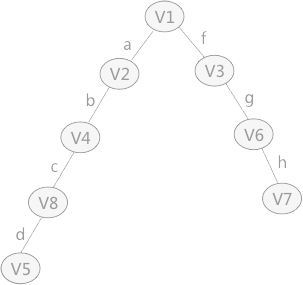

# 数据结构

## 概论

### 一、名词解释：

1. 数据：信息的载体
2. 数据元素：数据的基本单位
3. 数据对象：数据元素的集合
4. 数据类型：原子、结构、抽象数据类型（可定义完整数据结构）
5. 逻辑结构：队列、栈、串、数组、树、图、有序表。
6. 存储结构：顺序结构（顺序存储、循环队列）、链式（所有的链表）、索引、散列（哈希表）

### 二、时间复杂度计算

1、利用对数计算的时间复杂度（所有可以改写成while循环）

```c
// 例题：
void func(int n)
{
    int i;
    while(i<n)
    {
        i=i*2;
    }
}
```

- 根据while循环写出公式，注意i的初始值

| 次数k           | 1    | 2    | 3    | 4    | 5    |
| :-------------- | ---- | ---- | ---- | ---- | ---- |
| i的值           | 1    | 2    | 4    | 8    | 16   |
| 循环主体的值i*2 | 2    | 4    | 8    | 16   | 32   |

- 根据循环主体得到i与n的关系式：$2^k=n$
- 求得次数K关系式：$K=\log_2n$

2、for嵌套循环的时间复杂度

``` c
for(i=1;i<=n;i++)
{
    for(j=1;j<=2*i;j++)
    {
        m++;
    }
}
```

- 原则：有几个for就有几个累加，又因为m++就执行1次，所有m++为1
- 得公式：$\sum_{i=1}^n\sum_{i=1}^{2i}1$
- 计算方法，由右向左计算
  1. $\sum_{i=1}^{2i}1=1+1+1+...+1=2i$ （共累加2i次，每次都加1）
  2. $\sum_{i=1}^n2i=2\sum_{i=1}^ni=1+2+3+4+...+n=2\frac{n(n+1)}{2}=n^2+2$
- 因为时间复杂度只求近似值，所以时间复杂度为$O({n^2})$

3、常见的累加计算方法：

- $\sum_{n=1}^{n}1=1+1+1+...+1=n$ （n个1相加等于n ）
- $\sum_{j=i}^{n}1=(n-1)+(n-2)+(n-3)...+1=\frac{n[(n-1)+1]}{2}$ 
- $1^2+2^2+3^2+...+n^2=\frac{n(n+1)(2n+1)}{6}$
- $\sum_{i=1}^n(i^2+i)=\sum_{i=1}^ni^2+\sum_{i=1}^ni$ （时间复杂度只是粗略计算，因此只关心**高阶**，所以$\sum_{i=1}^ni$可以舍去）

## 线性表

### 一、顺序存储

1、线性表采用顺序存储，方便快速读取，插入删除较慢（因为要移动大量数据）

2、线性表中的头尾没有直接前驱或直接后继

3、顺序表=线性表采用顺序存储

3、顺序表中，在任意位置插入元素，元素平均移动次数是：$\frac{n+1}{2}$

4、顺序表中，在任意位置删除元素，元素平均移动次数是：$\frac{n-1}{2}$

### 二、链式存储

1、单链表必须在当前指针之后插入

2、双链表可以在元素前后插入

3、单向循环链表，头插/尾插的时候，知道尾节点更快

4、双向循环链表，头插，知道尾指针效率高

5、双向循环链表，尾插，知道头尾指针效率一样

6、长度为M和N得升序链表，

- 若将2个链表合并为**降序**（与原来的次序相反），则最坏的时间复杂度max(M,N)

- 若将2个链表合并为升序（与原来的次序相同），则最坏的时间复杂度M*N

  

## 队列/栈

### 一、队列

1、队列：**头出队，尾入队**

### 二、循环队列

1、循环队列（默认队列情况）

- 什么时候用默认队列：
  1. 题目没有说明的情况
  2. front与rear初始化时指向同一个区域
  3. 指针A指向队头元素，指针B指向队尾元素的后一个位置
- 默认队列公式：
  1. 初始化：Q.rear = Q.front = 0
  2. 入队：Q.rear = (Q.rear+1) % MaxSize
  3. 出队：Q.front= (Q.front+1) % MaxSize
  4. 队满：Q.front==(Q.rear+1) % MaxSize
  5. 队空：Q.rear == Q.front
  6. 队中元素个数：(Q.rear+MaxSize-Q.front) % MaxSize
- 缺点：这种队满浪费了一个数据元素

2、队列技术

- 缓冲区利用了队列技术

### 三、前/中/后缀表达式

1、笔算方式：**中缀**表达式转**前/后缀**，只需要加括号（依据正常计算的流程），再把符号前移/后移即可

2、中缀转后缀（利用栈）：

1. 运算符入栈，数字不入栈
2. 当前运算符优先级>栈顶元素优先级，入栈
4. 当前运算符优先级<=栈顶元素优先级，**先弹出栈中的元素**，当前元素才可入栈
5. “（”直接入栈，遇见“）”出栈，而且是一直出到与之匹配的“（”

3、**前缀/后缀**表达式转**中缀**（利用栈）

1. 入栈方向是从数字端开始

2. 数字入栈，操作符不入栈

3. 遇见操作符则出栈，出栈的**数字顺序与前/后缀中的顺序**相同（）

   1. 前缀可以理解为：A-B中的A是**先出栈的**
     2. 后缀可以理解为：A-B中的A是**后出栈的**

4. 出栈元素＋操作符组成一个整体，再次入栈

   **出栈方向也符合（<--是方向）：后<--栈-->前**

### 四、栈

1、特点

- st栈空条件：st->top = -1

2、若输入序列是1，2，3，……，n

- 输出序列第一个是n，则第i个元素是n-i+1
- 输出序列第一个是i（第一个元素不是n），则第j个元素是**不确定**
- 其出栈顺序是$P_1,P_2,P_3...$，若$P_2$=3（任意数），则$P_3$**可能取到的值**得个数是n-1（只有$P_2$是确定的，其他数都可取到）

2、先序序列为abcd的不同二叉树的个数

- 这相当于问以abcd的顺序入栈，出栈的顺序有多少种
- 公式：$C_{2n}^{n}\frac{1}{n+1}$ （n是元素的个数）
- $C_m^n=\frac{m!}{n!(m-n)!}$
- $C_n^0=C_n^n=1$ 

3、共享栈

- 节省空间，降低上溢发生率（共享栈2端是栈低，中间是栈顶）
- st栈满：top[1] + 1 = top[2]

4、链栈

- 最不适合做链栈的是：只有头指针，没有尾指针的循环单链表

## 串、矩阵

### 一、KMP算法

- next数组：https://www.bilibili.com/video/BV1g341147vQ
- nextval数组：https://www.bilibili.com/video/BV1uJ411s7br
- 已知字符串ABAABBAA……，模式串ABAAA，则next与nextval是根据**模式串**生成的
- 注意模式串下标，一般是从1开始，若是从0开始，next要全体-1

| j（默认为1） | 1    | 2    | 3    | 4    | 5    | 6    | 7    | 8    |
| ------------ | ---- | ---- | ---- | ---- | ---- | ---- | ---- | ---- |
| 模式串P      | a    | b    | a    | a    | b    | a    | a    | b    |
| next         | 0    | 1    | 1    | 2    | 2    | 3    | 4    | 5    |
| nextval      | 0    | 1    | 0    |      |      |      |      |      |

1、next求法

- next[1]=0，next[2]=1
- 当j=3时，j前面的字母是ab
  1. a,b没有相同的，则0+1=1
- 当j=4时，当前j前面字母时aba，（都是从左向右写）
  1. a（$j_1$）        | a  （$j_3$）    
  2. ab（$j_1,j_2$）| ba（$j_2,j_3$）
  3. 相同字符串最长的个数为1，则1+1 =2
- 当j=5时，当前j前的字母顺序为abaa
  1. a     | a
  2. ab   | aa
  3. aba | baa
  4. 相同字符串最长的个数为1，则1+1=2
- 当j=6时，当前j前面的字母为abaab
  1. a       | b 
  2. ab     | ab
  3. aba   | aab
  4. abaa | baab
  5. 相同字符串最长的个数为2，则2+1=3

2、nextval求法

- 若j=1，则nextval[1] = 0
- 若j>1（$P_j$为当前指向的字符串）
  1. $P_j\neq P_{next[j]}: nextval[j] = next[j]$   (next的值直接下移，成为nextval的值)
  2. $P_j=P_{next[j]}: nextval[j] = nextval[next[j]]$

### 二、矩阵压缩做题技巧

1、选择题

- 优先区分矩阵下标与数组下标，矩阵下标从1开始，数组下标从0开始
- 优先画出矩阵样子，选定特定的值带入选项公式计算
- 上三角/下三角与元素下标、列存储和行存储（一般默认都是行存储）的关系

2、使用压缩存储稀疏矩阵的存储结构：三元组和十字链表

### 三、对称矩阵压缩

1、矩阵特点

- 对称的位置数组相同，例：$a_{21}=a_{12}$
- 只要是下标行列相同的元素，其位置肯定在对角线上，例如：$A_{11}、A_{22}$
- 下标行列相同的元素一定是上三角的第一个或者下三角的最后一个
  1. 主要用于计算上三角元素第一个，使用公式：j-i
  2. 例如：求下标矩阵元素$A_{35}$ 在第3行是第几个元素，5-2=3
- 矩阵压缩，只需要存储一般的数据即可

$$
对称矩阵图例：
\begin{pmatrix} 
	a_{11} & a_{12} & a_{13} & \cdots & a_{1n} \\ 
    a_{21} & a_{22} & a_{23} & \cdots & a_{2n} \\
    \vdots & \vdots & \vdots & \ddots & \vdots \\    
    a_{n1} & a_{n2} & a_{n3} & \cdots & a_{nM} \\ 
\end{pmatrix}
$$


2、特别的计算方法

1. 情况一：计算元素位置 $A_{ij}(i>j)$ 在上三角矩阵（i<j）中的压缩位置
2. 原理： $A_{2,1}=A_{1,2};也就是A_{i,j}=A_{j,i}$（适用于上三角但元素下标i>j的情况）这样就可以把元素A转换到正确的位置中

3、计算方法**矩阵** $A_{ij}$ 在数组的下标位置

- 计算前i-1行有多少元素

  1. 下三角$i\geq j$ **【特别注意：一定是到i-1行】**

     $C = 1+2+3+...+(i-1)=\frac{(1+i-1)(i-1)}{2}=\frac{i(i-1)}{2}$

  2. 上三角$i\le j$ 

     说明：矩阵 $A_{ij}$ ，第1行是n-1+1，第2行是n-2+1，第3行是n-3+1；所以第i行应该是n-i+1

     $C=n+(n-1)+(n-2)+...+(n-i+1)=\frac{(n-i)(n+n-i+1)}{2}$

  3. 例子：10*10矩阵，前5行=10+9+8+7+6

- 计算第i行的元素

  1. 下三角矩阵 

     【**-1是因为数组从0开始存放，C+j是矩阵A第i行j列共多少元素**】

     数组下标K = C + j-1

  2. 上三角（$i \le j$）【**特别记住是 j-i **】

     数组下标K = C + j-i
  
  3. 注意：因为上三角$i<j$，第一个元素下标i=j，所以要从i个元素开始计算

### 四、三对阵矩阵压缩

1、矩阵特点

- 第一行，最后一行都是2个元素

- 中间元素下标i行j列，i=j

  前一个元素下标i行j列，i>j

  后一个元素下标i行j列，i<j

  例：$A_{43}A_{44}A_{45}$

$$
三对称矩阵图例：
\begin{pmatrix} 
	a_{11} & a_{12} & 0 & \cdots & & & 0 \\ 
    a_{21} & a_{22} & a_{23} & 0 &\cdots && 0 \\
    0 & a_{32} & a_{33} & a_{34} & 0 &\cdots & 0 \\
    \vdots & \vdots & \vdots &  & \vdots & \ddots &\\    
    0 & 0 & 0 & \cdots & a_{n,n-1} & & a_{nn} &\\ 
\end{pmatrix}
$$


2、计算方法：矩阵$A_{ij}$在一维数组中的位置

1. 计算去掉 **第i行** 和 **第一行** 一共有多少元素（注意每行3个元素）

   $C_z=3 \times (i-2)$

2. 矩阵A第i行j列一共有多少元素$A_{ij}$

   【第一行2个元素；第i行（除第一行）之前一共有多少元素】

   $总数C_{z1}=C_z+2$

3. 当前行元素

   i>j：+1

   i=j：+2

   i<j：+3

4. 因为数组中元素是从0开始，所以下标为总数-1

   $总数:C_{z1}-1$

### 五、上下三角矩阵

1、上三角矩阵
$$
上三角矩阵图例：
\begin{pmatrix} 
	a_{11} & a_{12} & a_{13} & \cdots & a_{1n} \\ 
    0 & a_{22} & a_{23} & \cdots & a_{2n} \\
    0 & 0 & a_{33} & \cdots & a_{2n} \\
    \vdots & \vdots & \vdots & \ddots & \vdots \\    
    0 & 0 & 0 & \cdots & a_{nM} \\ 
\end{pmatrix}
$$


2、下三角矩阵
$$
下三角矩阵图例：
\begin{pmatrix} 
	a_{11} & 0 & 0 & \cdots & a_{1n} \\ 
    a_{21} & a_{22} & 0 & \cdots & a_{2n} \\
    a_{31} & a_{32} & a_{33} & \cdots & a_{2n} \\
    \vdots & \vdots & \vdots & \ddots & \vdots \\    
    a_{n1} & a_{n2} & a_{n3} & \cdots & a_{nM} \\ 
\end{pmatrix}
$$


3、算法与对称矩阵相同，特殊的地方在于要有一个地方存放除上三角（下三角）之外的元素，所以是对称矩阵+1

### 六、其他数组存储元素

例：设二维数组A[1……m，1……n]按行存储在一维数组B中，则二维数组元素A[i,j]在B中的下标为

- 注意二维数组A，其元素下标为1……m，1……n；相当于对称矩阵
  $$
  对称矩阵图例：
  \begin{pmatrix} 
  	a_{11} & a_{12} & a_{13} & \cdots & a_{1n} \\ 
      a_{21} & a_{22} & a_{23} & \cdots & a_{2n} \\
      \vdots & \vdots & \vdots & \ddots & \vdots \\    
      a_{n1} & a_{n2} & a_{n3} & \cdots & a_{nM} \\ 
  \end{pmatrix}
  $$

- A[i,j]也是**矩阵下标**，下标从1开始，所以行可-1，列就不用-1；

  $A[i,j]在B位置的公式：(i-1)\times n+j$  

## 树与二叉树

### 一、常用基础

1、总结节点数 = 分支数 + 1

2、度为0（叶子节点）的个数 = 度为2的节点个数 + 1
$$
叶子节点=度为2的节点+1
\\
n_0 = n_2 + 1
\\
n_2 = n_0 - 1
$$
3、第i层最多有m个节点，公式：
$$
m = 2^{i-1}
$$
4、高度为K的树，整个树最多有m个节点，最少拥有N个节点
$$
最多节点数:m=2^k-1 
\\
最少节点数（一条线的情况）:N=2^{k-1}
$$
5、完全二叉树与满二叉树节点关系


6、n个节点的完全二叉树树高
$$
当n能被log整解:\lfloor \log_2n \rfloor + 1
\\
当n不能被log整解:\lceil \log_2(n+1) \rceil
$$

7、森林有e条边、k个节点，则这个森林包含k-e个树

8、二叉树的顺序存储，其节点的下标要满足父节点i，其子节点2i，2i+1的关系

9、二叉树左右子树有先后顺序，不能随意以更换；树的左右子树可以随意更换

10、二叉树不是树的特殊形式

### 二、树的遍历

1、将树转换为二叉树，再进行遍历

- 树的先序遍历（深度优先遍历） = 二叉树的先序遍历
- 树的后序遍历 = 二叉树的中序遍历
- 树的广度优先遍历 = 二叉树的层次遍历

### 三、前中后遍历与节点关系

1、概述

- 空树、只有根节点 :left_right_arrow: 前后、前中、中后相同
- 只有一半孩子节点（相同情况）
  1. 左孩子为空（只有右孩子）:left_right_arrow: 前中相同（记忆：头中相同，画图）
  2. 右孩子为空（只有左孩子）:left_right_arrow: 后中相同（记忆：尾中相同，画图）
- 高度与节点数相同 :left_right_arrow: 前后相反
- 任意节点不能同时拥有左右孩子:left_right_arrow: 前中相反
- 任意节点没有左孩子:left_right_arrow: 中后相反（待议）

2、先序与中序、后序与中序可以确定唯一的二叉树

- 原则1：先序确定根节点（最左边的是根节点）
- 原则2：后序确定根节点（最右边的是根节点）
- 原则3：中序根据先序/后序确定的根节点划分左右子树（位置，在根节点的左边还是右边）

3、前序后序可以确定祖先关系

- 原理1：当前序为XY，后序为YX则，X是Y的祖先
- 原理2：当前序为ABC，后序为EBA，则A是B的祖先，EC是B的孩子

### 四、二叉排序树

1、二叉排序是具有下列性质的二叉树：（左小右大）

- 若左子树不空，则左子树上所有结点的值均小于或等于它的根结点的值；
- 若右子树不空，则右子树上所有结点的值均大于或等于它的根结点的值；
- 左、右子树也分别为二叉排序树；

2、二叉排序树查找性能与输入数据有关（平衡二叉树是最优解）

3、生成二叉排序树，最坏情况是单支树；高度（深度）= 树的元素个数；n个元素，树高n

4、二叉排序查找路径（同折半查找关键字比较）

- 例：{95，22，91，24，94，71}能否构成二叉排序树路径
  1. 确定查找方向：2个元素（例：AB），查找有2种情况，大数（B>A）或者 小数（A>B）
  2. 验证是否符合情况：
     1. A>B;确定方向为小，除**确定查找方向**（AB）素外，剩下的元素都应小于A
     2. A<B确定方向为大，除**确定查找方向元（AB）**素外，剩下的元素都应大于A
- 查找元素（95，22），95>22，则剩余元素都应小于95；查找元素（22，91），22<91，则剩余元素都应大于22；（91，24），91>24，则以后的元素都应小于91，而94显然大于91所以不能构成二叉排序树路径。

### 五、平衡二叉树

1、所有非叶子节点的平衡因子均为1（平衡二叉树满足最少节点情况）

- N层的总节点数C的公式：$C_n=C_{n-1}+C_{n-2}+1$
- $共1层总节点数:C_1=1;$
- $共2层总节点数:C_2=2$

- 例：6层，所有非叶子节点的平衡因子均为1，总节点数:


$$
C_1=1\\
C_2=2\\
C_{3}=C_2+C_1+1 = 1+2+1 = 4\\
C_{4}=C_3+C_2+1 = 4+2+1 = 7 \\
C_{5}=C_4+C_3+1 = 7+4+1 = 12 \\
C_{6}=C_5+C_4+1 = 12+7+1 = 20
$$

2、平衡二叉树的调整

- 调整一步即可平衡

  1. 异侧（**需要交换位置**）

     

  2. 单侧

  

  

- 调整多步
  1. 计算个节点的平衡因子
  2. 找出平衡因子改变的3个点
  3. 将这3个点写成三角形平衡的二叉树，再将其他点重新插入到树中

3、检查平衡二叉树，中序遍历为增序序列

### 六、赫夫曼树

1、特点：

- n叉树**带权**且**路径最小**
- 只有$n_0、n_2;n_0=n_2+1$元素，可用二叉树-计算题-1的公式计算

2、哈夫曼树的创建

- 左小，右大

- 每次都要选择最小的节点数

- 选择的2个最小节点之和，要重新添加进待排序数列，参与最小节点的选择

  

3、WPL计算方法

- 只计算叶子节点

- 公式：叶子节点的权值*到这个叶子节点的**边**的个数

  $WPL_{13}=13*3$
  
  $WPL_{15}=15*3$
  
  $WPL_{4}=4*5$

4、哈夫曼树编码

- 生成哈夫曼树

- 只有叶子节点才可以求编码

- 左为0，右为1

  

5、前缀编码方案，按顺序写哈夫曼树，左0右1，若每一编码都是**叶子节点**，则是前缀编码

6、判断是否属于哈夫曼树

- 24、10、5和24、10、7有可能生成2个情况的树，如情况1，情况2

  

7、对于哈夫曼编码，已知字符集abcdef，若各字符出现的次数分别为6，3，8，2，10，4，则对应的字符集的哈夫曼编码是

- 直接用6,3,8,2,10,4生成哈夫曼树，然后根据字符集与字符出现的次数的对应关系，确定abcdef的位置
- 左0右1，进行哈夫曼编码

8、对于n个互不相同的符号进行哈夫曼编码，生成的哈夫曼树一共有M个节点，则n是多少 === 知道所有节点，求叶子节点的个数（计算题 1）

### 七、森林转与二叉树的转换

1、本质：**左孩子，右兄弟**

2、森林转换为二叉树


3、树转二叉树


4、将森林F转换为对应的二叉树T，F中的叶子节点个数等于T中左孩子为空的节点个数（画图就很清楚）

### 计算题

1、完全二叉树共M个节点，求叶子节点$n_0$的个数（直接背公式）

- 原理：因为完全二叉树只有$n_0,n_2$,设叶子节点总个数为$n_0,则n_2=n_0-1$
- 若M不是2个倍数$M=n_0+n_0-1=2n_0-1$，则$n_0=\frac{M+1}{2}$
- 若M是2的倍数$M=n_0+n_0-1+1=2n_0$，则$n_0=\frac{M}{2}$

2、Z叉树，求叶子节点的个数

- 公式：$n_0=1+n_2+2n_3+3n_4+....+(m-1)n_m$
- 注意:$n_m$代表**度**为m的**节点个数**，有公式可以看出不计算$n_1$的个数
- 例：$n_2$是度为2的**节点个数**

3、例题：计算第6层有8个节点的完全二叉树有多少节点

- 情况一，第6层全是叶子节点
  1. 计算前5层节点数：$2^5-1=A$
  2. 第6层节点数：8（由题目得）
  3. 前五层+第6层：A+8
- 情况二，第6层是倒数第2层，共有7层（也可说最多有多少节点）
  1. 先计算第6层一共有多少节点：$2^{6-1} = 32$
  2. 计算第6层有多少节点是含有叶子节点的：$32-8 = 24$
  3. 计算叶子节点个数，第7层节点个数：$24\times2 = 48$
  4. 计算前6层共多少节点：$2^6-1 = 63$
  5. 计算一共有多少节点 ：$48 + 63 = 111$

## 图

### 一、完全图/强连通图/连通图

1、图的定义（了解）

- 简单图：不存在重复的边，不存在从自己到自己的边

- 完全图：简单图，任意2点之间只有一条边连接

- 有向/无向图：有方向/无方向的图，表示方法：<a,b> （a,b）

- 无向无环/ 无线有环图：

  

- 有向有环图 / 无向无环图：

  

  

- 连通图：从一个点可以到达任意一点，任意两点都连通

- 强连通图：若任意两个顶点 A 和 B，满足从 A 到 B 以及从 B 到 A 都连通，也就是都含有至少一条通路，则称此有向图为强连通图

2、n个顶点n条边的 **连通图** 一定有环，n个顶点的 **连通图** 至少要有n-1条边。

3、**无向**完全图（连通图边数最多、任意两点之间有边），n与边的公式：$边=\frac{(n-1)n}{2}$ 

4、**有向**完全图，n与边的公式：$边=(n-1)n$ 

5、n个顶点，则生成树有n-1条边

6、n个顶点的**有向图**，每个顶点最大度（出度+入度）符合公式：2(n-1)

7、n个顶点，e条边的无向图森林，有n-e个数

8、n个顶点任何情况下都是连通的，至少要有n-1个顶点可组成完全图，然后再连接那个顶点

- 例：无向图G=（V，E）中含有7个节点，要保证图G任何情况都是连通的，则边数最少为？

  无向完全图必然连通（任意2点之间有边），只要6个节点是无向完全图，再加1条连接最后一个顶点的边即可

   $\frac{n(n-1)}{2} + 1 = \frac{6*5}{2} +1 = 16$

9、无向完全图**边与度**（出度+入度）的关系：2\*所有边=所以顶点的出度与入度之和

10、利用有向无环图来描述表达式的时候，至少需要**元素个数（不重复的）+运算符个数（不重复，乘法会被隐藏）**

### 二、图与树的遍历

1、树的深度优先遍历 = 二叉树的先序遍历

2、树的广度优先遍历 = 二叉树的层次遍历

3、树的深度优先遍历输出的是逆拓扑排序（不存在回路）

4、遍历特点：

- 广度优先遍历（BFS）是借用**队列**来存储的过程，分层查找，优先考虑距离出发点近的点。

  感觉上类似层次遍历，一层一层，由左向右遍历

- 深度优先遍历（DFS）算法是递归算法，需要借助一个递归工作**栈**，故它的空问复杂度为O(V）。

  深度优先遍历，从一个点出发，一直到最后一个点，如果还有未遍历的点，则退回最近的分叉点进行遍历

5、无向图邻接矩阵遍历 $\to$ 先转换为图像，然后再按深度优先或广度优先进行遍历

6、对于无向图遍历过程中所经历过的图中的顶点和边的组合，就是图的生成树或者生成森林，例子：


- 广度优先遍历：$v_1\to v_2\to v_3\to v_4\to v_5\to v_6\to v_7\to v_8$ 

  广度优先遍历生成树（广度优先）：

- 深度优先遍历：$v_1\to v_2\to v_4\to v_8\to v_5 \to v_3 \to v_6 \to v_7$ 

  深度优先遍历生成树：

### 三、邻接矩阵

1、邻接矩阵

- 无向图的邻接矩阵一定是对称的，有向图不一定。

- 邻接矩阵只有上/下三角，则一定是有向图无环图。

- 无环图一定是拓扑排序。

- 邻接矩阵全为1（任意2点之间都有边），完全图

- 使用邻接矩阵存储n个顶点e条边的的**无向图**，0元素的个数为
  $$
  （n^2表示总个数，2e表示总边数）=n^2-2e
  $$

- 邻接矩阵有奇数个边，这是有向图

2、邻接**矩阵**存储特点

- 邻接矩阵只存储节点v

$$
有向图/无向图：\\
深度优先遍历（DFS）:O(v^2)\\
广度优先遍历（BFS）:O(|v|^2)
$$

- 用**邻接矩阵**构造图时，若存储的是一个无向图，则时间复杂度为：$O(n^2 + n*e)$ 
- 邻接矩阵存储 稠密图

3、邻接矩阵的 行 是 出度， 列 是 入度；i顶点的入度 = i列非无穷且非0的元素个数之和

### 四、邻接表

1、**邻接表**存储特点

- 由于邻接表同时存储节点v和边e

$$
有向图/无向图：\\
深度优先遍历（DFS）:O(|v|+|e|)\\
广度优先遍历（BFS）:O(v+e)
$$

- 对于有v个顶点e条边的**无向图**，邻接表共存储有v个顶点2e条边
- 对于有v个顶点e条边的**有向图**，邻接表共存储有v个顶点e条边
- 显然对于**稀疏图**，**邻接表**更节省存储空间

### 五、拓扑排序AOV

1、拓扑排序一定不唯一

2、拓扑排序是**有向无环图**，有向无环图一定存在拓扑排序

### 六、关键路径AOE

1、概念：

- 关键路径：从起点到终点最长的路径（整个工期所完成的最短时间）
- 关键活动：关键路径上的活动（工期）

2、关键路径求法（事件=顶点）


- 事件**最早**发生时间

  1. 如果有多个不同的值，选择**数值大的数**
  2. 删除掉不需要的点，如a=3这条边

  | v1   | v2    | v3   | v4   | v5   | v6   |
  | ---- | ----- | ---- | ---- | ---- | ---- |
  | 0    | ~~3~~ | 8    | 21   | 18   | 27   |
  |      | 12    |      |      | 18   | 27   |

- 确定关键路径（关键路径可能不唯一）；因为已经去掉了a=3这条边，剩下的全是关键路径（路径最短）

  1. $1\to 3\to2\to4\to6$ （8+4+9+6=27） 
  2. $1\to3\to2\to5\to6$ （8+4+6+9=27）
  3. $1\to3\to5\to6$ （8+10+9=27）

- 事件**最晚**发生时间

  1. 从终点起步，依次减去边的权值

  2. 若有当前顶点有多个出度，选择**数值小**的一个

     例如：$v_1有2个出度,v_1\to v_2和v_1\to v_3$，

  | v1                     | v2         | v3      | v4      | v5      | v6   |
  | ---------------------- | ---------- | ------- | ------- | ------- | ---- |
  | v3:8-8=0（选数值小的） | v4:21-9=12 | 18-10=8 | 27-6=21 | 27-9=18 | 27   |
  | v2:12-3=9              | v5:18-6=12 |         |         |         |      |

- 缩短工期的方法

  1. 由关键路径可以看出缩短路径d可以控制2个a、b
  2. 缩短路径f可以控制c
  3. 缩短路径b可以控制a、b、c

3、活动发生时间（边）

- 最早：事件**最早**开始时间（$A \to B$：A的最早开始时间）
- 最晚：事件**最迟**开始时间-边的权值

4、关键路径的性质

- 缩短关键路径（时间）不能缩短整体时间，只能让其他路径变成关键路径
- 增加关键路径长度（时间）会增加整体时间

### 七、最小生成树

1、最小生成树一定是最小的（代价唯一），但样子可能不同

2、最小生成树**不能有回路** 

3、最小生成树就2种算法：

- Prim算法：由顶点出发，依次选中 已经连通 的 顶点 权值最小的边。
- Kruskal算法：直接找权值最小的**边**。

### 八、最短路径<笔记中记载>

1、单源路径最短路径Dijkstra：https://www.bilibili.com/video/BV1zz4y1m7Nq?spm_id_from=333.880.my_history.page.click

2、最短路径与最短路径得目标顶点不同：弗洛伊德算法

- 弗洛伊德的算法：$O_{(n^3)}$ 

### 九、十字链表（有向图）

课本P208

### 十、邻接多重表（无向图）

课本P208

## 查找

### 一、顺序查找

1、查找失败的比较次数：n+1次

### 二、顺序查找ASL计算

1、n个元素，查找方式为从头扫到尾，找到待查找元素即查找成功，若到尾部没有找到，说明查找失败。

-  $ASL_{成功} = \frac{(1+2+3+…+n)}{n}  =\frac{(n+1)}{2}$ 
- $ASL_{失败} = n $ 

### 二、折半查找

1、折半查找 $\iff$ 最佳二叉排序树 $\iff$ 折半查找判定树

3、折半查找判断树

- 本质就是利用折半查找算法，每一个计算出来的阶段是根节点
- 其中序序列是有序的（可以判别谁是折半查找判定树）
- 左子树一定小于右子树

4、折半查找，N个元素的**判定树树高** 或者 **成功/失败**最多比较次数（树高）：
$$
当n能被log整解 ：\lfloor \log_2n \rfloor + 1
$$

$$
当n不能被log整解 ：\lceil \log_2(n+1) \rceil
$$

5、折半查找 **失败** 比较**最少**次数是：最多比较次数-1

6、折半查找mid的计算方法

``` c
//中点
int mid; //mid是int类型，所以小数点之后的会舍去
mid = （low+high）/ 2
    
//左子树,右子树一定要+1,-1不然中点计算会错误
high = mid-1
low = mid+1
```

### 三、折半查找ASL计算

例：给11个数据元素有序表（2,3,10,15,20,25,28,29,30,35,40）采用折半查找。则ASL成功和不成功分别是多少？

1、生成折半查找判定树


2、成功ASL计算

- 公式（园）：（层数 * 成功的节点 之和）/ 总节点数

  1层1个；2层2个；3层4个；4层4个

  $ASL_{成功}=\frac{(1 \times 1+2\times 2+3\times 4+4\times 4)}{11}$

3、失败ASL计算

- 公式（方块）：（层数 * 失败的节点 之和）/ 总节点数

  4层4个；5层8个；

  $ASL_{失败}=\frac{4\times 4+5\times 8}{11}$

### 三、分块查找

1. 分块查找-块内可无序（块内顺序查找）

2. 分块查找-块间有序（块间用折半查找）

3. 分块查找最理想的块长（共N个元素）：$\sqrt{n}$
   
4. 索引顺序结构 $\to$ 使用分块查找快

   * 先建立分块（索引表）
   * 块间进行折半查找
   * 块内顺序查找

### 四、散列函数

1、线性探测法，同义词（A mod B的余数）不一定相邻

2、假设有K个关键字，互为同义词，线性探测法至少要探测:
$$
1+2+3+...+n = \sum_{n=1}^{n}{n}=\frac{n(n+1)}{2}
$$
3、N个元素 散列表 进行查找，**平均查找长度**不直接依赖于n（表中的记录个数）或者散列表长度

4、散列表**平均查找长度**与填装因子有关

5、散列表查找时间复杂度 = 0(1)

6、填装因子表示表的满的程度，越大冲突越多

7、平均查找长度受**堆积现象**影响，堆积不影响存储效率、散列函数、填装因子

8、冲突不可避免，任何散列函数都可能产生冲突

9、填装因子 = 元素个数 / 散列表长度

### 五、散列表ASL计算

题目：数列（7、8、30、11、18、9、14）；散列函数：H(key) = (key*3) MOD 7；装填（载）因子为 0.7

1、**计算散列表长度**：

- 7/ 0.7=10（元素个数/填装因子 = 散列表长度）=> key从0~9

2、**求成功的 ASL 算法**

- 计算散列值：（特别容易算错，时间充足应多算一遍）

  H(7) = (7x3) MOD 7 = 0   （注意：插入空元素也要比较1次）

  H(8) = (8x3) MOD 7 = 3            

  H(30) = (30x3)MOD 7 = 6 

  H(11) = (11x3) MOD 7 = 5       

  H(18) = (18x3) MOD 7 = 5          

  H(9) = (9x3) MOD 7 = 6         

  H(14) = (14x3) MOD 7 = 0 

|  key  | 0    | 1    | 2    | 3    | 4    | 5    | 6    | 7    | 8    | 9    |
| :---: | ---- | ---- | ---- | ---- | ---- | ---- | ---- | ---- | ---- | ---- |
| value | 7    | 14   |      | 8    |      | 11   | 30   | 18   | 9    |      |
|   -   | 1    | 2    |      | 1    |      | 1    | 1    | 3    | 3    |      |

- ASL成功公式：成功比较次数之和 / 元素个数（并不是散列表长度，也不是MOD的长度）

  $ASL_{成功}$（1+2+1+1+1+3+3）/  7 = 12/7

3、**计算失败的ASL**

- 【解题的关键之处】根据哈希函数地址为MOD7，因此任何一个数经散列函数计算以后的初始地址只可能在0~6的位置 
- 查找0~6位置查找失败的查找次数为： 
  KEY0到关键字为空的地址2需要比较3次，因此查找不成功的次数为3. 
  KEY1到关键字为空的地址2需要比较2次，因此查找不成功的次数为2. 
  KEY2到关键字为空的地址2需要比较1次，因此查找不成功的次数为1. 
  KEY3到关键字为空的地址4需要比较2次，因此查找不成功的次数为2. 
  KEY4到关键字为空的地址4需要比较1次，因此查找不成功的次数为1. 
  KEY5到关键字为空的地址9，因此查找不成功的次数为5. 
  KEY6到关键字为空的地址9，因此查找不成功的次数为4. 

|  key  | 0    | 1    | 2    | 3    | 4    | 5    | 6    | 7    | 8    | 9    |
| :---: | ---- | ---- | ---- | ---- | ---- | ---- | ---- | ---- | ---- | ---- |
| value | 7    | 14   |      | 8    |      | 11   | 30   | 18   | 9    |      |
|   -   | 3    | 2    | 1    | 2    | 1    | 5    | 4    |      |      |      |

- ASL失败公式：失败比较次数之和 / 元素个数（并不是散列表长度，也不是MOD的长度）

  $ASL_{失败}$：（3+2+1+2+1+5+4）/  7

### 五、B树/B+树/B-树

1、B+树是在B树的基础上增加了2个指针，一个指向root节点，一个指向叶子节点。所以B+树可以进行顺序查找，也可以进行多路查找

- B+树是针对于操作系统的文件系统需要B树的变形
- B+树常用于操作系统的文件**索引**或者数据库的**索引**

2、2阶B树最多有2个分支（子树）=满二叉树；3阶B树最少有2个子树=满二叉树

3、B树（B-树）性质（利用二叉排序树记忆）

- 主要记子树个数，关键字不论最多还是最少情况都要-1
- M阶每个节点**最多**有M个子树（二叉树排序树最大有2个子树）
- M阶一个节点**最多**含有M-1个关键字（二叉排序树每个节点只有1个关键字）
- M阶每个节点**至少**含有$\lceil m / 2 \rceil $个子树
- M阶每个节点至少有$\lceil m/2 \rceil-1$个关键字
- 所有叶子节点在同一层，且不带有信息

4、B树只有在节点超过一个节点含有关键字最多的情况下进行分裂

- 例：高度为2的5阶B树，所含的关键字最少为5
  1. 因为只有2层，最小的情况肯定是root节点满足分裂条件，叶子节点就是分裂的节点，看B树的插入

4、B树删除


5、B树添加（4阶B树）


## 排序算法

### 一、排序特点总结

- 插入类：*直接插入排序、折半排序、希尔排序*
- 交换类：冒泡排序，快排
- 选择排序：简单选择排序、堆排序

1、内部排序（大部分都要求是顺序结构）：插入类、交换类、选择类、归并排序、基数排序

2、外部排序：多路归并、拓扑排序

3、速度比较

- 数列有序时**直接插入算法**比较次数少（效率高）
- 越有序使用 **冒泡、直接插入** 效率越高，越乱使用 **快速排序**

4、比较次数

- 直接插入排序、冒泡排序、快速排序、堆、希尔的**比较次数**（元素移动次数）与初始状态有关
- 交换类排序（冒泡，快排）**排序趟数**与初始状态有关
- 直接插入排序，简单选择排序，冒泡排序他们的**趟数**都是固定的：n-1趟

5、元素确定

- 简单选择、冒泡、堆排序，每一趟都确定一个元素（最大或最小）
- 直接插入、归并排序只有最后一趟才能确定全部元素位置。
- 快速排序每趟确定中间元素

11、**希尔、堆排序**利用随机存储，不能用链表

12、查找效率低的结构式堆，堆只能用于排序，堆的内部是无序的

13、不稳定的算法：**简单选择、希尔、快速排序**

### 二、直接插入排序

1、直接插入排序，最多（最坏）进行比较次数：（n个元素，1~(n-1)元素之和）
$$
\frac{n(n-1)}{2}
$$
2、直接插入排序特点：

- 最后一趟前不能确定所有元素位置
- 局部有序（头或尾）
- i趟排序后，头或尾有 i+1 个元素有序

### 三、希尔排序

1、希尔排序是间隔内有序，要找到所有与上一次排序位置不同的数

2、希尔排序排序特点：

- 增量选择：

  10个元素，第一次增量选择10/2，第二次增量选择5/2（必须为int类型所以为2）

- 分组/元素下标确定：（注意：数增量的时候，当前元素是0）

  增量为5，则选择元素下标为（0，5）（1，6）（2，7）为分组

  增量为2，则选择元素下标为（0，2）（1，3）（2，4）（3，5）（4，6）（5，7）

- 图例：

  

### 四、冒泡排序

7、冒泡排序，全逆序的情况交换次数最多

8、冒泡排序比较次数公式（n个元素，1~(n-1)元素之和）

- 如何理解：N个数的大小并排序，第一次比较N次，第二次比较N-1次（因为每趟确定一个元素位置）……第N-1次比较1次，第N次排序完成

$$
\frac{n(n-1)}{2}
$$

### 五、快速排序

1、快速排序特点：

- 第 i 趟完成时，会有 i 个以上的数出现在它最终将要出现的位置，即它左边的数都比它小，它右边的数都比它大
- 例：3，2，5，4，7，6，9是第二趟排序，问是不是快速排序
  1. 只有9符合左小右大，不是快排
- 例：2，3，5，4，6，7，9
  1. 2，3，6，7，9都符合左小右大

2、快速排序是内部排序平均性能最好的内部排序

### 六、堆排序

1、堆排序本质是二叉树，元素位置关系和二叉树位置关系相同（下标0位置不放元素）


2、小根堆中，最大关键字（value）可能存储位置是(n/2)+1~n

3、堆中插入元素、删除元素实践复杂度都为O(logn)，建堆O(n^2)，堆排序查找最坏O(nlogn)

4、建堆过程：https://www.bilibili.com/video/BV1AF411G7cA

- 将元素由左向右依次写入二叉树；例8，15，10，21，34，16，12
- 从最后三节点依次向前调整，只要满足父节点大于孩子节点即可

### 七、归并排序

14、N个元素进行K路归并，趟数m满足公式：
$$
K^m=N -/或者/- m=\lceil\log_kN\rceil
$$
15、**外部排序**处理大文件，外部排序首选归并算法

16、将2个表（个数都为N）合并成有序表，最少（最好）比较次数为N（两个表是连续的）；最多比较2N-1次

17、二路归并算法特点：

- 第1次每连续的2个元素有序
- 第2次每连续的4个元素有序
- 第3次每连续的8个元素有序
- 第i趟有2^i个连续的元素有序

### 八、基数排序

1、原则：

- 从右向左，依次对每一位进行排序（个位、十位、百位、千位）
- 基数排序是稳定排序

